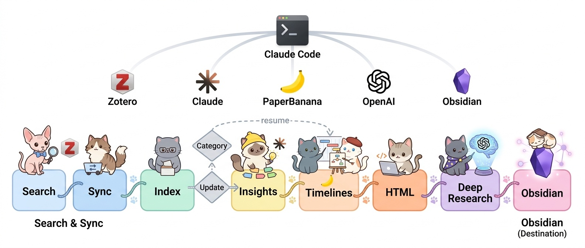

# Paper Curation

**Zotero 컬렉션에 PDF만 있으면, 나머지는 자동입니다.**

논문 PDF → 한국어 구조화 리뷰 → 자동 분류 → 연구 동향 타임라인 → 검색 가능한 사이트 + **Deep Research**(논문 근거 RAG Q&A)까지 — Claude Code가 오케스트레이션하는 개인 논문 큐레이션 파이프라인.

🇬🇧 [English README](README.en.md)



> 🐱 **한 장으로 보는 전체 파이프라인** — 수집부터 배포까지, 고양이들이 대신합니다.

## 기능

**Core** — `run_full --mode curate` 한 줄이면 전부 생성됩니다:

| 기능 | 설명 |
|------|------|
| **구조화 리뷰** | PDF에서 텍스트/Figure 추출 → Claude가 6개 섹션(Essence·Motivation·Achievement·How·Originality·Evaluation) 한국어 리뷰 자동 작성 |
| **자동 분류** | Bottom-up 토픽 모델링(SPECTER2 + HDBSCAN + UMAP)으로 카테고리 자동 생성·배정 |
| **같이 보면 좋은 논문** | 임베딩 후보를 Claude가 선별 — 관계 유형 + 한국어 이유 1문장. 망 장애에 강건(multi-round 재시도 + 연결 0개 논문 우선) |
| **Deep Research** | 자연어 질의 → hybrid 검색(BM25+dense) → LLM 답변 + `[N]` 인용. Anthropic·OpenAI·Google 키 자동 감지 |
| **Audio Overview** | 리뷰/답변을 팟캐스트형 한국어 오디오로(Gemini TTS, 브라우저 MP3 인코딩 → 다운로드 + 배포 시 이메일) |
| **타임라인** | 카테고리별 연구 동향 내러티브 + 다이어그램(PaperBanana) |
| **지식 축적** | Obsidian 연동 — 메모가 다음 질의에 반영되는 compounding knowledge |
| **논문 검색/등록** | arXiv·Semantic Scholar·OpenAlex 병렬 검색 + Zotero 자동 등록(선택) |

**Option** — 플래그/모드로 켤 때만:

| 기능 | 켜는 법 | 설명 |
|------|---------|------|
| **콘텐츠 배포 (O-1)** | `--mode deploy` | Cloudflare Workers + gh-pages 스텁. 배포 시 Audio 이메일 발송 활성화 — [운영 매뉴얼](docs/operations.md#deploy-option-o-1) |
| **Insights + 네트워크 (O-2)** | `--insights` | 크로스카테고리 인사이트 + UMAP 2D/3D 인터랙티브 네트워크 재생성 |
| **로컬 LLM fallback** | `--local-fallback` | 망 전멸 시 로컬 모델(Ollama 등)로 연결 생성 완결 — [운영 매뉴얼](docs/operations.md#korean-network-workarounds) |
| **워크플로 다이어그램** | `generate_workflow.py` | 상단 고양이 다이어그램 생성(PaperBanana, `--style cat/fairy/academic`) |

**필요한 것**: Zotero 컬렉션 + PDF + API 키(필수: Anthropic · Google · Zotero). OpenAI는 선택.

## 빠른 시작

가장 쉬운 방법 — **Claude Code에서 한 줄**:

> "여기에 paper-curation을 설치해줘: https://github.com/jehyunlee/paper-curation"

수동 설치:

```bash
# 1) 클론 + 의존성 (단일 conda env: py312)
git clone https://github.com/jehyunlee/paper-curation.git && cd paper-curation
conda create -n py312 -c conda-forge python=3.12 pip -y && conda activate py312
pip install -r requirements.txt

# 2) API 키 (리뷰=Anthropic, 검색 임베딩·Figure 검증·TTS=Google)
export ANTHROPIC_API_KEY=...
export GOOGLE_API_KEY=...

# 3) config.json 생성(대화형) → 첫 파이프라인 실행
PYTHONUTF8=1 python pipeline/setup.py
```

사전 준비 체크리스트, config.json 스키마, 설치 확인, 문제 해결 → **[Setup Guide](docs/setup-guide.md)**

## 파이프라인

`run_full.py` 한 줄이 아래 Core 단계를 순서대로 실행합니다 (위 그림이 전체 흐름):

1. **데이터 수집** — Zotero PDF → `text.md` + `figures/` (선택: arXiv·S2·OpenAlex 검색 후 Zotero 등록)
2. **구조화 리뷰** — Claude가 6섹션 한국어 `review.md`
3. **토픽 모델링 + 분류** — SPECTER2 + HDBSCAN + UMAP로 카테고리 자동 생성·배정
4. **같이 보면 좋은 논문** — 임베딩 후보를 Claude가 선별(multi-round 재시도)
5. **카테고리 요약 + 타임라인** & **Deep Research 검색 인덱스**(BM25 + Gemini 임베딩)
6. **토픽 인덱스** `index.html`(Deep Research·Audio Overview 내장) → **로컬 열람**(`serve_local.py`) 또는 **배포**

**브라우저 안에서**: Deep Research(키 자동 감지)와 Audio Overview(Gemini TTS → MP3)가 동작합니다.
**Option 분기**: `--insights`(크로스카테고리 인사이트 + 네트워크) · `--mode deploy`(Cloudflare + gh-pages) · `--local-fallback`(망 전멸 시 로컬 LLM).

단계별 입력·처리·출력 상세 → **[Architecture & Internals](docs/architecture.md)**

## 사용 모드

단일 오케스트레이터 `run_full.py` (3축: `--mode` / `--source` / `--images`):

```bash
# 주간 운영 — 검색 → Zotero 등록 → sync → 신규만 리뷰
PYTHONUTF8=1 python pipeline/run_full.py --topic ai4s --mode curate --source web --days 7

# 로컬 업데이트 — 검색 스킵
PYTHONUTF8=1 python pipeline/run_full.py --topic ai4s --mode curate --source zotero

# 분류만 / 타임라인만 / 배포만
PYTHONUTF8=1 python pipeline/run_full.py --topic ai4s --mode reclassify
PYTHONUTF8=1 python pipeline/run_full.py --topic ai4s --mode retime --images all
PYTHONUTF8=1 python pipeline/run_full.py --topic humanoid --mode deploy

# 실행 계획 미리보기 / 로컬 서버
PYTHONUTF8=1 python pipeline/run_full.py --topic ai4s --mode curate --dry-run
PYTHONUTF8=1 python pipeline/serve_local.py     # http://localhost:8000 + /api/embed
```

전체 모드 표, 안전 플래그, Concurrency 튜닝, 복구 절차 → **[Operations Manual](docs/operations.md)**

## 문서

| 문서 | 내용 |
|------|------|
| **[Setup Guide](docs/setup-guide.md)** | 사전 준비 · Claude Code/수동 설치 · config.json · 설치 확인 · 문제 해결 |
| **[Operations Manual](docs/operations.md)** | 모드/안전 플래그 · Concurrency · 한국 망 우회(SPECTER2/arXiv/로컬 fallback) · 배포(O-1) · 복구 |
| **[Architecture & Internals](docs/architecture.md)** | 파이프라인 단계 상세 · 신뢰성 설계 · 내부 구조 · Karpathy LLM Wiki 비교 · 요구사항 |
| **[English README](README.en.md)** | Full English documentation |

## 발표

이 프로젝트는 **AAiCON 2026** (국립중앙과학관, 2026.06.25–26)에서 발표되었습니다.

| 형식 | 자료 |
|------|------|
| **구두 발표** | [260625_이제현_AAiCon.pdf](docs/public/260625_이제현_AAiCon.pdf) |
| **포스터** | [260625_이제현_AAiCon_poster.pdf](docs/public/260625_이제현_AAiCon_poster.pdf) |

---

*Built with Claude Code.* 🐱
