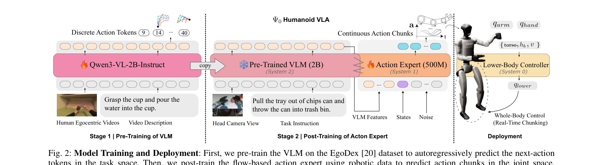
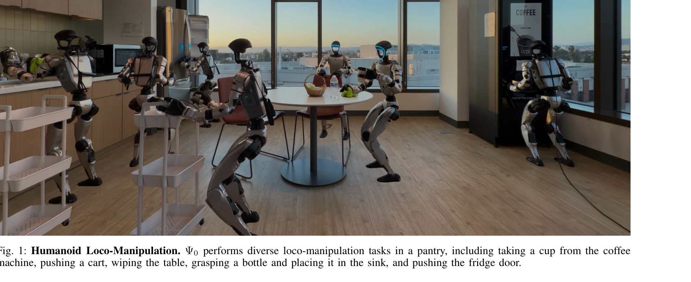

# $Ψ_0$: An Open Foundation Model Towards Universal Humanoid Loco-Manipulation

> **저자**: Songlin Wei, Hongyi Jing, Boqian Li, Zhenyu Zhao, Jiageng Mao, Zhenhao Ni, Sicheng He, Jie Liu, Xiawei Liu, Kaidi Kang, Sheng Zang, Weiduo Yuan, Marco Pavone, Di Huang, Yue Wang | **날짜**: 2026-03-12 | **DOI**: [10.48550/arXiv.2603.12263](https://doi.org/10.48550/arXiv.2603.12263)

---

## Essence

*Fig. 2: Model Training and Deployment: First, we pre-train the VLM on the EgoDex [20] dataset to autoregressively predic*

Ψ0는 인간의 egocentric 비디오로 pre-train한 VLM과 고품질 humanoid 데이터로 post-train한 flow-based action expert를 결합하여, 적은 데이터로 humanoid loco-manipulation을 효율적으로 학습하는 foundation model이다.

## Motivation

- **Known**: 최근 VLA 기반 접근법들(RT1-2, OpenVLA, π series 등)은 대규모 실제 로봇 데이터를 통해 우수한 성능을 보였으나, 인간의 egocentric 비디오는 humanoid 제어에 직접 적용하기 어렵다는 문제가 있다.
- **Gap**: 기존 co-training 방식은 인간과 humanoid 간의 근본적인 운동학적 차이로 인해 비효율적이며, 노이즈가 많은 대규모 이질적 데이터보다 고품질 데이터의 효율성이 중요하다는 점이 간과되어 왔다.
- **Why**: Humanoid loco-manipulation은 사회적으로 큰 잠재력을 가지고 있으나 데이터 수집 비용이 높아, 인간 비디오로부터의 효율적인 지식 전이는 robotics 분야의 핵심 과제이다.
- **Approach**: 단계적 학습 패러다임을 제시하여 Stage 1에서는 인간 egocentric 비디오로 VLM을 pre-train하여 visual-action representation을 학습하고, Stage 2에서는 flow-based MM-DiT action expert를 humanoid 데이터로 post-train하여 로봇 특화 제어를 학습한다.

## Achievement

*Fig. 1: Humanoid Loco-Manipulation. Ψ0 performs diverse loco-manipulation tasks in a pantry, including taking a cup from*

- **데이터 효율성**: 기존 방법 대비 10배 이상 적은 데이터(800시간 인간 비디오 + 30시간 실제 로봇 데이터)로 40% 이상 높은 success rate 달성
- **고품질 데이터 레시피**: 노이즈가 많은 인터넷 클립이나 cross-embodiment 데이터보다 고품질 egocentric 인간 데이터 → domain-specific humanoid 데이터의 순차 학습이 최적임을 입증
- **실시간 배포 기술**: training-time real-time action chunking 메커니즘으로 inference latency로 인한 motion jitter 완화
- **오픈소스 생태계**: 데이터 처리 파이프라인, 학습된 모델 가중치, 실시간 inference engine 공개

## How

*Fig. 2: Model Training and Deployment: First, we pre-train the VLM on the EgoDex [20] dataset to autoregressively predic*

- **Stage 1 Pre-training**: Qwen3-VL 2B 모델을 EgoDex 데이터셋의 인간 egocentric 비디오로 autoregressive next-action prediction 목표로 학습
- **Stage 2 Post-training**: 500M 파라미터 MM-DiT (Multi-Modal Diffusion Transformer) 기반 action expert를 humanoid 데이터로 post-train하여 joint space의 action chunk 예측
- **망원형 텔레오퍼레이션 파이프라인**: MANUS gloves 기반 조작 최적화된 teleoperation으로 하체 안정성 개선
- **Real-time Chunking**: 이전 action 실행 중 다음 action 예측하는 lower-body controller 활용으로 smooth whole-body control 구현
- **조건부 생성**: VLM의 visual-language features를 조건으로 하여 MM-DiT가 action chunk 동시 출력

## Originality

- 기존 co-training 패러다임을 벗어나 명확한 학습 목표를 가진 단계적 decoupled learning 전략 제시
- 고품질 인간 egocentric 비디오 → domain-specific humanoid 데이터의 최적 데이터 recipe 규명 및 실증
- MM-DiT를 활용한 효율적인 action chunk 예측으로 inference 안정성 확보
- Training-time real-time chunking 기법으로 실제 배포 환경의 latency 문제 해결

## Limitation & Further Study

- 800시간 고품질 egocentric 인간 비디오 데이터 수집 과정이 명확히 설명되지 않았으며, 이것이 얼마나 실현 가능한지 불명확
- 30시간의 실제 로봇 teleoperation 데이터가 여전히 필요하므로, 완전한 대규모 무인 학습은 아님
- Humanoid 로봇 하나(제품명 미명시)에서만 평가되었으므로, 다양한 humanoid 플랫폼 간 generalization 검증 필요
- 인간과 humanoid 간의 embodiment gap에 대한 이론적 분석 부족; 대기술적(empirical) 결과에 의존
- 후속연구로 더 다양한 embodiment에 대한 transfer learning 능력 평가 및 unsupervised data로부터의 학습 방법 탐구 필요

## Evaluation

- Novelty: 4/5
- Technical Soundness: 3/5
- Significance: 4/5
- Clarity: 4/5
- Overall: 4/5

**총평**: Ψ0는 단계적 학습과 고품질 데이터 선별이라는 실용적이면서도 효과적인 전략으로 humanoid loco-manipulation의 데이터 효율성을 획기적으로 개선했으며, 오픈소스 공개로 커뮤니티 기여도 높다. 다만 데이터 수집 과정의 현실성과 다양한 플랫폼에 대한 generalization 검증이 보완되면 더욱 강력한 기여가 될 것이다.

## Related Papers

- 🔄 다른 접근: [[papers/1281_Being-H0_Vision-Language-Action_Pretraining_from_Large-Scale/review]] — 둘 다 대규모 egocentric 비디오에서 humanoid 기초 모델을 학습하지만 Ψ0는 flow-based expert를, Being-H0는 손 동작 모델링을 강조한다.
- 🏛 기반 연구: [[papers/1287_BeyondMimic_From_Motion_Tracking_to_Versatile_Humanoid_Contr/review]] — π0의 vision-language-action 통합 프레임워크가 Ψ0의 VLM과 action expert 결합 구조의 이론적 기반을 제공한다.
- 🔗 후속 연구: [[papers/1372_EgoMimic_Scaling_Imitation_Learning_via_Egocentric_Video/review]] — DROID의 대규모 로봇 조작 데이터셋이 Ψ0의 humanoid 데이터와 결합되어 더 범용적인 foundation model 구축이 가능하다.
- 🔄 다른 접근: [[papers/1281_Being-H0_Vision-Language-Action_Pretraining_from_Large-Scale/review]] — 둘 다 대규모 인간 비디오에서 humanoid 기초 모델을 학습하지만 Being-H0는 손 동작 명시적 모델링을, Ψ0는 flow-based expert를 강조한다.
- 🔄 다른 접근: [[papers/1353_DreamControl-v2_Simpler_and_Scalable_Autonomous_Humanoid_Ski/review]] — 둘 다 humanoid loco-manipulation foundation model이지만 DreamControl-v2는 diffusion model을, Ψ0는 VLM+flow expert 결합을 사용한다.
