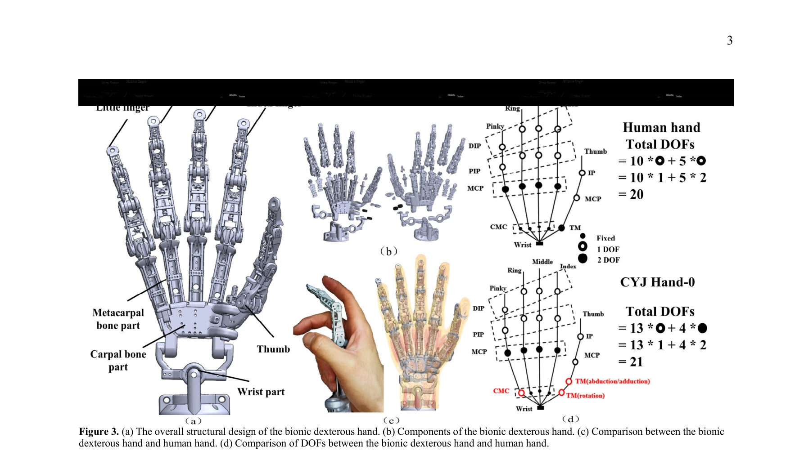
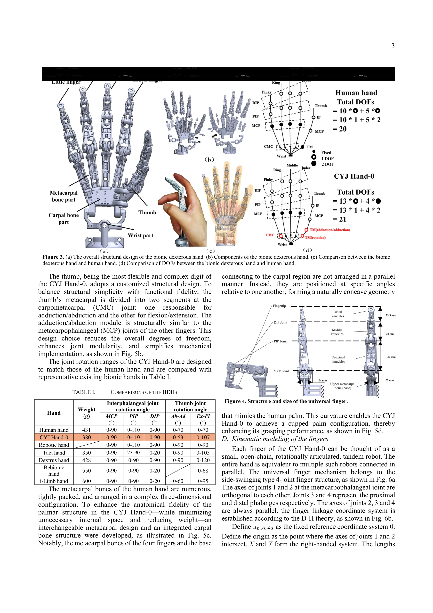

# A 21-DOF Humanoid Dexterous Hand with Hybrid SMA-Motor Actuation: CYJ Hand-0

> **저자**: Jin Chai, Xiang Yao, Mengfan Hou, Yanghong Li, Erbao Dong | **날짜**: 2025-07-19 | **URL**: [https://arxiv.org/abs/2507.14538](https://arxiv.org/abs/2507.14538)

---

## Essence

*Figure 3. (a) The overall structural design of the bionic dexterous hand. (b) Components of the bionic dexterous hand. (*

CYJ Hand-0는 SMA와 DC 모터를 결합한 하이브리드 tendon-driven 액추에이션 시스템을 갖춘 21-DOF 인간형 손으로, 3D 프린팅된 AlSi10Mg 금속 골격과 낚싯줄 인공 건을 사용하여 생체모방 손재주를 구현했다.

## Motivation

- **Known**: 기존 인간형 손 연구(Belgrade hand, Stanford/JPL hand 등)는 생체모방 구조 부족, DOF 부족, 높은 비용 등의 한계를 가지고 있으며, tendon-driven 메커니즘은 인간 손의 구조를 복제하는 고전적 원리로 알려져 있다.
- **Gap**: 기존 설계들은 충분한 DOF를 갖춘 biomimetic 구조, 효율적인 actuation 통합, 저비용 제조 간의 동시 달성이 미흡하였으며, 특히 hybrid actuation 시스템의 compact 통합과 dexterous 제어가 부족했다.
- **Why**: 손은 인간이 가진 가장 정교한 도구이며, 인간형 손을 구현하면 의료 보조, 산업용 조작, 우주 탐사 등 다양한 응용 분야에서 사람을 대체하거나 보조할 수 있어 실용적 가치가 크다.
- **Approach**: 인간 손의 해부학적 구조를 분석하여 21-DOF 구조를 설계하고, SMA 기반 신장 모듈과 DC 모터 기반 굴곡 모듈을 hybrid 액추에이션 유닛으로 통합한 후, AlSi10Mg 3D 프린팅으로 저비용 제작하고 Arduino Mega 2560으로 제어했다.

## Achievement

*Figure 3. (a) The overall structural design of the bionic dexterous hand. (b) Components of the bionic dexterous hand. (*

- **21-DOF 생체모방 설계**: 인간 손의 해부학적 구조(27개 뼈, 관절 범위)를 1:1 스케일로 복제하여 모든 생리적 운동 범위를 재현
- **하이브리드 액추에이션 시스템**: SMA 모듈(신장, 횡단 벌림)과 DC 모터 모듈(굴곡)을 tendon-driven 메커니즘으로 효율적으로 통합
- **저비용 제조**: AlSi10Mg 3D 프린팅으로 380g의 경량 구조 실현 (인간 손 대비 92.4% 무게 감소)
- **높은 기능성**: 단일 손가락 1.2 kgf, 전체 손 8 kgf의 하중 용량, 모든 Kapandji 테스트, 32가지 제스처, 30+ 파지 실험 수행 가능
- **실증된 성능**: 기계적, 운동학적 실험을 통해 설계의 유효성과 생체모방 손재주 검증

## How

*Figure 4. Structure and size of the universal finger.*

- 인간 손의 해부학 분석: 27개 뼈, 관절 범위(MCP 0-90°, PIP 0-110°, DIP 0-90° 등), 손가락 간 결합 관계식 도출
- 모듈식 설계: 표준 손가락 설계(index, middle, ring 공용, 12개 부품) 및 맞춤형 엄지손가락(TMC 조인트를 2개 분리 세그먼트로 단순화)
- SMA linear flexible drive module: 이중 증폭 스트로크로 신장 및 측면 벌림 제어
- DC brush motor linear drive module: 굴곡 운동 제어
- tendon-driven mechanism: 고강도 낚싯줄을 인공 건으로 사용하여 근육-건 구조 모방
- AlSi10Mg 3D 프린팅: 80개 부품, 18가지 component 타입으로 구성
- 제어 시스템: Arduino Mega 2560 기반 단일 손가락 및 전체 손 제어
- 성능 평가: 힘, 운동, 손재주, 파지 능력 종합 검증

## Originality

- SMA와 DC 모터의 hybrid 액추에이션으로 신장/벌림과 굴곡을 분리 제어하여 제어 복잡도 감소 및 compact 통합 달성
- 21-DOF 구현 시 TMC 조인트를 2개 분리 세그먼트로 단순화하여 ball-and-socket 조인트의 3개 액추에이터/6개 건 필요성 제거
- tendon-driven 구조에서 DIP-PIP joint coupling 관계식을 명시적으로 구현
- AlSi10Mg 3D 프린팅으로 인간 손과 유사한 무게(380g) 달성 동시에 저비용 제조
- 모듈식 설계(동일 component 재사용)로 제조 비용 및 복잡도 최소화

## Limitation & Further Study

- 제어 시스템이 Arduino Mega 2560 기반의 기본 수준으로, 고급 closed-loop control 또는 적응 제어 부재
- SMA의 느린 응답 속도와 히스테리시스 특성에 대한 보상 메커니즘 미기술
- 센서 통합(tactile, proprioceptive) 미흡으로 정밀 피드백 제어 어려움
- 실험이 기본 성능(Kapandji 테스트, 파지) 중심으로 복잡한 조작 작업 및 실시간 제어 성능 미평가
- 후속 연구: (1) 고속 closed-loop control 및 machine learning 기반 적응 제어 도입, (2) 촉각 센서 및 proprioceptive feedback 통합, (3) 복잡한 조작 작업 및 인간-로봇 협업 시나리오 검증

## Evaluation

- Novelty: 4/5
- Technical Soundness: 3/5
- Significance: 4/5
- Clarity: 4/5
- Overall: 4/5

**총평**: CYJ Hand-0는 hybrid SMA-motor actuation, tendon-driven mechanism, 저비용 3D 프린팅을 결합하여 21-DOF 생체모방 손을 효과적으로 구현했으며, 인간형 로봇 손 연구에서 구조적 우수성과 실용성의 좋은 사례를 제시한다. 다만 제어 시스템 고도화와 센서 통합을 통한 후속 개선이 필요하다.

## Related Papers

- 🔄 다른 접근: [[papers/1269_Antagonistic_Bowden-Cable_Actuation_of_a_Lightweight_Robotic/review]] — 21-DOF SMA-모터 하이브리드 구동과 경량 Bowden 케이블 구동 방식의 인간형 손 설계 비교 연구가 가능합니다.
- 🔄 다른 접근: [[papers/1603_ORCA_An_Open-Source_Reliable_Cost-Effective_Anthropomorphic/review]] — SMA-모터 하이브리드 시스템과 힘줄 구동 시스템의 손재주 조작 성능과 제작 비용을 비교 분석할 수 있습니다.
- 🧪 응용 사례: [[papers/1335_Code-as-Monitor_Constraint-aware_Visual_Programming_for_Reac/review]] — 21-DOF 손재주 손의 정밀한 조작 능력을 GUI 기반 원격조작 시스템에 적용하여 비전문가도 사용할 수 있습니다.
- 🔄 다른 접근: [[papers/1269_Antagonistic_Bowden-Cable_Actuation_of_a_Lightweight_Robotic/review]] — Bowden 케이블 구동과 SMA-모터 하이브리드 구동의 서로 다른 경량화 접근법을 비교 연구할 수 있습니다.
- 🔄 다른 접근: [[papers/1603_ORCA_An_Open-Source_Reliable_Cost-Effective_Anthropomorphic/review]] — 힘줄 구동과 SMA-모터 하이브리드 시스템의 서로 다른 17-21 DOF 손재주 손 구현 방식을 비교할 수 있습니다.
