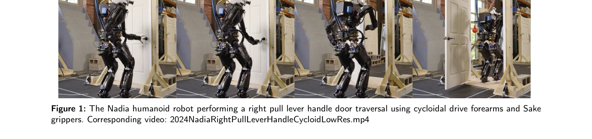

# A Behavior Architecture for Fast Humanoid Robot Door Traversals

> **저자**: Duncan Calvert, Luigi Penco, Dexton Anderson, Tomasz Bialek, Arghya Chatterjee, Bhavyansh Mishra, Geoffrey Clark, Sylvain Bertrand, Robert Griffin | **날짜**: 2024-11-05 | **URL**: [https://arxiv.org/abs/2411.03532](https://arxiv.org/abs/2411.03532)

---

## Essence

*Figure 2: An all inclusive overview of the parts involved in this work.*

휴머노이드 로봇이 다양한 문을 빠르게 통과할 수 있도록 GPU 가속 perception, behavior tree 기반 동작 조율, whole body motion 제어를 통합한 아키텍처를 제시한다.

## Motivation

- **Known**: 휴머노이드 로봇의 조작과 이동 능력 개발이 진행 중이며, Affordance Template 프레임워크와 Behavior Tree를 이용한 행동 조율이 알려져 있다.
- **Gap**: 휴머노이드 로봇의 문 통과 능력에 대한 체계적 연구가 부재하며, 바퀴형 로봇과 달리 양족 보행 로봇을 위한 계획 수립에 차이가 존재한다.
- **Why**: 휴머노이드 로봇이 인간 환경에서 작동하기 위해서는 문과 같은 일상적 장애물을 극복해야 하며, 이는 도시 작전, 재해 대응, 우주 탐사 등에 필수적이다.
- **Approach**: Affordance Template, action primitive, sequential composition, concurrent action layering을 통합한 behavior tree 기반 아키텍처를 구축하고, neural network와 classical computer vision을 결합한 perception 시스템을 개발했다.

## Achievement

*Figure 1: The Nadia humanoid robot performing a right pull lever handle door traversal using cycloidal drive forearms an*

- **온라인 행동 생성 및 수정**: runtime에 behavior tree와 action sequence를 수정 가능하게 하여 1년 내에 20개 이상의 다양한 문 통과 행동을 개발했다.
- **다중 문 유형 대응**: 다양한 문의 종류(pull lever handle, push, slide 등)에 대응할 수 있는 재사용 가능한 행동 구조를 제시했다.
- **실제 로봇 성능**: Nadia 휴머노이드 로봇에서 빠른 문 통과 동작을 실제로 구현하고 검증했다.
- **Coactive Design 통합**: operator-robot interdependence analysis chart를 통해 인간 인지와 인공지능의 결합 방식을 체계적으로 분석했다.

## How

*Figure 2: An all inclusive overview of the parts involved in this work.*

- GPU 가속 perception으로 object detection과 door mechanism pose estimation을 수행
- Behavior Tree의 logical operator node (sequence, fallback, parallel)를 사용하여 행동 흐름 제어
- Ticking system을 통한 continuous re-evaluation로 reactivity 확보
- Action primitive를 whole body controller 위에 구축하여 조작과 보행을 동시 지원
- Layered concurrency를 통한 action sequence 병렬 실행으로 속도 향상
- Affordance Template 프레임워크로 모듈화된 low-level action 조합
- Digital twin 3D scene을 통한 operator 인터페이스 제공
- JSON 파일 기반 behavior 저장 및 로딩

## Originality

- 양족 휴머노이드 로봇의 문 통과 행동에 대한 최초의 체계적 연구
- Behavior Tree를 bipedal loco-manipulation에 적용한 최초 사례
- Coactive Design 원칙을 기반으로 한 operator-robot interdependence 분석의 robotics 적용
- Runtime online behavior modification으로 빠른 행동 개발 가능하게 한 혁신적 접근
- Affordance Template과 Behavior Tree의 통합으로 재사용 가능하고 확장 가능한 행동 아키텍처 제시

## Limitation & Further Study

- 현재 주로 door traversal 행동에 집중되어 있으며, 다른 loco-manipulation 작업으로의 일반화 수준이 불분명함
- Perception 시스템의 실외 환경 성능에 대한 정량적 평가 부재
- 다양한 휴머노이드 플랫폼으로의 이식성(portability) 검증 부족
- AI/modern learning-based approach와의 명시적 비교 및 통합 논의 필요
- 후속 연구로는 end-to-end learning과 behavior tree의 하이브리드 접근, 동적 환경에서의 robustness 개선, 다양한 로봇 플랫폼으로의 확대 필요

## Evaluation

- Novelty: 4/5
- Technical Soundness: 3/5
- Significance: 4/5
- Clarity: 4/5
- Overall: 4/5

**총평**: 휴머노이드 로봇의 실제 도어 통과 능력을 구현하기 위해 기존 기법들을 체계적으로 통합한 완성도 높은 연구로, 온라인 행동 수정 및 빠른 개발 사이클이 주요 기여이며, 양족 로봇의 loco-manipulation 분야에 중요한 실무 가치를 제공한다.

## Related Papers

- 🔄 다른 접근: [[papers/1260_AGILE_A_Comprehensive_Workflow_for_Humanoid_Loco-Manipulatio/review]] — 휴머노이드 로봇의 실세계 행동을 위한 통합 아키텍처를 다른 접근법으로 설계한다
- 🧪 응용 사례: [[papers/1285_Berkeley_Humanoid_A_Research_Platform_for_Learning-based_Con/review]] — door traversal이 실제 Berkeley Humanoid 플랫폼에서 구현될 수 있는 구체적인 응용 사례를 제공한다
- 🏛 기반 연구: [[papers/1309_An_Real-Sim-Real_RSR_Loop_Framework_for_Generalizable_Roboti/review]] — 실세계 배포를 위한 RSR 루프 프레임워크가 door traversal 같은 구체적 행동의 시뮬-실세계 전이에 필요한 기초를 제공한다
- ⚖️ 반론/비판: [[papers/1599_Opening_the_Sim-to-Real_Door_for_Humanoid_Pixel-to-Action_Po/review]] — 전통적인 behavior architecture와 pixel-to-action 정책의 성능을 직접 비교할 수 있는 동일 task 연구
