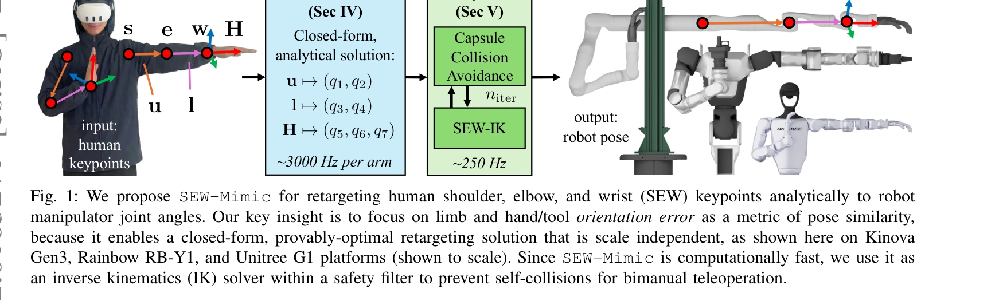

# A Closed-Form Geometric Retargeting Solver for Upper Body Humanoid Robot Teleoperation

> **저자**: Chuizheng Kong, Yunho Cho, Wonsuhk Jung, Idris Wibowo, Parth Shinde, Sundhar Vinodh-Sangeetha, Long Kiu Chung, Zhenyang Chen, Andrew Mattei, Advaith Nidumukkala, Alexander Elias, Danfei Xu, Taylor Higgins, Shreyas Kousik | **날짜**: 2026-02-02 | **URL**: [https://arxiv.org/abs/2602.01632](https://arxiv.org/abs/2602.01632)

---

## Essence

*Fig. 1: We propose SEW-Mimic for retargeting human shoulder, elbow, and wrist (SEW) keypoints analytically to robot*

인간의 어깨, 팔꿈치, 손목(SEW) 키포인트를 로봇 관절각으로 변환하는 폐쇄형 기하학적 역기구학 해법을 제안하여, 인간형 로봇 텔레오퍼레이션에서 고속(3 kHz)이면서도 최적의 성능을 달성한다.

## Motivation

- **Known**: 기존 로봇 텔레오퍼레이션은 손 위치/방향만 추적하거나 최적화 기반 재타게팅을 사용하는데, 전자는 null-space motion 문제를 유발하고 후자는 지연(0.7초)이 크다.
- **Gap**: 7-DoF 인간형 로봇 팔에서 팔꿈치 제어를 직접 수행하면서도 고속 연산을 달성하는 최적 재타게팅 방법이 부재하다.
- **Why**: 로봇 텔레오퍼레이션의 실시간성과 정확성은 원격 조작 효율성과 수집되는 학습 데이터 품질에 직접 영향을 미친다.
- **Approach**: 방향 정렬 문제로 재프레이밍하여 기하학적 부분 문제를 이용한 폐쇄형 해석 해법을 도출하고, 방향 오차를 유사도 지표로 정의하여 스케일 불변 특성을 확보한다.

## Achievement

*Fig. 1: We propose SEW-Mimic for retargeting human shoulder, elbow, and wrist (SEW) keypoints analytically to robot*

- **고속 연산**: 표준 CPU에서 팔당 3 kHz 추론 속도로 기존 최적화 기반 방법(0.7초)과 비교하여 1000배 이상 빠름
- **최적성 보증**: 폐쇄형 기하학적 해로부터 증명 가능한 최적성 보장
- **직접 팔꿈치 제어**: 인간의 팔 방향과 로봇 팔 방향을 직접 정렬하여 null-space motion 제거
- **사용자 연구**: 파일럿 사용자 연구에서 텔레오퍼레이션 작업 성공률 향상 확인
- **정책 학습 개선**: SEW-Mimic 수집 데이터가 더 부드러워서 자율 정책 학습 성능 향상
- **다중 플랫폼 호환**: Kinova Gen3, Rainbow RB-Y1, Unitree G1 등 여러 7-DoF 로봇에 적용 가능

## How

*Fig. 1: We propose SEW-Mimic for retargeting human shoulder, elbow, and wrist (SEW) keypoints analytically to robot*

- 인간 팔의 상박 및 하박 방향을 shoulder-elbow, elbow-wrist 벡터로 정의
- 로봇 팔의 해당 link 벡터와의 방향 오차를 최소화하는 폐쇄형 기하학적 부분 문제 설정
- Paden-Kahan 부분 문제 유형의 기하학적 구조 활용으로 해석 해법 도출
- 안전 필터: capsule 기반 충돌 회피를 위해 SEW-Mimic을 역기구학 솔버로 사용하여 양팔 자기충돌 방지
- MediaPipe 또는 Meta Quest 헤드셋 입력 지원으로 키포인트 소스에 무관한 설계

## Originality

- 기존의 hand-only retargeting과 달리 elbow 방향을 직접 제어하는 새로운 문제 재정의
- 방향 정렬을 유사도 지표로 설정하여 인간-로봇 체형 차이를 극복하는 스케일 불변 해법
- 분석적 기하학 IK의 Paden-Kahan 부분 문제를 재타게팅 문제에 체계적으로 적용
- 양팔 자기충돌 회피 안전 필터를 통합한 완전한 텔레오퍼레이션 시스템 제시

## Limitation & Further Study

- 현재는 상반신에만 적용되며, 하반신 재타게팅은 TWIST와의 결합으로 간접 적용(계산 속도만 개선)
- 통신 지연(wireless latency)은 해결하지 않으며, 로컬 연산 시간만 개선
- user study가 파일럿 규모로 제한적이며, 대규모 사용자 평가 필요
- 로봇의 기구학적 특이점(singularity) 근처에서의 동작 안정성 분석 미흡
- 후속 연구: 전신 동작 재타게팅으로의 확장, 실시간 통신 지연 최소화, 더 큰 규모의 사용자 연구 수행

## Evaluation

- Novelty: 4/5
- Technical Soundness: 3/5
- Significance: 4/5
- Clarity: 4/5
- Overall: 4/5

**총평**: SEW-Mimic은 폐쇄형 기하학적 해를 통해 기존 재타게팅의 지연과 null-space motion 문제를 동시에 해결하며, 실용적인 안전 필터와 함께 로봇 텔레오퍼레이션의 근본적인 성능 향상을 제시한다.

## Related Papers

- 🔗 후속 연구: [[papers/1250_A_Whole-Body_Motion_Imitation_Framework_from_Human_Data_for/review]] — 전신 동작 모방을 위한 접촉 인식 retargeting에서 상체 특화 폐쇄형 기하학적 해법을 활용할 수 있다
- 🔄 다른 접근: [[papers/1306_CLONE_Closed-Loop_Whole-Body_Humanoid_Teleoperation_for_Long/review]] — MR 헤드셋 기반 전신 텔레오퍼레이션에서 상체 제어의 실시간 역기구학 해법이 필요하다
- 🏛 기반 연구: [[papers/1297_Bunny-VisionPro_Real-Time_Bimanual_Dexterous_Teleoperation_f/review]] — Apple Vision Pro 손 추적 기반 양손 조작에서 정확한 관절각 변환을 위한 기하학적 해법이 기반이 된다
- 🧪 응용 사례: [[papers/1391_ExtremControl_Low-Latency_Humanoid_Teleoperation_with_Direct/review]] — 저지연 휴머노이드 텔레오퍼레이션에서 3kHz 고속 상체 retargeting이 직접 적용된다
- 🔗 후속 연구: [[papers/1306_CLONE_Closed-Loop_Whole-Body_Humanoid_Teleoperation_for_Long/review]] — MR 헤드셋 기반 텔레오퍼레이션에서 상체 실시간 역기구학이 전신 제어에 확장된다
- 🔗 후속 연구: [[papers/1297_Bunny-VisionPro_Real-Time_Bimanual_Dexterous_Teleoperation_f/review]] — Apple Vision Pro 손 추적에서 폐쇄형 기하학적 역기구학이 정확한 관절 매핑에 활용된다
- 🏛 기반 연구: [[papers/1250_A_Whole-Body_Motion_Imitation_Framework_from_Human_Data_for/review]] — 접촉 인식 motion retargeting에서 폐쇄형 기하학적 역기구학 해법이 기초가 된다
- 🏛 기반 연구: [[papers/1448_High-Speed_and_Impact_Resilient_Teleoperation_of_Humanoid_Ro/review]] — IMU 기반 고속 텔레오퍼레이션의 모션 레타게팅이 폐쇄형 기하학적 상체 휴머노이드 솔버의 기반 기술을 활용한다.
