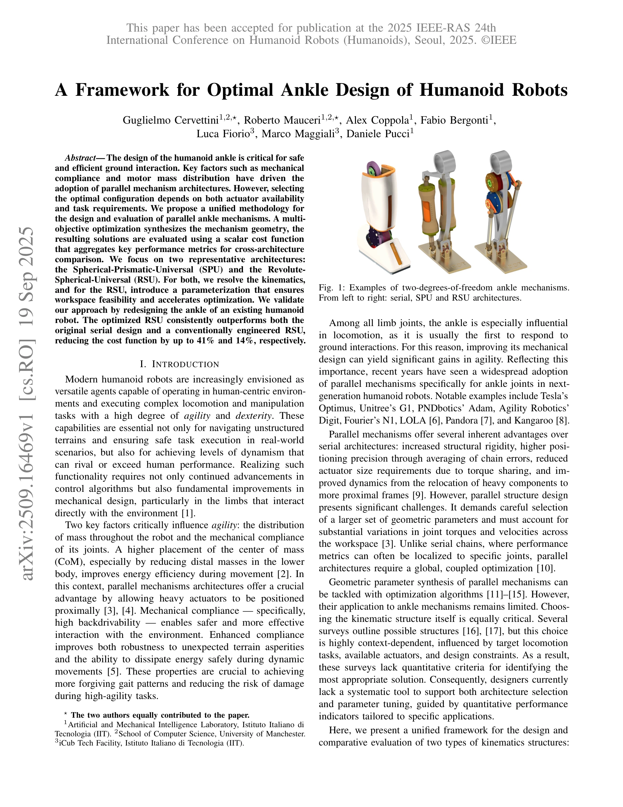

# A Framework for Optimal Ankle Design of Humanoid Robots

> **저자**: Guglielmo Cervettini, Roberto Mauceri, Alex Coppola, Fabio Bergonti, Luca Fiorio, Marco Maggiali, Daniele Pucci | **날짜**: 2025-09-19 | **URL**: [https://arxiv.org/abs/2509.16469](https://arxiv.org/abs/2509.16469)

---

## Essence

*Fig. 1: Examples of two-degrees-of-freedom ankle mechanisms.*

휴머노이드 로봇의 발목 설계를 위한 통합 프레임워크를 제시하며, SPU와 RSU 두 가지 병렬 메커니즘 아키텍처를 다목적 최적화와 비용 함수 기반 평가로 비교 분석한다.

## Motivation

- **Known**: 병렬 메커니즘 아키텍처는 기계적 컴플라이언스와 모터 질량 분포 측면에서 직렬 아키텍처보다 장점이 있으며, 최근 차세대 휴머노이드 로봇들에서 발목에 널리 채택되고 있다.
- **Gap**: 발목 메커니즘에 대한 최적화 알고리즘의 적용이 제한적이며, 설계자들은 아키텍처 선택과 파라미터 튜닝을 위한 정량적 성능 지표에 기반한 체계적 도구가 부재하다.
- **Why**: 발목은 지면과의 상호작용에서 가장 먼저 반응하는 조인트로서 기계적 설계 개선이 로봇의 민첩성과 안전성에 중대한 영향을 미친다.
- **Approach**: SPU와 RSU 메커니즘의 키네매틱 모델링을 수행하고, RSU에 대해 작업 공간 타당성을 보장하는 새로운 파라미터화를 도입하여 다목적 최적화와 스칼라 비용 함수 기반 평가를 통해 아키텍처 간 비교를 가능하게 한다.

## Achievement

*Fig. 1: Examples of two-degrees-of-freedom ankle mechanisms.*

- **통합 설계 프레임워크**: SPU와 RSU 두 병렬 메커니즘에 대한 통일된 설계 및 평가 방법론 제시
- **개선된 파라미터화**: RSU 메커니즘의 작업 공간 타당성을 보장하면서 최적화를 가속화하는 새로운 파라미터화 도입
- **성능 개선**: 최적화된 RSU 설계가 기존 직렬 설계 대비 41% 비용 감소, 기존 RSU 대비 14% 감소 달성

## How

*Fig. 2: Connectivity graphs of SPU and RSU mechanisms. Links*

- Grübler-Kutzbach 기준으로 2 DOF 병렬 메커니즘의 이동도 확인
- Jacobian 행렬을 통한 특이점 식별 및 manipulability ellipsoid 분석
- SPU 및 RSU 메커니즘의 루프 클로저 방정식 유도 및 역 키네매틱 폐형해 도출
- 다목적 최적화로 메커니즘 기하학 합성 (actuator 가용성 및 작업 요구사항 고려)
- 주요 성능 메트릭을 통합한 스칼라 비용 함수로 아키텍처 간 비교
- 기존 휴머노이드 로봇의 발목 재설계를 통한 검증

## Originality

- 발목 메커니즘 설계에 최적화 알고리즘을 체계적으로 적용한 최초의 통합 프레임워크
- RSU 메커니즘의 작업 공간 타당성 보장 파라미터화라는 새로운 기술적 기여
- SPU와 RSU 두 아키텍처에 대한 정량적 비교 분석으로 설계 선택에 대한 근거 제시
- actuator 유형(선형 vs. 회전)의 차이를 고려한 설계 프레임워크

## Limitation & Further Study

- 현재 2 DOF 발목에만 한정되어 있으며, 3 DOF 이상의 더 복잡한 메커니즘으로의 확장 필요
- 동역학적 분석(dynamics) 및 control 성능에 대한 검증이 부족하며, 실제 로봇 구현 및 보행 실험 결과 필요
- 비용 함수의 가중치 결정이 응용 분야에 따라 민감할 수 있으므로, 다양한 작업 시나리오에 대한 일반화된 가중치 설정 방법 필요
- 최적화 계산 복잡도 및 수렴 속도에 대한 논의 부족으로, 실시간 설계 응용의 가능성 불명확

## Evaluation

- Novelty: 4/5
- Technical Soundness: 4/5
- Significance: 4/5
- Clarity: 4/5
- Overall: 4/5

**총평**: 발목 메커니즘 설계를 위한 첫 번째 체계적이고 정량적 프레임워크를 제시하여 휴머노이드 로봇 설계 분야에 실질적 기여를 하며, 우수한 최적화 결과와 명확한 방법론은 학술적 및 산업적 가치가 높다.

## Related Papers

- 🏛 기반 연구: [[papers/1318_Control_of_Humanoid_Robots_with_Parallel_Mechanisms_using_Di/review]] — 발목 설계 최적화의 병렬 메커니즘 이론이 휴머노이드 로봇의 병렬 구동 메커니즘 제어에 직접 적용됩니다.
- 🔗 후속 연구: [[papers/1326_DecARt_Leg_Design_and_Evaluation_of_a_Novel_Humanoid_Robot_L/review]] — 발목 설계 프레임워크가 DecARt Leg의 다중 바 앵클 구동 시스템 설계에 확장 적용될 수 있습니다.
- 🧪 응용 사례: [[papers/1293_Biomechanical_Comparisons_Reveal_Divergence_of_Human_and_Hum/review]] — 최적화된 발목 설계가 인간과 휴머노이드 보행 차이 분석에서 생체역학적 성능 개선에 기여할 수 있습니다.
- 🧪 응용 사례: [[papers/1293_Biomechanical_Comparisons_Reveal_Divergence_of_Human_and_Hum/review]] — GDAF 프레임워크가 발목 설계 최적화의 생체역학적 성능 검증에 적용될 수 있습니다.
- 🧪 응용 사례: [[papers/1318_Control_of_Humanoid_Robots_with_Parallel_Mechanisms_using_Di/review]] — 병렬 메커니즘의 정확한 비선형 전달함수 모델이 발목 설계 최적화의 제어 성능 향상에 직접 적용됩니다.
- 🏛 기반 연구: [[papers/1326_DecARt_Leg_Design_and_Evaluation_of_a_Novel_Humanoid_Robot_L/review]] — 다중 바 앵클 구동 시스템이 발목 설계 최적화 프레임워크의 병렬 메커니즘 이론을 기반으로 구현됩니다.
- 🧪 응용 사례: [[papers/1461_Human-Level_Actuation_for_Humanoids/review]] — Human-Equivalence Envelopes가 발목 설계 최적화에서 인간 수준 성능 검증 기준으로 적용됩니다.
- 🧪 응용 사례: [[papers/1552_LEGO_Latent-space_Exploration_for_Geometry-aware_Optimizatio/review]] — 휴머노이드 로봇 발목 최적 설계 프레임워크가 LEGO의 상반신 운동학 설계 자동화에 직접적으로 적용 가능하다
