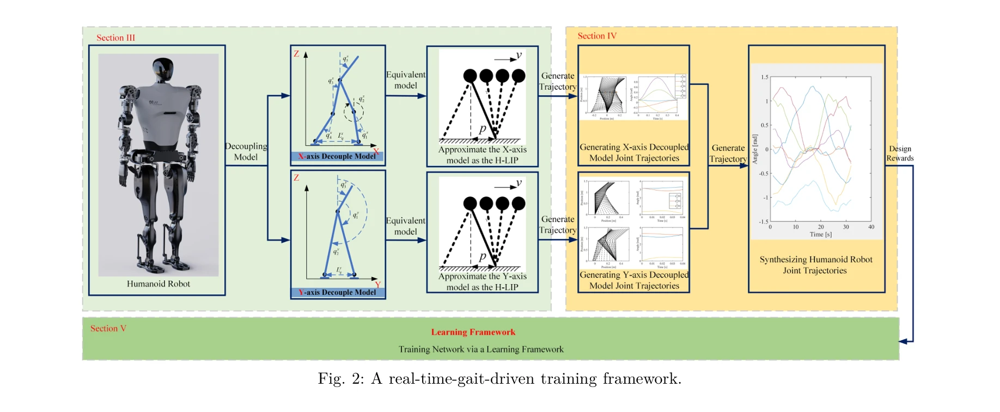

# A Gait Driven Reinforcement Learning Framework for Humanoid Robots

> **저자**: Bolin Li, Yuzhi Jiang, Linwei Sun, Xuecong Huang, Lijun Zhu, Han Ding | **날짜**: 2025-06-10 | **URL**: [https://arxiv.org/abs/2506.08416](https://arxiv.org/abs/2506.08416)

---

## Essence

*Fig. 2: A real-time-gait-driven training framework.*

본 논문은 3D 휴머노이드 로봇을 2D H-LIP 모델로 분해하여 실시간 보행 계획을 수행하고, 이를 기반으로 설계된 보상 함수 조합을 통해 강화학습으로 주기적 이족 보행을 학습하는 프레임워크를 제시한다.

## Motivation

- **Known**: 기존 모델 기반 최적화는 안정성 보장은 제공하지만 적응성과 실시간성이 부족하고, 순수 강화학습 방식은 학습 시간이 길고 주기성이 불규칙하다는 문제가 있다.
- **Gap**: 모델 기반 강건성과 데이터 기반 적응성의 균형을 맞추면서 동시에 실시간 전신 관절 궤적 계획과 학습 과정을 효율적으로 통합하는 하이브리드 접근법이 부족하다.
- **Why**: 휴머노이드 로봇의 안정적이고 효율적인 이족 보행은 비정형 환경에서 필수적이며, 모델 기반 계획과 학습 기반 제어의 통합은 실시간 적응성과 주기성을 동시에 달성할 수 있기 때문이다.
- **Approach**: 3D 휴머노이드 모델을 X축과 Y축의 두 2D 모델로 분해하고 각각을 H-LIP로 근사하여 실시간 관절 궤적을 생성한 후, 주기성 강제, 궤적 추적, 시간 효율성을 포함한 다목적 보상 함수 조합으로 RL 정책을 학습한다.

## Achievement

*Fig. 2: A real-time-gait-driven training framework.*

- **동적 분해 전략**: 3D 휴머노이드 모동작을 계산 가능한 2D H-LIP 근사로 단순화하여 균형 및 운동학 제약 조건 하에서 실행 가능한 참조 궤적 생성
- **다목적 보상 설계**: 주기성, 시간 효율성, 궤적 추적 일관성을 명시적으로 촉진하여 RL의 국소 최적해와 불규칙한 동작 문제 해결
- **학습 효율성 향상**: 제안 방법이 기존 방법 대비 훨씬 빠른 수렴 시간과 향상된 보행 성능을 보임

## How

*Fig. 3: Decouple model from the mechanical structure.*

- 3D 휴머노이드를 X-model(5개 링크)과 Y-model(3개 링크)의 두 평면 모델로 분해하고, 직교 방향 영향을 무시하는 가정 적용
- 각 평면 모델에 대해 H-LIP(point-mass 모델로 일정한 CoM 높이와 두 개의 telescopic legs)을 적용하여 단일 지지 상(SSP)과 이중 지지 상(DSP)의 hybrid dynamics 활용
- SSP dynamics를 선형 시스템으로 모델링하고 폐형 해(closed-form solution)를 유도하여 실시간 계획 가능
- 주기성 강제, 궤적 추적 오차, 시간 효율성을 조합한 multi-objective reward function 설계
- 생성된 참조 궤적을 reward 함수에 포함시켜 RL 정책 학습 가속화

## Originality

- 기존 MBRL 방식과 달리 계산 비용이 높은 전체 동역학 모델 학습 대신, 동적 특성을 보존하는 H-LIP 근사를 사용한 실시간 계획 제시
- robot dynamics를 reward 함수에 직접 통합하는 구조화된 보상 조합 전략으로 순수 RL의 수렴 시간 단축
- 3D-2D 분해를 통해 전신 관절 궤적 계획의 계산 복잡성을 크게 줄이면서도 동적 실행 가능성 유지

## Limitation & Further Study

- 직교 방향 영향을 무시하는 가정이 큰 각도 변위나 복잡한 지형에서 타당성이 제한될 수 있음
- DSP를 순간적이라고 가정하는 것이 실제 휴머노이드의 더블 지지 상 역학을 완전히 캡처하지 못할 가능성
- 논문에서는 시뮬레이션 결과 중심으로 제시되어 있으며, 실제 물리 로봇 플랫폼에서의 검증 결과는 제한적으로 제시됨
- 향후 비정형 지형, 외부 교란 대응, 다양한 보행 유형(turning, jumping 등) 확장이 필요함

## Evaluation

- Novelty: 4/5
- Technical Soundness: 3/5
- Significance: 4/5
- Clarity: 4/5
- Overall: 4/5

**총평**: 본 논문은 모델 기반 계획과 강화학습을 효과적으로 통합한 실용적인 프레임워크를 제시하며, 특히 H-LIP를 통한 3D-2D 분해는 계산 효율성과 동적 실행 가능성을 동시에 달성하는 우수한 접근법이다. 다만 현실 적용을 위해서는 더 복잡한 환경 조건에서의 검증이 필요하다.

## Related Papers

- 🏛 기반 연구: [[papers/1284_Benchmarking_Potential_Based_Rewards_for_Learning_Humanoid_L/review]] — H-LIP 모델 기반 보행 계획과 강화학습 보상 설계의 이론적 기반을 제공한다
- 🔗 후속 연구: [[papers/1321_Coordinated_Humanoid_Robot_Locomotion_with_Symmetry_Equivari/review]] — 주기적 보행 학습에 대칭성 제약을 추가하여 더 안정적인 보행을 달성할 수 있다
- 🔄 다른 접근: [[papers/1267_AMP_Adversarial_Motion_Priors_for_Stylized_Physics-Based_Cha/review]] — 보행 학습에서 적대적 모션 프라이어를 사용하는 다른 접근 방식을 제시한다
- 🔗 후속 연구: [[papers/1284_Benchmarking_Potential_Based_Rewards_for_Learning_Humanoid_L/review]] — H-LIP 기반 보상 함수 설계에서 PBRS의 견고성 분석을 적용한다
- 🏛 기반 연구: [[papers/1321_Coordinated_Humanoid_Robot_Locomotion_with_Symmetry_Equivari/review]] — 주기적 보행 학습에 인간의 대칭성을 DRL에 내장하여 더 자연스러운 보행을 달성한다
