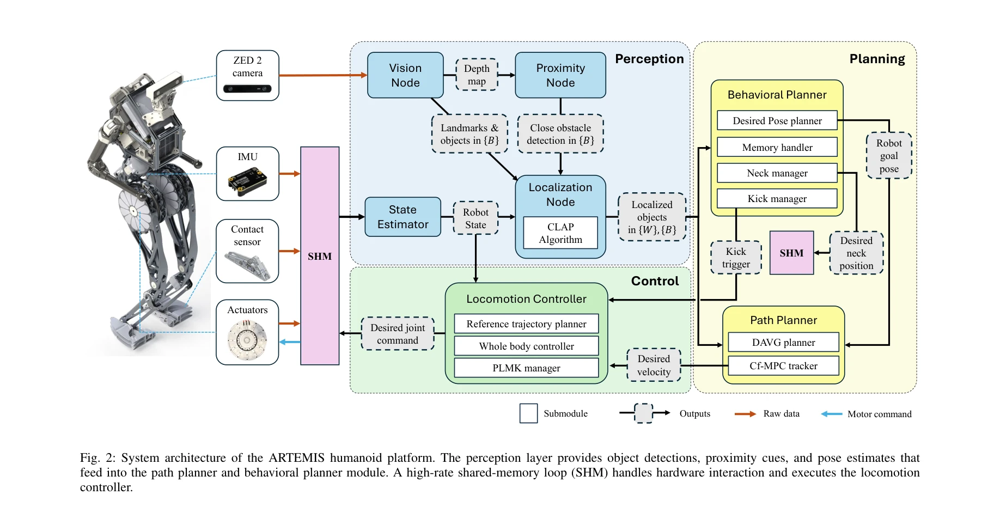

# A Hierarchical, Model-Based System for High-Performance Humanoid Soccer

> **저자**: Quanyou Wang, Mingzhang Zhu, Ruochen Hou, Kay Gillespie, Alvin Zhu, Shiqi Wang, Yicheng Wang, Gaberiel I. Fernandez, Yeting Liu, Colin Togashi, Hyunwoo Nam, Aditya Navghare, Alex Xu, Taoyuanmin Zhu, Min Sung Ahn, Arturo Flores Alvarez, Justin Quan, Ethan Hong, Dennis W. Hong | **날짜**: 2025-12-10 | **URL**: [https://arxiv.org/abs/2512.09431](https://arxiv.org/abs/2512.09431)

---

## Essence

*Fig. 1: Overview of the ARTEMIS humanoid soccer system. A). Two ARTEMIS humanoid robots competing for ball possession du*

RoboCup 2024 성인 크기 휴머노이드 축구 로봇 챔피언인 ARTEMIS 시스템으로, QDD 액추에이터 기반 하드웨어와 stereo vision, landmark fusion, MPC 기반 경로계획을 통합한 계층적 소프트웨어 아키텍처를 제시한다.

## Motivation

- **Known**: 휴머노이드 로봇이 동적 운동 능력을 갖추고 있으며, 많은 RoboCup 팀들이 servo 기반 액추에이터와 ZMP 보행을 사용하고 있다. 기존 deep RL 접근법은 개별 스킬 학습에만 초점을 맞춘다.
- **Gap**: 성인 크기 휴머노이드 축구에서 강력한 in-gait 킥 실행이 어렵고, 기존 소프트웨어는 perception과 제어의 약한 통합, 제한된 role reasoning, 없거나 미흡한 충돌 회피 능력을 보인다.
- **Why**: RoboCup 축구는 지각, 보행, 계획, 의사결정을 완전 자율적으로 장시간 통합해야 하는 극히 도전적인 벤치마크이며, 이를 해결하는 것은 동적 환경에서의 지능형 로봇 개발을 위해 중요하다.
- **Approach**: 하드웨어로 고토크 QDD 액추에이터와 특수 발 설계로 보행 중 강력한 킥을 구현하고, 소프트웨어로 stereo vision + landmark-based CLAP 로컬라이제이션, proximity 센싱 기반 collision-aware MPC 경로계획, 통합 행동 관리자를 개발했다.

## Achievement

*Fig. 1: Overview of the ARTEMIS humanoid soccer system. A). Two ARTEMIS humanoid robots competing for ball possession du*

- **하드웨어 혁신**: QDD 액추에이터와 특수화된 발 설계로 보행 안정성을 유지하면서 강력한 in-gait 킥 실현
- **통합 지각 및 로컬라이제이션**: stereo vision, object detection, landmark 기하학의 fusion을 통한 CLAP 알고리즘으로 신뢰성 높은 자기 위치, 볼, 팀원, 상대방 추정
- **계층적 소프트웨어**: 1 kHz 실시간 제어 루프, ROS 2 기반 지각/로컬라이제이션, collision-aware MPC 경로계획, 중앙집중식 행동 관리자의 seamless 통합
- **RoboCup 2024 우승**: 성인 크기 휴머노이드 축구 경쟁에서 우승으로 실증

## How

*Fig. 2: System architecture of the ARTEMIS humanoid platform. The perception layer provides object detections, proximity*

- ZED 2 stereo camera로 약 60 Hz에서 깊이 맵 및 객체 검출 생성
- CLAP (Coordinate-based Landmark Association and Positioning) 알고리즘으로 landmark 기하학과 IMU 측정치 fusion하여 로봇 포즈 (xr, yr, θr) 추정
- proximity 센싱으로 vision 저하 시 보완 정보 제공 및 충돌 회피 입력 제공
- DAVG (Dynamically-feasible Autonomous Vector Generation) planner로 전역 경로계획 수행
- Collision-aware MPC (Model Predictive Control)로 proximity 제약과 필드 기하학을 고려한 동적 가능 궤적 생성
- Whole-body controller와 PLMK (Phase-based Leg Momentum Kickoff) manager로 in-gait 킹 및 balance 제어
- 행동 관리자가 desired pose planning, memory handling, motion prediction, kick/neck control을 조율하여 game state 변화에 대응

## Originality

- 강력한 in-gait 킹과 보행 안정성의 동시 달성을 위한 hardware-software co-design 접근
- Landmark 기하학 기반 CLAP 로컬라이제이션의 정확성과 proximity 센싱의 중복성 조합
- Vision, proximity, 제어의 tight integration을 통한 modular 아키텍처의 약점 극복
- 중앙집중식 행동 관리자로 role selection, 의사결정, kick 실행을 게임 상태와 동적으로 조율

## Limitation & Further Study

- 오클루전, 조명 변화에 의한 vision 성능 저하 처리 상세 기술 부족
- MPC 기반 경로계획의 실시간 계산량과 latency에 대한 정량적 분석 미흡
- 다양한 필드 환경(실내/실외, 조명 조건)에 대한 robust성 평가 제한적
- 상대 로봇의 예측 주행과 복합적 멀티-에이전트 상호작용 모델링 기회 있음
- learning 기반 접근과의 비교나 혼합 전략 탐색 가능

## Evaluation

- Novelty: 4/5
- Technical Soundness: 4/5
- Significance: 4/5
- Clarity: 4/5
- Overall: 4/5

**총평**: 이 논문은 QDD 액추에이터, landmark-based 로컬라이제이션, proximity-aware MPC, 통합 행동 관리자를 결합하여 성인 크기 휴머노이드 축구의 강력한 end-to-end 솔루션을 제시하며, RoboCup 우승으로 실제 성능을 입증했다. 하드웨어-소프트웨어 co-design과 tight integration 철학이 돋보이는 완성도 높은 시스템 논문이다.

## Related Papers

- 🔄 다른 접근: [[papers/1601_Optimizing_Bipedal_Locomotion_for_The_100m_Dash_With_Compari/review]] — 축구 로봇의 계층적 시스템과 달리기 최적화 시스템 모두 고성능 운동 제어를 위한 서로 다른 접근법을 제시합니다.
- 🔗 후속 연구: [[papers/1299_CAD-Driven_Co-Design_for_Flight-Ready_Jet-Powered_Humanoids/review]] — ARTEMIS의 MPC 기반 경로계획이 제트 추진 휴머노이드의 co-design 프레임워크에서 제어 최적화에 응용 가능합니다.
- 🏛 기반 연구: [[papers/1472_Humanoid_Robot_Acrobatics_Utilizing_Complete_Articulated_Rig/review]] — 계층적 소프트웨어 아키텍처가 곡예 동작을 위한 완전한 강체역학 제어 아키텍처의 기반이 됩니다.
- 🏛 기반 연구: [[papers/1299_CAD-Driven_Co-Design_for_Flight-Ready_Jet-Powered_Humanoids/review]] — MPC 기반 제어 이론이 제트 추진 시스템의 형태-제어 동시 최적화에 기초를 제공합니다.
- 🔗 후속 연구: [[papers/1472_Humanoid_Robot_Acrobatics_Utilizing_Complete_Articulated_Rig/review]] — 완전한 강체역학 기반 곡예 제어가 ARTEMIS의 계층적 아키텍처에서 더 정밀한 동작 제어로 확장됩니다.
- 🔄 다른 접근: [[papers/1601_Optimizing_Bipedal_Locomotion_for_The_100m_Dash_With_Compari/review]] — 달리기 최적화와 축구 로봇 시스템의 서로 다른 고성능 운동 제어 접근법을 비교 연구할 수 있습니다.
