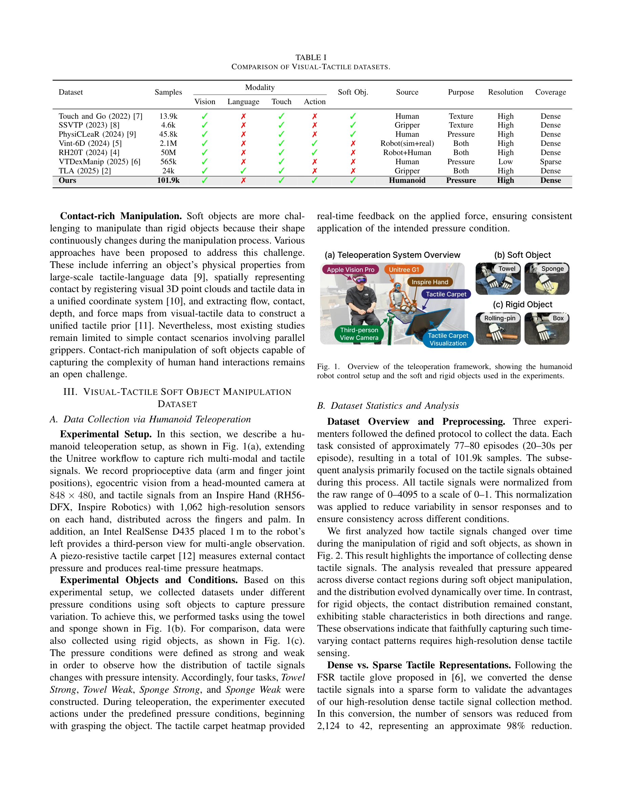
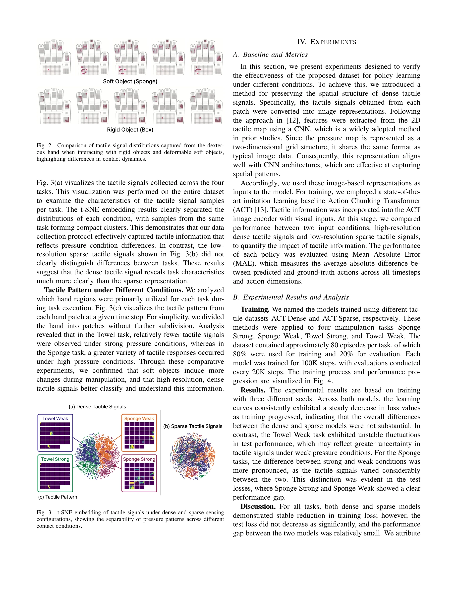

# A Humanoid Visual-Tactile-Action Dataset for Contact-Rich Manipulation

> **저자**: Eunju Kwon, Seungwon Oh, In-Chang Baek, Yucheon Park, Gyungbo Kim, JaeYoung Moon, Yunho Choi, Kyung-Joong Kim | **날짜**: 2025-10-28 | **URL**: [https://arxiv.org/abs/2510.25725](https://arxiv.org/abs/2510.25725)

---

## Essence

*Fig. 1.*

휴머노이드 로봇의 촉각 센서를 활용하여 부드러운 물체 조작에 대한 101.9K 프레임의 visual-tactile-action 데이터셋을 수집하고, 다양한 압력 조건에서의 접촉 역학을 분석함.

## Motivation

- **Known**: 로봇 학습 데이터셋은 주로 경직된 물체에 초점을 맞추었으며, 대부분 단순한 그리퍼와 표면 수준의 촉각 데이터만 수집해왔다. 최근 멀티모달 센싱의 중요성이 인식되고 있지만, 부드러운 물체 조작과 고해상도 촉각 신호는 여전히 미흡한 상태이다.
- **Gap**: 기존 visual-tactile 데이터셋들은 다양한 압력 조건 하의 부드러운 물체 조작을 포착하지 못하며, 휴머노이드 손의 복잡한 접촉 상호작용을 충분히 반영하지 않는다.
- **Why**: 접촉이 풍부한 조작은 로봇이 실제 환경에서 복잡한 작업을 수행하기 위한 핵심이며, 고해상도 촉각 신호는 부드러운 물체의 동적 변형을 추적하는 데 필수적이다.
- **Approach**: Inspire Hand의 1,062개 센서와 piezo-resistive tactile carpet을 갖춘 휴머노이드 로봇 텔레오퍼레이션을 통해 강한/약한 압력 조건 하에서 수건과 스펀지 조작 데이터를 수집하였다. 데이터는 정규화되어 처리되고, t-SNE 임베딩 분석을 통해 조건별 분리 가능성을 검증했다.

## Achievement

*Fig. 3(a) visualizes the tactile signals collected across the four*

- **첫 번째 휴머노이드 visual-tactile-action 데이터셋**: 부드러운 물체를 다양한 제어 조건 하에서 포착하는 최초의 휴머노이드 기반 마ル티모달 접촉-풍부 데이터셋 구성
- **고해상도 촉각 신호의 우월성 입증**: 밀집 촉각 신호(2,124개 센서)가 희소 표현(42개 센서, 98% 감소)보다 작업 조건을 훨씬 더 명확하게 구분함을 실증
- **동적 접촉 패턴 분석**: 부드러운 물체 조작 시 접촉이 다양한 영역에서 시간에 따라 변화하는 반면, 경직된 물체는 안정적임을 규명

## How

*Fig. 1.*

- Unitree 워크플로우 기반 휴머노이드 텔레오퍼레이션 프레임워크 구축: 촉각 신호, egocentric 비전(848×480), 3인칭 RGB-D(Intel RealSense D435), 고유수용각 데이터 동시 수집
- 4개 작업 프로토콜 설계: 수건/스펀지 × 강한/약한 압력 조건, 각 77-80 에피소드(20-30초), 총 101.9K 프레임 수집
- 촉각 신호 정규화: 원본 범위(0-4095)를 0-1 스케일로 변환하여 센서 응답 변동성 감소 및 조건 간 일관성 확보
- t-SNE 임베딩을 통한 정성적 분석: 밀집 촉각 신호의 작업별 클러스터링과 희소 표현과의 비교 분석
- 손 패치별 촉각 패턴 분석: 각 작업에서 활용되는 손 영역의 시공간적 분포 시각화

## Originality

- 휴머노이드 로봇의 고해상도 dexterous hand를 활용한 첫 번째 visual-tactile-action 데이터셋으로, 기존의 그리퍼 중심 연구와 근본적으로 다른 인간 손과 유사한 조작 복잡성을 포착
- 다양한 압력 조건(strong/weak) 하에서 부드러운 물체의 동적 변형을 촉각 신호로 체계적으로 수집함으로써, 기존 연구의 경직된 물체/단순 접촉 감지 패러다임을 전환
- 밀집 vs. 희소 촉각 표현의 정량적/정성적 비교를 통해 고해상도 촉각 센싱의 명확한 우월성을 객관적으로 입증

## Limitation & Further Study

- **샘플 크기 제한**: 101.9K 프레임은 RH20T(50M)나 Vint-6D(2.1M) 등 대규모 데이터셋에 비해 현저히 작아 일반화 능력의 제약이 있을 수 있음
- **객체 다양성 부족**: 수건과 스펀지 두 가지 부드러운 물체만 포함되어 있어, 다양한 재질, 경도, 변형 특성을 지닌 부드러운 물체에 대한 모델 성능 평가 불가
- **작업 범위 제한**: 기본적인 파지 작업 중심으로, 복잡한 조작 행동(rolling, squeezing, folding 등)이 충분히 다양하지 않을 가능성
- **후속 연구 방향**: (1) 더 다양한 부드러운 물체 및 조작 작업 추가 수집, (2) 밀집 촉각 신호를 효과적으로 활용하는 신경망 아키텍처 개발, (3) 정책 학습 실험 완성 및 실제 로봇 조작 성능 평가

## Evaluation

- Novelty: 4/5
- Technical Soundness: 3/5
- Significance: 4/5
- Clarity: 4/5
- Overall: 4/5

**총평**: 이 논문은 휴머노이드 dexterous hand를 활용한 첫 번째 visual-tactile-action 데이터셋을 제시하며, 고해상도 촉각 센싱의 중요성을 체계적으로 입증함으로써 접촉-풍부 조작 연구에 의미 있는 기여를 한다. 다만 샘플 규모와 객체/작업 다양성 확대, 그리고 정책 학습 실험의 완성이 영향력을 극대화하기 위한 과제이다.

## Related Papers

- 🔗 후속 연구: [[papers/1246_A_Rapid_Instrument_Exchange_System_for_Humanoid_Robots_in_Mi/review]] — 수술용 휴머노이드 로봇에서 섬세한 촉각 피드백과 압력 조건 분석이 필수적이다
- 🔄 다른 접근: [[papers/1251_ACE_A_Cross-Platform_Visual-Exoskeletons_System_for_Low-Cost/review]] — 촉각 기반 정교한 조작에서 visual-exoskeleton과 tactile sensing의 상호보완적 접근이다
- 🧪 응용 사례: [[papers/1302_CHILD_Controller_for_Humanoid_Imitation_and_Live_Demonstrati/review]] — 전신 텔레오퍼레이션에서 접촉이 풍부한 조작 작업을 위한 촉각 데이터가 활용된다
- 🏛 기반 연구: [[papers/1604_OSMO_Open-Source_Tactile_Glove_for_Human-to-Robot_Skill_Tran/review]] — 저비용 촉각 장갑 시스템에서 visual-tactile 융합 데이터의 기초가 된다
- 🔗 후속 연구: [[papers/1302_CHILD_Controller_for_Humanoid_Imitation_and_Live_Demonstrati/review]] — 전신 텔레오퍼레이션에서 촉각 센서 기반 접촉 풍부한 조작이 확장 적용된다
- 🏛 기반 연구: [[papers/1246_A_Rapid_Instrument_Exchange_System_for_Humanoid_Robots_in_Mi/review]] — 수술용 휴머노이드의 섬세한 기구 조작에서 촉각 센서 데이터가 기반이 된다
- 🔄 다른 접근: [[papers/1251_ACE_A_Cross-Platform_Visual-Exoskeletons_System_for_Low-Cost/review]] — 정교한 원격조작에서 visual-exoskeleton과 tactile sensing의 상보적 접근이다
- 🏛 기반 연구: [[papers/1587_Object-Centric_Dexterous_Manipulation_from_Human_Motion_Data/review]] — human visual-tactile-action 데이터셋의 contact-rich 조작 경험을 로봇 손의 object-centric 조작 학습에 활용한다.
