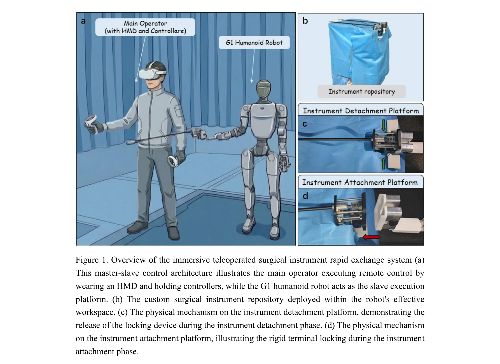
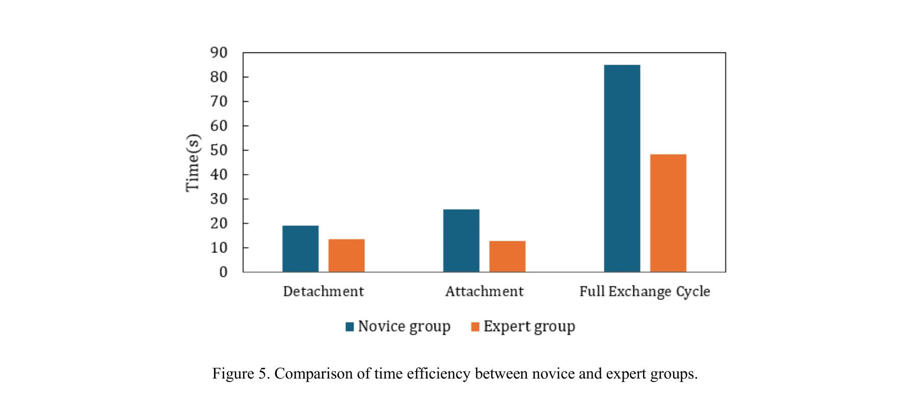
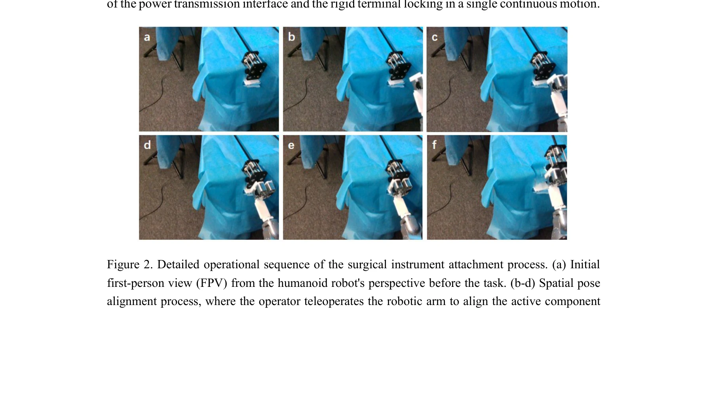

# A Rapid Instrument Exchange System for Humanoid Robots in Minimally Invasive Surgery

> **저자**:  | **날짜**: 2026-04-03 | **URL**: [https://arxiv.org/abs/2604.02707](https://arxiv.org/abs/2604.02707)

---

## Essence

*Figure 1. Overview of the immersive teleoperated surgical instrument rapid exchange system (a)*

휴머노이드 로봇의 이중 팔 구조를 활용하여 HMD 기반 몰입형 원격조작으로 최소침습 수술 중 수술 기구를 고속으로 교환하는 시스템을 제안하며, 단축 컴플라이언트 도킹 메커니즘과 실시간 1인칭 시점 인지를 통합했다.

## Motivation

- **Known**: 기존 다중 팔 수술 로봇은 전용 인터페이스와 높은 비용, 대형 공간 점유로 임상 활용이 제한되며, 산업용 자동 공구 교환기(ATC)와 의료용 빠른 교환 메커니즘들이 개발되었으나 휴머노이드 로봇의 이중 팔 구조에 직접 적용하기 어렵다.
- **Gap**: 휴머노이드 로봇은 생체모방적 이중 팔 구조의 공간 제약으로 인해 기존 다중 팔 로봇이나 전용 의료 로봇용 교환 인터페이스를 직접 통합하기 어렵고, 완전 자율 기구 교환 기술이 미성숙하여 텔레오퍼레이션 기반 고정밀 도킹 솔루션이 부족하다.
- **Why**: 수술 기구의 빠른 교환은 직접 치료 행위는 아니지만 수술 전체 효율성, 로봇 시스템의 임상 유용성, 외과의와 보조자 간 협업 인지 부하 감소에 결정적이며, 휴머노이드 로봇의 생체모방 민첩성과 최소 공간 점유 장점을 최대화하는 데 필수적이다.
- **Approach**: Master-slave 협력 제어 아키텍처 하에서 HMD를 통한 실시간 FPV(first-person view) 시각 피드백, 자연스러운 3차원 공간 모션 매핑, 그리고 휴머노이드 로봇 전용 설계된 단축 컴플라이언트 도킹 메커니즘을 통합하여 직관적이고 안정적인 원격 기구 교환 솔루션을 구현했다.

## Achievement

*Figure 5. Comparison of time efficiency between novice and expert groups.*

- **고속 도킹 메커니즘 설계**: 로봇 측 능동 컴포넌트(모터 탑재)와 기구 측 수동 컴포넌트(와이어 구동)로 구성된 단축 컴플라이언트 도킹 시스템을 개발하여 교환 시간을 단축
- **몰입형 원격조작 시스템**: HMD 기반 실시간 FPV 인지와 컨트롤러를 통한 3차원 공간 모션 매핑으로 직관적 조작 경험 제공
- **신속한 학습 곡선**: 미숙련 조작자도 brief training 후 기구 부착·분리 성능이 대폭 향상되어 높은 운영 견고성 입증
- **임상 환경 적용 타당성**: 제약된 임상 환경 내에서 휴머노이드 로봇의 안정적인 기구 교환 실행 가능성을 성공적으로 검증

## How

*Figure 2. Detailed operational sequence of the surgical instrument attachment process. (a) Initial*

- G1 humanoid robot(Unitree Robotics)을 slave execution platform으로 활용하며, 전신 29 DoF(양팔 각 7 DoF, 하지 각 7 DoF, 허리 yaw 1 DoF) 활용
- 로봇 팔 말단에 능동 컴포넌트(구동 모터 내장)를 강결하고, 수술 기구 기저부에 수동 컴포넌트(와이어 구동 메커니즘)를 통합한 이중 구조 설계
- instrument repository를 로봇 효율적 작업 공간 내에 배치하여 교환 기구 저장 및 접근 최적화
- HMD를 착용한 주 조작자가 컨트롤러로 slave robot을 원격 제어하는 master-slave architecture 구현
- 기구 부착 시 rigid terminal locking, 분리 시 locking device release 메커니즘으로 안정성 확보
- 전문가 vs 미숙련자 비교 평가 실험을 통해 operational robustness 및 learning curve convergence 검증

## Originality

- 휴머노이드 로봇의 이중 팔 생체모방 구조와 공간 제약을 고려한 전용 기구 교환 메커니즘 설계로, 기존 다중 팔 또는 전용 의료 로봇용 솔루션과 차별화
- HMD 기반 실시간 FPV 몰입형 원격조작을 기구 교환에 처음 적용하여 조작자의 공간 인지 복잡성과 인지 부하 대폭 감소
- 단축 컴플라이언트 도킹(single-axis compliant docking) 메커니즘과 환경 제약 해제(environmental constraint release) 기반의 저지연 솔루션으로 기술적 간극 해소
- 텔레오퍼레이션 기반 고정밀 기구 도킹과 완전 자율화 사이의 실용적 중간 경로 제시

## Limitation & Further Study

- **장거리 공간 정렬 과제**: 장거리 spatial alignment에서 시간 비용과 협업 안정성이 여전히 도전 과제로 남음
- **완전 자율화 미성숙**: 현 단계에서는 텔레오퍼레이션 의존도가 높으며, 완전 자율 기구 교환 기술 개발 필요
- **임상 검증 제한**: 실제 수술 환경에서의 임상 검증 데이터 부족
- **후속 연구 방향**: 완전 자율 교환 기능 개발, 장거리 alignment 시간 단축 알고리즘 개선, 실제 수술 시나리오에서의 대규모 임상 평가

## Evaluation

- Novelty: 4/5
- Technical Soundness: 3/5
- Significance: 4/5
- Clarity: 4/5
- Overall: 4/5

**총평**: 본 연구는 휴머노이드 로봇의 이중 팔 구조 제약을 실용적으로 해결하기 위한 창의적인 기구 교환 시스템을 제시하며, HMD 기반 몰입형 원격조작과 맞춤형 도킹 메커니즘의 통합으로 미성숙한 자율화 단계에서 효과적인 중간 솔루션을 제공한다. 다만 완전 자율화 기술 개발과 실제 임상 환경에서의 대규모 검증이 후속 과제다.

## Related Papers

- 🏛 기반 연구: [[papers/1244_A_Humanoid_Visual-Tactile-Action_Dataset_for_Contact-Rich_Ma/review]] — 수술용 휴머노이드의 섬세한 기구 조작에서 촉각 센서 데이터가 기반이 된다
- 🔄 다른 접근: [[papers/1306_CLONE_Closed-Loop_Whole-Body_Humanoid_Teleoperation_for_Long/review]] — HMD 기반 몰입형 원격조작에서 수술과 일반 조작의 다른 접근 방식이다
- 🧪 응용 사례: [[papers/1482_Humanoids_in_Hospitals_A_Technical_Study_of_Humanoid_Robot_S/review]] — 병원 환경에서 휴머노이드 로봇의 의료용 텔레오퍼레이션 실제 적용 사례다
- 🔗 후속 연구: [[papers/1512_LapSurgie_Humanoid_Robots_Performing_Surgery_via_Teleoperate/review]] — 복강경 수술에서 휴머노이드 로봇의 기구 교환 시스템이 확장 적용된다
- 🔄 다른 접근: [[papers/1306_CLONE_Closed-Loop_Whole-Body_Humanoid_Teleoperation_for_Long/review]] — MR 헤드셋 원격조작에서 장시간 협응과 수술용 정밀 조작의 다른 응용 분야다
- 🔗 후속 연구: [[papers/1244_A_Humanoid_Visual-Tactile-Action_Dataset_for_Contact-Rich_Ma/review]] — 수술용 휴머노이드 로봇에서 섬세한 촉각 피드백과 압력 조건 분석이 필수적이다
- 🔄 다른 접근: [[papers/1482_Humanoids_in_Hospitals_A_Technical_Study_of_Humanoid_Robot_S/review]] — 둘 다 의료용 휴머노이드를 다루지만 Hospitals는 포괄적 의료업무에, Instrument Exchange는 도구 교체에 집중한다
- 🔄 다른 접근: [[papers/1512_LapSurgie_Humanoid_Robots_Performing_Surgery_via_Teleoperate/review]] — 둘 다 의료용 휴머노이드를 다루지만 LapSurgie는 복강경 수술에, Instrument Exchange는 도구 교체에 집중한다
