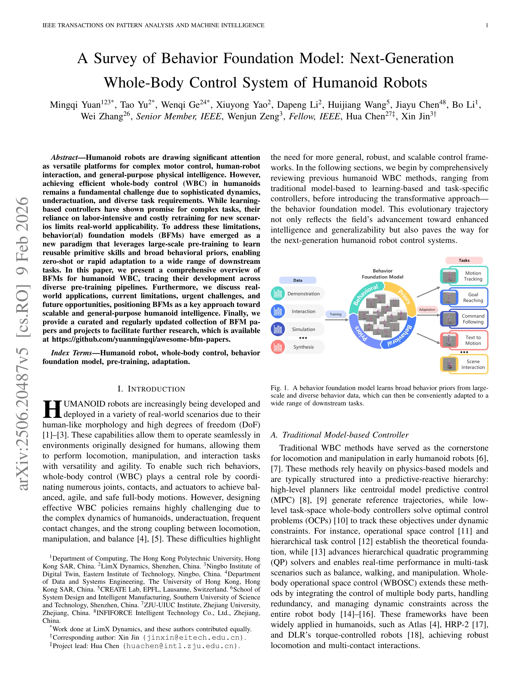
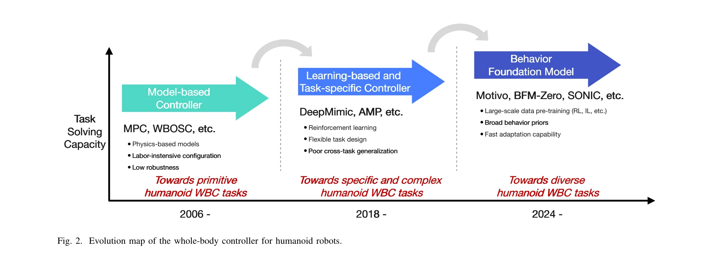

# A Survey of Behavior Foundation Model: Next-Generation Whole-Body Control System of Humanoid Robots

> **저자**: Mingqi Yuan, Tao Yu, Wenqi Ge, Xiuyong Yao, Huijiang Wang, Jiayu Chen, Bo Li, Wei Zhang, Wenjun Zeng, Hua Chen, Xin Jin | **날짜**: 2025-06-25 | **URL**: [https://arxiv.org/abs/2506.20487](https://arxiv.org/abs/2506.20487)

---

## Essence

*Fig. 1. A behavior foundation model learns broad behavior priors from large-*

본 논문은 인간형 로봇의 전신 제어(WBC)를 위한 행동 기초 모델(BFM)의 포괄적 조사를 제시하며, 대규모 사전학습을 통해 재사용 가능한 기술 기초와 행동 사전 정보를 학습하여 새로운 작업에 빠르게 적응할 수 있는 패러다임을 제안한다.

## Motivation

- **Known**: 기존 model-based 제어(MPC, WBOSC 등)는 동역학 기반이지만 작업 설정과 튜닝이 노동집약적이며, learning-based 제어(DeepMimic, AMP)는 복잡한 기술을 학습할 수 있으나 특정 작업에만 특화되고 일반화 능력이 떨어진다.
- **Gap**: 기존 학습 기반 제어 방법들은 새로운 시나리오에 대해 비용이 많이 드는 재학습을 필요로 하며, model-based 제어는 복잡한 동역학 하에서 고차원 시스템의 실시간 처리와 역동적 기술 실행에 어려움을 겪는다.
- **Why**: 인간형 로봇이 현실 세계의 다양한 환경과 작업에 배치되기 위해서는 확장 가능하고 일반화된 제어 시스템이 필수적이며, BFM은 이러한 한계를 극복하여 더 효율적이고 유연한 제어를 가능하게 한다.
- **Approach**: 대규모 행동 데이터(인간 시연, 에이전트-환경 상호작용)에서 광범위한 행동 사전 정보를 학습하는 foundation model 패러다임을 도입하여, 다양한 사전학습 파이프라인을 통해 zero-shot 또는 빠른 적응이 가능한 체계적 프레임워크를 제시한다.

## Achievement

*Fig. 2. Evolution map of the whole-body controller for humanoid robots.*

- **진화 추적**: Model-based 제어(2006년~)에서 learning-based 제어(2018년~)를 거쳐 BFM(2024년~)으로의 인간형 로봇 제어 기술 진화를 체계적으로 분류하고 비교
- **BFM 정의 확장**: Foundation model 원리(GPT-4, CLIP, SAM)를 행동 제어에 적용하여 동적 환경에서 에이전트 행동을 제어하는 특화된 기초 모델 클래스로 정의
- **포괄적 설문**: BFM의 다양한 사전학습 파이프라인(RL, IL, 상호작용 기반 등), 실제 응용 사례, 현재 한계, 긴급 과제, 향후 기회를 종합적으로 검토
- **리소스 제공**: 논문과 프로젝트의 정리된 컬렉션 제공(https://github.com/yuanmingqi/awesome-bfm-papers)으로 후속 연구 촉진

## How

*Fig. 1. A behavior foundation model learns broad behavior priors from large-*

- 전통적 model-based 제어(MPC, WBOSC)의 한계점(작업 설정 복잡성, 고차원 시스템의 실시간 처리 어려움)을 분석
- RL 기반 방법(DeepMimic, AMP)과 IL 기반 방법(TRILL, ExBody)의 성과와 제한점(샘플 효율성, 보상 함수 설계 민감도, sim2real 간극, 좁은 작업 특화) 검토
- 대규모 행동 데이터(human demonstrations, agent-environment interactions)에서 광범위한 행동 사전 정보 학습
- Vision-language-action(VLA) 모델 통합 등 최신 advance 활용
- 다양한 downstream 작업(motion tracking, goal reaching, command following, text to motion)에 대한 zero-shot 또는 빠른 적응 능력 검증

## Originality

- **통합적 프레임워크**: Model-based, learning-based, BFM 세 패러다임의 진화를 체계적으로 통합하고 명확한 단계별 발전 경로 제시
- **BFM의 재정의**: 기존 강화학습 에이전트 정의에서 나아가 foundation model 원리를 행동 제어에 적용한 특화된 정의 제안
- **광범위한 문헌 조사**: 인간형 로봇의 전신 제어라는 구체적 응용 분야에서 BFM 접근의 체계적이고 포괄적인 설문 제공
- **실천적 리소스**: 정기적으로 업데이트되는 논문 및 프로젝트 컬렉션 제공으로 실제 연구 커뮤니티 지원

## Limitation & Further Study

- **이론적 깊이 부재**: 설문 논문으로서 BFM의 기본 원리나 수학적 기초에 대한 심화 분석 부족
- **Sim2real 간극 미해결**: 기존 learning-based 방법의 주요 한계인 시뮬레이션-현실 갭이 BFM에서 어떻게 해결되는지 명확하지 않음
- **성능 정량화 부족**: 발췌된 부분에서 BFM의 정량적 성능 지표(성공률, 샘플 효율성 개선도 등) 제시 불충분
- **적응 메커니즘 상세 미흡**: Zero-shot 또는 빠른 적응이 어떤 구체적 메커니즘으로 작동하는지 발췌 부분에서 불명확
- **후속 연구 필요**: BFM의 robustness에 대한 평가, 실제 하드웨어 구현 경험, 데이터 규모와 다양성이 미치는 영향 등의 상세 분석 필요

## Evaluation

- Novelty: 4/5
- Technical Soundness: 3/5
- Significance: 4/5
- Clarity: 4/5
- Overall: 4/5

**총평**: 본 논문은 인간형 로봇 전신 제어의 진화 경로를 명확히 제시하고 BFM이라는 새로운 패러다임의 중요성을 포괄적으로 설명하며, 실제 리소스를 제공함으로써 이 분야의 현황 파악과 향후 연구 방향 설정에 유용한 설문 논문이다. 다만 이론적 깊이와 정량적 성능 검증이 추가될 경우 더욱 강력한 기여가 될 것이다.

## Related Papers

- 🔄 다른 접근: [[papers/1292_A_Comprehensive_Survey_on_World_Models_for_Embodied_AI/review]] — embodied AI를 위한 모델 설계에서 행동 기초 모델과 world model이라는 다른 접근법을 제시한다
- 🔗 후속 연구: [[papers/1307_An_Anatomy_of_Vision-Language-Action_Models_From_Modules_to/review]] — VLA 모델의 구조적 분석을 토대로 전신 제어를 위한 행동 기초 모델의 발전 방향을 구체화한다
- 🧪 응용 사례: [[papers/1278_Behavior_Foundation_Model_for_Humanoid_Robots/review]] — 행동 기초 모델의 이론적 틀을 휴머노이드 로봇의 실제 행동 제어에 적용하는 구체적 사례를 보여준다
- 🔄 다른 접근: [[papers/1292_A_Comprehensive_Survey_on_World_Models_for_Embodied_AI/review]] — embodied AI를 위한 모델 설계에서 world model과 행동 기초 모델이라는 서로 다른 접근법을 제시한다
- 🏛 기반 연구: [[papers/1278_Behavior_Foundation_Model_for_Humanoid_Robots/review]] — 인간형 로봇을 위한 행동 기초 모델의 포괄적 조사로 BFM의 이론적 토대를 제공한다
- 🏛 기반 연구: [[papers/1536_RoboBrain_A_Unified_Brain_Model_for_Robotic_Manipulation_fro/review]] — Behavior Foundation Model Survey가 RoboBrain의 통합 MLLM 모델 개발에 필요한 행동 기반 모델의 이론적 배경을 제공한다.
