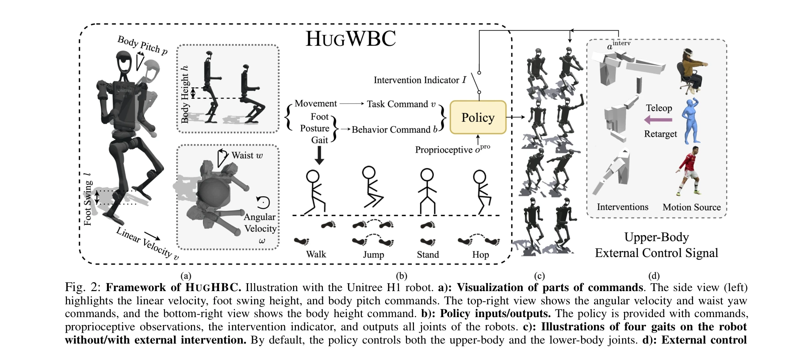
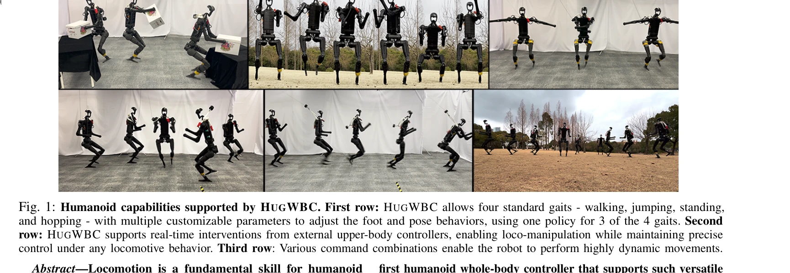

# A Unified and General Humanoid Whole-Body Controller for Versatile Locomotion

> **저자**: Yufei Xue, Wentao Dong, Minghuan Liu, Weinan Zhang, Jiangmiao Pang | **날짜**: 2025-02-05 | **URL**: [https://arxiv.org/abs/2502.03206](https://arxiv.org/abs/2502.03206)

---

## Essence

*Fig. 2: Framework of HUGHBC. Illustration with the Unitree H1 robot. a): Visualization of parts of commands. The side vi*

인휴머노이드 로봇을 위한 통합 전신 제어기 HugWBC를 제안하여, 보행, 점프, 호핑 등 다양한 보행 패턴과 커스터마이징 가능한 파라미터를 지원하며 상체 조작도 동시에 가능하게 함.

## Motivation

- **Known**: 기존 인휴머노이드 로봇 제어는 model-based 최적 제어나 learning-based 접근법을 사용하지만, 대부분 단일하고 제한된 보행 스타일만 생성하며 다양한 운동 능력 구현이 미흡함.
- **Gap**: 인간처럼 다양한 운동 능력(보행, 뛰기, 호핑)과 동적 파라미터 조절(주파수, 발 높이)을 동시에 지원하면서도 상체 조작까지 강건하게 처리할 수 있는 통합 제어기가 부재함.
- **Why**: 인휴머노이드 로봇이 현실의 다양한 환경과 작업에 효과적으로 적응하려면 다채로운 운동 능력과 실시간 제어 유연성이 필수적이므로, 이는 로봇의 실용성과 적용 범위를 크게 확대함.
- **Approach**: 일반화된 명령 공간(task/behavior commands) 설계와 symmetrical loss, intervention training 등의 고급 학습 기법을 활용하여 simulation에서 강화학습으로 전신 제어 정책을 학습하고 실로봇에 직접 전이함.

## Achievement

*Fig. 1: Humanoid capabilities supported by HUGWBC. First row: HUGWBC allows four standard gaits - walking, jumping, stan*

- **다중 보행 패턴 지원**: 보행, 점프, 서기, 호핑 4가지 기본 보행을 3가지는 단일 정책으로 생성 가능
- **파라미터 커스터마이징**: 발 스윙 높이, 보행 주파수, 몸 높이, 허리 회전, 몸 pitch 등 8개 명령에 대해 높은 추적 정확도 달성
- **상체 개입 지원**: 실시간 외부 상체 제어기(원격조작 등)를 통합하여 loco-manipulation 가능하면서도 강건성 유지
- **높은 강건성과 유연성**: 상체 개입 유무와 무관하게 모든 명령에 대해 우수한 성능 입증

## How

*Fig. 2: Framework of HUGHBC. Illustration with the Unitree H1 robot. a): Visualization of parts of commands. The side vi*

- **일반화된 명령 공간**: 선형/각속도, 발 스윙 높이, 몸 높이, 허리 회전, 몸 pitch 등을 포함하는 확장된 태스크 및 동작 명령 설계
- **Symmetrical loss**: 좌우 대칭 운동 특성을 활용하여 학습 효율성과 정책 품질 향상
- **Intervention training**: 외부 상체 제어 신호에 대한 강건성을 향상시키기 위해 노이즈 커리큘럼 방식으로 개입을 점진적으로 도입
- **Phase-based gait control**: Clock function과 phase variable을 통해 다양한 보행 패턴을 통일된 프레임워크로 제어
- **Policy structure**: 명령, 고유감각 관측치, 개입 지표를 입력받아 모든 관절의 제어 신호를 출력하는 end-to-end 신경망 정책
- **Simulation-to-reality transfer**: Sim2real gap을 고려한 학습으로 실로봇 적용 시 안정적 성능 달성

## Originality

- **확장된 명령 공간**: 기존 연구보다 훨씬 더 풍부한 동작 및 태스크 명령을 통합하여 진정한 의미의 versatile locomotion 실현
- **단일 정책 다중 보행 생성**: 3가지 보행을 하나의 정책으로 제어하면서 높은 정확도 유지하는 설계
- **Intervention training 메커니즘**: 상체 개입에 대한 강건성을 명시적으로 학습하는 novel curriculum 도입
- **Loco-manipulation의 완전한 통합**: 별도의 IK 기반 상체 제어기 없이 학습 기반 정책만으로 정밀한 loco-manipulation 지원
- **종합적 명령 상호작용 분석**: 다양한 명령 조합이 로봇 움직임에 미치는 영향과 상호관계에 대한 심층 분석 제공

## Limitation & Further Study

- **호핑 보행**: 3가지 보행만 단일 정책으로 지원 가능하며, 호핑은 별도 정책 필요
- **환경 적응성 미제시**: 실제 불규칙한 지형 환경에서의 성능과 강건성이 충분히 검증되지 않음
- **상체 개입의 범위 제한**: 원격조작, IK 기반 제어 등으로 제한되며, 더 복잡한 상체 운동 시퀀스와의 호환성 미명시
- **일반화 능력 평가 부재**: 단일 로봇 플랫폼(Unitree H1)에서만 검증되었으며, 다양한 인휴머노이드 로봇으로의 전이 가능성 미평가
- **후속 연구 방향**: 계단 오르기, 불규칙 지형 통과 등 복잡한 환경 적응 기능 추가, 여러 로봇 플랫폼으로의 확장, 실시간 지형 인식과 동적 궤적 계획의 통합

## Evaluation

- Novelty: 4/5
- Technical Soundness: 3/5
- Significance: 4/5
- Clarity: 4/5
- Overall: 4/5

**총평**: 인휴머노이드 로봇의 보행 제어에 있어 다양한 운동 능력과 동적 파라미터 조절을 통합한 첫 번째 범용 전신 제어기를 제안하며, 강화학습과 intervention training 등의 기법으로 실로봇에서 강건한 성능을 입증한 점에서 학술적·실용적 기여도가 높음.

## Related Papers

- 🔄 다른 접근: [[papers/1250_A_Whole-Body_Motion_Imitation_Framework_from_Human_Data_for/review]] — 휴머노이드 전신 제어에서 통합 제어기와 모방 기반 프레임워크의 다른 접근법이다
- 🔗 후속 연구: [[papers/1331_DemoHLM_From_One_Demonstration_to_Generalizable_Humanoid_Loc/review]] — 일반화 가능한 로코-조작에서 통합 전신 제어기의 기반 기술이 활용된다
- 🏛 기반 연구: [[papers/1287_BeyondMimic_From_Motion_Tracking_to_Versatile_Humanoid_Contr/review]] — 다양한 동작 조합을 위한 통합 제어 프레임워크가 motion tracking의 기초가 된다
- 🧪 응용 사례: [[papers/1425_GMT_General_Motion_Tracking_for_Humanoid_Whole-Body_Control/review]] — GMT의 전신 동작 추적에서 통합 제어기의 보행과 조작 통합 기능이 적용된다
- 🔄 다른 접근: [[papers/1250_A_Whole-Body_Motion_Imitation_Framework_from_Human_Data_for/review]] — 전신 동작 제어에서 모방 기반과 통합 제어기의 다른 접근 방식이다
- 🏛 기반 연구: [[papers/1331_DemoHLM_From_One_Demonstration_to_Generalizable_Humanoid_Loc/review]] — 일반화 가능한 로코-조작에서 통합 전신 제어기의 보행-조작 통합이 기초가 된다
- 🏛 기반 연구: [[papers/1554_RT-1_Robotics_Transformer_for_Real-World_Control_at_Scale/review]] — 통합된 휴머노이드 전신 제어 프레임워크가 LeVERB의 계층적 latent VLA 시스템에 핵심 제어 이론을 제공한다
- 🏛 기반 연구: [[papers/1628_WholeBodyVLA_Towards_Unified_Latent_VLA_for_Whole-Body_Loco-/review]] — A Unified Humanoid Controller의 전신 제어 이론이 WholeBodyVLA의 loco-manipulation 통합 설계 기반이 된다
- 🔗 후속 연구: [[papers/1287_BeyondMimic_From_Motion_Tracking_to_Versatile_Humanoid_Contr/review]] — motion tracking 기반 제어에서 통합 전신 제어기의 다양한 동작 지원이 확장된다
