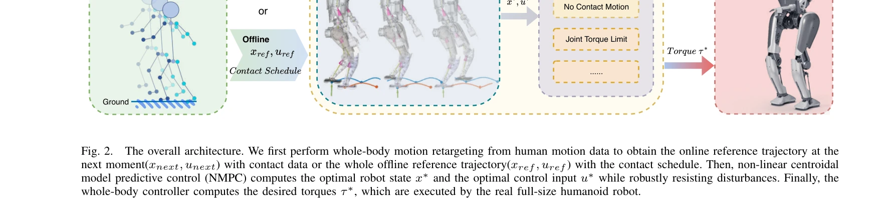

# A Whole-Body Motion Imitation Framework from Human Data for Full-Size Humanoid Robot

> **저자**: Zhenghan Chen, Haodong Zhang, Dongqi Wang, Jiyu Yu, Haocheng Xu, Yue Wang, Rong Xiong | **날짜**: 2025-08-01 | **URL**: [https://arxiv.org/abs/2508.00362](https://arxiv.org/abs/2508.00362)

---

## Essence

*Fig. 2.*

전신 동작 모방을 위해 접촉 인식 motion retargeting과 비선형 centroidal MPC를 결합한 휴머노이드 로봇 제어 프레임워크를 제안하여, 인간의 움직임을 실시간으로 정확하게 모방하면서 동시에 균형을 유지할 수 있다.

## Motivation

- **Known**: Humanoid robot의 전신 동작 모방은 인간과 유사한 구조를 활용하여 다양한 작업을 수행할 수 있게 한다. 기존 motion retargeting과 제어 방법들은 인간-로봇 간의 운동학적 차이, 실시간 계산의 어려움, 동적 균형 유지 간의 트레이드오프 문제를 겪고 있다.
- **Gap**: Motion retargeting은 발 접촉 정보를 충분히 활용하지 못하고, MPC 기반 제어는 고차 동역학 모델의 복잡성 때문에 실시간 성능이 제한된다. 또한 두 방법을 유기적으로 통합하여 anthropomorphic하면서도 강건한 전신 동작 모방을 달성한 연구가 부족하다.
- **Why**: Humanoid robot이 인간과 같은 다양하고 표현력 있는 움직임을 수행할 수 있다면 인간-로봇 상호작용과 환경 적응 능력이 크게 향상되며, 실제 작업 환경에서의 활용 가능성이 증대된다.
- **Approach**: Contact-aware whole-body motion retargeting으로 인간 동작을 로봇에 맞게 변환하여 참조 궤적을 생성하고, 이를 비선형 centroidal MPC의 초기값으로 제공한다. 이어서 centroidal dynamics 기반 NMPC가 동적 제약조건을 만족하면서 실시간으로 최적 제어 입력을 계산하고, whole-body controller가 토크 제어를 수행한다.

## Achievement

- **Contact-aware motion retargeting**: 인간 동작의 발 접촉 정보를 고려하여 운동학적으로 실현 가능하면서도 표현력 있는 참조 궤적을 생성
- **실시간 비선형 MPC**: Centroidal dynamics를 활용하여 계산 복잡성을 줄이면서도 정확한 동작 추적과 동적 균형 유지를 동시에 달성
- **전신 동작 제어**: 상체 움직임, 한 다리 서기 등 다양한 준정적 동작부터 복잡한 전신 동작까지 실시간으로 모방 가능
- **실제 플랫폼 검증**: 시뮬레이션뿐만 아니라 전체 크기 humanoid robot에서 높은 추적 정확도와 강건성을 입증

## How

*Fig. 2.*

- 인간 동작 데이터(Joint positions P_human)로부터 로봇 관절각(Q_robot) 변환 시 형태학적 차이(링크 비율, 로봇 제약)을 고려
- 발 접촉 감지를 통해 정확한 발 배치 시간과 순서를 결정하여 참조 궤적 품질 향상
- Centroidal MPC 최적화 문제로 로봇 상태(x*)와 제어 입력(u*)을 계산하며 외부 교란에 대한 강건성 확보
- Whole-body controller가 NMPC 출력을 기반으로 최종 관절 토크(τ*)를 계산하여 로봇에 전달
- 온라인 모드(다음 시점 참조 궤적 실시간 생성) 또는 오프라인 모드(사전 계산된 완전 참조 궤적 사용) 선택 가능

## Originality

- Contact-aware information을 명시적으로 통합한 motion retargeting은 기존 kinematic method나 data-driven approach의 한계를 극복
- Centroidal dynamics 기반 NMPC를 full-size humanoid의 전신 제어에 확장하여 실시간 성능과 정확도의 균형 달성
- Motion retargeting과 model-based control을 통합한 unified framework로 anthropomorphism과 robustness를 동시에 보장하는 점이 차별화
- 실제 로봇 플랫폼에서 다양한 전신 동작(상체, 다리, 준정적 동작)을 통해 방법의 일반성 입증

## Limitation & Further Study

- Contact detection의 정확성에 따라 성능이 좌우되며, 복잡한 접촉 전환(예: 다중 접촉 지점) 처리에 대한 상세한 논의 부족
- NMPC 최적화 문제가 실시간 해결 가능하려면 planning horizon과 샘플링 시간의 신중한 설정이 필요하지만 일반화 지침이 불명확
- 실험이 주로 준정적 동작에 집중되어 있으며, 고속 동적 동작(running, jumping)에 대한 성능 검증 부족
- 인간 모션 데이터의 품질과 센서 노이즈의 영향에 대한 강건성 분석 필요
- 후속 연구로 학습 기반 접근(예: reinforcement learning)과의 통합, 더욱 복잡한 동작 클래스 확장, 부정확한 동역학 모델에 대한 적응적 제어 등이 고려될 수 있음

## Evaluation

- Novelty: 4/5
- Technical Soundness: 3/5
- Significance: 4/5
- Clarity: 4/5
- Overall: 4/5

**총평**: 본 논문은 contact-aware motion retargeting과 비선형 centroidal MPC를 유기적으로 결합하여 humanoid robot의 인간다운 전신 동작 모방 문제를 효과적으로 해결한 실질적 기여를 제시한다. 이론과 실제 플랫폼 실험을 통해 높은 추적 정확도와 동적 강건성을 동시에 달성함을 보여주었으나, 고속 동적 동작 확장과 일반화 가능성에 대한 더욱 광범위한 검증이 보완된다면 더욱 완성도 있는 연구가 될 것으로 기대된다.

## Related Papers

- 🏛 기반 연구: [[papers/1240_A_Closed-Form_Geometric_Retargeting_Solver_for_Upper_Body_Hu/review]] — 접촉 인식 motion retargeting에서 폐쇄형 기하학적 역기구학 해법이 기초가 된다
- 🔄 다른 접근: [[papers/1249_A_Unified_and_General_Humanoid_Whole-Body_Controller_for_Ver/review]] — 전신 동작 제어에서 모방 기반과 통합 제어기의 다른 접근 방식이다
- 🔗 후속 연구: [[papers/1287_BeyondMimic_From_Motion_Tracking_to_Versatile_Humanoid_Contr/review]] — motion tracking 기반 다양한 휴머노이드 제어에서 전신 모방 프레임워크가 확장된다
- 🧪 응용 사례: [[papers/1327_Deep_Imitation_Learning_for_Humanoid_Loco-manipulation_throu/review]] — VR 텔레오퍼레이션을 통한 로코-조작 학습에서 전신 motion imitation이 적용된다
- 🔗 후속 연구: [[papers/1240_A_Closed-Form_Geometric_Retargeting_Solver_for_Upper_Body_Hu/review]] — 전신 동작 모방을 위한 접촉 인식 retargeting에서 상체 특화 폐쇄형 기하학적 해법을 활용할 수 있다
- 🔄 다른 접근: [[papers/1249_A_Unified_and_General_Humanoid_Whole-Body_Controller_for_Ver/review]] — 휴머노이드 전신 제어에서 통합 제어기와 모방 기반 프레임워크의 다른 접근법이다
- 🔗 후속 연구: [[papers/1327_Deep_Imitation_Learning_for_Humanoid_Loco-manipulation_throu/review]] — VR 텔레오퍼레이션을 통한 휴머노이드 로코-조작에서 전신 motion imitation이 확장된다
- 🏛 기반 연구: [[papers/1287_BeyondMimic_From_Motion_Tracking_to_Versatile_Humanoid_Contr/review]] — 다양한 휴머노이드 제어에서 전신 motion imitation 프레임워크가 기반이 된다
