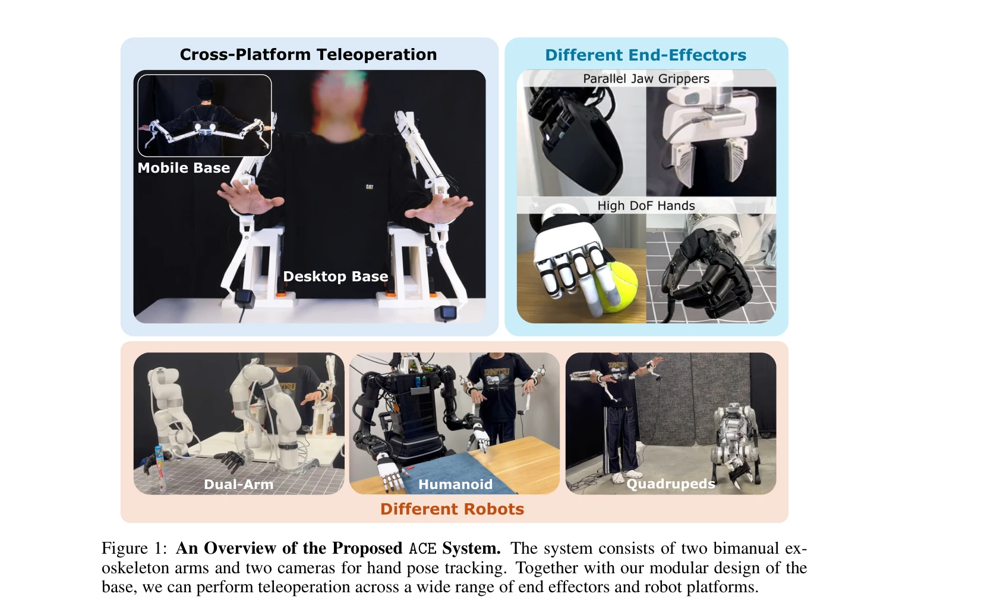
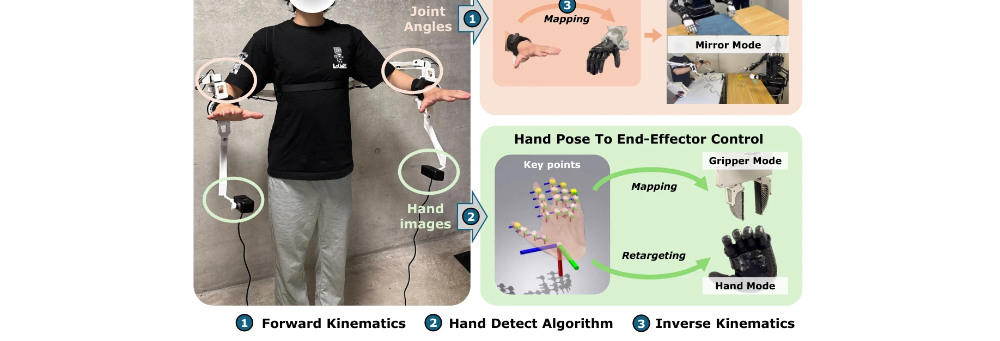

# ACE: A Cross-Platform Visual-Exoskeletons System for Low-Cost Dexterous Teleoperation

> **저자**: Shiqi Yang, Minghuan Liu, Yuzhe Qin, Runyu Ding, Jialong Li, Xuxin Cheng, Ruihan Yang, Sha Yi, Xiaolong Wang | **날짜**: 2024-08-21 | **URL**: [https://arxiv.org/abs/2408.11805](https://arxiv.org/abs/2408.11805)

---

## Essence

*Figure 1: An Overview of the Proposed ACE System. The system consists of two bimanual ex-*

ACE는 저비용의 3D 프린팅 exoskeleton과 hand-facing camera를 결합한 cross-platform visual-exoskeleton 시스템으로, 다양한 robot 플랫폼과 end-effector에 대해 정확한 dexterous teleoperation을 가능하게 한다.

## Motivation

- **Known**: Teleoperation은 robot learning을 위한 효과적인 data collection 방법이며, VR, motion capture, wearable glove 등 다양한 시스템이 존재한다. ALOHA와 GELLO 같은 kinematics 기반 시스템은 정확하지만 비용이 높고 특정 hardware에 제한적이다.
- **Gap**: 기존 시스템들은 높은 비용, 특정 robot에의 hardware 의존성, 또는 vision 기반의 정확도 부족 문제를 가지고 있어 cross-platform 호환성과 low-cost를 동시에 만족하는 시스템이 부족하다.
- **Why**: Robot learning을 위한 large-scale dataset 수집에는 비용 효율적이면서도 다양한 robot platform과 end-effector에 적응 가능한 teleoperation 시스템이 필수적이다.
- **Approach**: Exoskeleton의 forward kinematics와 hand-facing camera를 통한 hand pose estimation을 결합하고, inverse kinematics를 통해 operator의 hand 동작을 다양한 robot morphology로 retargeting하는 방식을 제안한다.

## Achievement

*Figure 1: An Overview of the Proposed ACE System. The system consists of two bimanual ex-*

- **Cross-Platform 호환성**: 단일 시스템으로 humanoid hands, arm-hands, arm-gripper, quadruped-gripper 등 다양한 robot 플랫폼과 end-effector를 지원
- **저비용 구현**: 0.6k 달러의 낮은 비용으로 ALOHA(20k)나 DexCap(4k)보다 저렴하게 구현
- **높은 정확도**: Exoskeleton의 kinematic precision과 vision-based hand pose estimation의 조합으로 정확한 finger와 wrist pose 추적
- **사용 편의성**: 최소한의 calibration으로 서로 다른 체형의 사용자에게 적응 가능하고 fixed/mobile base 전환 용이
- **모듈식 설계**: 3D 프린팅과 표준 부품 사용으로 제조, 유지보수, 부품 교체가 용이

## How

*Figure 2: Architecture of the ACE Teleoperation System. Our system reads the joint angles from*

- 3D 프린팅 bimanual exoskeleton을 portable desktop 또는 mobile base에 장착
- Hand-facing camera 2개를 exoskeleton 끝에 부착하여 hand 전면을 항상 추적 (occlusion 해결)
- Hand detection algorithm으로 hand keypoint와 pose 추정
- Exoskeleton motor로부터 joint angle을 읽어 forward kinematics로 wrist pose와 end-effector position 계산
- Operator의 hand pose와 wrist position을 inverse kinematics를 통해 robot arm의 end-effector pose로 변환
- Normal mode (1:1 motion transfer), Mirror mode, Gripper mode 등 다양한 operation mode 제공
- Hand root position과 hand pose를 분리하여 전달하므로 robot morphology와 무관하게 작동

## Originality

- Kinematics 기반 exoskeleton과 vision 기반 hand tracking을 결합하여 두 접근법의 장점을 통합한 hybrid 방식 제시
- Hand-facing camera를 exoskeleton 끝에 부착하여 vision-based system의 occlusion 문제를 구조적으로 해결
- Forward/inverse kinematics를 활용한 robot-agnostic motion retargeting으로 hand morphology와 robot morphology 간의 자동 변환
- Cross-platform 호환성을 위해 hand pose와 wrist position을 독립적으로 처리하는 modular architecture 설계

## Limitation & Further Study

- Exoskeleton이 operator의 arm 길이와 다를 경우 workspace mismatch 문제 존재 가능성
- Hand-facing camera의 occlusion 해결에도 extreme hand pose에서 tracking 오류 가능성
- Inverse kinematics 계산이 robot의 redundancy를 충분히 활용하지 못할 수 있음
- 현재 시스템의 force feedback 부재로 operator가 접촉 정보 없이 작업해야 함
- 후속 연구로 haptic feedback 추가, real-time visual servoing 개선, 더 복잡한 manipulation 태스크에 대한 실험 필요

## Evaluation

- Novelty: 4/5
- Technical Soundness: 3/5
- Significance: 4/5
- Clarity: 4/5
- Overall: 4/5

**총평**: ACE는 exoskeleton의 정확도와 vision 기반 시스템의 cost-effectiveness를 성공적으로 결합하여, 기존의 높은 비용이나 platform 제한을 극복한 실용적인 cross-platform teleoperation 솔루션을 제시한다. 특히 large-scale robot learning을 위한 data collection 장벽을 크게 낮춘 점에서 중요한 기여이다.

## Related Papers

- 🔄 다른 접근: [[papers/1244_A_Humanoid_Visual-Tactile-Action_Dataset_for_Contact-Rich_Ma/review]] — 정교한 원격조작에서 visual-exoskeleton과 tactile sensing의 상보적 접근이다
- 🔄 다른 접근: [[papers/1297_Bunny-VisionPro_Real-Time_Bimanual_Dexterous_Teleoperation_f/review]] — 저비용 정교한 텔레오퍼레이션에서 exoskeleton과 Vision Pro 손 추적의 다른 방식이다
- 🔗 후속 연구: [[papers/1302_CHILD_Controller_for_Humanoid_Imitation_and_Live_Demonstrati/review]] — 전신 텔레오퍼레이션에서 손 부분의 정교한 제어를 위해 ACE 시스템이 확장 적용된다
- 🔄 다른 접근: [[papers/1604_OSMO_Open-Source_Tactile_Glove_for_Human-to-Robot_Skill_Tran/review]] — 저비용 정교한 조작을 위해 3D 프린팅 exoskeleton과 촉각 장갑의 다른 접근법이다
- 🔄 다른 접근: [[papers/1297_Bunny-VisionPro_Real-Time_Bimanual_Dexterous_Teleoperation_f/review]] — 저비용 정교한 텔레오퍼레이션에서 Vision Pro 손 추적과 3D 프린팅 exoskeleton의 다른 방식이다
- 🏛 기반 연구: [[papers/1302_CHILD_Controller_for_Humanoid_Imitation_and_Live_Demonstrati/review]] — 베이비 캐리어 형태 시스템에서 정교한 손 제어를 위한 visual-exoskeleton이 기초가 된다
- 🔄 다른 접근: [[papers/1244_A_Humanoid_Visual-Tactile-Action_Dataset_for_Contact-Rich_Ma/review]] — 촉각 기반 정교한 조작에서 visual-exoskeleton과 tactile sensing의 상호보완적 접근이다
- 🔄 다른 접근: [[papers/1586_NuExo_A_Wearable_Exoskeleton_Covering_all_Upper_Limb_ROM_for/review]] — 상완부 전체 움직임을 위한 웨어러블 외골격 NuExo와 저비용 시각-외골격 시스템 ACE가 동일한 웨어러블 인터페이스 문제를 다룬다.
