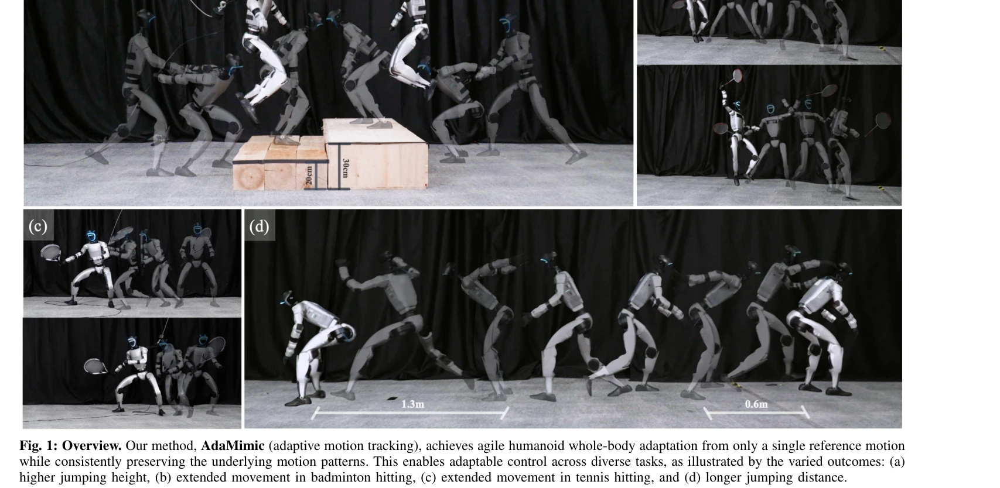
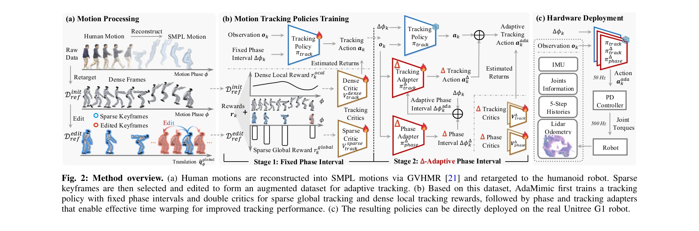

# AdaMimic: Towards Adaptable Humanoid Control via Adaptive Motion Tracking

> **저자**:  | **날짜**:  | **URL**: [https://taohuang13.github.io/adamimic.github.io/](https://taohuang13.github.io/adamimic.github.io/)

---

## Essence

*Fig. 1: Overview. Our method, AdaMimic (adaptive motion tracking), achieves agile humanoid whole-body adaptation from on*

단일 참조 모션으로부터 인간형 로봇의 적응적 제어를 가능하게 하는 AdaMimic이라는 새로운 motion tracking 알고리즘을 제안하며, 동적 시간 왜곡(time warping)을 통해 모션 패턴 보존과 적응성을 동시에 달성한다.

## Motivation

- **Known**: Motion tracking 방법은 정확한 모방을 달성하지만 대규모 훈련 데이터와 테스트 시간 참조 모션이 필요하고, motion prior 기반 RL 접근법은 적응성은 우수하나 모방 정확도를 희생한다.
- **Gap**: 단일 참조 모션에서 정확한 모션 패턴 보존과 광범위한 적응성을 동시에 달성하는 방법의 부재. 기존 방법들은 두 가지 강점을 모두 갖추지 못한다.
- **Why**: 인간형 로봇이 전문가 시연으로부터 배우고 다양한 실제 조건에 빠르게 적응할 수 있는 능력은 로봇 제어의 실용성과 일반화 능력을 크게 향상시킨다.
- **Approach**: 단일 참조 모션을 sparse keyframe으로 변환하고 최소한의 물리 가정으로 편집하여 augmented 데이터셋을 생성한 후, 고정 phase interval로 추적 정책을 학습하고 phase adapter와 tracking adapter를 통해 유연한 time warping을 구현한다.

## Achievement

*Fig. 1: Overview. Our method, AdaMimic (adaptive motion tracking), achieves agile humanoid whole-body adaptation from on*

- **데이터 효율성**: 단일 참조 모션만으로도 diverse adaptation conditions에 대응할 수 있음을 입증
- **높은 정확도**: sparse 및 dense critic을 활용한 dual reward 구조로 global trajectory와 local motion pattern 모두 정확히 추적
- **시간 왜곡 능력**: phase adapter와 tracking adapter를 통해 동적 motion speed 조절로 jumping height, movement range 등 다양한 적응 가능
- **실제 배포 검증**: 실제 Unitree G1 로봇에서 성공적으로 배포되어 여러 task에서 우수한 성능 달성

## How

*Fig. 2: Method overview. (a) Human motions are reconstructed into SMPL motions via GVHMR [21] and retargeted to the huma*

- GVHMR을 사용한 human motion의 SMPL 재구성 및 로봇으로의 retargeting
- 원본 모션에서 sparse keyframe 선택 후 global trajectory(translation) 편집으로 augmented dataset D_ref^edit 생성
- Stage 1: 고정 phase interval Δϕ_k로 tracking policy π_track 학습, sparse global reward와 dense local reward를 가중치 w로 조합
- Double critic 구조 활용 (V_track^dense, V_track^sparse)로 서로 다른 시간 척도의 reward 추정
- Stage 2: Phase adapter π_phase^Δ로 adaptive phase interval Δϕ_k^ada 생성, tracking adapter π_track^Δ로 action 보정
- PD controller를 통해 50Hz에서 joint torque 명령으로 변환하여 500Hz 제어 주기로 실행

## Originality

- 단일 모션으로부터 시작하는 data augmentation 전략이 기존의 대규모 데이터셋 기반 접근법과 차별화
- Sparse keyframe 기반 tracking으로 dense intermediate motion을 생성하는 two-stage 학습 파이프라인의 설계
- Phase 및 tracking adapter를 분리하여 학습함으로써 정확한 time warping을 구현하는 방식이 novel
- Local pattern 보존 제약 조건(식 3)을 명시적으로 정의하여 motion adaptation의 수학적 프레임워크 제시

## Limitation & Further Study

- 단일 참조 모션만 사용하므로 매우 다양한 환경 변화(예: 극단적 지형, 예측 불가능한 외부 충격)에 대한 일반화 성능은 미지수
- Keyframe 편집 시 '최소한의 물리 가정'이라는 모호한 기준이 있어 실무적 적용 시 편집 과정의 자동화 수준이 명확하지 않음", '현재는 5개 representative motion만으로 평가하여 더 광범위한 task 다양성(복잡한 조작 작업 등)에서의 성능 미확인
- **후속연구**: (1) 매우 다양한 환경 조건에 대한 적응성 강화, (2) 자동화된 keyframe 선택 및 편집 알고리즘 개발, (3) 신체 치수가 다른 다양한 로봇 플랫폼에서의 일반화 검증

## Evaluation

- Novelty: 4/5
- Technical Soundness: 3/5
- Significance: 4/5
- Clarity: 4/5
- Overall: 4/5

**총평**: AdaMimic은 motion tracking의 정확성과 motion prior 기반 접근법의 적응성을 효과적으로 결합하며, 단일 모션으로부터 시작하는 혁신적 데이터 효율성과 실제 로봇 배포 성공으로 인간형 로봇 제어 분야에 중요한 기여를 한다.

## Related Papers

- 🔄 다른 접근: [[papers/1360_DynaRetarget_Dynamically-Feasible_Retargeting_using_Sampling/review]] — 단일 참조 모션으로부터 humanoid 적응 제어를 학습하는 다른 접근 방식을 제시한다
- 🔗 후속 연구: [[papers/1561_Make_Tracking_Easy_Neural_Motion_Retargeting_for_Humanoid_Wh/review]] — motion tracking 기반 humanoid 제어를 neural retargeting으로 확장한 방법론이다
- 🏛 기반 연구: [[papers/1425_GMT_General_Motion_Tracking_for_Humanoid_Whole-Body_Control/review]] — whole-body motion tracking의 기본 프레임워크를 제공하는 기반 연구다
- 🔄 다른 접근: [[papers/1360_DynaRetarget_Dynamically-Feasible_Retargeting_using_Sampling/review]] — 동작 재타겟팅을 다른 최적화 방법론으로 해결하는 접근법이다
