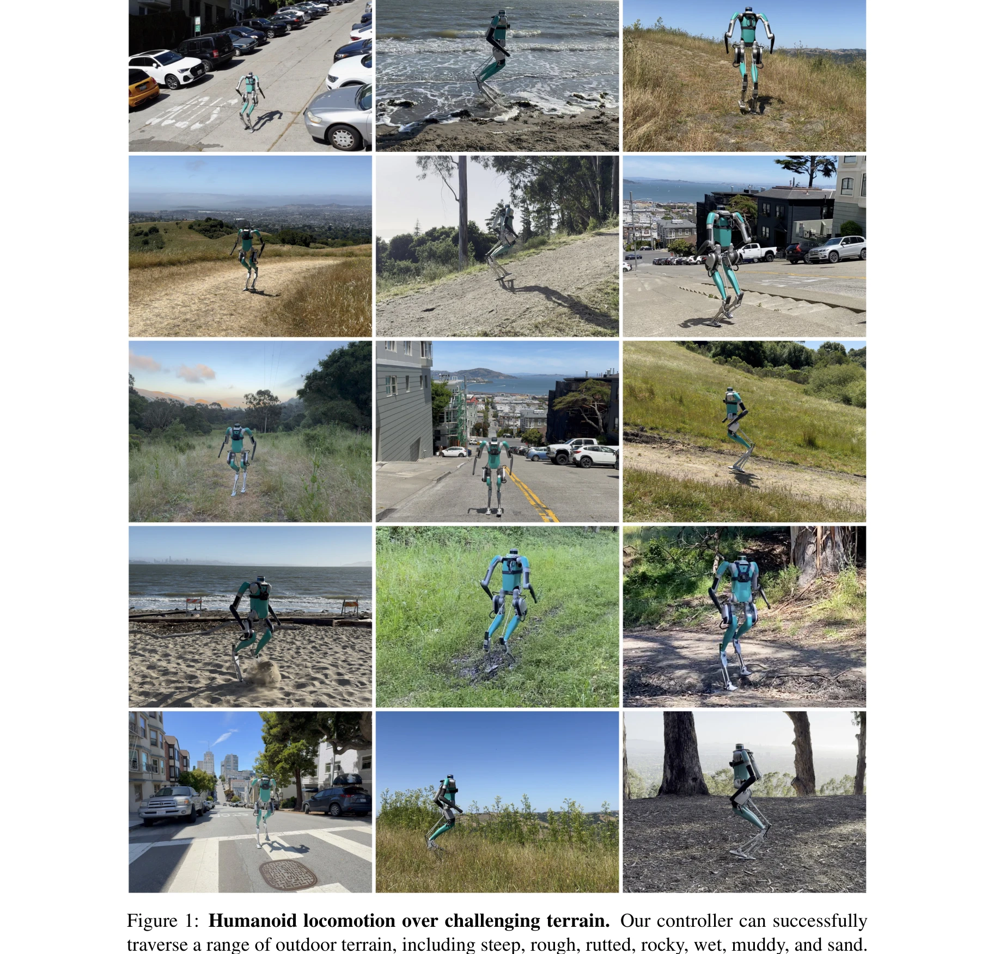

# Adapting Humanoid Locomotion over Challenging Terrain via Two-Phase Training

> **저자**:  | **날짜**:  | **URL**: [https://sites.google.com/view/adapting-humanoid-locomotion/two-phase-training](https://sites.google.com/view/adapting-humanoid-locomotion/two-phase-training)

---

## Essence

*Figure 1: Humanoid locomotion over challenging terrain. Our controller can successfully*

Humanoid 로봇의 도전적인 지형 주행을 위해 flat ground에서 sequence modeling으로 사전학습한 후 RL로 미세조정하는 두 단계 학습 방법을 제시하며, 실제 Digit 로봇으로 4마일 이상의 산악 지형과 31% 이상의 가파른 도시 거리 주행을 성공했다.

## Motivation

- **Known**: Humanoid locomotion은 사지 로봇보다 복잡하며, 기존 고전 제어기는 일반화가 어렵고 학습 기반 방법들은 주로 완만한 지형에 초점을 맞춰왔다. Transformer 기반의 learning-based humanoid controller는 제한적인 성과만 이루었다.
- **Gap**: Challenging terrain으로의 확장은 시뮬레이션 학습의 계산 복잡도 증가, 환경 설계의 어려움, sim-to-real transfer의 과제 등으로 인해 직접적이지 않다. 효율적인 학습 방법과 실세계 일반화 능력이 필요하다.
- **Why**: Humanoid 로봇이 자연과 도시 환경의 다양한 지형을 자율적으로 주행할 수 있다면 재난 구조, 건설, 탐사 등 실제 응용 가능성이 대폭 확대되며, 범용 로봇의 실현에 중요한 단계가 된다.
- **Approach**: Transformer 기반 controller를 두 단계로 학습하되, 먼저 flat ground 궤적 데이터셋으로 sequence modeling 사전학습을 수행하여 기본 보행 능력을 확보한 후, RL로 도전적 지형에 맞게 미세조정함으로써 샘플 효율성을 높인다.

## Achievement

- **실세계 주행 성과**: 실제 Digit 로봇이 Berkeley 지역 5개 등산로에서 4마일 이상 성공적으로 주행 및 San Francisco의 31% 이상 경사 도시 거리 통과
- **다양한 지형 일반화**: 단일 신경망으로 가파른, 거친, 바위가 많은, 젖은, 진흙, 모래 등 훈련 중 미노출된 지형도 포함하여 다양한 지형 정복
- **샘플 효율성 증대**: Pre-training을 통해 처음부터 학습하는 것 대비 훨씬 적은 샘플로 challenging terrain 학습 가능
- **긴급 적응 능력**: 지형 기울기에 따른 kinematic adaptation과 지표면 재질에 따른 dynamic adaptation이 프로그래밍되지 않았음에도 자동으로 나타남
- **의미있는 표현 학습**: 모델의 latent representation이 지형 유형별로 자동으로 clustering되어 emergent terrain representation 형성

## How

- Transformer 신경망 사용하여 과거의 proprioceptive observations와 actions 이력을 입력으로 다음 action 예측
- Flat ground 궤적 데이터셋 (prior policy, model-based controller, human sequence 활용)으로 sequence modeling 사전학습
- 미세조정 단계에서 RL(reinforcement learning)을 사용하여 uneven terrain 적응 학습
- Proprioceptive-only controller로 vision 미사용, omni-directional walking 지원
- 50 Hz 신경망 제어로 desired joint positions와 PD gains 산출, 2000 Hz PD controller로 실제 토크 변환
- Digit humanoid robot (1.6m, 45kg, 36 DoF) 플랫폼에서 실험

## Originality

- NLP의 generative pre-training 원리를 humanoid locomotion에 창의적으로 적용하여 flat ground pre-training 후 challenging terrain fine-tuning 방식 제시
- Sequence modeling을 humanoid 보행 학습에 도입하여 RL 단독 학습 대비 훨씬 안정적이고 효율적인 학습 방식 구현
- Proprioceptive-only blind controller로 지형 인지 및 적응하는 방식 (vision 미사용)은 센서 의존도를 낮인 실용적 접근
- 실제 4마일 산악 지형 및 31% 이상 도시 경사에서의 검증으로 학습 기반 humanoid locomotion의 현실적 가능성 입증

## Limitation & Further Study

- Pre-training에 사용된 flat ground 데이터셋의 구성이 명확히 정의되지 않았으며, 데이터 규모 및 다양성의 정량적 분석 부족
- Challenging terrain에서의 실패 사례, 안정성 한계, 최대 통과 가능 경사도 등에 대한 명확한 정량적 경계 정의 부족
- RL fine-tuning에 필요한 시간, 계산량, 실제 로봇 테스트 시간 등의 구체적 비용 분석 미흡
- 단일 로봇(Digit) 플랫폼에서만 검증되었으므로 다른 humanoid 형태(다리 구조, 질량 분포 등)로의 일반화 가능성 미지수
- 사람 같은 복합 작업 (팔 사용, 장애물 회피, 객체 조작)과의 통합 가능성 미탐색
- **후속 연구**: 더 큰 규모의 pre-training 데이터셋 구축, 다중 로봇 플랫폼 검증, vision-proprioception 통합, 실시간 경로 계획 및 장애물 회피 기능 추가, 온라인 적응 능력 강화

## Evaluation

- Novelty: 4/5
- Technical Soundness: 3/5
- Significance: 4/5
- Clarity: 4/5
- Overall: 4/5

**총평**: NLP의 사전학습-미세조정 원리를 humanoid locomotion에 효과적으로 적용하여 실제 4마일 산악 지형과 급경사 도시 거리 주행을 성공시킨 강력한 실증 논문으로, 샘플 효율성과 일반화 능력 면에서 significant contribution을 제시한다. 다만 일반화 범위와 실패 경계에 대한 더 명확한 분석이 필요하다.

## Related Papers

- 🔄 다른 접근: [[papers/1257_Advancing_Humanoid_Locomotion_Mastering_Challenging_Terrains/review]] — 도전적 지형 적응에서 두 단계 학습 대신 end-to-end 접근 방식을 제시한다
- 🔗 후속 연구: [[papers/1264_AME-2_Agile_and_Generalized_Legged_Locomotion_via_Attention-/review]] — 지형 적응 학습에 attention 기반 매핑과 불확실성 인식을 추가하여 성능을 향상시킨다
- 🏛 기반 연구: [[papers/1317_Contrastive_Representation_Learning_for_Robust_Sim-to-Real_T/review]] — 지형 인식을 위한 대조 학습 기법의 이론적 기반을 제공한다
- 🔗 후속 연구: [[papers/1317_Contrastive_Representation_Learning_for_Robust_Sim-to-Real_T/review]] — 지형 적응에 대조 학습을 통한 환경 정보 증류를 추가하여 견고성을 강화한다
- 🔄 다른 접근: [[papers/1257_Advancing_Humanoid_Locomotion_Mastering_Challenging_Terrains/review]] — 지형 적응에서 두 단계 학습 대신 단일 end-to-end 학습 프레임워크를 사용한다
- 🏛 기반 연구: [[papers/1264_AME-2_Agile_and_Generalized_Legged_Locomotion_via_Attention-/review]] — 지형 적응을 위한 두 단계 학습 방법론의 이론적 기반을 제공한다
