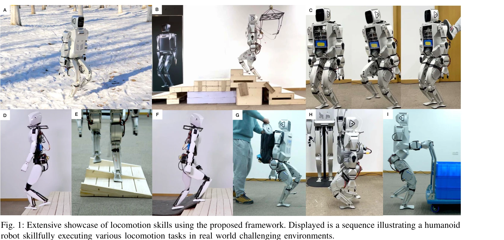

# Advancing Humanoid Locomotion: Mastering Challenging Terrains with Denoising World Model Learning

> **저자**: Xinyang Gu, Yen-Jen Wang, Xiang Zhu, Chengming Shi, Yanjiang Guo, Yichen Liu, Jianyu Chen | **날짜**: 2024-08-26 | **URL**: [https://arxiv.org/abs/2408.14472](https://arxiv.org/abs/2408.14472)

---

## Essence

*Fig. 3: Illustration of the Denoising World Model Learning Framework. This diagram details the information flow from sen*

Denoising World Model Learning (DWL)은 encoder-decoder 아키텍처와 representation learning을 활용하여 humanoid 로봇이 실제 환경의 복잡한 지형을 제로샷 sim-to-real 전이로 마스터할 수 있도록 하는 end-to-end RL 프레임워크이다.

## Motivation

- **Known**: Model-based 제어(ZMP, MPC, WBC)는 복잡한 환경 모델링이 어렵고, model-free RL은 quadruped 및 bipedal 로봇에서 성공했으나 humanoid 로봇의 고도의 불안정성으로 인해 단순 지형에만 제한되어 있다.
- **Gap**: Humanoid 로봇은 높은 무게중심, 다리 스윙 불안정성, 큰 다리 관성 등으로 인해 복잡한 실제 지형(눈, 계단, 불규칙한 표면)에서의 robust한 RL 기반 제어가 아직 입증되지 못했다.
- **Why**: Humanoid 로봇은 인간 중심 환경에 최적화되어 있어 다양한 실제 작업 수행이 중요하며, 이를 위해 복잡한 지형에서의 robust locomotion 능력이 필수적이다.
- **Approach**: Environmental noise, dynamics noise, sensory noise, masking noise 등 sim-to-real gap의 여러 잡음 요인을 식별하고, 이를 모의환경에서 시뮬레이션한 후 encoder-decoder 구조로 denoising하여 true state 복구 및 online adaptation을 수행한다.

## Achievement

*Fig. 1: Extensive showcase of locomotion skills using the proposed framework. Displayed is a sequence illustrating a hum*

- **세계 최초 humanoid 로봇의 복잡한 실제 지형 마스터**: 눈 덮인 언덕, 계단 오르내림, 극도로 불규칙한 지형에서 동일한 신경망으로 zero-shot sim-to-real 전이 달성
- **DWL 프레임워크 제안**: Representation learning을 통한 효과적인 sim-to-real gap 제거 및 robust generalization 구현
- **2-DoF Closed Kinematic Chain Ankle Mechanism**: 기존의 1-DoF 또는 passive ankle 대비 다리 관성 감소 및 안정성 향상을 통한 enhanced stability and flexibility

## How

*Fig. 3: Illustration of the Denoising World Model Learning Framework. This diagram details the information flow from sen*

- **Encoder-decoder 아키텍처**: 부분 관찰된 역사적 센서 데이터를 latent space에 embedding하고 full state 재구성
- **Noise 시뮬레이션**: 모의환경에서 environmental, dynamics, sensory, masking noise를 주입하여 현실 조건 모방
- **Policy gradient 최적화**: 환경 상호작용을 통한 반복적 제어 개선 및 복잡한 목표 최적화
- **POMDP 설정**: Partially Observable Markov Decision Process 프레임워크에서 불완전한 센서 정보 기반 의사결정
- **Masking loss**: 실제로 획득 불가능한 정보(linear velocity, contact force)의 partial observability를 masking noise로 처리

## Originality

- **Sim-to-real gap의 체계적 분류 및 통합 해결**: Environmental, dynamics, sensory, masking noise를 하나의 denoising 프레임워크로 통합 처리
- **Humanoid 특화 설계**: Quadruped, bipedal과 달리 humanoid의 높은 무게중심과 복잡한 역학을 고려한 representation learning 접근
- **2-DoF Closed Kinematic Chain Ankle Mechanism**: 기존 humanoid 로봇에서 구현되지 않은 active ankle control 구현으로 안정성 혁신
- **동일 신경망의 다중 지형 적응**: 별도의 재학습 없이 단일 policy로 눈, 계단, 불규칙한 표면 등을 처리하는 generalization

## Limitation & Further Study

- **지형 다양성의 범위**: 눈, 계단, 불규칙한 표면에서의 성능은 입증되었으나, 극한 조건(깊은 물, 극저온 등)에서의 성능 미검증
- **온라인 적응 메커니즘 상세 분석 부족**: Encoder-decoder가 실시간으로 어떻게 새로운 환경에 적응하는지 정량적 분석 제한
- **계산 복잡도**: 실시간 encoder-decoder 추론의 computational overhead 및 onboard 컴퓨팅 자원 요구사항 미상세
- **후속연구 방향**: (1) 더 극한의 지형 및 기후 조건에서의 테스트, (2) Transfer learning을 통한 새로운 로봇 플랫폼 확대, (3) Adversarial 환경에서의 robustness 강화

## Evaluation

- Novelty: 4/5
- Technical Soundness: 4/5
- Significance: 4/5
- Clarity: 4/5
- Overall: 4/5

**총평**: 본 논문은 humanoid 로봇 제어라는 극도로 어려운 문제에 대해 체계적인 sim-to-real gap 분석과 DWL 프레임워크를 통해 세계 최초의 실제 복잡 지형 마스터링을 달성했으며, 2-DoF ankle mechanism 등의 하드웨어 혁신과 결합하여 robotics 분야에 상당한 기여를 한다.

## Related Papers

- 🔄 다른 접근: [[papers/1255_Adapting_Humanoid_Locomotion_over_Challenging_Terrain_via_Tw/review]] — 지형 적응에서 두 단계 학습 대신 단일 end-to-end 학습 프레임워크를 사용한다
- 🔗 후속 연구: [[papers/1310_CMR_Contractive_Mapping_Embeddings_for_Robust_Humanoid_Locom/review]] — 노이즈가 있는 관측에서의 견고성을 위해 수축 매핑 임베딩을 추가로 활용할 수 있다
- 🏛 기반 연구: [[papers/1288_3D_Diffusion_Policy_Generalizable_Visuomotor_Policy_Learning/review]] — DWL의 인코더-디코더 구조와 표현 학습의 이론적 기반을 제공한다
- 🏛 기반 연구: [[papers/1310_CMR_Contractive_Mapping_Embeddings_for_Robust_Humanoid_Locom/review]] — 비정형 지형에서의 견고한 보행에 DWL의 표현 학습 기법을 활용한다
- 🔄 다른 접근: [[papers/1255_Adapting_Humanoid_Locomotion_over_Challenging_Terrain_via_Tw/review]] — 도전적 지형 적응에서 두 단계 학습 대신 end-to-end 접근 방식을 제시한다
- 🔄 다른 접근: [[papers/1529_Learning_Humanoid_Locomotion_over_Challenging_Terrain/review]] — 도전적 지형에서의 휴머노이드 locomotion 마스터링이라는 동일한 목표를 다루지만 서로 다른 기술적 접근법을 제시함
