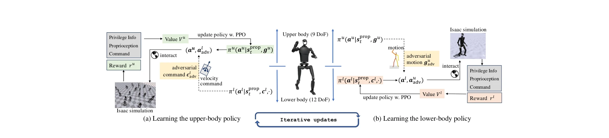

# Adversarial Locomotion and Motion Imitation for Humanoid Policy Learning

> **저자**: Jiyuan Shi, Xinzhe Liu, Dewei Wang, Ouyang Lu, Sören Schwertfeger, Chi Zhang, Fuchun Sun, Chenjia Bai, Xuelong Li | **날짜**: 2025-04-19 | **URL**: [https://arxiv.org/abs/2504.14305](https://arxiv.org/abs/2504.14305)

---

## Essence

*Figure 1: The overview of ALMI. (a) In updating the upper-body policy πu, we sample adversarial*

인간형 로봇의 상반신과 하반신의 서로 다른 역할을 고려하여 adversarial learning으로 robust locomotion과 precise motion imitation을 동시에 달성하는 ALMI 프레임워크를 제안한다.

## Motivation

- **Known**: 기존 whole-body motion imitation 방식은 상반신과 하반신의 역할 차이를 무시하고 복잡한 reward 구조와 높은 computational cost를 요구하며, 실세계 배포 시 로봇 불안정성과 넘어짐 문제를 발생시킨다.
- **Gap**: 상반신의 precise motion tracking과 하반신의 robust locomotion 간의 trade-off를 동시에 해결하고, 이들의 coordinated whole-body control을 보장하는 체계적인 방법이 부족하다.
- **Why**: 인간형 로봇이 춤, 조작 등 다양한 전신 운동을 수행하려면 안정적인 보행 기반 위에서 정밀한 상반신 제어가 필요하며, 이는 로봇의 실용성과 표현력을 크게 향상시킨다.
- **Approach**: 두 개의 독립적인 policy (πl, πu)를 adversarial training으로 학습하되, 하반신은 상반신의 disturbance에 강건한 locomotion을 제공하고 상반신은 하반신의 운동 중에도 motion을 정확히 추적하도록 min-max game을 형성한다.

## Achievement

- **Adversarial 학습 이론**: two-player zero-sum Markov game 기반 Nash equilibrium 수렴성을 Theorem 3.1으로 보장하는 이론적 토대 제시
- **Robust locomotion**: 상반신의 adversarial disturbance 하에서도 velocity command를 정확히 추적하는 하반신 policy 학습 성공
- **Precise motion imitation**: 하반신의 rapid movement와 불안정성 속에서도 reference motion을 정확히 따르는 상반신 policy 학습 성공
- **Real-world deployment**: Unitree H1-2 전신 로봇에서 simulation과 real world 모두에서 robust locomotion과 precise motion tracking 동시 달성
- **ALMI-X dataset**: 80K+ trajectories를 포함한 language annotation 기반의 대규모 humanoid whole-body control dataset 공개, foundation model 학습 가능

## How

*Figure 1: The overview of ALMI. (a) In updating the upper-body policy πu, we sample adversarial*

- State space를 shared하되 action space는 분리 (al ∈ R12 for lower body, au ∈ R9 for upper body)
- Lower-body learning: πl이 command-following reward rl을 최대화하고 πu가 이를 최소화하는 min-max 게임 구성
- Upper-body learning: πu가 motion tracking reward ru를 최대화하고 πl이 이를 최소화하는 대칭적 게임 구성
- Independent RL optimization으로 각 policy는 독립적으로 policy gradient 사용하여 업데이트
- Two-timescale learning rate rule과 ε-greedy exploration으로 ε-approximate Nash equilibrium 수렴 보장
- Phase parameter ϕt를 통해 cyclic locomotion pattern 표현
- PD controller를 통해 policy의 target joint position을 실제 토크로 변환

## Originality

- 상반신과 하반신의 역할 분리를 통한 adversarial training 프레임워크는 기존 separate control 방식과 달리 coordination을 보장하는 이론적 기반 제공
- Two-player zero-sum Markov game을 humanoid locomotion-manipulation 문제에 처음 적용하며 Nash equilibrium 수렴성 증명
- Language annotation이 포함된 대규모 humanoid trajectory dataset (ALMI-X) 구축으로 foundation model 학습 가능성 제시
- Joystick-based upper-body teleoperation과 velocity command-based lower-body control의 통합 제어 체계 제안

## Limitation & Further Study

- Theorem 3.1의 수렴 조건 (ε-greedy exploration, two-timescale learning rate)이 매우 제한적이며 실제 RL 구현과의 gap 존재
- Adversarial disturbance가 반드시 모든 robust locomotion 문제를 해결하는지, 또는 단순히 상반신 policy의 평균화 효과인지 불명확
- ALMI-X dataset의 foundation model 시뮬레이션이 preliminary이며, 실제 cross-embodiment generalization 성능 미평가
- 손목 3 DoF는 control에서 제외되어 fine-grained manipulation 불가능
- Uneven terrain이나 외부 큰 perturbation에 대한 robustness 평가 부족
- 후속 연구: (1) 더 복잡한 terrain과 큰 외부 힘에 대한 robustness 검증, (2) Foundation model의 zero-shot generalization 성능 평가, (3) Real-world 손목 제어 포함 확장

## Evaluation

- Novelty: 4/5
- Technical Soundness: 4/5
- Significance: 4/5
- Clarity: 4/5
- Overall: 4/5

**총평**: 인간형 로봇의 상반신-하반신 coordination 문제를 adversarial learning의 game-theoretic 관점에서 우아하게 해결하고, 이론 증명과 실제 full-scale 로봇 실험, 대규모 dataset 공개까지 제시한 매우 수준 높은 연구이다. 다만 수렴 조건의 실제 적용 가능성과 foundation model의 성숙도 측면에서 보완 여지가 있다.

## Related Papers

- 🔗 후속 연구: [[papers/1261_Agility_Meets_Stability_Versatile_Humanoid_Control_with_Hete/review]] — 적대적 학습 기반의 상하반신 분리 제어를 민첩성과 안정성 통합으로 확장한다
- 🔄 다른 접근: [[papers/1265_AMO_Adaptive_Motion_Optimization_for_Hyper-Dexterous_Humanoi/review]] — 상하반신 분리 제어 대신 전신 통합 최적화 접근 방식을 제시한다
- 🏛 기반 연구: [[papers/1267_AMP_Adversarial_Motion_Priors_for_Stylized_Physics-Based_Cha/review]] — 적대적 학습을 통한 모션 모방의 이론적 기반을 제공한다
- 🏛 기반 연구: [[papers/1261_Agility_Meets_Stability_Versatile_Humanoid_Control_with_Hete/review]] — 민첩성과 안정성 통합에서 상하반신 분리 제어의 적대적 학습 기법을 활용한다
- 🔄 다른 접근: [[papers/1265_AMO_Adaptive_Motion_Optimization_for_Hyper-Dexterous_Humanoi/review]] — 적대적 상하반신 분리 대신 통합 최적화로 전신 제어를 달성하는 다른 접근법이다
- 🔄 다른 접근: [[papers/1321_Coordinated_Humanoid_Robot_Locomotion_with_Symmetry_Equivari/review]] — 적대적 학습 대신 대칭성 제약을 통한 자연스러운 보행 제어 방법을 제시한다
- 🔄 다른 접근: [[papers/1505_Keep_on_Going_Learning_Robust_Humanoid_Motion_Skills_via_Sel/review]] — 두 논문 모두 adversarial training을 사용하지만, SA2RT는 selective attack에, 다른 논문은 general adversarial locomotion에 초점을 둔다.
