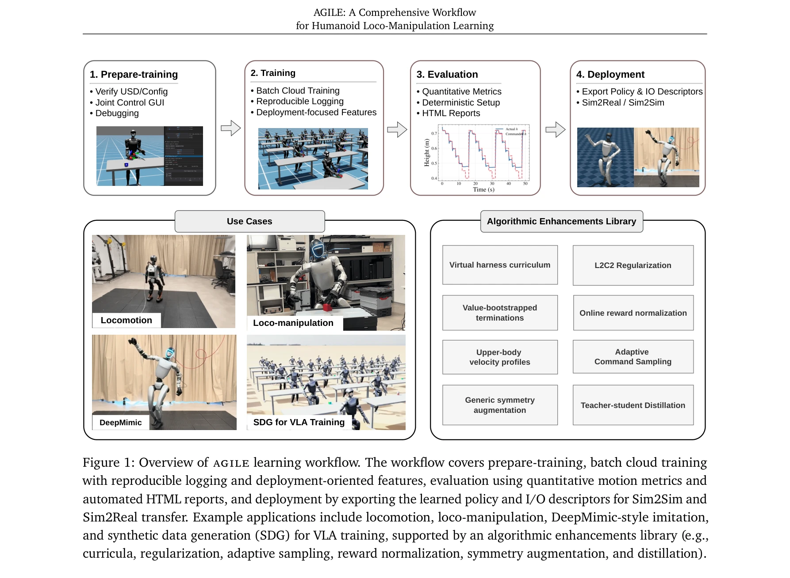

# AGILE: A Comprehensive Workflow for Humanoid Loco-Manipulation Learning

> **저자**:  | **날짜**: 2026-03-31 | **URL**: [https://arxiv.org/abs/2603.20147](https://arxiv.org/abs/2603.20147)

---

## Essence

*Figure 1: Overview of agile learning workflow. The workflow covers prepare-training, batch cloud training*

휴머노이드 로봇의 강화학습 개발 전 과정을 표준화하는 AGILE 워크플로우를 제시하며, 환경 검증, 재현 가능한 학습, 통합 평가, 디스크립터 기반 배포의 4단계를 통해 시뮬-실세계 전이를 체계적으로 개선한다.

## Motivation

- **Known**: GPU 기반 시뮬레이션(Isaac Gym, Isaac Lab)과 RL 알고리즘이 발전했으나, 실제 로봇 배포에서는 환경 설정 오류, 평가 방법 부재, 정책 내보내기의 fragmentation 등으로 인한 시뮬-실세계 전이 실패가 빈번하다.
- **Gap**: 기존 인프라는 시뮬레이션 성능과 알고리즘 설계에 집중했으나, 환경 검증부터 배포까지 전체 라이프사이클을 연결하는 체계적 워크플로우가 부재하다.
- **Why**: 휴머노이드 RL 개발의 신뢰성과 재현성을 높이고, 반복적인 디버깅 비용을 줄이며, 정량적 사전 검증 없이 물리 로봇에 배포하는 위험을 제거하기 위해 필수적이다.
- **Approach**: 4단계 파이프라인(Prepare, Train, Evaluate, Deploy)으로 구성된 엔드-투-엔드 워크플로우를 Isaac Lab과 RSL-RL 위에 구축하고, 동시에 L2C2, 보상 정규화, 가상 해리스 커리큘럼 등 훈련 안정화 기법들을 통합한다.

## Achievement

*Figure 1: Overview of agile learning workflow. The workflow covers prepare-training, batch cloud training*

- **체계적 4단계 라이프사이클**: 인터랙티브 환경 디버깅, 재현 가능한 클라우드 훈련, 결정적 시나리오 테스트와 확률적 롤아웃 결합, YAML 디스크립터 기반 자동 정책 내보내기로 fragmentation 제거
- **통합 평가 프레임워크**: 관절 흔들림, 제한 위반 등 배포 중심의 모션 품질 지표를 지원하는 unified 평가 파이프라인으로 자동화된 회귀 테스트 및 정량적 강건성 평가 가능
- **5가지 작업과 2개 하드웨어 플랫폼 검증**: Unitree G1, Booster T1에서 속도 추적, 높이 제어 보행, 일어서기, 모션 모방, 로코-조작 등 일관된 시뮬-실세계 전이 달성
- **오픈소스 공개 및 사전학습된 체크포인트**: 재현성과 커뮤니티 채택을 위해 코드와 모델 공개

## How

*Figure 1: Overview of agile learning workflow. The workflow covers prepare-training, batch cloud training*

- **Prepare 단계**: 관절 제어, 물체 조작, 보상 시각화 GUI로 MDP 오류를 훈련 전에 분 단위에서 포착
- **Train 단계**: 자동 하이퍼파라미터 스윕, 실험 추적, 독립적으로 토글 가능한 알고리즘 강화(L2C2, 대칭 증강, 보상 정규화 등) 제공
- **Evaluate 단계**: 결정적 시나리오 테스트와 확률적 롤아웃을 병렬 환경에서 실행하여 관절 jerk, 제한 위반 등 배포 중심 메트릭 측정
- **Deploy 단계**: 훈련된 정책을 자체 포함 YAML I/O 디스크립터와 함께 자동 내보내기하여 joint 순서, 액션 스케일 문제 자동 해결 및 MuJoCo 시뮬-시뮬, 실세계 배포 가능하게 함
- **알고리즘 강화 라이브러리**: L2C2(Lipschitz 연속성), 보상 정규화, 적응적 명령 샘플링, 가상 해리스 커리큘럼, value-bootstrapped 종료 조건, 대칭 증강, teacher-student 증류 등 모듈식 제공

## Originality

- **Workflow 중심 재프레이밍**: 기존 프레임워크들이 훈련 확장성에 집중한 반면, AGILE은 검증부터 배포까지 전체 개발 라이프사이클을 일관된 엔지니어링 프로세스로 재정의
- **디스크립터 기반 배포**: YAML I/O 디스크립터를 통해 정책 내보내기를 자동화하고 관절 순서, 액션 스케일링 등 silent bug 제거 — 기존 프레임워크에서 미지원
- **결정적 평가와 모션 진단의 통합**: scenario-based 테스트와 randomized rollout을 단일 평가 프레임워크로 통합하고 per-joint 모션 품질 메트릭 도입으로 정량적 회귀 테스트 실현
- **독립적 알고리즘 강화의 모듈식 통합**: L2C2, 보상 정규화, 커리큘럼 등 시뮬-실세계 전이 기법들을 단일 파이프라인 내에서 토글 가능하게 제공하여 ablation 연구 용이

## Limitation & Further Study

- **다중 시뮬레이터 백엔드 미지원**: Isaac Lab과 RSL-RL에만 의존하므로 MuJoCo, PyBullet 등 다른 엔진과의 상호운용성 제한 (HumanoidVerse 대비 약점)
- **알고리즘 혁신 부재**: AGILE은 기존 알고리즘과 기법들의 엔지니어링 통합이므로 새로운 RL 알고리즘이나 sim-to-real 기법 제시 없음
- **손상 회복, 복잡한 조작 작업의 제한적 검증**: 5가지 작업이 비교적 단순한 로코모션 중심이므로, 복잡한 손 조작이나 극단적 손상 회복의 성능은 미검증
- **하드웨어 플랫폼 제한**: Unitree G1, Booster T1 두 가지만 검증되어 다양한 휴머노이드 형태에 대한 일반화 미확인
- **후속 연구 방향**: (1) 다중 시뮬레이터 백엔드 지원 확장, (2) 더 복잡한 손 조작과 다중 작업 학습 시나리오 통합, (3) 더 다양한 휴머노이드 형태에 대한 일반화 검증

## Evaluation

- Novelty: 4/5
- Technical Soundness: 3/5
- Significance: 4/5
- Clarity: 4/5
- Overall: 4/5

**총평**: AGILE은 휴머노이드 RL의 개발 라이프사이클을 표준화하고 시뮬-실세계 전이를 체계적으로 개선하는 실용적이고 중요한 인프라 기여이다. 알고리즘 혁신은 아니지만, 실제 로봇 배포의 신뢰성과 재현성을 크게 향상시키는 엔지니어링 우수성과 공개 코드를 통한 커뮤니티 영향력이 높다.

## Related Papers

- 🔄 다른 접근: [[papers/1314_AutoEval_Autonomous_Evaluation_of_Generalist_Robot_Manipulat/review]] — 로봇 정책 개발의 전체 워크플로우를 표준화한다는 동일한 목표를 평가와 학습이라는 다른 측면에서 접근한다
- 🔗 후속 연구: [[papers/1295_Booster_Gym_An_End-to-End_Reinforcement_Learning_Framework_f/review]] — 강화학습 기반 휴머노이드 제어의 구체적 구현을 통해 AGILE 워크플로우의 실제 적용 사례를 제공한다
- 🏛 기반 연구: [[papers/1350_Deep_Reinforcement_Learning_for_Robotics_A_Survey_of_Real-Wo/review]] — 실세계 강화학습 연구의 포괄적 조사가 AGILE 워크플로우 설계의 이론적 기초를 제공한다
- 🧪 응용 사례: [[papers/1295_Booster_Gym_An_End-to-End_Reinforcement_Learning_Framework_f/review]] — 휴머노이드 보행을 위한 구체적인 강화학습 구현을 통해 AGILE 워크플로우의 실제 적용 사례를 보여준다
- 🔄 다른 접근: [[papers/1239_A_Behavior_Architecture_for_Fast_Humanoid_Robot_Door_Travers/review]] — 휴머노이드 로봇의 실세계 행동을 위한 통합 아키텍처를 다른 접근법으로 설계한다
- 🏛 기반 연구: [[papers/1377_Embodied_intelligent_industrial_robotics_Framework_and_techn/review]] — AGILE의 humanoid loco-manipulation 워크플로우가 산업용 embodied robotics의 기술적 기반을 제공한다.
- 🔄 다른 접근: [[papers/1314_AutoEval_Autonomous_Evaluation_of_Generalist_Robot_Manipulat/review]] — 로봇 개발 프로세스 자동화를 각각 정책 평가와 전체 워크플로우라는 다른 측면에서 접근한다
