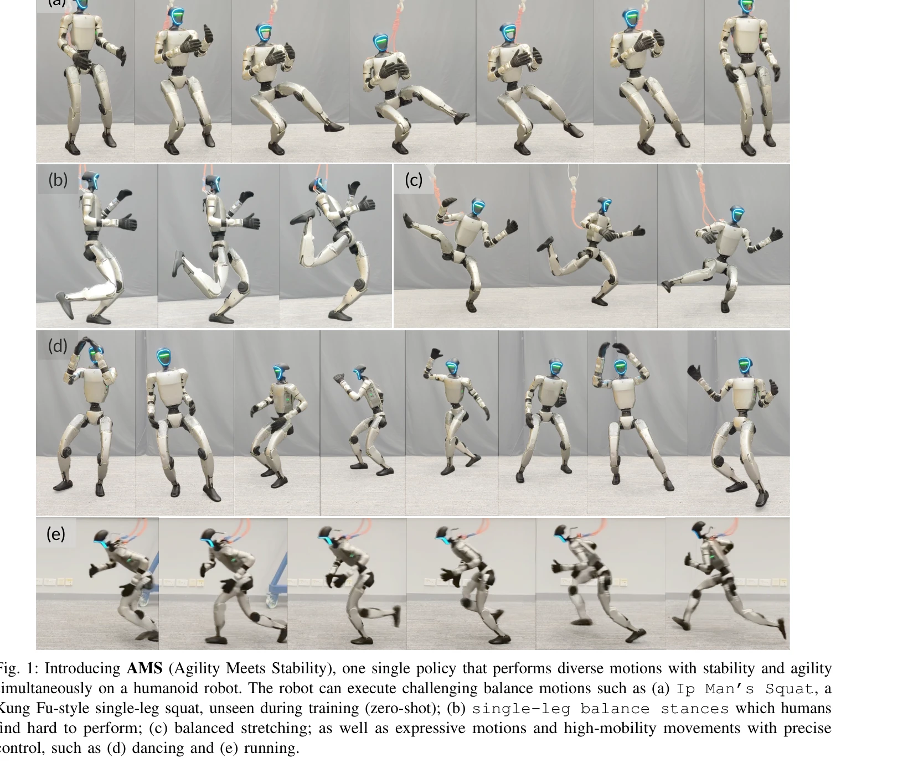

# Agility Meets Stability: Versatile Humanoid Control with Heterogeneous Data

> **저자**: Yixuan Pan, Ruoyi Qiao, Li Chen, Kashyap Chitta, Liang Pan, Haoguang Mai, Qingwen Bu, Hao Zhao, Cunyuan Zheng, Ping Luo, Hongyang Li | **날짜**: 2026-03-03 | **DOI**: [10.48550/arXiv.2511.17373](https://doi.org/10.48550/arXiv.2511.17373)

---

## Essence

*Fig. 1: Introducing AMS (Agility Meets Stability), one single policy that performs diverse motions with stability and ag*

AMS는 인간의 동작 캡처 데이터와 합성 균형 데이터를 혼합하여 민첩한 동작 추적과 극단적 균형 유지를 하나의 정책으로 통합하는 휴머노이드 로봇 제어 프레임워크이다.

## Motivation

- **Known**: 최근 locomotion과 whole-body tracking 연구는 민첩한 역학 기술 또는 안정성 관련 행동에 각각 뛰어난 성과를 보였으나, 기존 방법은 한 가지 능력에 특화되어 다른 능력을 훼손하는 한계를 가진다.
- **Gap**: 현재 강화학습 기반 정책들은 단일 모션 타입에 최적화되어 있으며, 인간 MoCap 데이터의 극단적 균형 시나리오 부족과 민첩성/안정성이라는 상충하는 최적화 목표로 인해 두 능력을 동시에 달성하기 어렵다.
- **Why**: 휴머노이드 로봇이 인간 중심 환경에서 다양한 작업을 수행하려면 민첩성과 견고한 균형을 결합한 제어기가 필수적이며, 이는 로봇의 자율성과 실용성을 크게 향상시킨다.
- **Approach**: AMS는 인간 MoCap 데이터와 물리적 제약이 적용된 합성 균형 데이터를 결합하고, 모든 데이터에 일반적 추적 목표를 적용하면서 합성 데이터에만 균형 특화 보상을 주입하는 hybrid reward scheme을 설계한다. 추가로 performance-driven sampling과 motion-specific reward shaping을 활용한 적응형 학습 전략을 도입한다.

## Achievement

*Fig. 1: Introducing AMS (Agility Meets Stability), one single policy that performs diverse motions with stability and ag*

- **통합 정책의 첫 실현**: 동적 모션 추적과 극단적 균형 유지를 단일 정책으로 통합하는 최초의 프레임워크 제시
- **이질적 데이터 활용**: 인간 MoCap 데이터의 장점과 합성 균형 데이터의 제어 가능성을 결합하여 long-tail 분포 문제 해결
- **다양한 실제 로봇 실험 성공**: Unitree G1에서 춤추기, 달리기 같은 민첩한 스킬과 Ip Man's Squat 같은 영점사격(zero-shot) 극단적 균형 동작을 동일 정책으로 수행", '**실시간 teleoperation 지원**: RGB 카메라 기반 실시간 원격 조작 시스템 구현으로 실용성 입증

## How

*Fig. 2: Overview of AMS. (a) The general whole-body tracking pipeline retargets human MoCap data to reference motions*

- **Heterogeneous 데이터 통합**: 인간 MoCap 데이터에 물리적으로 검증된 합성 균형 모션을 생성하여 보충하고, 두 데이터 소스의 장점을 활용
- **Hybrid reward scheme**: 일반 보상(general rewards)은 모든 데이터에 적용하되, 균형 특화 보상(balance-specific rewards)은 합성 모션에만 적용하여 상충 목표 조화
- **Adaptive sampling**: 개별 모션의 성능에 따라 샘플링 확률을 동적으로 조정하여 어려운 샘플 채광(hard sample mining) 수행
- **Motion-specific reward shaping**: 모든 모션을 동일하게 취급하지 않고 개별 성능에 따라 오류 허용도를 동적으로 유지
- **Teacher-student RL 파이프라임**: Privileged information을 활용한 behavior cloning 기반 강화학습으로 Sim2Real 전이 최적화
- **Motion space filtering**: 신경 보간을 통해 kinematic retargeting 오류를 제거하고 물리적 타당성을 보장

## Originality

- **이질적 데이터 결합의 첫 시도**: 인간 MoCap 데이터와 합성 균형 데이터를 함께 사용하여 상호 보완하는 혁신적 접근
- **Hybrid reward 설계**: 데이터 타입별로 차등적 보상을 적용하여 상충하는 최적화 목표를 체계적으로 해결
- **Adaptive learning 메커니즘**: Performance-driven sampling과 motion-specific reward shaping으로 이질적 데이터에서의 효율적 학습 달성
- **실제 로봇에서의 zero-shot 극단 균형**: 학습 과정에 없던 동작(Ip Man's Squat)을 영점사격으로 수행하는 일반화 능력 시연

## Limitation & Further Study

- **데이터 합성 방식의 제약**: Constrained sampling을 통한 균형 데이터 생성이 균형 시나리오의 전체 공간을 완전히 커버하는지 불명확
- **모션 다양성의 한계**: 현재 테스트는 춤, 달리기, 균형 자세 등 제한된 모션 카테고리에 집중되어 더 복잡한 조작 작업에 대한 검증 부족
- **Hyperparameter 민감도**: Adaptive learning의 샘플링 확률과 보상 가중치 조정이 수동 튜닝에 의존할 가능성
- **Sim2Real 일반화**: 단일 로봇(Unitree G1)에서만 검증되어 다른 형태의 휴머노이드에서의 적용 가능성 미확인
- **후속 연구 방향**: (1) 더 다양한 휴머노이드 플랫폼에서의 검증, (2) 조작 작업이 포함된 복합 행동 학습, (3) 온라인 적응형 학습으로 환경 변화 대응 개선

## Evaluation

- Novelty: 4/5
- Technical Soundness: 3/5
- Significance: 4/5
- Clarity: 4/5
- Overall: 4/5

**총평**: AMS는 이질적 데이터와 hybrid reward scheme을 통해 민첩성과 안정성의 오랜 이분법을 극복한 획기적인 연구이며, 실제 로봇에서의 검증과 zero-shot 극단 균형 수행은 휴머노이드 제어의 새로운 패러다임을 제시한다.

## Related Papers

- 🏛 기반 연구: [[papers/1258_Adversarial_Locomotion_and_Motion_Imitation_for_Humanoid_Pol/review]] — 민첩성과 안정성 통합에서 상하반신 분리 제어의 적대적 학습 기법을 활용한다
- 🔄 다른 접근: [[papers/1265_AMO_Adaptive_Motion_Optimization_for_Hyper-Dexterous_Humanoi/review]] — 민첩성과 안정성 통합에 대해 혼합 데이터셋 대신 통합 최적화 접근 방식을 제시한다
- 🔗 후속 연구: [[papers/1330_CLAM_Continuous_Latent_Action_Models_for_Robot_Learning_from/review]] — DeepMimic 기반 물리 시뮬레이션에 민첩성과 안정성 통합 개념을 확장 적용한다
- 🔗 후속 연구: [[papers/1258_Adversarial_Locomotion_and_Motion_Imitation_for_Humanoid_Pol/review]] — 적대적 학습 기반의 상하반신 분리 제어를 민첩성과 안정성 통합으로 확장한다
