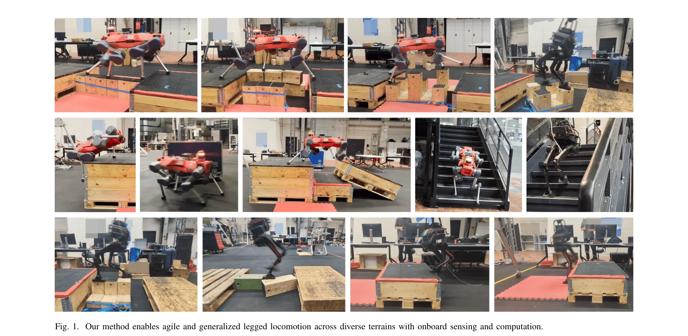
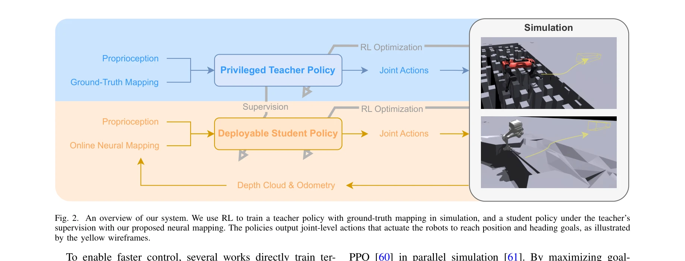

# AME-2: Agile and Generalized Legged Locomotion via Attention-Based Neural Map Encoding

> **저자**: Chong Zhang, Victor Klemm, Fan Yang, Marco Hutter | **날짜**: 2026-01-13 | **URL**: [https://arxiv.org/abs/2601.08485](https://arxiv.org/abs/2601.08485)

---

## Essence

*Fig. 1. Our method enables agile and generalized legged locomotion across diverse terrains with onboard sensing and comp*

AME-2는 attention 기반의 신경망 맵 인코더와 학습 기반의 불확실성 인식 elevation mapping을 결합하여 민첩성과 일반화를 동시에 달성하는 통합 RL 프레임워크이다. 이 방법은 사족 로봇과 이족 로봇에서 다양한 지형에 대한 강력한 성능을 시뮬레이션과 실제 환경에서 입증한다.

## Motivation

- **Known**: 기존 고전적 파이프라인 기반 방법들은 정확한 상태 추정과 모델 기반 제어로 신중한 보행은 잘 수행하지만 민첩성이 제한적이고, end-to-end 감각운동 정책은 높은 민첩성을 보이지만 미지의 지형에 대한 일반화가 부족하다.
- **Gap**: 기존 RL 기반 방법들은 민첩성, 일반화, 맵핑 효율성, 해석가능성 중 일부를 포기하는 트레이드오프를 하고 있으며, 오클루전(occlusion) 및 희소한 발판 조건에서 이들을 모두 만족하는 통합 프레임워크가 부재하다.
- **Why**: 실제 복잡한 지형에서 작동하는 다리 로봇은 민첩성과 일반화를 동시에 요구하므로, 이를 달성하는 방법은 자율 로봇의 실용성과 안전성을 크게 향상시킬 수 있다.
- **Approach**: AME-2는 elevation map에서 local과 global 특징을 추출한 후 attention 메커니즘으로 현재 작업에 관련된 영역에 가중치를 부여하고, 경량 neural network 기반의 elevation 매핑 파이프라인이 depth 관찰을 불확실성과 함께 local elevation으로 변환하여 정책 입력으로 제공한다.

## Achievement

*Fig. 1. Our method enables agile and generalized legged locomotion across diverse terrains with onboard sensing and comp*

- **AME-2 아키텍처**: attention 기반 맵 인코더가 local과 global 특징을 결합하여 지형 인식 표현을 생성하고, 다양한 지형에서 서로 다른 attention과 동작 패턴을 학습 가능하게 함
- **학습 기반 elevation mapping**: Bayesian learning으로 훈련된 경량 neural network가 depth 이미지를 local elevation과 per-cell 불확실성으로 변환하고, odometry와 fusion하여 빠르고 robust한 지형 표현 제공
- **Teacher-Student 학습 scheme**: 교사 정책이 ground-truth 맵으로 먼저 훈련된 후 학생 정책이 제안된 맵핑 하에서 감독받으며 훈련되어 배포 가능하면서도 민첩성과 일반화 유지
- **실제 로봇 검증**: ANYmal-D 사족 로봇과 LimX TRON1 이족 로봇에서 시뮬레이션과 실제 환경 모두에서 민첩성과 일반화 우수성 입증, 동일한 훈련 설정으로 서로 다른 로봇 플랫폼에 적용 가능

## How

*Fig. 2. An overview of our system. We use RL to train a teacher policy with ground-truth mapping in simulation, and a st*

- Elevation map에서 pixel 수준의 local 특징과 global 지형 맥락을 포착하는 global 특징 추출
- Proprioception과 global 특징을 조합하여 local 특징에 대한 attention weight 계산하고, 현재 작업과 무관한 영역의 가중치 감소
- Weighted local 특징을 global 특징과 proprioception과 concatenate하여 정책 학습용 지형 인식 표현 생성
- Depth 이미지를 local grid로 투영하고 Bayesian neural network로 local elevation 및 불확실성 예측
- Local map 예측을 temporal network 대신 frame 단위로 fusion하여 데이터 효율성 개선 및 과적합 완화
- 시뮬레이션과 실제 로봇 모두에서 병렬 매핑 파이프라인 실행으로 훈련 중 online mapping 가능화
- Teacher 정책은 ground-truth elevation map으로 학습하고, 학생 정책은 teacher supervision과 RL 손실의 조합으로 제안된 mapping 파이프라인 사용하여 훈련
- 같은 reward 함수와 훈련 설정으로 서로 다른 로봇 플랫폼 적응

## Originality

- **Attention 메커니즘의 새로운 적용**: 지형 맥락에 조건화된 attention을 elevation map 인코딩에 도입하여, 지형별로 서로 다른 주의 패턴과 동작을 학습 가능하게 함
- **Uncertainty-aware elevation mapping**: Bayesian neural network 기반의 경량 맵핑 파이프라인이 명시적으로 occlusion과 sensor noise를 모델링하면서도 빠른 실시간 처리 가능
- **통합 프레임워크**: attention 기반 인코더, 학습된 mapping, teacher-student 학습 scheme을 결합하여 민첩성, 일반화, 효율성, 해석가능성을 동시에 충족
- **교차 플랫폼 일반화**: 같은 훈련 설정과 reward 함수로 사족과 이족 로봇 모두에 적용되는 통합 RL 프레임워크 제시

## Limitation & Further Study

- **Mapping 정확도**: occlusion이 심한 환경이나 sensor noise가 높은 상황에서 elevation map 품질에 대한 상세한 분석 부족
- **계산 비용**: attention 메커니즘과 neural network 기반 mapping의 온보드 계산 비용과 실시간성에 대한 정량적 평가 제시 필요
- **지형 분포**: 훈련 지형과 테스트 지형의 분포 차이에 따른 성능 저하 정도에 대한 상세 분석 필요
- **후속 연구**: 극도로 sparse한 발판 또는 매우 동적인 지형 변화에 대한 성능 개선, transformer 기반의 더 복잡한 attention 구조 탐색, 다중 센서 fusion 전략 확대

## Evaluation

- Novelty: 4/5
- Technical Soundness: 3/5
- Significance: 4/5
- Clarity: 4/5
- Overall: 4/5

**총평**: AME-2는 attention 기반 인코더와 학습 기반 uncertainty-aware mapping을 결합하여 민첩성과 일반화를 동시에 달성하는 혁신적인 접근법을 제시하며, 사족 로봇과 이족 로봇에서 광범위한 실제 검증을 통해 실용적 가치를 입증한 우수한 논문이다.

## Related Papers

- 🏛 기반 연구: [[papers/1255_Adapting_Humanoid_Locomotion_over_Challenging_Terrain_via_Tw/review]] — 지형 적응을 위한 두 단계 학습 방법론의 이론적 기반을 제공한다
- 🔗 후속 연구: [[papers/1270_APEX_Learning_Adaptive_High-Platform_Traversal_for_Humanoid/review]] — attention 기반 매핑을 고플랫폼 순회와 같은 특수 지형 태스크로 확장 적용한다
- 🏛 기반 연구: [[papers/1365_EGM_Efficiently_Learning_General_Motion_Tracking_Policy_for/review]] — attention 메커니즘과 신경망 구조 설계의 이론적 기반을 제공한다
- 🏛 기반 연구: [[papers/1270_APEX_Learning_Adaptive_High-Platform_Traversal_for_Humanoid/review]] — 고플랫폼 순회에 attention 기반 지형 매핑과 인식 기술을 활용한다
- 🔗 후속 연구: [[papers/1255_Adapting_Humanoid_Locomotion_over_Challenging_Terrain_via_Tw/review]] — 지형 적응 학습에 attention 기반 매핑과 불확실성 인식을 추가하여 성능을 향상시킨다
- 🧪 응용 사례: [[papers/1491_NaVILA_Legged_Robot_Vision-Language-Action_Model_for_Navigat/review]] — 어텐션 기반 민첩한 legged locomotion 기술이 언어 기반 네비게이션에서 저수준 제어로 활용됩니다.
