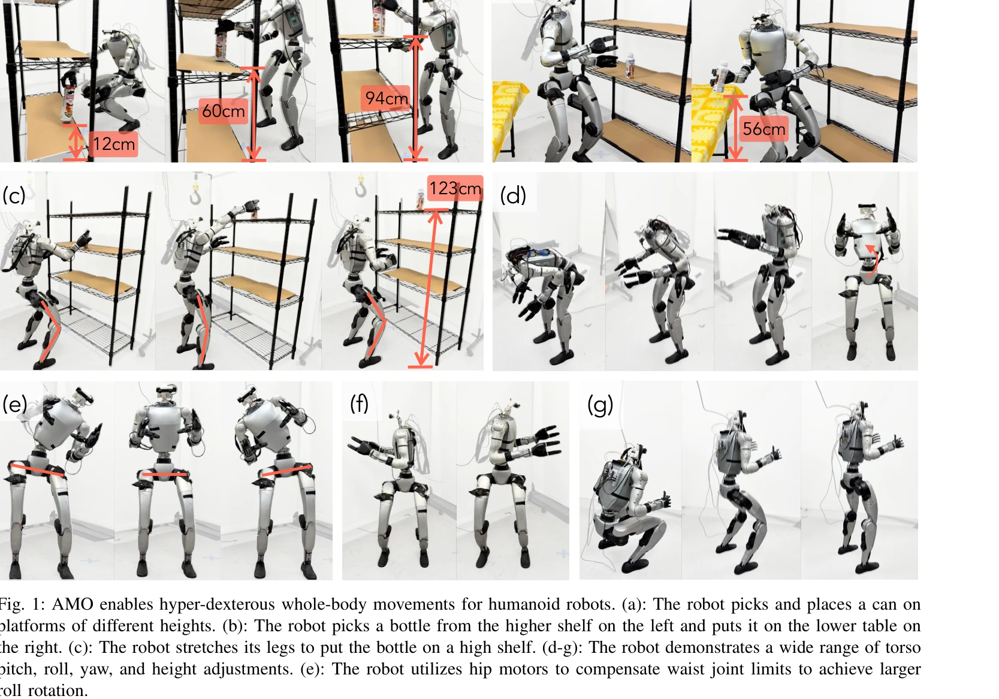

# AMO: Adaptive Motion Optimization for Hyper-Dexterous Humanoid Whole-Body Control

> **저자**: Jialong Li, Xuxin Cheng, Tianshu Huang, Shiqi Yang, Ri-Zhao Qiu, Xiaolong Wang | **날짜**: 2025-05-06 | **URL**: [https://arxiv.org/abs/2505.03738](https://arxiv.org/abs/2505.03738)

---

## Essence

*Fig. 2: System overview. The system is decomposed into four stages: 1. AMO module training by collecting AMO dataset*

AMO는 sim-to-real RL과 trajectory optimization을 결합하여 휴머노이드 로봇의 실시간 적응형 전신 제어를 실현하며, hybrid 데이터셋과 일반화 가능한 네트워크를 통해 O.O.D. 명령에도 견고하게 대응한다.

## Motivation

- **Known**: Motion capture 기반 모방 학습은 kinematic bias로 인해 이족 보행 중심이며, trajectory optimization은 계산 비효율과 제한된 motion primitive로 인해 real-time 적응이 어렵다는 점이 알려져 있다.
- **Gap**: 기존 방법들은 단순화된 보행 패턴에만 제한되어 전신 기민성을 달성하지 못하며, 동적 시나리오에서의 신속한 적응과 O.O.D. 명령에 대한 견고성이 부족하다.
- **Why**: 휴머노이드 로봇이 손으로 닿을 수 있는 작업 공간을 전신 움직임으로 확장하는 것은 지면 근처의 물체 집기 같은 조작 작업 수행에 필수적이며, 이는 복잡한 비선형 동역학과 29개의 high-DoF를 안정적으로 제어해야 하는 과제를 해결하는 것이 중요하기 때문이다.
- **Approach**: Hybrid motion synthesis를 통해 motion capture의 팔 궤적과 확률적으로 샘플링된 torso 방향을 결합하여 동역학을 고려한 reference motion을 생성하고, 이를 학습한 AMO 네트워크가 연속 명령 공간과 O.O.D. teleoperation 입력에 강건하게 대응하도록 훈련한다.

## Achievement

*Fig. 1: AMO enables hyper-dexterous whole-body movements for humanoid robots. (a): The robot picks and places a can on*

- **Hybrid Dataset 구성**: Motion capture와 trajectory optimization을 융합하여 kinematic bias를 제거한 첫 번째 휴머노이드 기민성 조작 데이터셋 AMO dataset 구축
- **확장된 작업 공간**: 강화 학습 기반 WBC 정책으로 이전 방법 대비 상당히 확대된 torso 방향(roll, pitch, yaw) 및 높이 조정 능력 달성
- **O.O.D. 일반화 성능**: Discrete look-up table 대신 continuous mapping을 학습하여 in-distribution과 out-of-distribution 명령 모두에서 견고한 성능 입증
- **Real-time 적응 제어**: VR teleoperation으로부터의 sparse pose를 multi-target inverse kinematics로 변환하고, AMO 네트워크와 RL 정책의 조합으로 실시간 제어 실현
- **자율 작업 실행**: Imitation learning을 통해 teleoperation 데이터로부터 학습한 transformer 정책으로 자율 loco-manipulation 수행 가능

## How

*Fig. 2: System overview. The system is decomposed into four stages: 1. AMO module training by collecting AMO dataset*

- Motion capture 데이터에서 상체 팔 궤적 추출 및 torso 방향 SO(3), 높이를 확률적으로 샘플링하여 상체 명령 조합 생성
- Trajectory optimizer를 사용하여 상체 명령을 기반으로 동역학 제약을 만족하는 전신 reference motion 생성
- 생성된 reference motion과 명령 쌍으로 AMO dataset 구성
- Teacher-student distillation을 통해 RL teacher 정책에서 AMO network로 continuous mapping 학습
- WBC 정책은 AMO network의 출력과 proprioceptive/privileged 정보를 입력받아 실시간 joint angle command 생성
- Deployment 단계에서 VR system에서 sparse pose 추출 후 multi-target IK로 상체 목표 설정 및 AMO 네트워크와 WBC 정책 순차 실행
- 자율 작업을 위해 teleoperation 궤적으로부터 transformer 기반 imitation learning policy 훈련

## Originality

- Motion capture와 trajectory optimization을 하이브리드 방식으로 결합하여 kinematic bias를 제거하는 novel dataset 구성 방식
- SO(3) + Height 공간에서의 torso 명령을 활용한 전신 기민성 확장이라는 새로운 문제 정식화
- Continuous mapping을 학습함으로써 discrete lookup table의 한계를 극복하고 O.O.D. 일반화를 달성하는 novel 정책 학습 전략
- 29-DoF 휴머노이드 로봇에서 지면 근처 물체 집기를 포함한 대규모 작업 공간 expansion을 실현한 최초의 실증 사례

## Limitation & Further Study

- Dataset 구성 과정에서 trajectory optimizer의 계산 비용이 여전히 존재하며, 대규모 새로운 동작 학습에 대한 확장성 논의 부족
- VR teleoperation 시스템에 대한 의존성으로 인한 일반화 가능성 제한 (다른 입력 방식에 대한 검증 미비)
- Simulation-to-real gap 완화 방법에 대한 상세한 기술적 분석 부족 (sim2real transfer 메커니즘 설명 부재)
- 신체 접촉(contact-rich) 조작 작업에 대한 구체적인 검증 및 접촉 안정성 분석 제한
- 다양한 신체 형태의 휴머노이드에 대한 일반화 가능성 미검증
- **후속 연구**: 온라인 적응 학습을 통한 실시간 domain adaptation, 더 복잡한 manipulation skill에 대한 확장, cross-embodiment transfer learning 연구

## Evaluation

- Novelty: 4/5
- Technical Soundness: 4/5
- Significance: 4/5
- Clarity: 4/5
- Overall: 4/5

**총평**: 본 논문은 hybrid motion synthesis와 continuous policy learning을 통해 휴머노이드 로봇의 전신 기민성을 획기적으로 확장하였으며, O.O.D. 일반화와 실시간 적응 제어를 동시에 달성함으로써 humanoid loco-manipulation 분야에서 실질적인 기술적 진전을 이루었다. 특히 29-DoF 실제 로봇에서의 광범위한 검증과 자율 작업 실행 능력은 이 분야의 중요한 마일스톤을 제시한다.

## Related Papers

- 🔄 다른 접근: [[papers/1258_Adversarial_Locomotion_and_Motion_Imitation_for_Humanoid_Pol/review]] — 적대적 상하반신 분리 대신 통합 최적화로 전신 제어를 달성하는 다른 접근법이다
- 🔗 후속 연구: [[papers/1322_Cost-Matching_Model_Predictive_Control_for_Efficient_Reinfor/review]] — 궤적 최적화와 RL의 결합을 비용 매칭 MPC로 더 효율적으로 구현한다
- 🏛 기반 연구: [[papers/1425_GMT_General_Motion_Tracking_for_Humanoid_Whole-Body_Control/review]] — 전신 모션 추적과 제어의 일반화 가능한 네트워크 설계 기반을 제공한다
- 🔄 다른 접근: [[papers/1258_Adversarial_Locomotion_and_Motion_Imitation_for_Humanoid_Pol/review]] — 상하반신 분리 제어 대신 전신 통합 최적화 접근 방식을 제시한다
- 🔄 다른 접근: [[papers/1261_Agility_Meets_Stability_Versatile_Humanoid_Control_with_Hete/review]] — 민첩성과 안정성 통합에 대해 혼합 데이터셋 대신 통합 최적화 접근 방식을 제시한다
- 🏛 기반 연구: [[papers/1322_Cost-Matching_Model_Predictive_Control_for_Efficient_Reinfor/review]] — 효율적인 강화학습에 궤적 최적화와 RL 결합의 기본 원리를 제공한다
- 🏛 기반 연구: [[papers/1394_FARM_Frame-Accelerated_Augmentation_and_Residual_Mixture-of-/review]] — adaptive motion optimization의 기본 개념을 제공하는 연구다
