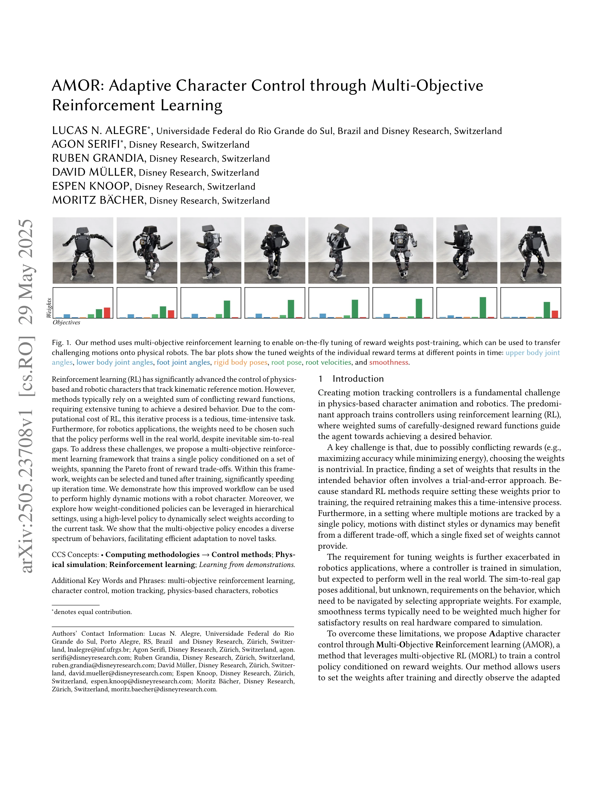
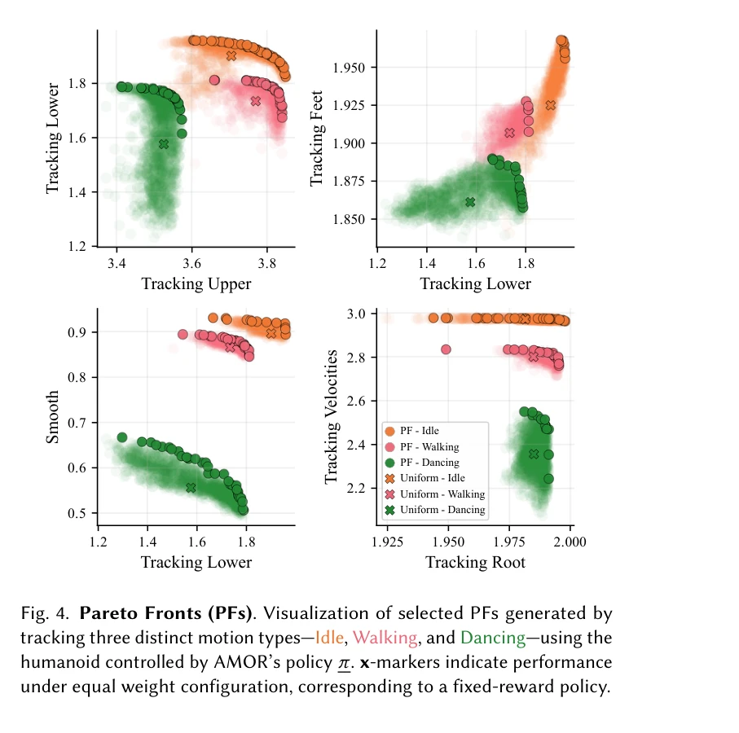
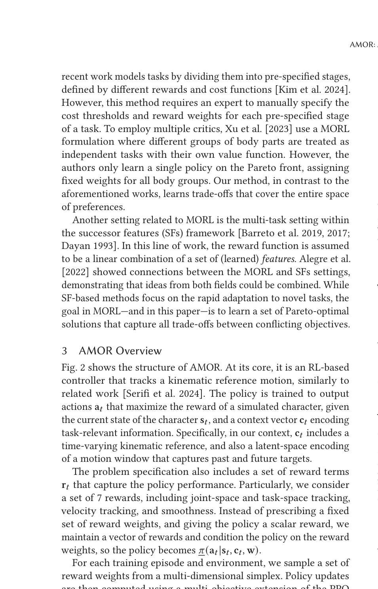

# AMOR: Adaptive Character Control through Multi-Objective Reinforcement Learning

> **저자**: Lucas N. Alegre, Agon Serifi, Ruben Grandia, David Müller, Espen Knoop, Moritz Bächer | **날짜**: 2025-05-29 | **URL**: [https://arxiv.org/abs/2505.23708](https://arxiv.org/abs/2505.23708)

---

## Essence

*Fig. 1. Our method uses multi-objective reinforcement learning to enable on-the-fly tuning of reward weights post-traini*

본 논문은 Multi-Objective Reinforcement Learning (MORL)을 이용하여 보상 가중치에 조건화된 단일 정책을 학습함으로써, 훈련 후 가중치를 조정할 수 있는 적응형 물리 기반 캐릭터 제어 방법 AMOR을 제안한다.

## Motivation

- **Known**: 강화학습을 통한 물리 기반 캐릭터 제어는 움직임 추적에서 큰 진전을 이루었으나, 전형적으로 가중치를 합산한 보상 함수에 의존하여 원하는 동작을 얻기 위해 광범위한 조정이 필요하다. 이는 RL의 높은 계산 비용으로 인해 시간이 많이 소요되는 반복 과정이다.
- **Gap**: 기존 방법들은 훈련 전에 가중치를 설정해야 하므로 재훈련이 필요하며, 로보틱스 응용에서 시뮬레이션-실제 간극(sim-to-real gap)을 처리하기 위해 가중치를 동적으로 선택할 수 없다. 또한 다양한 동작 스타일에 최적인 가중치 조합이 다르더라도 단일 가중치 세트로는 대응할 수 없다.
- **Why**: 훈련 후 가중치 조정이 가능하면 반복 튜닝 시간을 대폭 단축할 수 있으며, sim-to-real 전이 시 동적으로 가중치를 선택할 수 있어 로보틱스 응용의 실용성을 높인다. 또한 계층적 제어 구조에서 고수준 정책이 작업에 따라 보상 가중치를 적응적으로 선택할 수 있다면 다양한 행동 학습의 효율성이 크게 향상된다.
- **Approach**: 본 연구는 context-conditioned MORL 문제를 설정하여 보상 가중치에 조건화된 정책을 학습한다. generator-discriminator 접근 방식을 기반으로 Pareto 최적 전면(Pareto front)을 학습하고, 훈련 후 가중치를 선택하여 즉시 적응된 동작을 관찰할 수 있다. 또한 고수준 정책(HLP)이 동적으로 가중치를 조정하는 계층적 설정도 탐색한다.

## Achievement

*Fig. 4. Pareto Fronts (PFs). Visualization of selected PFs generated by*

- **Context-Conditioned MORL 문제 설정**: 서로 다른 context에 조건화된 Pareto 전면을 단일 정책으로부터 추출할 수 있는 새로운 문제 공식화 제시
- **AMOR 컨트롤러**: 보상 가중치와 작업 context에 조건화되어 충돌하는 목표 간 trade-off에 대해 zero-shot 적응이 가능한 컨트롤러 개발
- **계층적 정책 구조**: AMOR을 활용하여 실시간으로 보상 가중치를 미세 조정하고 암시적 보상의 해석 가능성을 제공하는 고수준 정책 설계
- **동적 모션 전이**: 개발된 방법으로 로봇 캐릭터에서 동적 모션의 sim-to-real 전이 성공적으로 달성
- **다양한 행동 인코딩**: 다목적 정책이 다양한 행동 스펙트럼을 인코딩하여 새로운 작업으로의 효율적 적응 가능성 입증

## How

*Fig. 2 shows the structure of AMOR. At its core, it is an RL-based*

- Multi-objective reinforcement learning 프레임워크에서 정책 π(a|s, w)를 가중치 벡터 w에 조건화하여 학습
- Generator-discriminator 접근 방식을 적용하여 참조 모션과 정책 생성 모션을 구별하는 implicit reward 활용
- Pareto 최적성을 만족하는 가중치-정책 쌍 집합을 학습하여 훈련 후 임의의 가중치 조합에서 성능 추출
- 고수준 정책(HLP)이 현재 작업 상태에 따라 low-level 정책의 보상 가중치 w를 동적으로 선택
- Kinematic reference 추적 정확도, 에너지 효율성, 움직임 부드러움 등 여러 목표 간 상충 관계를 Pareto 전면으로 표현

## Originality

- 기존 MORL이 주로 discrete task 전환에 초점을 맞춘 것에 비해, context-conditioned 형태로 연속적인 가중치 공간의 Pareto 최적 정책을 단일 네트워크로 학습하는 접근법은 참신함
- Physics-based character control에서 훈련 후 가중치 조정의 이점을 처음으로 체계적으로 활용하여 sim-to-real 문제에 적용
- 계층적 제어 구조에서 HLP가 자동으로 미세한 수준의 가중치 선택을 수행하는 구성은 기존 고정 가중치 방식과 차별화
- Implicit reward (discriminator 기반)과 명시적 보상 설계를 MORL과 결합하여 해석 가능성을 유지하는 하이브리드 접근

## Limitation & Further Study

- 학습 과정이 여전히 높은 계산 비용을 요구하므로, MORL의 장점인 훈련 후 조정도 한계가 있음. 초기 훈련 비용 절감 방안이 필요
- Pareto 전면의 품질이 학습되는 가중치 분포에 의존하므로, 예상치 못한 가중치 조합에서 성능 저하 가능성
- Generator-discriminator 접근법이 mode collapse 및 훈련 불안정성 문제를 완전히 해결하지 못할 수 있음
- 현재 평가가 제한된 로봇 플랫폼과 모션 세트에서만 수행되었으므로, 더 다양한 로봇 체형과 모션에 대한 일반화 검증 필요
- 고수준 정책의 학습 방법과 수렴 성능에 대한 상세 분석이 부족하며, 계층적 구조에서 HLP 가중치 선택의 최적성 보장 부재
- Sim-to-real 전이 성공 사례가 제한적이므로, 다양한 sim-to-real 갭 시나리오에서의 강건성 검증 필요

## Evaluation

- Novelty: 4/5
- Technical Soundness: 3/5
- Significance: 4/5
- Clarity: 4/5
- Overall: 4/5

**총평**: 본 논문은 MORL을 물리 기반 캐릭터 제어에 창의적으로 적용하여 훈련 후 가중치 조정이라는 실용적 이점을 제공한다. 방법론의 참신성과 로보틱스 응용의 중요성은 우수하나, 계산 비용 감소 및 더 광범위한 sim-to-real 평가가 보완된다면 더욱 강력한 기여가 될 것이다.

## Related Papers

- 🏛 기반 연구: [[papers/1267_AMP_Adversarial_Motion_Priors_for_Stylized_Physics-Based_Cha/review]] — adversarial motion prior 학습 방법이 다중 목표 강화학습의 모션 품질 향상을 위한 기초 기술을 제공한다
- 🔄 다른 접근: [[papers/1330_DeepMimic_Example-Guided_Deep_Reinforcement_Learning_of_Phys/review]] — physics-based character control에서 모션 캡처 데이터 활용을 각각 다중 목표와 예시 기반 학습으로 접근한다
- 🔗 후속 연구: [[papers/1275_ASE_Large-Scale_Reusable_Adversarial_Skill_Embeddings_for_Ph/review]] — adversarial skill embedding을 다중 목표 최적화와 결합하여 더 풍부한 캐릭터 행동 제어를 가능하게 한다
- 🔗 후속 연구: [[papers/1330_DeepMimic_Example-Guided_Deep_Reinforcement_Learning_of_Phys/review]] — example-guided RL의 기초 방법을 adaptive multi-objective learning으로 확장하여 더 유연한 제어를 가능하게 한다
