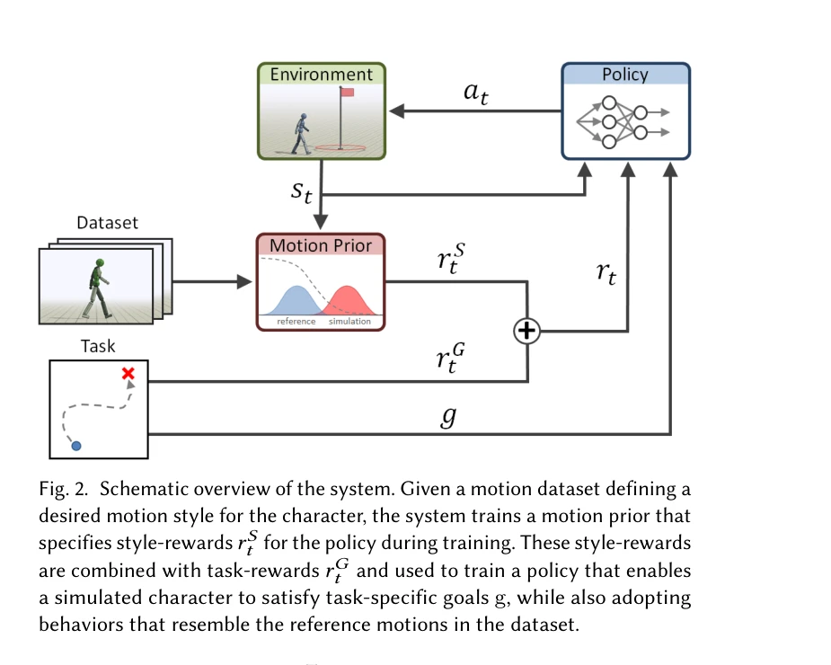
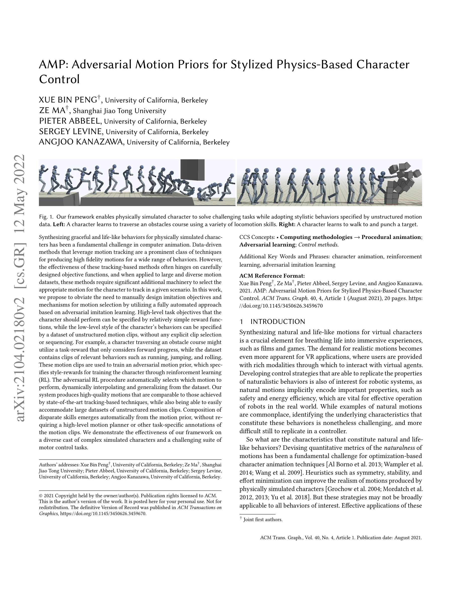

# AMP: Adversarial Motion Priors for Stylized Physics-Based Character Control

> **저자**: Xue Bin Peng, Ze Ma, Pieter Abbeel, Sergey Levine, Angjoo Kanazawa | **날짜**: 2021-04-05 | **URL**: [https://arxiv.org/abs/2104.02180](https://arxiv.org/abs/2104.02180)

---

## Essence

*Fig. 2. Schematic overview of the system. Given a motion dataset defining a*

물리 기반 캐릭터 제어에서 adversarial motion prior를 학습하여 비구조화된 모션 데이터셋으로부터 스타일을 자동으로 추출하고, 간단한 보상함수로 정의된 고수준 작업 목표와 결합하여 자연스러운 동작을 생성하는 방법을 제시한다.

## Motivation

- **Known**: 물리 기반 캐릭터 애니메이션에서 tracking 기반 방법들은 높은 품질의 모션을 생성하지만, 대규모 비구조화 모션 데이터셋에 적용할 때 각 시간 단계에서 추적할 적절한 모션 클립을 선택해야 하는 문제가 있다. Adversarial imitation learning은 잘 알려진 기법이지만 물리 기반 풀바디 캐릭터 제어에 효과적으로 적용된 사례가 제한적이다.
- **Gap**: 기존 tracking 기반 방법들은 모션 선택과 시퀀싱을 위해 고수준 motion planner와 task-specific 주석이 필요하며, 명시적으로 설계된 imitation objective가 필수적이다. 비구조화된 대규모 모션 데이터셋에서 자동으로 스타일을 학습하고 다양한 작업에 적응시킬 수 있는 통합 프레임워크가 부재하다.
- **Why**: 자연스럽고 생명감 있는 가상 캐릭터 동작 생성은 영화, 게임, VR 등 다양한 응용에서 핵심적이며, 로봇 공학에서도 자연스러운 모션에 내재된 안전성과 에너지 효율성은 실세계 로봇 운영에 필수적이다.
- **Approach**: Adversarial discriminator를 사용하여 모션 데이터셋과 캐릭터가 생성한 동작 간의 유사성을 측정하는 motion prior를 학습하고, 이를 goal-conditioned reinforcement learning 프레임워크에 통합하여 작업 보상과 스타일 보상을 동시에 최적화한다.

## Achievement

*Fig. 1. Our framework enables physically simulated character to solve challenging tasks while adopting stylistic behavio*

- **자동 모션 선택 및 보간**: Motion prior가 데이터셋에서 자동으로 관련 모션을 선택하고 보간하므로 명시적인 클립 선택이나 sequencing이 불필요하다.
- **비구조화 데이터 활용**: Task-specific 주석이나 정렬 없이 대규모 비구조화 모션 클립 데이터셋을 직접 활용할 수 있다.
- **자동 스킬 합성**: 서로 다른 스킬의 조합이 고수준 motion planner 없이 자동으로 emergent된다.
- **최고 수준의 품질**: State-of-the-art tracking 기반 기법과 비교 가능한 높은 품질의 모션을 생성한다.
- **다양한 캐릭터 및 작업**: 복잡한 물리 시뮬레이션 캐릭터와 장애물 코스 통과, 타겟 공격 등 도전적인 모터 제어 작업에서 효과를 입증한다.

## How

*Fig. 2. Schematic overview of the system. Given a motion dataset defining a*

- Adversarial discriminator를 학습하여 reference motion과 generated motion을 구별하도록 훈련
- Discriminator의 출력을 style reward로 변환하여 RL objective에 통합
- Goal-conditioned RL을 사용하여 task reward(예: forward progress)와 style reward(motion prior)를 결합
- Policy network가 작업 목표를 수행하면서 동시에 motion prior의 style을 따르도록 학습
- RL 최적화 과정에서 자동으로 상황에 맞는 모션 클립이 선택되고 보간되도록 유도

## Originality

- Adversarial imitation learning을 물리 기반 풀바디 캐릭터 제어에 효과적으로 적용한 것은 선행 연구에서 제한적이었다.
- Motion prior를 explicit motion selection 없이 RL 보상으로 활용하는 새로운 패러다임을 제시한다.
- 비구조화 데이터로부터 자동 스킬 합성을 달성하는 통합 프레임워크를 개발한다.
- 다양한 설계 선택사항(architecture, training procedure 등)을 통해 선행 adversarial learning 기법보다 실질적으로 향상된 결과를 도출한다.

## Limitation & Further Study

- Discriminator 학습의 안정성: Adversarial training의 내재적 불안정성으로 인한 수렴 어려움이 발생할 수 있다.
- 모션 데이터셋의 품질 의존성: 데이터셋의 다양성과 품질이 최종 생성 모션의 수준을 크게 좌우한다.
- 도메인 갭: 실제 인간 모션 데이터셋과 물리 시뮬레이션 환경 간의 괴리가 존재할 수 있다.
- 계산 비용: Adversarial training과 RL의 결합으로 인한 높은 계산 비용이 실시간 응용을 제한할 수 있다.
- 후속연구: 더 안정적인 adversarial training 기법, 적응형 motion prior 학습, 적은 모션 데이터로 학습 가능한 방법, 실제 로봇 환경으로의 sim-to-real transfer 등이 필요하다.

## Evaluation

- Novelty: 4/5
- Technical Soundness: 3/5
- Significance: 4/5
- Clarity: 4/5
- Overall: 4/5

**총평**: 본 논문은 adversarial imitation learning을 물리 기반 캐릭터 애니메이션에 성공적으로 적용하여, 비구조화 모션 데이터를 효과적으로 활용하면서도 높은 품질의 동작을 생성할 수 있는 실용적인 솔루션을 제시한다. 자동 스킬 합성과 motion selection 자동화라는 측면에서 컴퓨터 애니메이션 분야에 중요한 기여를 한다.

## Related Papers

- 🏛 기반 연구: [[papers/1330_DeepMimic_Example-Guided_Deep_Reinforcement_Learning_of_Phys/review]] — 모션 캡처 데이터로부터 자연스러운 동작을 생성하는 기초적인 adversarial learning 접근법을 제시한다
- 🔗 후속 연구: [[papers/1275_ASE_Large-Scale_Reusable_Adversarial_Skill_Embeddings_for_Ph/review]] — adversarial motion prior를 대규모 skill embedding으로 확장하여 더 다양한 행동을 학습할 수 있게 한다
- 🔄 다른 접근: [[papers/1565_MaskedMimic_Unified_Physics-Based_Character_Control_Through/review]] — physics-based character control에서 adversarial learning과 masked autoencoder라는 서로 다른 self-supervised 접근법을 제시한다
- 🏛 기반 연구: [[papers/1275_ASE_Large-Scale_Reusable_Adversarial_Skill_Embeddings_for_Ph/review]] — adversarial motion prior를 통한 물리 기반 캐릭터 제어의 핵심 기법을 제공한다
- 🔄 다른 접근: [[papers/1242_A_Gait_Driven_Reinforcement_Learning_Framework_for_Humanoid/review]] — 보행 학습에서 적대적 모션 프라이어를 사용하는 다른 접근 방식을 제시한다
- 🏛 기반 연구: [[papers/1258_Adversarial_Locomotion_and_Motion_Imitation_for_Humanoid_Pol/review]] — 적대적 학습을 통한 모션 모방의 이론적 기반을 제공한다
- 🏛 기반 연구: [[papers/1266_AMOR_Adaptive_Character_Control_through_Multi-Objective_Rein/review]] — adversarial motion prior 학습 방법이 다중 목표 강화학습의 모션 품질 향상을 위한 기초 기술을 제공한다
- 🔗 후속 연구: [[papers/1330_DeepMimic_Example-Guided_Deep_Reinforcement_Learning_of_Phys/review]] — motion capture 기반의 physics-based control을 adversarial motion prior로 발전시켜 더 자연스러운 동작을 생성한다
- 🏛 기반 연구: [[papers/1475_MetaMorph_Learning_Universal_Controllers_with_Transformers/review]] — Adversarial Motion Prior의 물리 기반 캐릭터 제어가 Transformer 기반 범용 제어기의 기반 기술을 제공한다.
- 🏛 기반 연구: [[papers/1510_KungfuBot2_Learning_Versatile_Motion_Skills_for_Humanoid_Who/review]] — Adversarial Motion Priors (AMP) 기반의 물리 기반 캐릭터 제어 방법론이 VMS의 다양한 동작 학습 접근법과 직접적으로 연관됨
- 🔗 후속 연구: [[papers/1545_Learning_to_Walk_and_Fly_with_Adversarial_Motion_Priors/review]] — 기본 AMP 프레임워크를 항공 휴머노이드라는 특수한 멀티모달 이동 시스템에 적용하여 걷기와 비행을 통합한 발전된 형태임
- 🔗 후속 연구: [[papers/1546_Learning_to_Walk_in_Costume_Adversarial_Motion_Priors_for_Ae/review]] — 기본 AMP 프레임워크를 엔터테인먼트 휴머노이드의 미학적 제약과 비정상적 질량 분포라는 특수 상황에 적용한 발전된 형태임
- 🔗 후속 연구: [[papers/1547_Learning_Vision-Driven_Reactive_Soccer_Skills_for_Humanoid_R/review]] — AMP 프레임워크를 시각 기반 동적 제어로 확장하여 지각-동작 협응을 구현한 발전된 형태임
- 🏛 기반 연구: [[papers/1578_MoRE_Mixture_of_Residual_Experts_for_Humanoid_Lifelike_Gaits/review]] — 물리 기반 캐릭터 제어의 적대적 모션 사전 기법이 MoRE의 다중 전문가 학습 프레임워크의 이론적 기초를 제공합니다.
- 🔄 다른 접근: [[papers/1589_Olaf_Bringing_an_Animated_Character_to_Life_in_the_Physical/review]] — 물리 기반 캐릭터 애니메이션에서 적대적 모션 사전과 강화학습 기반 제어가 서로 다른 접근 방식을 제시합니다.
- 🏛 기반 연구: [[papers/1609_Perpetual_Humanoid_Control_for_Real-time_Simulated_Avatars/review]] — 적대적 모션 사전을 통한 물리 기반 캐릭터 제어가 PMCP의 고충실도 모션 모방의 이론적 기초를 제공합니다.
- 🏛 기반 연구: [[papers/1538_Learning_Symmetric_and_Low-energy_Locomotion/review]] — AMP의 adversarial motion prior 개념을 확장하여 대칭성과 에너지 효율성을 명시적으로 고려한 자연스러운 보행을 생성한다.
