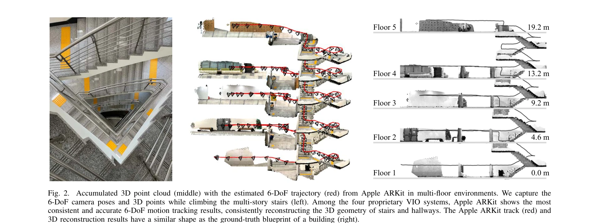
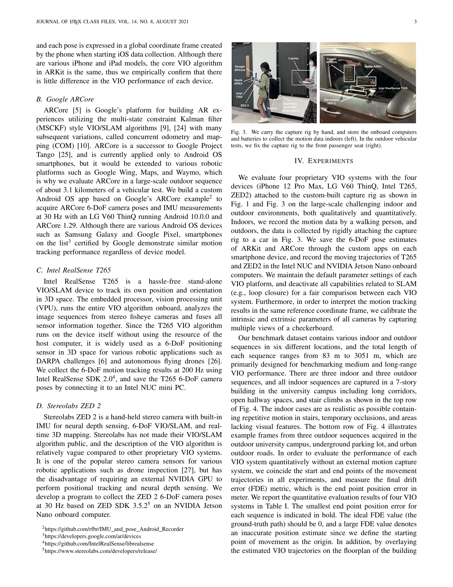

# An Empirical Evaluation of Four Off-the-Shelf Proprietary Visual-Inertial Odometry Systems

> **저자**: Jungha Kim, Minkyeong Song, Yeoeun Lee, Moonkyeong Jung, Pyojin Kim | **날짜**: 2022-07-14 | **URL**: [https://arxiv.org/abs/2207.06780](https://arxiv.org/abs/2207.06780)

---

## Essence

*Fig. 1. The custom-built capture rig for benchmarking 6-DoF motion tracking*

Apple ARKit, Google ARCore, Intel RealSense T265, Stereolabs ZED 2 등 네 가지 상용 VIO 시스템을 실내외 환경에서 종합 평가하여 위치 안정성, 일관성, 정확도를 비교 분석한 벤치마크 연구.

## Motivation

- **Known**: VIO는 6-DoF 자세 추정의 비용 효율적인 방법으로 여러 상용 제품이 존재하며, 학술적 오픈소스 VIO 알고리즘(MSCKF, OKVIS, VINS-Mono)에 대한 비교 연구가 존재한다.
- **Gap**: 상용 VIO 시스템들(ARKit, ARCore, T265, ZED 2)에 대한 포괄적인 벤치마크 연구가 부족하며, 기존 연구는 제한된 환경이나 소수의 플랫폼만 평가했다.
- **Why**: 상용 VIO 시스템이 DARPA 챌린지, 자율주행, AR/VR 애플리케이션에서 광범위하게 사용되므로 신뢰성 있는 성능 비교가 연구자와 엔지니어에게 필요하다.
- **Approach**: 맞춤형 캡처 리그에 네 가지 VIO 시스템을 장착하여 장 복도, 광활한 개방 공간, 반복적 계단, 지하 주차장, 도시 교통 환경 등 6가지 실내외 도전적 환경에서 체계적 실험을 수행했다.

## Achievement

*Fig. 2.*

- **포괄적 벤치마크**: 상용 VIO 시스템 4개를 실제 환경에서 첫 비교 평가하여 위치 안정성, 일관성, 정확도 데이터 제공
- **Apple ARKit 우수성**: 다층 계단 환경에서 ARKit이 가장 일관되고 정확한 6-DoF 추적 성능 시현
- **다양한 시나리오 커버**: 장거리 복도부터 3.1km 차량 운행까지 도보 및 차량 이동 조건 포함
- **실제 사용 사례 반영**: 반복적 시각 특징, 조명 부족, 급속 회전 등 실제 도전 환경 포함

## How

*Fig. 3. We carry the capture rig by hand, and store the onboard computers*

- iPhone 12 Pro Max(ARKit), LG V60 ThinQ(ARCore), Intel NUC 연결 T265, NVIDIA GPU 연결 ZED 2로 구성된 맞춤형 리그 제작
- 각 시스템에서 6-DoF 카메라 자세, RGB/깊이 이미지, IMU 데이터 수집(ARKit 60Hz, ARCore 30Hz, T265 200Hz)
- 6가지 도전적 실내외 환경에서 실험: 장 좁은 복도, 대규모 개방 공간, 반복적 계단, 조명 부족 지하주차장, 3.1km 차량 도시 주행
- 추정 궤적과 3D 점군을 건물 블루프린트 등 지상 참값과 비교 평가
- 위치 정확도, 궤적 일관성, 드리프트 특성 분석

## Originality

- 상용 VIO 시스템 4개의 첫 직접 비교 벤치마크 연구로, 기존 연구는 제한된 플랫폼이나 환경에서만 평가
- 실제 도전적 환경(반복 특징, 조명 부족, 다층 구조, 도시 차량 운행 등)에서의 평가로 학술 데이터셋 평가의 한계 극복
- 폐쇄 소스 상용 플랫폼의 성능을 체계적으로 벤치마킹함으로써 실용적 적용 가이드 제공

## Limitation & Further Study

- 지상 참값이 제한적(블루프린트 등)이어서 정량적 오차 메트릭이 불완전할 수 있음 - 모션 캡처 시스템 사용 권장
- 네 가지 시스템만 평가하였으므로 다른 상용/오픈소스 VIO 알고리즘과의 비교 필요
- 폐쇄 소스 특성상 알고리즘 내부 동작 원리 분석 불가능 - 성능 차이의 근본 원인 규명 제한
- 스마트폰(ARKit, ARCore)의 카메라/센서 변동이 결과에 미치는 영향 추가 분석 필요
- 긴 기간 추적 안정성 및 대규모 환경 폐루프 검출 성능 평가 확대 권장

## Evaluation

- Novelty: 4/5
- Technical Soundness: 3/5
- Significance: 4/5
- Clarity: 4/5
- Overall: 4/5

**총평**: 상용 VIO 시스템의 성능을 실제 도전적 환경에서 체계적으로 비교 평가한 최초 벤치마크로, 로보틱스와 자율 시스템 분야의 연구자와 엔지니어에게 실질적인 기준 제공한다.

## Related Papers

- 🏛 기반 연구: [[papers/1245_A_Hybrid_Autoencoder_for_Robust_Heightmap_Generation_from_Fu/review]] — 상용 VIO 시스템의 성능 벤치마크가 LiDAR와 깊이 카메라 융합 시스템의 비교 기준을 제공한다.
- 🧪 응용 사례: [[papers/1560_SARA-RT_Scaling_up_Robotics_Transformers_with_Self-Adaptive/review]] — LookOut의 egocentric 네비게이션 시스템이 평가된 VIO 시스템들을 실제 humanoid 환경에서 활용하는 사례를 보여준다.
- 🔗 후속 연구: [[papers/1590_Toward_General-Purpose_Robots_via_Foundation_Models_A_Survey/review]] — Omni-Perception의 omnidirectional 충돌 회피 시스템이 VIO 평가 결과를 바탕으로 더 robust한 perception을 구현한다.
- 🔄 다른 접근: [[papers/1344_DIAL_Distilling_Intent-Aware_Latents_for_Vision-Language-Act/review]] — DIAL의 latent intent bottleneck과 기존 VLM 평가의 서로 다른 vision-language 통합 접근법을 비교할 수 있습니다.
- 🔗 후속 연구: [[papers/1466_ManipBench_Benchmarking_Vision-Language_Models_for_Low-Level/review]] — 상업적 VLM들의 경험적 평가를 로봇 조작 특화 벤치마크로 확장하여 더욱 구체적인 성능 분석을 제공합니다.
- 🧪 응용 사례: [[papers/1518_Prismatic_VLMs_Investigating_the_Design_Space_of_Visually-Co/review]] — proprietary VLM들의 empirical evaluation이 Prismatic VLMs의 체계적 설계 분석을 실제 상용 모델에 적용한다.
- 🔗 후속 연구: [[papers/1443_Hierarchical_Intention-Aware_Expressive_Motion_Generation_fo/review]] — VLM의 멀티모달 이해 능력을 휴머노이드의 실시간 표현적 동작 생성에 확장 적용했다
- 🔗 후속 연구: [[papers/1483_HumanoidVLM_Vision-Language-Guided_Impedance_Control_for_Con/review]] — 멀티모달 VLM의 능력을 휴머노이드의 임피던스 제어에 특화하여 적용했다
