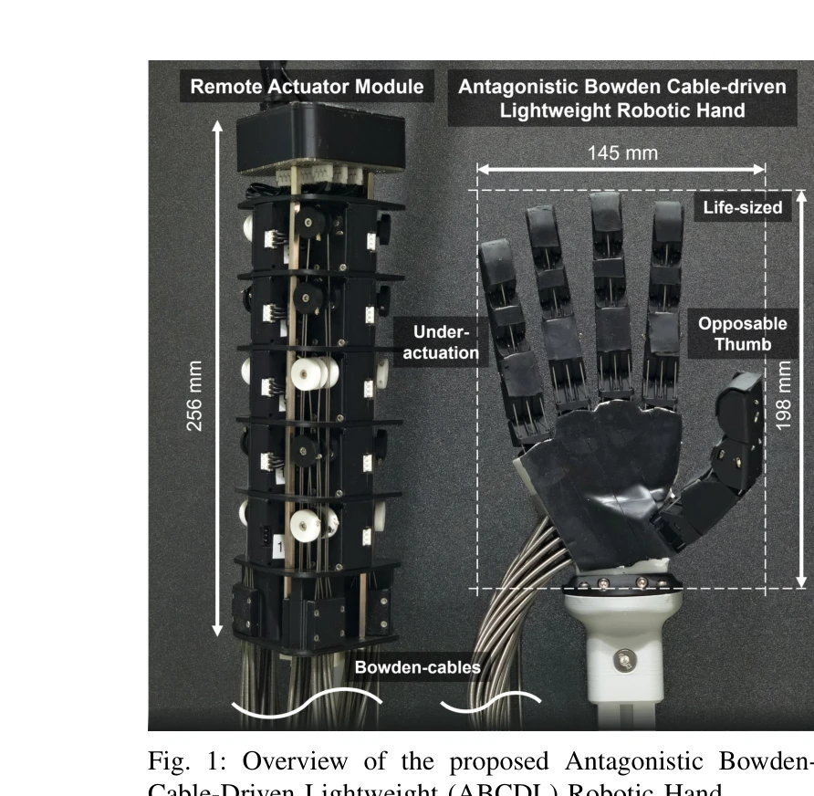

# Antagonistic Bowden-Cable Actuation of a Lightweight Robotic Hand: Toward Dexterous Manipulation for Payload Constrained Humanoids

> **저자**: Sungjae Min, Hyungjoo Kim, David Hyunchul Shim | **날짜**: 2025-12-31 | **URL**: [https://arxiv.org/abs/2512.24657](https://arxiv.org/abs/2512.24657)

---

## Essence

*Fig. 1: Overview of the proposed Antagonistic Bowden-*

인간 수준의 손재주를 갖춘 휴머노이드 로봇을 위해, 원격 구동되는 Bowden 케이블과 rolling-contact joint를 결합한 경량 5지 인간형 로봇 손을 제시한다. 제안된 손은 236g의 극저 말단 질량으로 100배 이상의 페이로드를 들어올릴 수 있다.

## Motivation

- **Known**: 기존 케이블 구동 로봇 손들(Biomimetic Hand, ACT Hand, SeoulTech Hand 등)은 높은 자유도와 인간 규모의 크기를 달성했지만, 말단 무게 증가로 인한 팔의 페이로드 감소 문제가 있다. 고기어비는 역구동성과 안정성을 훼손한다.
- **Gap**: 기존 설계들은 무게, 토크 생성, 자유도, 손목 호환성 간의 상충 관계를 완벽하게 해결하지 못했다. 무거운 구동기 모듈이 팜 내부에 통합되어 팔의 페이로드 용량을 크게 제한한다.
- **Why**: 휴머노이드 로봇이 인간 환경에서 복잡한 조작 작업을 수행하려면, 고 자유도, 강한 그립력, 빠른 속도를 유지하면서도 팔의 페이로드 용량을 보존하는 경량 손이 필수적이다. 이는 imitation learning과 demonstration dataset 기반의 Physical AI 플랫폼 개발에도 중요하다.
- **Approach**: 구동기를 원격(예: 휴머노이드 몸통)으로 배치하고 Bowden 케이블을 통해 연결하며, rolling-contact joint와 antagonistic 케이블 쌍을 결합하여 단일 모터당 하나의 관절을 제어한다. 3D 프린팅 기반의 모듈식 설계로 유연성과 유지보수성을 확보한다.

## Achievement

*Fig. 1: Overview of the proposed Antagonistic Bowden-*

- **극경량 설계**: 말단 질량 236g(원격 구동기 제외)으로 인간형 로봇 손 중 가장 가볍고, 인간 손과 1:1 규모 달성
- **높은 자유도 유지**: 15개 구동기로 20 DOF 구현, 각 지에 대한 독립적 제어
- **우수한 그립 성능**: 18N 이상의 지끝 힘, 자신 무게의 100배 이상 페이로드 들어올리기 가능
- **antagonistic cable의 이점**: 일방향 케이블 손의 배측 접촉 시 의도하지 않은 굴곡 문제 제거, 모터 간 동기화 불필요
- **robust 검증**: Cutkosky taxonomy 그립들을 통한 안정성 검증, 구동기-손 변환 교란 시에도 궤적 일관성 유지

## How

- Rolling-contact joint(RCJ) 설계를 통해 복잡한 베어링, 링크, 핀 제거
- Antagonistic Bowden 케이블 쌍으로 flexion-extension 및 abduction-adduction 제어
- 모든 손가락을 동일한 매개변수화 구조로 설계하되, 엄지의 CMC-MCP 관절은 underactuation 구현
- Spectra 스레드로 RCJ 고정, 나머지 구성품은 FDM 3D 프린팅(PLA 소재)으로 제작
- 마찰 보정을 위해 손가락 및 팜 표면에 러버 테이프 부분 적용
- 원격 구동 모듈(690g)은 로봇 몸통에 배치 가능하여 팔의 페이로드 용량 보존

## Originality

- **원격 구동 + 경량 설계의 창의적 결합**: Bowden 케이블 기반으로 말단 질량을 극소화하면서도 높은 자유도 유지
- **Antagonistic cable 아키텍처의 독창적 응용**: 단일 모터당 관절 제어와 의도하지 않은 굴곡 문제 동시 해결
- **Rolling-contact joint의 최적화**: 매개변수화된 rolling radius 설계로 cable-length deviation 최소화
- **모듈식 3D 프린팅 설계**: 유연한 케이블 라우팅, 센서 통합 용이, 유지보수 간소화를 동시에 달성

## Limitation & Further Study

- **Bowden 케이블의 마찰 및 히스테리시스**: 케이블-쉬스 마찰로 인한 비선형성이 완전히 제거되지 않음, 보정 알고리즘 필요
- **PLA 소재의 강도 제한**: 저마찰 계수를 보완하기 위해 러버 테이프 부분 적용이 필요하며, 장기 내구성에 대한 검증 부족
- **실시간 피드백 제어의 복잡성**: Antagonistic cable 구동 시 양쪽 케이블 장력의 정밀한 제어가 요구되나, 세부 제어 알고리즘 미상
- **후속 연구**: (1) 접촉 센서 통합을 통한 폐루프 제어 시스템 구현, (2) 더 높은 강도의 바이오-소재 또는 복합재 적용, (3) 실제 휴머노이드 플랫폼(예: Atlas, Tesla Bot)에의 통합 및 동적 조작 작업 평가

## Evaluation

- Novelty: 4/5
- Technical Soundness: 4/5
- Significance: 4/5
- Clarity: 4/5
- Overall: 4/5

**총평**: 이 논문은 원격 구동과 antagonistic cable 아키텍처를 창의적으로 결합하여 휴머노이드 로봇의 페이로드 제약을 해결하면서도 높은 자유도를 유지하는 경량 손 설계를 제시한다. 극저 말단 질량(236g)과 우수한 그립 성능의 균형은 기존 설계의 상충 관계를 효과적으로 완화하며, 3D 프린팅 기반 모듈식 구조는 실용성과 확장성을 높인다.

## Related Papers

- 🔄 다른 접근: [[papers/1238_A_21-DOF_Humanoid_Dexterous_Hand_with_Hybrid_SMA-Motor_Actua/review]] — Bowden 케이블 구동과 SMA-모터 하이브리드 구동의 서로 다른 경량화 접근법을 비교 연구할 수 있습니다.
- 🏛 기반 연구: [[papers/1603_ORCA_An_Open-Source_Reliable_Cost-Effective_Anthropomorphic/review]] — 원격 구동과 rolling-contact joint 설계 원리가 힘줄 구동 로봇 손의 기본 구조로 활용됩니다.
- 🧪 응용 사례: [[papers/1341_CoPAL_Corrective_Planning_of_Robot_Actions_with_Large_Langua/review]] — 경량 로봇 손의 100배 페이로드 능력이 20-DoF 손의 정밀한 원격조작에 응용 가능합니다.
- 🔄 다른 접근: [[papers/1238_A_21-DOF_Humanoid_Dexterous_Hand_with_Hybrid_SMA-Motor_Actua/review]] — 21-DOF SMA-모터 하이브리드 구동과 경량 Bowden 케이블 구동 방식의 인간형 손 설계 비교 연구가 가능합니다.
- 🔗 후속 연구: [[papers/1603_ORCA_An_Open-Source_Reliable_Cost-Effective_Anthropomorphic/review]] — ORCA의 17-DoF 설계가 경량 5지 로봇 손의 Bowden 케이블 구동 시스템으로 확장 적용됩니다.
