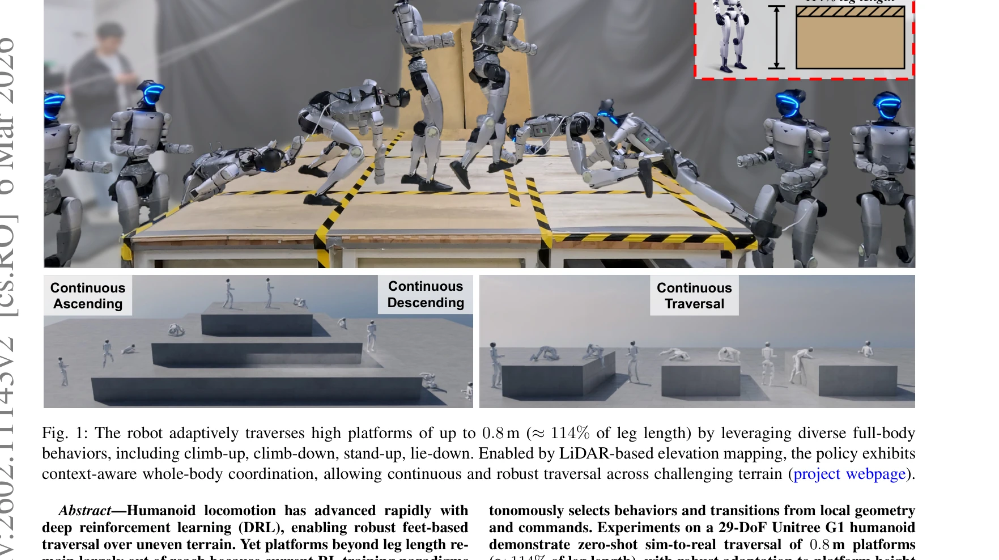

# APEX: Learning Adaptive High-Platform Traversal for Humanoid Robots

> **저자**: Yikai Wang, Tingxuan Leng, Changyi Lin, Shiqi Liu, Shir Simon, Bingqing Chen, Jonathan Francis, Ding Zhao | **날짜**: 2026-02-11 | **URL**: [https://arxiv.org/abs/2602.11143](https://arxiv.org/abs/2602.11143)

---

## Essence

*Fig. 2: Learning pipeline for high-platform traversal: Teacher Training uses RL with the Ratchet Progress Reward, where *

APEX는 deep reinforcement learning으로 humanoid 로봇이 다리 길이의 114%에 달하는 고플랫폼을 climbing 기반의 다중 스킬로 자율적으로 횡단하는 시스템이다. generalized ratchet progress reward와 LiDAR 기반 perception, 정책 증류를 결합하여 안전하고 적응적인 고플랫폼 순회를 실현한다.

## Motivation

- **Known**: Deep reinforcement learning으로 uneven terrain의 발 기반 보행은 가능해졌으나, jumping 기반 방식은 높이가 제한적(63% 이하)이고 높은 충격 토크로 인해 실제 배포에 부적합하다. Humanoid의 full-body maneuver 학습은 연구되었으나 대부분 단순 행동에 국한되어 있다.
- **Gap**: 다리 길이 이상의 극단적으로 높은 플랫폼(>100%)에 대해 안전하고 견고한 현실 적용이 가능한 통합 다중 스킬 정책이 부재하며, contact-rich goal-reaching maneuver를 DRL로 효과적으로 학습하기 위한 reward formulation이 명확하지 않다.
- **Why**: Humanoid 로봇의 실제 환경 적응성과 활용성을 크게 확장할 수 있으며, 높은 장애물 극복 능력은 탐사, 구조, 엔터테인먼트 등 다양한 응용 분야에서 핵심 역량이 된다. 안전한 실시간 정책 학습과 배포는 로봇 제어의 중요한 난제이다.
- **Approach**: Ratchet progress reward로 6개의 teacher 정책(climb-up, climb-down, stand-up, lie-down, walking, crawling)을 개별 학습한 후, DAgger 스타일 데이터 샘플링과 distillation으로 하나의 unified student 정책으로 통합하고, LiDAR elevation mapping의 training-time artifact 모델링과 deployment-time filtering/inpainting으로 sim-to-real 갭을 해소한다.

## Achievement

*Fig. 1: The robot adaptively traverses high platforms of up to 0.8 m (≈114% of leg length) by leveraging diverse full-bo*

- **extreme height 극복**: 29-DoF Unitree G1에서 0.8m(다리 길이의 114%) 플랫폼을 zero-shot sim-to-real로 횡단 성공
- **generalized ratchet progress reward**: velocity-free하면서도 dense한 감독신호로 safety regularization 하에서 contact-rich maneuver 학습을 단일 단계에서 달성
- **자율적 스킬 선택 및 전환**: 6개 heterogeneous 스킬을 통합 정책으로 관리하고 local geometry 및 user command에 따라 context-aware하게 선택·전환
- **강건한 적응성**: 플랫폼 높이와 초기 자세 변화에 robust하게 대응하는 terrain-conditioned 전략 학습
- **smooth multi-skill transition**: predecessor와 successor 간 상태 분포 매칭으로 안정적인 행동 전환 실현

## How

*Fig. 2: Learning pipeline for high-platform traversal: Teacher Training uses RL with the Ratchet Progress Reward, where *

- **Ratchet progress reward**: 최고 달성한 task progress를 추적하는 'best-so-far' reference를 유지하고, 이를 엄격히 초과하는 상태만 보상하여 non-improving step 제약", '**LiDAR-based elevation mapping**: training 중 mapping artifact를 시뮬레이션에서 모델링하고, deployment 중 filtering과 inpainting으로 perception gap 감소
- **Teacher policy training**: 각 maneuver와 locomotion에 대해 개별 DRL 훈련으로 task-specialized expertise 확보
- **Policy distillation**: 'divide-and-conquer' data sampling rule로 분산 환경에서 maneuver와 transition을 모두 커버하는 데이터 혼합", '**Unified policy synthesis**: 6개 teacher의 행동을 single student policy로 통합하여 autonomous skill selection과 seamless transition 가능하게 함
- **Safety regularization**: strong regularization 하에서도 dense reward 제공으로 exploration 효율화

## Originality

- **Ratchet progress reward의 generalization**: 기존 stand-up 등 단순 maneuver를 넘어 다양한 contact-rich, goal-reaching 행동에 일관되게 적용 가능한 unified reward 설계
- **극단 높이 극복**: humanoid의 jumping 기반 방식(63% 이하)을 climbing 기반(114%)으로 완전히 전환하여 새로운 능력 대역 개척
- **Heterogeneous multi-skill distillation**: quadruped 중심의 기존 연구와 달리 humanoid의 극도로 다른 full-body maneuver들(upright ↔ prone)과 locomotion을 통합
- **Dual sim-to-real strategy**: training-time modeling + deployment-time inpainting으로 perception gap을 systematic하게 해결
- **Reference-free, terrain-conditioned learning**: 기존 motion tracking 방식과 달리 prerecorded trajectory 없이 terrain geometry에 적응하는 정책 학습

## Limitation & Further Study

- **플랫폼 높이 한계**: 0.8m이 최대이며, 더 극단적 높이에 대한 확장성은 미지수
- **LiDAR 의존성**: LiDAR 기반 elevation mapping에 의존하므로 GPS-denied 또는 센서 성능 저하 환경에서의 견고성 미검증
- **Sim-to-real gap의 잔존**: artifact 모델링과 filtering에도 불구하고 완전한 perception gap 해소인지 불명확하며, 현실 환경의 다양한 재질/조건에 대한 일반화 정도 제한적
- **계산 비용**: teacher 6개 + distillation으로 인한 training 복잡도 높음
- **스킬 조합 제약**: 사전 정의된 6가지 스킬의 조합만 가능하므로, 예상 밖 환경에서의 새로운 행동 창발 어려움
- **후속 연구**: (1) 더 높은 플랫폼과 복합 장애물 극복 능력 확장, (2) end-to-end vision-based policy로 LiDAR 의존성 제거, (3) 새로운 스킬 자동 학습 메커니즘 통합

## Evaluation

- Novelty: 4/5
- Technical Soundness: 3/5
- Significance: 4/5
- Clarity: 4/5
- Overall: 4/5

**총평**: APEX는 humanoid 로봇의 고플랫폼 횡단이라는 오랫동안 미해결 문제를 generalized ratchet progress reward, systematic sim-to-real 전략, 효과적인 정책 증류로 우아하게 해결한 seminal work이다. zero-shot 현실 배포와 114% 극단 높이 달성은 humanoid 로봇의 실제 능력 경계를 명확히 확장했으며, 방법론의 일반성과 명확한 설명은 후속 연구의 강력한 기초가 될 것으로 판단된다.

## Related Papers

- 🏛 기반 연구: [[papers/1264_AME-2_Agile_and_Generalized_Legged_Locomotion_via_Attention-/review]] — 고플랫폼 순회에 attention 기반 지형 매핑과 인식 기술을 활용한다
- 🔄 다른 접근: [[papers/1277_BeamDojo_Learning_Agile_Humanoid_Locomotion_on_Sparse_Footho/review]] — 고플랫폼 순회와 sparse foothold 이동에 대한 서로 다른 전문화된 접근 방식을 제시한다
- 🔗 후속 연구: [[papers/1449_Learned_Perceptive_Forward_Dynamics_Model_for_Safe_and_Platf/review]] — 고플랫폼 순회를 더 일반적인 parkour 프레임워크로 확장한다
- 🔄 다른 접근: [[papers/1277_BeamDojo_Learning_Agile_Humanoid_Locomotion_on_Sparse_Footho/review]] — sparse foothold에서의 민첩한 이동과 고플랫폼 순회에 대한 서로 다른 전문화된 접근 방식이다
- 🔗 후속 연구: [[papers/1264_AME-2_Agile_and_Generalized_Legged_Locomotion_via_Attention-/review]] — attention 기반 매핑을 고플랫폼 순회와 같은 특수 지형 태스크로 확장 적용한다
- 🏛 기반 연구: [[papers/1329_Deep_Whole-body_Parkour/review]] — 전신 parkour에 고플랫폼 순회의 다중 접촉 동작 계획 기법을 활용한다
- 🔗 후속 연구: [[papers/1608_Perceptive_Humanoid_Parkour_Chaining_Dynamic_Human_Skills_vi/review]] — 고플랫폼 횡단 학습이 파쿠르 동작의 다양한 장애물 환경으로의 확장 가능성을 보여줍니다.
