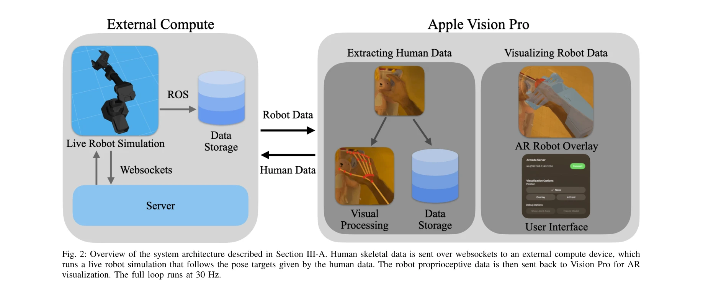

# ARMADA: Augmented Reality for Robot Manipulation and Robot-Free Data Acquisition

> **저자**: Nataliya Nechyporenko, Ryan Hoque, Christopher Webb, Mouli Sivapurapu, Jian Zhang | **날짜**: 2024-12-14 | **URL**: [https://arxiv.org/abs/2412.10631](https://arxiv.org/abs/2412.10631)

---

## Essence

*Fig. 1: Overview. (A) Human demonstrators wearing Apple Vision Pro can*

Apple Vision Pro의 증강현실을 활용하여 물리적 로봇 없이 로봇 조작 데이터를 수집하는 시스템 ARMADA를 제시하고, 실시간 로봇 피드백이 데이터 품질을 획기적으로 향상시킴을 입증했다.

## Motivation

- **Known**: 모방 학습(imitation learning)은 로봇이 복잡한 조작 작업을 학습하는 유망한 방법이나, 전문가 데이터 수집을 위해 물리적 로봇 하드웨어 접근이 필수적이어서 확장성이 제한된다.
- **Gap**: 인간과 로봇의 신체 차이(embodiment gap)로 인해 일반적인 인간 영상 데이터의 재사용이 어려우며, 대규모 로봇 조작 데이터셋의 부재로 기존 방식의 데이터 수집은 하드웨어 가용성에 의해 병목 현상을 겪고 있다.
- **Why**: 인터넷 규모의 대규모 데이터셋이 언어 및 비전 모델의 혁신을 주도했으므로, 로봇 조작 분야도 유사한 규모의 데이터 수집이 가능해진다면 일반화 능력이 획기적으로 향상될 수 있기 때문이다.
- **Approach**: Apple Vision Pro의 고해상도 passthrough 카메라에 로봇의 디지털 트윈을 실시간으로 오버레이하여, 사용자가 자신의 손 동작이 로봇 동작으로 어떻게 변환되는지 직관적으로 이해할 수 있도록 한다.

## Achievement

*Fig. 1: Overview. (A) Human demonstrators wearing Apple Vision Pro can*

- **실시간 AR 피드백의 효과**: 실시간 로봇 피드백으로 수집한 데이터의 물리 로봇 재생 성공률이 1.3%에서 71.1%로 대폭 상향되었다.
- **사용자 친화적 시스템**: 15명의 참가자를 대상으로 한 사용자 연구에서 VR 경험이 없는 사용자도 쉽게 사용 가능함을 입증했고, 3가지 작업에서 총 675개의 로봇 프리 데모를 수집했다.
- **확장성 가능성**: Vision Pro만으로 수천 시간 규모의 조작 데이터 수집이 가능해져, 기존 로봇 원격제어 방식 대비 한 자리 수 이상의 데이터 규모 확대가 예상된다.
- **맨손 상호작용**: 움직임 추적 장갑이나 컨트롤러 없이 맨손만으로 데이터를 수집할 수 있어, 더 자연스럽고 다양한 작업에 적용 가능하다.

## How

*Fig. 2: Overview of the system architecture described in Section III-A. Human skeletal data is sent over websockets to a*

- **시스템 아키텍처**: Vision Pro의 ARKit을 통해 인간 골격 데이터를 추적하고, websocket과 ROS를 통해 외부 compute 장치와 통신하는 30Hz 루프 시스템을 구성한다.
- **손 제어 매핑**: ARKit in visionOS 2.0으로 추적된 손가락과 손목 위치를 로봇 암의 제어 명령으로 변환한다.
- **가상 제약 시각화**: 특이점(singularity), 속도 위반, 작업 공간(workspace) 위반 등 로봇 제약 조건을 실시간으로 계산하고 AR로 시각화하여 사용자가 로봇 한계를 인지하도록 한다.
- **위치 기준 설정**: QR 코드를 통해 테이블 상의 로봇 베이스 위치를 기준으로 설정하고, 각 로봇 링크의 변환 행렬을 순차적으로 렌더링한다.
- **데이터 저장**: egocentric 뷰의 이미지 프레임, 인간 골격 데이터, 로봇의 proprioceptive 데이터(joint angle, velocity, torque)를 모두 기록한다.

## Originality

- **실시간 디지털 트윈의 AR 오버레이**: 기존 AR2-D2 등과 달리 Vision Pro의 egocentric 관점에서 로봇 모션을 실시간으로 피드백하는 방식으로, 직관적 embodiment gap 인지를 가능하게 했다.
- **맨손 데이터 수집**: ARCap 등 기존 방식과 달리 모션 캡처 장갑이나 손목 마운트 없이 완전히 자유로운 맨손 상호작용을 제시했다.
- **물리 로봇 재생 검증**: 수집한 데이터를 직접 물리 로봇에서 재생하여 실제 로봇 호환성을 입증한 점이 새롭다.
- **기존 개인 장치의 활용**: 특수 하드웨어 구성 대신 Vision Pro라는 기존 상용 장치만 필요로 하여 확장성을 극대화했다.

## Limitation & Further Study

- **하드웨어 의존성**: Apple Vision Pro라는 특정 기기에 제한되어 있어 광범위한 채택에 제약이 있을 수 있다.
- **작업 범위의 제한**: 발표된 논문에서 실험한 작업은 3가지 수준이며, 더 복잡하거나 다양한 조작 작업에 대한 일반화 가능성이 명확하지 않다.
- **지연시간 및 동기화**: 실시간 피드백이 30Hz로 운영되는데, 극도로 빠른 조작이나 정밀한 력 제어가 필요한 작업에서의 성능이 미지수다.
- **시뮬레이션-현실 차이**: 가상 로봇 모델과 실제 물리 로봇 간의 동역학 모델링 오류가 누적될 수 있으며, 접촉 역학이 정확히 반영되지 않을 가능성이 있다.
- **후속 연구**: 더 큰 규모의 사용자 연구, 다양한 로봇 플랫폼(Franka, UR5 등)에 대한 호환성 검증, 그리고 수집한 대규모 데이터로 학습한 모델의 성능 평가가 필요하다.

## Evaluation

- Novelty: 4/5
- Technical Soundness: 3/5
- Significance: 4/5
- Clarity: 4/5
- Overall: 4/5

**총평**: 로봇 모방 학습 데이터 수집의 근본적인 확장성 문제를 Apple Vision Pro의 AR 기술로 해결하려는 창의적이고 실용적인 접근이며, 실시간 피드백이 데이터 품질을 획기적으로 향상시킨다는 실증적 결과가 로봇 학습 분야에 의미 있는 기여를 제시한다.

## Related Papers

- 🔄 다른 접근: [[papers/1279_BEHAVIOR_Robot_Suite_Streamlining_Real-World_Whole-Body_Mani/review]] — 로봇 조작 데이터 수집에서 증강현실과 물리적 로봇 텔레오퍼레이션의 다른 접근이다
- 🏛 기반 연구: [[papers/1291_BiGym_A_Demo-Driven_Mobile_Bi-Manual_Manipulation_Benchmark/review]] — 양팔 조작 벤치마크에서 증강현실 기반 데이터 수집 방법론이 기초가 된다
- 🔗 후속 연구: [[papers/1336_DexHub_and_DART_Towards_Internet_Scale_Robot_Data_Collection/review]] — 대규모 로봇 데이터 수집에서 AR 기반 robot-free 방법이 확장 적용된다
- 🧪 응용 사례: [[papers/1372_DROID_A_Large-Scale_In-The-Wild_Robot_Manipulation_Dataset/review]] — 실제 로봇 조작 데이터셋 구축에서 증강현실 기반 수집 방법이 적용된다
- 🔗 후속 연구: [[papers/1291_BiGym_A_Demo-Driven_Mobile_Bi-Manual_Manipulation_Benchmark/review]] — 양팔 이동 조작에서 증강현실 기반 robot-free 데이터 수집이 확장 활용된다
- 🔄 다른 접근: [[papers/1279_BEHAVIOR_Robot_Suite_Streamlining_Real-World_Whole-Body_Mani/review]] — 실세계 전신 조작에서 물리적 로봇과 증강현실 기반 데이터 수집의 다른 방식이다
- 🔄 다른 접근: [[papers/1334_Development_of_an_Intuitive_GUI_for_Non-Expert_Teleoperation/review]] — 비전문가 로봇 조작에서 직관적 GUI와 증강현실의 다른 인터페이스 접근이다
- 🔗 후속 연구: [[papers/1491_iCub3_Avatar_System_Enabling_Remote_Fully-Immersive_Embodime/review]] — 증강현실 기반 로봇 조작과 완전 몰입형 원격 embodiment가 human-robot interaction의 확장된 형태를 제시한다.
- 🔗 후속 연구: [[papers/1598_Open-TeleVision_Teleoperation_with_Immersive_Active_Visual_F/review]] — VR 기반 원격 조종 시스템이 로봇 조작과 피드백을 위한 AR 확장 시스템 ARMADA로 발전할 수 있다.
