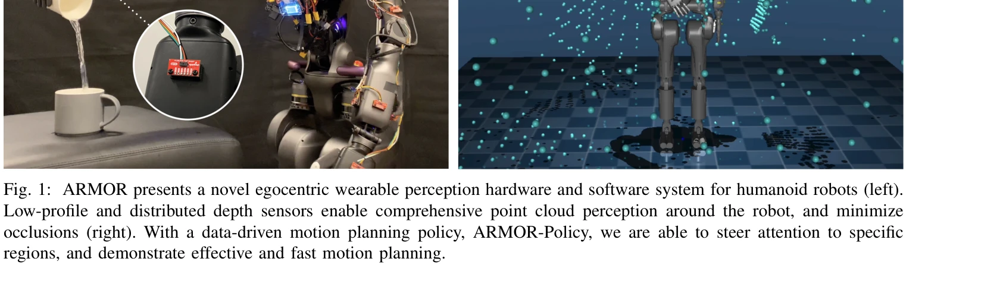

# ARMOR: Egocentric Perception for Humanoid Robot Collision Avoidance and Motion Planning

> **저자**: Daehwa Kim, Mario Srouji, Chen Chen, Jian Zhang | **날짜**: 2024-11-30 | **URL**: [https://arxiv.org/abs/2412.00396](https://arxiv.org/abs/2412.00396)

---

## Essence

*Fig. 1: ARMOR presents a novel egocentric wearable perception hardware and software system for humanoid robots (left).*

휴머노이드 로봇의 충돌 회피 및 동작 계획을 위해 분산형 ToF 라이다 센서 기반 자기중심 인지 시스템(ARMOR)과 transformer 기반 모방학습 정책(ARMOR-Policy)을 제시한다.

## Motivation

- **Known**: 휴머노이드 로봇은 일반적으로 중앙집중식 카메라나 라이다를 헤드 또는 토르소에 장착하여 인지를 수행하며, 샘플링 기반 동작 계획 알고리즘들이 존재한다.
- **Gap**: 기존 헤드 마운트 카메라는 팔과 손의 폐색(occlusion) 문제가 있고, 촉각 센서는 비용이 높아 대규모 통합이 어렵다. 휴머노이드 로봇의 분산형 자기중심 인지 시스템과 이를 활용한 동작 계획에 대한 연구가 부족하다.
- **Why**: 안전한 휴머노이드 로봇 배포를 위해서는 강건한 충돌 회피 능력이 필수적이며, 자기중심 센서는 외부 카메라 의존성을 제거하여 이동 로봇의 활용도를 크게 높일 수 있다.
- **Approach**: 40개의 저전력 VL53L5CX ToF 센서를 GR1 로봇의 팔에 분산 배치하고, AMASS 데이터셋의 인간 동작(86시간, 311,922개)을 자산으로 활용한 transformer 기반 모방학습 정책을 학습한다.

## Achievement

*Fig. 3: ARMOR’s egocentric perception hardware in simu-*

- **인지 성능**: ARMOR 인지가 4개의 헤드/외부 마운트 카메라 대비 63.7% 충돌 감소, 78.7% 성공률 향상
- **정책 효율성**: ARMOR-Policy가 cuRobo 샘플링 기반 계획 대비 31.6% 적은 충돌, 16.9% 높은 성공률, 26배 감소된 계산 지연
- **실제 배포**: Fourier Intelligence GR1 휴머노이드 로봇에 완전히 통합·배포 완료

## How

*Fig. 3: ARMOR’s egocentric perception hardware in simu-*

- VL53L5CX ToF 센서 40개를 전략적으로 양쪽 팔에 배치 (각 20개), 4개 센서 묶음을 XIAO ESP 마이크로컨트롤러로 제어
- I2C 버스를 통해 각 센서 그룹의 데이터를 수집하고 USB로 로봇 온보드 컴퓨터(Jetson Xavier NX)로 전송
- 처리된 센서 데이터를 Linux 머신의 NVIDIA GeForce RTX 4090으로 무선 스트리밍 (15 Hz 운영)
- AMASS 데이터셋의 인간 동작을 Fourier GR1 로봇의 관절에 재타겟팅하여 전문가 궤적 생성
- 생성된 궤적 주변에 폐색 영역을 생성하여 충돌 회피 학습 데이터 구성
- Transformer encoder-decoder 아키텍처 기반 ARMOR-Policy 설계 (세부 내용은 도중 절단)
- 추론 시점 최적화로 다중 궤적 샘플링 수행하여 충돌 회피 성능 강화

## Originality

- 분산형 ToF 라이다 센서 어레이를 활용한 자기중심 인지 시스템 설계가 기존 중앙집중식 RGB-D 카메라와 다름
- 인간 동작 데이터(AMASS)를 기반으로 한 모방학습 정책은 작업 특화 동작이 아닌 일반적인 인간 운동을 학습하여 현실성 강화
- zone-array 기반 ToF 센서를 단순 근접 센서가 아닌 세밀한 장애물 표현에 활용하고 transformer 기반 학습 정책과 결합
- 40개 센서의 분산 입력을 transformer 어텐션 헤드가 동적으로 처리하는 구조의 혁신성

## Limitation & Further Study

- 센서 구성이 특정 로봇(Fourier GR1)에 맞춰 설계되어 다른 휴머노이드로의 직접 이전에 어려움 가능
- VL53L5CX 센서의 8×8 저해상도는 근거리 고정밀 감지에 제약이 있을 수 있음
- 실제 환경에서의 동적 장애물(움직이는 인간 등)에 대한 평가 부족
- 센서 개수(40개) 증가에 따른 전력 소비, 처리 비용, 시스템 복잡도 상승 측면 분석 미흡
- 후속 연구: (1) 다양한 휴머노이드 플랫폼 적응 메커니즘 개발, (2) 동적 장애물 시나리오 확대, (3) 최소 센서 구성 최적화 연구

## Evaluation

- Novelty: 4/5
- Technical Soundness: 4/5
- Significance: 4/5
- Clarity: 4/5
- Overall: 4/5

**총평**: 분산형 자기중심 인지 시스템과 인간 동작 기반 모방학습을 결합한 혁신적 접근으로 휴머노이드 로봇의 충돌 회피 문제를 효과적으로 해결하며, 실제 배포까지 달성한 우수한 연구이다.

## Related Papers

- 🧪 응용 사례: [[papers/1285_Berkeley_Humanoid_A_Research_Platform_for_Learning-based_Con/review]] — Berkeley Humanoid 플랫폼에서 자기중심 인지 기반 충돌 회피 시스템이 적용된다
- 🔗 후속 연구: [[papers/1371_EgoMI_Learning_Active_Vision_and_Whole-Body_Manipulation_fro/review]] — 자기중심 시각 기반 능동 비전과 전신 조작에서 ToF 라이다 인지가 확장된다
- 🔄 다른 접근: [[papers/1560_LookOut_Real-World_Humanoid_Egocentric_Navigation/review]] — 휴머노이드 자기중심 네비게이션에서 ToF 라이다와 일반 시각의 다른 센서 접근이다
- 🏛 기반 연구: [[papers/1590_Omni-Perception_Omnidirectional_Collision_Avoidance_for_Legg/review]] — 다방향 충돌 회피에서 자기중심 ToF 라이다 인지 시스템이 기반이 된다
- 🏛 기반 연구: [[papers/1312_Collision-Free_Humanoid_Traversal_in_Cluttered_Indoor_Scenes/review]] — 충돌 회피를 위한 인지 시스템과 환경 표현의 기본 원리를 제공한다
- 🏛 기반 연구: [[papers/1285_Berkeley_Humanoid_A_Research_Platform_for_Learning-based_Con/review]] — 학습 기반 제어 플랫폼에서 자기중심 인지 기반 충돌 회피가 기초 기능이 된다
- 🧪 응용 사례: [[papers/1340_Dexterous_Safe_Control_for_Humanoids_in_Cluttered_Environmen/review]] — 충돌 회피 인지 시스템에 p-SSA의 섬세한 안전 제어를 적용한다
- 🔗 후속 연구: [[papers/1383_End-to-End_Humanoid_Robot_Safe_and_Comfortable_Locomotion_Po/review]] — ARMOR의 충돌 회피 인식과 end-to-end 안전 정책을 결합하면 더욱 포괄적인 humanoid 안전 시스템을 구축할 수 있다.
- 🔄 다른 접근: [[papers/1560_SARA-RT_Scaling_up_Robotics_Transformers_with_Self-Adaptive/review]] — 휴머노이드 로봇의 충돌 회피를 위한 지각 시스템으로 이고센트릭 네비게이션의 실용적 응용 분야를 제시한다.
- 🏛 기반 연구: [[papers/1590_Toward_General-Purpose_Robots_via_Foundation_Models_A_Survey/review]] — 휴머노이드 충돌 회피를 위한 이고센트릭 인식의 기반이 되는 충돌 감지 시스템을 제공한다.
