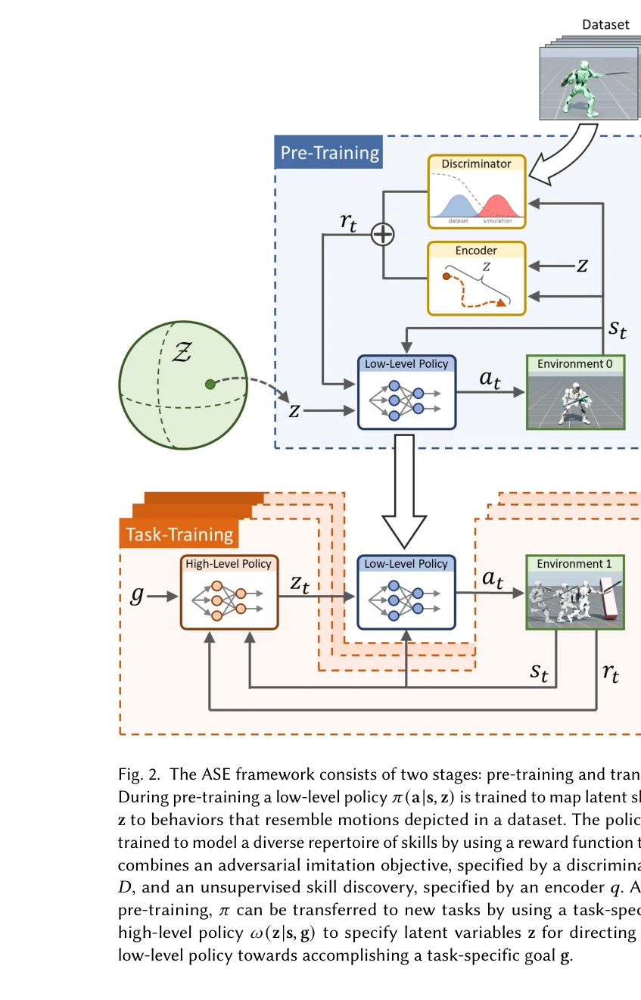
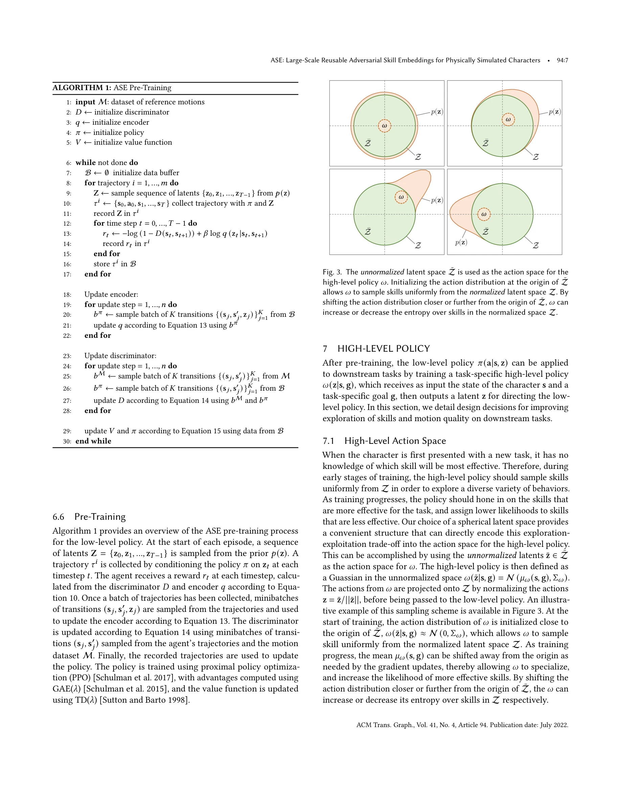

# ASE: Large-Scale Reusable Adversarial Skill Embeddings for Physically Simulated Characters

> **저자**: Xue Bin Peng, Yunrong Guo, Lina Halper, Sergey Levine, Sanja Fidler | **날짜**: 2022-05-04 | **URL**: [https://arxiv.org/abs/2205.01906](https://arxiv.org/abs/2205.01906)

---

## Essence

*Fig. 1. Our framework enables physically simulated characters to learn versatile and reusable skill embeddings from larg*

물리 시뮬레이션 캐릭터를 위해 비정형 모션 데이터셋으로부터 재사용 가능한 기술 임베딩을 학습하는 대규모 데이터 기반 프레임워크를 제시하며, adversarial imitation learning과 unsupervised reinforcement learning을 결합하여 다양한 다운스트림 태스크에 적용 가능한 생명감 있는 행동을 생성한다.

## Motivation

- **Known**: 물리 기반 캐릭터 애니메이션에서는 일반적으로 각 태스크마다 제어 정책을 처음부터 학습하며, 자연스러운 행동을 생성하기 위해 목적함수 설계에 많은 엔지니어링 노력이 필요하다. 최근 데이터 기반 방법들이 모션 추적과 adversarial motion priors를 통해 대규모 비정형 모션 데이터셋을 활용하기 시작했다.
- **Gap**: 기존 방법들은 특정 모션 클립을 정확히 추적하거나 명시적 모션 선택이 필요하여 복잡한 태스크 구성에 어려움이 있으며, 대규모 데이터셋에서 다양하고 재사용 가능한 기술을 효과적으로 학습하는 확장 가능한 프레임워크가 부족하다.
- **Why**: 인간은 오랜 학습을 통해 축적한 다양한 기술들을 새로운 태스크에 재사용하는데, 에이전트도 이러한 능력을 갖추면 처음부터 학습하기 어려운 복잡한 태스크를 해결할 수 있으며, 이는 컴퓨터 비전과 NLP 분야의 대규모 사전학습 모델의 성공으로부터 영감을 받을 수 있다.
- **Approach**: 비정형 모션 클립 데이터셋으로부터 저수준 잠재변수 모델을 정보 최대화 목적함수를 통해 학습하여 다양한 기술을 발견하고, 이를 고수준 정책의 추상적 행동 공간으로 정의하여 새로운 태스크에 전이한다.

## Achievement

*Fig. 2. The ASE framework consists of two stages: pre-training and transfer.*

- **확장 가능한 학습**: Isaac Gym의 대규모 병렬 GPU 시뮬레이터를 활용하여 10년 이상의 시뮬레이션 경험으로 기술 임베딩을 사전학습할 수 있다.
- **다양한 기술 획득**: 정보 최대화 목적함수를 통해 단일 사전학습된 모델에서 100개 이상의 비정형 모션 클립으로부터 다양한 기술을 학습한다.
- **강건한 회복 전략**: 임의의 초기 상태에서 복구 전략을 사전학습하여 외부 방해에 대한 강건한 대응이 가능하다.
- **효과적인 전이**: 단일 사전학습 모델이 다양한 다운스트림 태스크에 효과적으로 적용되며, 보상함수만으로 복잡하고 자연스러운 행동 전략을 자동 생성한다.

## How

*Fig. 3. The unnormalized latent space ¯Z is used as the action space for the*

- **2단계 프레임워크**: 비정형 모션 데이터셋으로부터의 사전학습 단계와 새로운 태스크를 위한 전이 단계로 구성
- **정보 최대화 목적함수**: 잠재변수 모델이 다양한 행동들을 발견하도록 유도하여 기술 다양성 증진
- **Adversarial imitation learning**: 판별기를 통해 생성된 행동이 모션 데이터셋의 특성을 따르도록 학습
- **Unsupervised RL**: 태스크 특정적 보상 없이 기술 임베딩의 다양성과 일관성을 학습
- **임의 초기 상태 학습**: 강건한 복구 전략을 발전시키기 위해 다양한 초기 상태에서 학습
- **잠재 공간 정규화**: 정규화되지 않은 잠재 공간을 행동 공간으로 사용하여 효율적인 제어 표현 제공

## Originality

- 기존 adversarial motion priors를 확장하여 정보 최대화를 통한 기술 다양성 발견이라는 새로운 목적함수 도입
- 대규모 병렬 GPU 시뮬레이터를 활용한 장기간 사전학습으로 이전에 가능하지 않던 규모의 학습 실현
- 비정형 모션 데이터셋에서 정확한 추적 없이 행동적 특성을 학습하는 암묵적 모션 임베딩 방식의 제안
- 임의 초기 상태 복구 학습을 통해 추가 알고리즘 오버헤드 없이 건강한 회복 전략을 통합하는 방법론

## Limitation & Further Study

- 사전학습에 필요한 고품질 모션 캡처 데이터의 수집과 처리 비용이 높다.
- GPU 기반 병렬 시뮬레이터에 대한 의존성으로 인해 다양한 환경이나 시뮬레이터에서의 적용이 제한될 수 있다.
- 학습된 기술이 모션 데이터셋의 도메인에 의존적일 수 있으며, 데이터셋에 없는 새로운 행동 유형으로의 외삽이 어려울 수 있다.
- 다운스트림 태스크의 복잡도가 매우 높거나 현저히 다른 물리적 제약이 있을 때 전이 성능이 저하될 수 있다.
- 향후 연구로는 도메인 간 전이, 더 효율적인 사전학습 방법, 그리고 실제 로봇에서의 sim-to-real 전이 가능성 탐색이 필요하다.

## Evaluation

- Novelty: 4/5
- Technical Soundness: 4/5
- Significance: 4/5
- Clarity: 4/5
- Overall: 4/5

**총평**: 본 논문은 대규모 데이터와 병렬 시뮬레이션을 활용하여 재사용 가능한 기술 임베딩 학습이라는 중요한 문제를 해결하며, adversarial learning과 정보 이론을 결합한 혁신적 접근법과 실질적인 scalability를 통해 물리 기반 캐릭터 애니메이션 분야에 상당한 기여를 한다.

## Related Papers

- 🏛 기반 연구: [[papers/1267_AMP_Adversarial_Motion_Priors_for_Stylized_Physics-Based_Cha/review]] — adversarial motion prior를 통한 물리 기반 캐릭터 제어의 핵심 기법을 제공한다
- 🔗 후속 연구: [[papers/1330_CLAM_Continuous_Latent_Action_Models_for_Robot_Learning_from/review]] — physics-based 동작 모방을 더 깊은 강화학습으로 발전시킨 연구다
- 🔄 다른 접근: [[papers/1565_MaskedMimic_Unified_Physics-Based_Character_Control_Through/review]] — masked learning을 통해 physics-based character control을 다른 방식으로 접근한다
- 🔗 후속 연구: [[papers/1266_AMOR_Adaptive_Character_Control_through_Multi-Objective_Rein/review]] — adversarial skill embedding을 다중 목표 최적화와 결합하여 더 풍부한 캐릭터 행동 제어를 가능하게 한다
- 🔗 후속 연구: [[papers/1267_AMP_Adversarial_Motion_Priors_for_Stylized_Physics-Based_Cha/review]] — adversarial motion prior를 대규모 skill embedding으로 확장하여 더 다양한 행동을 학습할 수 있게 한다
- 🔗 후속 연구: [[papers/1346_Diffusion_Forcing_for_Multi-Agent_Interaction_Sequence_Model/review]] — adversarial learning을 multi-agent 상황으로 확장한 sequence modeling이다
- 🔄 다른 접근: [[papers/1330_DeepMimic_Example-Guided_Deep_Reinforcement_Learning_of_Phys/review]] — physics-based character control에서 각각 example-guided learning과 adversarial skill embedding이라는 다른 접근법을 제시한다
- 🏛 기반 연구: [[papers/1386_Example-based_Motion_Synthesis_via_Generative_Motion_Matchin/review]] — physics-based motion generation의 기본 프레임워크를 제공한다
- 🏛 기반 연구: [[papers/1444_Hierarchical_Planning_and_Control_for_Box_Loco-Manipulation/review]] — ASE의 대규모 재사용 가능한 adversarial skill embedding이 계층적 loco-manipulation 제어의 기반이 된다.
- 🔗 후속 연구: [[papers/1538_Learning_Symmetric_and_Low-energy_Locomotion/review]] — ASE의 adversarial skill embedding을 바탕으로 대칭성과 저에너지라는 특정 제약을 추가한 보행 학습을 수행한다.
- 🔗 후속 연구: [[papers/1564_MaskedManipulator_Versatile_Whole-Body_Manipulation/review]] — ASE의 adversarial skill embedding 개념을 전신 조작이라는 더 복잡한 과제에서의 다양한 행동 생성으로 확장한다.
