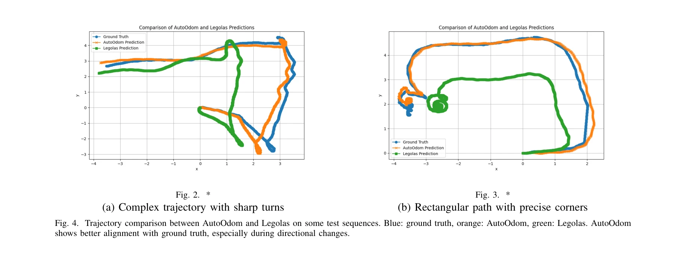

# AutoOdom: Learning Auto-regressive Proprioceptive Odometry for Legged Locomotion

> **저자**: Changsheng Luo, Yushi Wang, Wenhan Cai, Mingguo Zhao | **날짜**: 2025-11-24 | **URL**: [https://arxiv.org/abs/2511.18857](https://arxiv.org/abs/2511.18857)

---

## Essence

*Fig. 1. Overview of the AutoOdom system.*

AutoOdom은 두 단계 학습 패러다임을 통해 다리 로봇의 자동회귀 고유감각 주행거리측정을 수행하며, 대규모 시뮬레이션 데이터로 비선형 동역학을 학습한 후 제한된 실제 데이터로 sim-to-real 갭을 해소한다.

## Motivation

- **Known**: 기존 EKF 기반 필터링 방식은 누적 표류와 모델링 불확실성에 시달리고, 순수 학습 방식은 대규모 실제 데이터 수집과 sim-to-real 전이 문제를 겪는다.
- **Gap**: GPS 거부 및 시각적으로 저하된 환경에서 로봇의 정확한 자동회귀 고유감각 주행거리측정이 필요하지만, 기존 방법들은 동역학 모델링, 데이터 효율성, 실제 환경 적응 사이의 균형을 맞추지 못하고 있다.
- **Why**: 다리 로봇이 점프, 급회전 등 역동적인 움직임에서 시각적 주행거리측정 실패에 대응하고, 신속한 접지 상태 변화와 센서 노이즈에 견뎌야 하기 때문에 견고한 고유감각 기반 내비게이션이 필수적이다.
- **Approach**: Stage 1에서 large-scale 시뮬레이션 데이터로 비선형 동역학과 접지 상태를 학습하고, Stage 2에서 자동회귀 강화 메커니즘으로 제한된 실제 데이터를 이용해 센서 노이즈 복원력과 동역학 환경 견고성을 향상시킨다.

## Achievement

*Fig. 4. Trajectory comparison between AutoOdom and Legolas on some test sequences. Blue: ground truth, orange: AutoOdom,*

- **성능 개선**: Legolas 기준선 대비 절대 궤적 오차 57.2%, Umeyama 정렬 오차 59.2%, 상대 포즈 오차 36.2% 개선
- **두 단계 학습 패러다임**: 시뮬레이션 사전학습 후 실제 데이터로의 자동회귀 강화를 통한 효율적인 sim-to-real 갭 해소
- **자동회귀 훈련 메커니즘**: 모델의 자체 예측 학습을 통해 센서 노이즈 내성 및 역동 환경 견고성 향상
- **체계적 설계 검증**: 센서 모달리티 선택 및 시간 모델링에 대한 포괄적 절제 연구로 고유감각 주행거리측정 설계 원칙 도출

## How

*Fig. 1. Overview of the AutoOdom system.*

- 입력 관찰 Ot는 IMU 가속도, 명령 속도/각속도, 관절 각도·각속도, 회전 행렬, 접지점 변위 등 다중 모달 고유감각 데이터 포함
- Stage 1: Booster Gym 시뮬레이션 환경에서 대규모 데이터로 복잡한 비선형 동역학 및 빠르게 변하는 접지 상태 학습
- Stage 2: 제한된 실제 데이터로 자동회귀 강화(모델이 자체 예측으로부터 학습)을 통해 실제 환경 적응 및 노이즈 견고성 개선
- 포즈 변화와 해당 분산을 연속 프레임 간 예측하여 완전한 주행거리측정 추정치 제공
- 절제 연구를 통해 센서 선택(예: IMU 가속도 데이터의 효과) 및 시간 모델링 구조 최적화

## Originality

- 시뮬레이션 사전학습과 실제 자동회귀 강화를 결합한 새로운 두 단계 훈련 패러다임으로 기존 hybrid 접근법의 분석 모듈 종속성 극복
- 자동회귀 훈련 메커니즘으로 모델의 자체 예측 학습을 통해 센서 노이즈 복원력을 직접적으로 강화하는 혁신적 접근
- 순수 학습 방식의 대규모 실제 데이터 수집 요구를 제한된 실제 데이터로 축소하면서도 sim-to-real 갭 해소
- Booster T1 humanoid 로봇의 실제 동역학 환경에서 검증된 실무적 효과성과 재현 가능성 확보

## Limitation & Further Study

- Booster T1 단일 플랫폼에서만 검증되어, 다른 다리 로봇(사족보행, 이족보행 변형 등) 일반화 가능성 불명확
- Stage 2 실제 데이터 수집 규모(정확한 데이터셋 크기 미기재)와 수렴 조건이 충분히 기술되지 않아 재현 난이도 존재
- 자동회귀 메커니즘이 극도로 역동적인 환경(암석 지대, 극한 불규칙 지형)에서의 성능 한계 미검토
- 후속 연구: (1) 다양한 다리 로봇 플랫폼으로 일반화 검증, (2) 온라인 적응 학습 메커니즘 도입으로 배포 후 성능 개선, (3) 불확실성 정량화 강화로 안전성 마진 확보

## Evaluation

- Novelty: 4/5
- Technical Soundness: 3/5
- Significance: 4/5
- Clarity: 4/5
- Overall: 4/5

**총평**: AutoOdom은 sim-to-real 갭 해소와 센서 노이즈 견고성을 혁신적인 두 단계 자동회귀 훈련으로 달성하여, 다리 로봇의 고유감각 주행거리측정 분야에서 의미 있는 진전을 보여준다. 단일 플랫폼 검증의 한계와 실제 데이터 수집 상세 기술 부재는 있으나, 실무 성능과 철저한 절제 연구로 높은 신뢰도를 유지한다.

## Related Papers

- 🔗 후속 연구: [[papers/1316_Contact-Aided_Invariant_Extended_Kalman_Filtering_for_Robot/review]] — 접촉 기반 상태 추정을 자동회귀 학습으로 확장하여 더 정확한 주행거리측정을 달성한다
- 🔄 다른 접근: [[papers/1495_InEKFormer_A_Hybrid_State_Estimator_for_Humanoid_Robots/review]] — 순수 고유감각 기반 주행거리측정 대신 하이브리드 상태 추정 방법을 제시한다
- 🏛 기반 연구: [[papers/1551_Legged_Robot_State-Estimation_Through_Combined_Forward_Kinem/review]] — 다리 로봇의 상태 추정에서 운동학과 센서 융합의 기본 원리를 제공한다
- 🏛 기반 연구: [[papers/1316_Contact-Aided_Invariant_Extended_Kalman_Filtering_for_Robot/review]] — 자동회귀 주행거리측정에 접촉 기반 상태 추정의 InEKF 이론을 활용한다
- 🔄 다른 접근: [[papers/1459_HuMam_Humanoid_Motion_Control_via_End-to-End_Deep_Reinforcem/review]] — 두 논문 모두 proprioceptive information을 활용하지만, HuMam은 Mamba 인코더에, AutoOdom은 auto-regressive odometry에 초점을 둔다.
- 🔗 후속 연구: [[papers/1551_Legged_Robot_State-Estimation_Through_Combined_Forward_Kinem/review]] — AutoOdom의 자기회귀적 고유감각 측정법을 forward kinematic과 contact factor로 보완한 더욱 견고한 상태 추정 시스템으로 발전시킨 형태임
