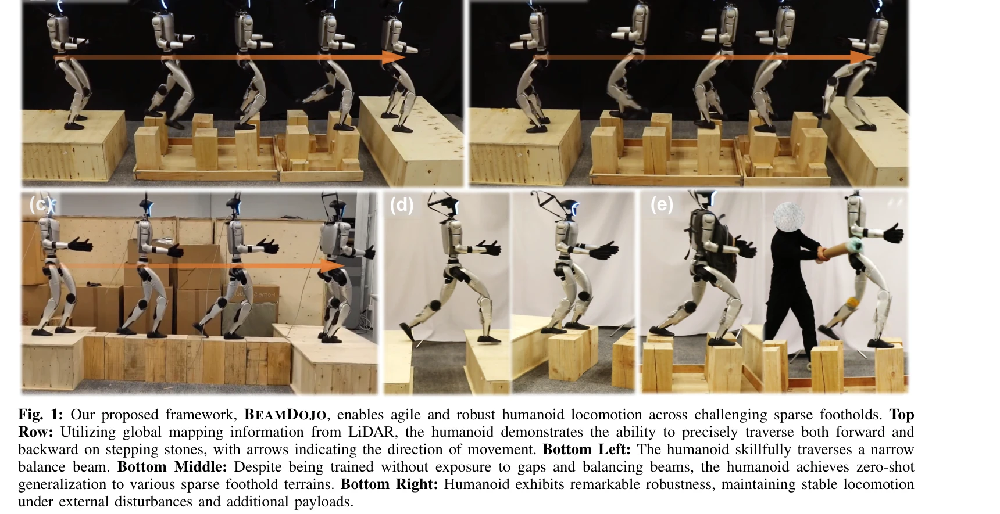
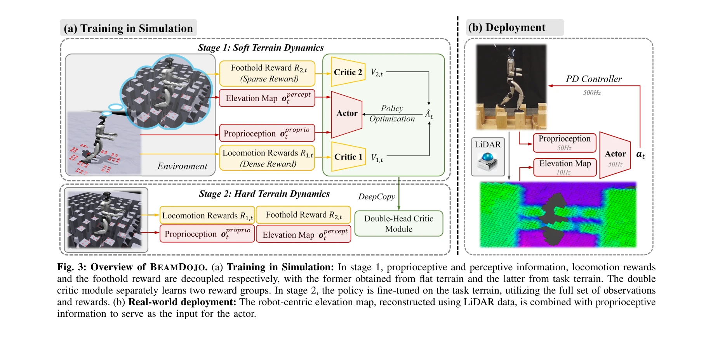

# BeamDojo: Learning Agile Humanoid Locomotion on Sparse Footholds

> **저자**: Huayi Wang, Zirui Wang, Junli Ren, Qingwei Ben, Tao Huang, Weinan Zhang, Jiangmiao Pang | **날짜**: 2025-02-14 | **URL**: [https://arxiv.org/abs/2502.10363](https://arxiv.org/abs/2502.10363)

---

## Essence

*Fig. 1: Our proposed framework, BEAMDOJO, enables agile and robust humanoid locomotion across challenging sparse foothol*

BeamDojo는 인간형 로봇이 sparse foothold 위에서 민첩하게 이동할 수 있도록 하는 reinforcement learning 프레임워크로, 다각형 발 모델에 맞춘 sampling-based foothold reward와 two-stage 학습 방식을 제안한다.

## Motivation

- **Known**: Quadrupedal 로봇은 point-shaped feet를 이용한 sparse foothold 이동이 기존 연구로 잘 해결되었으나, humanoid 로봇의 polygonal feet에 대한 foothold reward 설계와 안정적인 학습이 미흡하다.
- **Gap**: 기존 RL 기반 방법들은 sparse foothold reward 신호로 인한 비효율적 학습과 early termination 문제를 해결하지 못했으며, humanoid 로봇의 polygonal feet에 적합한 foothold reward 설계가 부재했다.
- **Why**: Humanoid 로봇이 stepping stones, balance beams 같은 위험한 terrain을 안전하고 민첩하게 통과할 수 있다면 실제 재난 구조, 건설 현장 등 다양한 응용 분야에서 큰 가치를 제공할 수 있다.
- **Approach**: Sampling-based foothold reward와 double critic 구조를 통해 dense locomotion reward와 sparse foothold reward의 학습 균형을 맞추고, flat terrain에서의 first stage와 actual task terrain에서의 second stage로 구성된 two-stage RL 접근법을 제시한다.

## Achievement

*Fig. 1: Our proposed framework, BEAMDOJO, enables agile and robust humanoid locomotion across challenging sparse foothol*

- **Sampling-based foothold reward**: Polygonal foot model을 위해 발 아래 n개 점을 샘플링하여 safe region 내 contact 정도를 평가하는 새로운 reward 함수 설계
- **Double critic architecture**: Dense locomotion reward와 sparse foothold reward를 분리된 critic으로 학습하여 reward conflict 완화
- **Two-stage RL framework**: Stage 1에서 flat terrain + task-terrain percept 학습으로 exploration 촉진, Stage 2에서 actual terrain fine-tuning으로 효율적 학습 달성
- **LiDAR-based elevation map**: Robot-centric 센서 활용으로 실제 배포 가능성 확보 및 forward/backward 양방향 이동 지원
- **High sim-to-real transfer**: 80% 수준의 zero-shot sim-to-real 성공률 달성 및 external disturbance에 강건한 동작

## How

*Fig. 3: Overview of BEAMDOJO. (a) Training in Simulation: In stage 1, proprioceptive and perceptive information, locomot*

- 발 아래 n개 점을 sampling하고 각 점의 global terrain height를 확인하여 safe region 내 contact points 계산
- PPO 기반 RL 알고리즘에 foothold reward와 locomotion reward를 결합한 multi-objective 최적화
- Double critic 구조로 두 reward 신호의 scale과 영향력을 독립적으로 관리하여 학습 안정성 향상
- Stage 1: Flat terrain에서 task-terrain aware observation(LiDAR-based elevation map) 제공하며 foothold penalty만 부여 (episode 종료 없음)
- Stage 2: Actual task terrain에서 learned policy를 fine-tune하며 real dynamics 적응
- Simulation에서 terrain texture, friction, robot morphology 등에 대한 domain randomization 적용
- Unitree G1 humanoid에 onboard LiDAR 장착하여 real-time elevation map 생성 및 policy 실행

## Originality

- Humanoid의 polygonal feet를 위한 최초의 sampling-based foothold reward 함수 제안
- Sparse reward 학습 효율성 향상을 위한 double critic 아키텍처의 novel 적용
- Terrain dynamics relaxation과 task-terrain percept을 결합한 two-stage RL 방식이 기존 sim-to-real 두 단계 방식과 차별화됨
- LiDAR 기반 elevation map을 perception module로 활용하여 depth camera의 한계(narrow FOV, backward movement 제약) 극복
- Fine-grained foothold control을 위한 end-to-end learning 방식으로 model-based hybrid 방법의 computational complexity 해결

## Limitation & Further Study

- 실험이 단일 humanoid 플랫폼(Unitree G1)에만 수행되어 다른 humanoid 아키텍처에 대한 일반화 검증 부족
- Two-stage 학습 파이프라인의 hyperparameter(stage 1 training 기간, flat terrain 난이도) 선택 기준이 명확하지 않음
- Zero-shot transfer 성공률 80%이므로 20%의 실패 케이스 분석 및 개선 방안 미제시
- LiDAR 센서의 측정 오류(noise, reflectance 변화)가 극단적 환경에서 미치는 영향 분석 부재
- Humanoid의 고차 자유도와 불안정한 동역학을 고려한 reward shaping 설계 근거 및 ablation study 상세도 부족
- 후속 연구로 multiple foothold types(cables, slopes), dynamic obstacles, human-robot interaction 등으로 확장 필요

## Evaluation

- Novelty: 4/5
- Technical Soundness: 3/5
- Significance: 4/5
- Clarity: 4/5
- Overall: 4/5

**총평**: BeamDojo는 humanoid 로봇의 sparse foothold 이동이라는 도전적 문제에 대해 polygonal feet 맞춤형 reward와 효율적 two-stage 학습을 통해 처음으로 실용적 해결책을 제시했으며, 높은 sim-to-real 성공률과 real-world 실험을 통해 기술적 기여도가 뛰어나다.

## Related Papers

- 🔄 다른 접근: [[papers/1270_APEX_Learning_Adaptive_High-Platform_Traversal_for_Humanoid/review]] — sparse foothold에서의 민첩한 이동과 고플랫폼 순회에 대한 서로 다른 전문화된 접근 방식이다
- 🔗 후속 연구: [[papers/1329_Deep_Whole-body_Parkour/review]] — sparse foothold 이동을 전신 parkour로 확장하여 더 복잡한 동작을 수행한다
- 🏛 기반 연구: [[papers/1475_Humanoid_Whole-Body_Locomotion_on_Narrow_Terrain_via_Dynamic/review]] — 좁은 지형에서의 동적 균형과 발판 계획의 기본 원리를 제공한다
- 🔄 다른 접근: [[papers/1270_APEX_Learning_Adaptive_High-Platform_Traversal_for_Humanoid/review]] — 고플랫폼 순회와 sparse foothold 이동에 대한 서로 다른 전문화된 접근 방식을 제시한다
- 🏛 기반 연구: [[papers/1329_Deep_Whole-body_Parkour/review]] — 복잡한 parkour 동작에 sparse foothold 이동의 발판 계획 원리를 적용한다
- 🧪 응용 사례: [[papers/1463_LOVON_Legged_Open-Vocabulary_Object_Navigator/review]] — 희박한 지지면에서의 민첩한 휴머노이드 로코모션 기술이 legged 로봇의 복잡한 환경 네비게이션에 적용됩니다.
- 🔄 다른 접근: [[papers/1520_Learning_Bipedal_Locomotion_on_Gear-Driven_Humanoid_Robot_Us/review]] — 두 논문 모두 제한된 센서 환경에서의 이족 보행을 다루지만, IMU 기반 vs sparse foothold 환경이라는 서로 다른 도전 과제에 집중함
