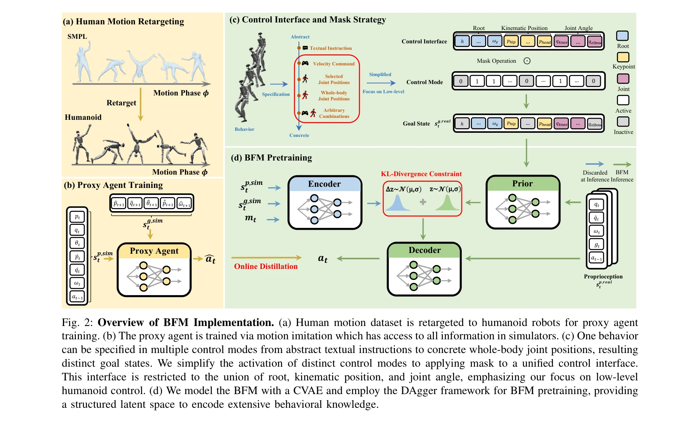
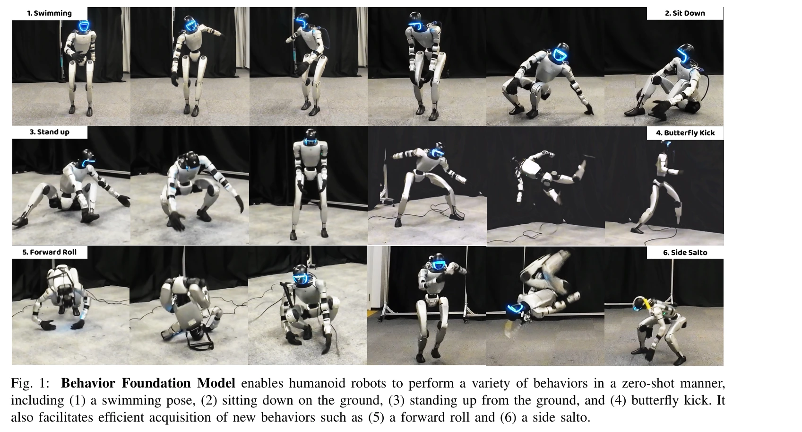

# Behavior Foundation Model for Humanoid Robots

> **저자**: Weishuai Zeng, Shunlin Lu, Kangning Yin, Xiaojie Niu, Minyue Dai, Jingbo Wang, Jiangmiao Pang | **날짜**: 2025-09-17 | **DOI**: [10.48550/arXiv.2509.13780](https://doi.org/10.48550/arXiv.2509.13780)

---

## Essence

*Fig. 2: Overview of BFM Implementation. (a) Human motion dataset is retargeted to humanoid robots for proxy agent*

본 논문은 인간형 로봇의 전신 제어(WBC)를 위해 다양한 제어 모드를 통일하는 Behavior Foundation Model (BFM)을 제안하며, masked online distillation과 CVAE를 결합하여 대규모 행동 데이터셋에서 재사용 가능한 행동 지식을 학습한다.

## Motivation

- **Known**: 인간형 로봇의 WBC 시스템은 보행, 텔레오퍼레이션, 모션 추적 등 다양한 응용을 가능하게 했으나, 기존 프레임워크는 과제별로 특화되어 있고 보상 엔지니어링에 의존하여 과제 간 일반화 능력이 제한적이다.
- **Gap**: 기존 WBC 시스템은 속도 명령, VR 신호, 참조 모션 등 서로 다른 제어 모드별로 설계되어 있어 크로스태스크 일반화가 불가능하며, 임의의 제어 모드에 대응하고 복잡한 실제 환경에 배포되기 어렵다.
- **Why**: 통일된 행동 학습 패러다임을 통해 다양한 제어 모드를 하나의 프레임워크로 처리할 수 있으면 일반적인 인간형 로봇 제어의 기초 모델을 구축할 수 있으며, 새로운 행동 학습 시 처음부터 학습할 필요가 없어 효율성이 크게 향상된다.
- **Approach**: 다양한 과제의 공통 목표가 적절한 행동 생성이라는 관찰에 기초하여, motion imitation으로 시뮬레이션에서 프록시 에이전트를 학습하고, masked online distillation 프레임워크와 CVAE를 결합하여 BFM을 사전학습한다.

## Achievement

*Fig. 1: Behavior Foundation Model enables humanoid robots to perform a variety of behaviors in a zero-shot manner,*

- **통일된 행동 학습 패러다임**: 과제 특화 학습에서 통합 행동 학습으로 전환하여 인간형 로봇 제어의 새로운 설계 원칙을 제시
- **유연한 제어 인터페이스**: masked strategy를 통해 추상적 텍스트 명령부터 구체적 전신 조인트 위치까지 임의의 제어 모드를 지원
- **효율적 행동 학습**: residual learning을 통해 새로운 행동을 처음부터 학습하지 않고 빠르게 습득 가능
- **구조화된 잠재 공간**: CVAE의 잠재 공간으로 행동 합성(behavior composition)과 조절(modulation)을 가능하게 함
- **실세계 검증**: 시뮬레이션과 실제 인간형 로봇 플랫폼에서 다양한 WBC 과제에 걸쳐 강건한 일반화 능력을 실증

## How

*Fig. 2: Overview of BFM Implementation. (a) Human motion dataset is retargeted to humanoid robots for proxy agent*

- SMPL 인간 모션 데이터셋을 인간형 로봇에 retarget하여 다양한 행동 데이터 수집
- 프록시 에이전트를 motion imitation 목표로 PPO를 사용하여 시뮬레이션에서 학습
- masked online distillation 프레임워크로 프록시 에이전트의 지식을 온라인으로 증류
- CVAE 아키텍처로 행동 분포를 모델링하고 KL-divergence 제약을 통해 구조화된 잠재 공간 학습
- 다양한 제어 모드를 root 운동학 위치와 조인트 각도의 합집합에 mask를 적용하여 통일
- 사전학습된 BFM에서 residual learning으로 새로운 행동 빠르게 습득

## Originality

- 기존 HOVER와 달리 두 단계 mask 전략 대신 직접 sparsity mask를 적용하여 임의의 제어 모드 지원
- MaskedMimic과 달리 실제 인간형 로봇에 적용하고 CVAE 잠재 공간의 성질을 행동 합성/조절 관점에서 분석
- 행동을 제어 모드로부터 명시적으로 분리하는 개념적 틀을 제시하여 WBC 설계의 통일된 관점 제공
- 온라인 증류와 CVAE 결합으로 대규모 행동 데이터셋 학습 시 안정성과 표현력 동시 확보

## Limitation & Further Study

- 시뮬레이션-실제 로봇 간 도메인 갭 해결 메커니즘이 명시적으로 설명되지 않음
- 대규모 행동 데이터셋의 구체적 규모, 구성, 수집 방법에 대한 상세 정보 부족
- CVAE 선택의 정당성과 다른 생성 모델(diffusion model, transformer 등)과의 비교 실험 부재
- 실제 로봇 실험이 제한된 행동 세트(수영, 앉기, 서기, 나비 발차기, 앞구르기, 옆 살토)에만 국한
- 정량적 평가 지표(성공률, 추적 오차, 에너지 효율 등)가 충분히 제시되지 않음
- 후속 연구: 자연어 지시와의 통합, 더 복잡한 조작 과제로의 확장, 실시간 적응 학습 능력 개선

## Evaluation

- Novelty: 4/5
- Technical Soundness: 3/5
- Significance: 4/5
- Clarity: 4/5
- Overall: 4/5

**총평**: 본 논문은 인간형 로봇의 WBC를 행동 생성 관점에서 통일하는 창의적 아이디어와 masked online distillation + CVAE의 적절한 기술 조합으로 실제 로봇에서 다양한 과제의 일반화를 보여주며, 기초 모델 기반 로봇 제어의 중요한 진전을 제시한다. 다만 기술적 깊이, 정량적 평가, 도메인 갭 해결 방안 등에서 개선의 여지가 있다.

## Related Papers

- 🏛 기반 연구: [[papers/1247_A_Survey_of_Behavior_Foundation_Model_Next-Generation_Whole-/review]] — 인간형 로봇을 위한 행동 기초 모델의 포괄적 조사로 BFM의 이론적 토대를 제공한다
- 🔄 다른 접근: [[papers/1288_3D_Diffusion_Policy_Generalizable_Visuomotor_Policy_Learning/review]] — BFM-Zero는 프롬프트 기반 접근법으로 masked distillation과는 다른 방식의 행동 기초 모델을 구현한다
- 🔗 후속 연구: [[papers/1412_GR00T_N1_An_Open_Foundation_Model_for_Generalist_Humanoid_Ro/review]] — GR00T N1은 BFM의 개념을 일반화하여 더 광범위한 인간형 로봇 기초 모델로 확장한다
- 🧪 응용 사례: [[papers/1247_A_Survey_of_Behavior_Foundation_Model_Next-Generation_Whole-/review]] — 행동 기초 모델의 이론적 틀을 휴머노이드 로봇의 실제 행동 제어에 적용하는 구체적 사례를 보여준다
- 🔄 다른 접근: [[papers/1492_Neural_Brain_A_Neuroscience-inspired_Framework_for_Embodied/review]] — Embodied agent를 위한 신경과학 영감 프레임워크와 행동 foundation model의 서로 다른 접근 방식을 보여준다.
