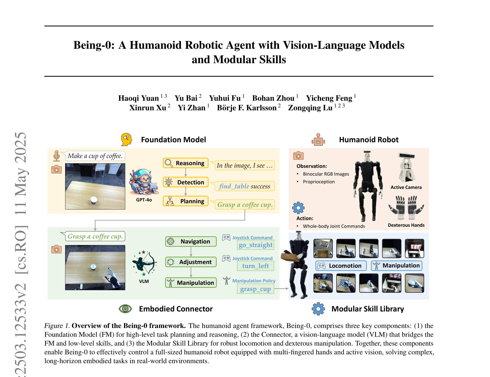
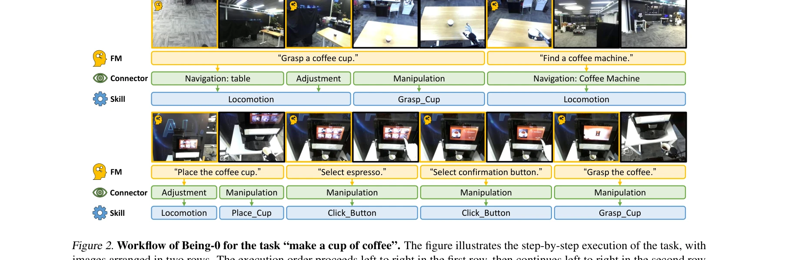

# Being-0: A Humanoid Robotic Agent with Vision-Language Models and Modular Skills

> **저자**: Haoqi Yuan, Yu Bai, Yuhui Fu, Bohan Zhou, Yicheng Feng, Xinrun Xu, Yi Zhan, Börje F. Karlsson, Zongqing Lu | **날짜**: 2025-03-16 | **URL**: [https://arxiv.org/abs/2503.12533](https://arxiv.org/abs/2503.12533)

---

## Essence

*Figure 1. Overview of the Being-0 framework. The humanoid agent framework, Being-0, comprises three key components: (1) *

Being-0는 Foundation Model과 modular skill library를 계층적으로 통합한 humanoid robot agent로, Vision-Language Model 기반의 Connector 모듈을 통해 고수준 계획을 저수준 기술로 변환하여 장시간의 복합 작업을 수행한다.

## Motivation

- **Known**: Foundation Model은 고수준 인지 작업에 우수하고, 개별 robotic skill들이 발전했지만, 두 계층을 직접 결합하면 장시간 작업에서 누적 오류와 모듈 지연으로 인해 강건성이 떨어진다.
- **Gap**: Humanoid robot의 특성상 bipedal locomotion의 불안정성과 FM의 낮은 inference 효율, 부족한 embodied scene 이해로 인해 navigation과 manipulation 간 전환이 비효율적이다.
- **Why**: Humanoid robot이 인간 수준의 성능으로 현실 환경에서 복잡한 작업을 자율적으로 수행할 수 있다면 로봇 연구의 궁극적 목표 달성에 크게 기여할 수 있다.
- **Approach**: VLM 기반 Connector를 FM과 skill library 사이에 배치하여 언어 계획을 실시간 실행 명령으로 변환하고, 온보드 디바이스에 배포 가능하도록 설계하여 효율성을 극대화했다.

## Achievement

*Figure 2. Workflow of Being-0 for the task “make a cup of coffee”. The figure illustrates the step-by-step execution of *

- **장시간 작업 성공률**: 복잡한 long-horizon 작업에서 평균 84.4% 완료율 달성
- **효율성 향상**: FM 기반 agent 대비 4.2배 빠른 navigation 속도
- **자율 에이전트 구현**: 41-DoF humanoid robot으로 dexterous manipulation과 active vision을 활용한 완전 자율 작업 수행
- **실시간 성능**: 모든 컴포넌트(FM 제외)를 저비용 온보드 연산 디바이스에 배포 가능

## How

*Figure 1. Overview of the Being-0 framework. The humanoid agent framework, Being-0, comprises three key components: (1) *

- Foundation Model: GPT-4o를 이용한 고수준 태스크 계획, 추론, 지시 이해
- Connector (VLM): first-person navigation 이미지, 언어 지시, 객체 라벨, bounding box로 학습하여 embodied knowledge 증류
- Modular Skill Library: teleopertion과 imitation learning으로 습득한 robust locomotion skill (joystick 명령 기반)과 manipulation skill (언어 기술 포함)
- Active Vision System: 2-DoF neck의 binocular RGB camera로 동적 환경 인식
- Adjustment Mechanism: navigation과 manipulation 간 seamless 연결을 위해 locomotion 명령으로 로봇 pose 조정

## Originality

- **Connector 모듈의 신규 제안**: FM과 skill library 간의 간극을 메우기 위해 경량 VLM 기반 중간층 도입으로 실시간 responsiveness 확보
- **Humanoid 특화 설계**: bipedal 불안정성을 고려한 locomotion adjustment 메커니즘 개발
- **효율적 배포 전략**: FM은 클라우드, 나머지는 온보드 배포로 latency 최소화
- **통합적 자율 에이전트**: 기존 arm/wheeled robot 기반 연구를 humanoid robot으로 확장하며 dexterous hand와 active vision 통합

## Limitation & Further Study

- **실험 환경의 제한**: 대규모 실내 환경에서만 평가되었으며 실외 환경이나 극단적 환경에서의 성능 미검증
- **Skill library 확장성**: 현재 skill set이 제한적이며 새로운 manipulation task 습득에 추가 학습 필요
- **FM 의존성**: GPT-4o는 여전히 클라우드 기반이어야 하며 오프라인 환경에서의 작동 불가
- **Connector 일반화**: VLM-based Connector가 training data의 navigation scenario에만 최적화되어 있어 다른 환경에서의 일반화 성능 의문
- **후속 연구 방향**: (1) 보다 다양한 실제 환경에서의 평가, (2) 온디바이스 경량 FM 개발, (3) 강화학습을 통한 skill 자동 습득, (4) multi-robot 협업 시나리오 확대

## Evaluation

- Novelty: 4/5
- Technical Soundness: 3/5
- Significance: 4/5
- Clarity: 4/5
- Overall: 4/5

**총평**: Being-0는 humanoid robot의 자율 에이전트화라는 중요한 문제를 Connector라는 우아한 중간층으로 해결하며, 실제 로봇 실험을 통해 84.4% 성공률을 달성한 의미 있는 연구다. 다만 실험 환경의 제한성과 일부 기술적 의존성(클라우드 FM)이 있으나, humanoid robot 분야의 자율성 연구에 중요한 기여를 한다.

## Related Papers

- 🔗 후속 연구: [[papers/1422_Hi_Robot_Open-Ended_Instruction_Following_with_Hierarchical/review]] — Hi Robot은 Being-0의 계층적 구조를 확장하여 열린 지시사항 따르기를 구현한다
- 🔄 다른 접근: [[papers/1329_CityNavAgent_Aerial_Vision-and-Language_Navigation_with_Hier/review]] — CityNavAgent는 드론 환경에서 유사한 계층적 의미 계획을 사용하지만 다른 구현체를 활용한다
- 🏛 기반 연구: [[papers/1553_RoBridge_A_Hierarchical_Architecture_Bridging_Cognition_and/review]] — RoBridge는 Being-0와 유사한 인지와 제어를 연결하는 계층적 아키텍처의 이론적 기반을 제공한다
- 🔄 다른 접근: [[papers/1329_CityNavAgent_Aerial_Vision-and-Language_Navigation_with_Hier/review]] — Being-0는 CityNavAgent와 유사한 계층적 구조를 가지지만 인간형 로봇을 위한 지상 환경에 특화되어 있다
