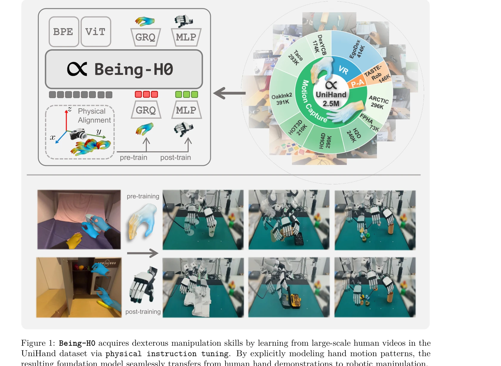

# Being-H0: Vision-Language-Action Pretraining from Large-Scale Human Videos

> **저자**: Hao Luo, Yicheng Feng, Wanpeng Zhang, Sipeng Zheng, Ye Wang, Haoqi Yuan, Jiazheng Liu, Chaoyi Xu, Qin Jin, Zongqing Lu | **날짜**: 2025-07-21 | **URL**: [https://arxiv.org/abs/2507.15597](https://arxiv.org/abs/2507.15597)

---

## Essence

*Figure 1: Being-H0 acquires dexterous manipulation skills by learning from large-scale human videos in the*

Being-H0는 대규모 인간 비디오에서 학습한 Vision-Language-Action 모델로, 손 동작의 명시적 모델링을 통해 섬세한 로봇 조작을 위한 기초 모델을 제시한다.

## Motivation

- **Known**: Vision-Language-Action (VLA) 모델들은 텔레오퍼레이션 데이터의 부족과 합성 데이터의 sim-to-real 갭으로 인해 복잡한 조작 작업에서 낮은 성능을 보인다. 대규모 다중모달 모델의 instruction tuning이 성공적이었다.
- **Gap**: 기존 VLA는 인간 영상의 대규모 데이터를 활용하지 못하고 있으며, 텍스트/2D 시각 입력과 3D 액션 공간 사이의 이질성이 존재한다. 명시적 인간 중심 표현 학습은 규모가 제한적이다.
- **Why**: 인간의 손은 섬세한 조작의 금표준이며 웹 규모의 데이터 활용으로 로봇 손 제어의 데이터 부족 문제를 해결할 수 있다. 이는 embodied AI의 'ChatGPT 모멘트'를 가능하게 할 수 있다.
- **Approach**: Physical Instruction Tuning이라는 새로운 패러다임을 제안하여 인간 영상 사전학습, 물리 공간 정렬, 로봇 작업 적응을 통합한다. Part-level motion tokenization으로 밀리미터 수준의 정확도를 달성한다.

## Achievement

*Figure 1: Being-H0 acquires dexterous manipulation skills by learning from large-scale human videos in the*

- **Physical Instruction Tuning 패러다임**: 인간의 손을 기초 조작자로 설정하고 비전, 언어, 모션 간 교차 모달 추론을 통합한 새로운 학습 방식
- **Part-level Motion Tokenization**: grouped residual quantization (GRQ) 기반으로 연속 손 동작을 이산 토큰으로 변환하면서 밀리미터 수준 정확도 보존
- **UniHand 대규모 데이터셋**: 모션 캡처, VR, RGB-only 영상을 통합한 1억 5천만개 이상의 instruction-following 샘플 수집
- **Being-H0 모델**: 대규모 인간 영상 기반 첫 섬세한 VLA로, 손 동작 생성, instruction following, 실제 로봇 조작에서 우수한 성능 입증

## How

*Figure 3: Physical Instruction Tuning. Our training paradigm bridges human video datasets and robotic*

- Shared attention mechanism을 가진 unified autoregressive 아키텍처로 vision, language, motion 통합
- 이질성 높은 다양한 카메라 시스템과 기록 조건의 데이터를 물리 공간 정렬을 통해 통일
- Part-level motion tokenization으로 손가락 좌표를 grouped residual quantization 기반 토큰으로 양자화
- Motion capture, VR, RGB-only 데이터를 통합하는 확장 가능한 데이터 큐레이션 파이프라인 구축
- 사전학습 후 로봇 특화 post-training으로 형태 차이를 고려한 기술 이전

## Originality

- 대규모 인간 영상에서 명시적 동작 모델링을 통한 VLA 학습은 처음 시도 (기존은 암시적 학습 방식)
- Physical instruction tuning은 LMM의 visual instruction tuning을 물리 도메인으로 확장한 새로운 패러다임
- Part-level motion tokenization은 손 동작의 미세한 제어 정보를 언어 모델 호환 토큰으로 변환하는 혁신적 방법
- 인간 손을 '기초 조작자'로 설정하고 로봇 손으로의 이전을 명시적으로 설계한 접근

## Limitation & Further Study

- 실제 로봇 조작에서의 성과가 초기 단계이며, 다양한 로봇 형태에 대한 일반화 검증 필요
- UniHand 데이터셋의 구체적인 레이블링 품질과 정확성에 대한 상세 분석 부족
- Part-level motion tokenization의 밀리미터 수준 정확도가 모든 로봇 작업에서 필수인지 미검증
- 시뮬레이션과 실제 환경 간 여전히 존재할 수 있는 갭에 대한 논의 부족
- 후속 연구로 더 다양한 로봇 형태(humanoid, 4-legged 등)에 대한 적응 성능 평가 필요
- 다양한 문화권과 환경의 인간 동작 편향성 분석 필요

## Evaluation

- Novelty: 4/5
- Technical Soundness: 4/5
- Significance: 4/5
- Clarity: 4/5
- Overall: 4/5

**총평**: Being-H0는 대규모 인간 영상 학습과 명시적 동작 모델링을 통해 로봇 조작의 새로운 방향을 제시하는 혁신적 연구다. 특히 Physical Instruction Tuning과 UniHand 데이터셋은 embodied AI 분야의 중요한 기여를 이루며, 향후 로봇 학습의 데이터 병목 해소에 큰 영향을 미칠 것으로 예상된다.

## Related Papers

- 🔄 다른 접근: [[papers/1237_Ψ_0_An_Open_Foundation_Model_Towards_Universal_Humanoid_Loco/review]] — 둘 다 대규모 인간 비디오에서 humanoid 기초 모델을 학습하지만 Being-H0는 손 동작 명시적 모델링을, Ψ0는 flow-based expert를 강조한다.
- 🏛 기반 연구: [[papers/1372_EgoMimic_Scaling_Imitation_Learning_via_Egocentric_Video/review]] — EgoMimic의 egocentric 비디오 스케일링 기법이 Being-H0의 대규모 인간 비디오 활용 방법론의 기반을 제공한다.
- 🔗 후속 연구: [[papers/1376_EmbodMocap_In-the-Wild_4D_Human-Scene_Reconstruction_for_Emb/review]] — EgoScale의 다양한 egocentric 조작 데이터가 Being-H0의 손 동작 모델링을 더 정교하게 발전시킬 수 있다.
- 🏛 기반 연구: [[papers/1282_Being-M05_A_Real-Time_Controllable_Vision-Language-Motion_Mo/review]] — 대규모 vision-language-action 데이터를 활용한 사전훈련의 기반이 되는 연구다
- 🔄 다른 접근: [[papers/1237_Ψ_0_An_Open_Foundation_Model_Towards_Universal_Humanoid_Loco/review]] — 둘 다 대규모 egocentric 비디오에서 humanoid 기초 모델을 학습하지만 Ψ0는 flow-based expert를, Being-H0는 손 동작 모델링을 강조한다.
- 🔗 후속 연구: [[papers/1350_Do_You_Have_Freestyle_Expressive_Humanoid_Locomotion_via_Aud/review]] — vision-language-action을 audio modality로 확장한 multimodal 접근이다
- 🏛 기반 연구: [[papers/1356_DreamGen_Unlocking_Generalization_in_Robot_Learning_through/review]] — Being-H0의 대규모 vision-language-action 사전학습이 DexGraspVLA의 foundation model 기반을 제공한다.
- 🏛 기반 연구: [[papers/1512_PaLM-E_An_Embodied_Multimodal_Language_Model/review]] — Being-H0의 대규모 비전-언어-액션 사전학습이 PaLM-E의 멀티모달 언어 모델 통합 방법론의 기초를 제공한다.
- 🧪 응용 사례: [[papers/1608_Vision-Language-Action_VLA_Models_Concepts_Progress_Applicat/review]] — Being-H0의 대규모 pretraining 접근이 VLA 모델들의 실제 구현 사례로 1608 리뷰에서 다룬 개념들을 실증
- 🧪 응용 사례: [[papers/1611_Visual_Instruction_Tuning/review]] — Being-H0가 LLaVA의 vision-language 이해 능력을 humanoid 로봇 제어에 적용한 구체적 사례를 보여준다
- 🏛 기반 연구: [[papers/1422_GENMO_A_GENeralist_Model_for_Human_MOtion/review]] — vision-language-action 사전훈련의 기본 방법론을 human motion에 적용한다
- 🏛 기반 연구: [[papers/1431_Guided_Motion_Diffusion_for_Controllable_Human_Motion_Synthe/review]] — Vision-Language-Action 사전훈련이 텍스트 조건부 모션 생성의 이론적 기반을 제공함
- 🏛 기반 연구: [[papers/1530_Learning_Humanoid_Navigation_from_Human_Data/review]] — 대규모 인간 데이터를 활용한 vision-language-action 사전학습의 이론적 배경이 EgoNav의 인간 보행 데이터 기반 학습에 직접적으로 적용됨
- 🏛 기반 연구: [[papers/1569_MetaWorld-X_Hierarchical_World_Modeling_via_VLM-Orchestrated/review]] — VLM 기반 행동 계획의 대규모 사전학습 방법론을 제공하여 MetaWorld-X의 VLM 오케스트레이션 접근법과 유사한 기반을 제공합니다.
- 🔗 후속 연구: [[papers/1318_Being-H05_Scaling_Human-Centric_Robot_Learning_for_Cross-Emb/review]] — Being-H0는 Being-H0.5의 전신인 대규모 사전학습 Vision-Language-Action 모델이다
- 🔄 다른 접근: [[papers/1410_GR-3_Technical_Report/review]] — GR-3와 Being-H0 모두 대규모 vision-language-action 모델이지만, 일반화 중심 vs 실시간 제어 중심이라는 서로 다른 초점을 가진다
- 🏛 기반 연구: [[papers/1412_GR00T_N1_An_Open_Foundation_Model_for_Generalist_Humanoid_Ro/review]] — Being-H0의 large-scale human video pretraining이 GR00T N1의 heterogeneous data mixture 학습에 방법론적 기반을 제공한다.
