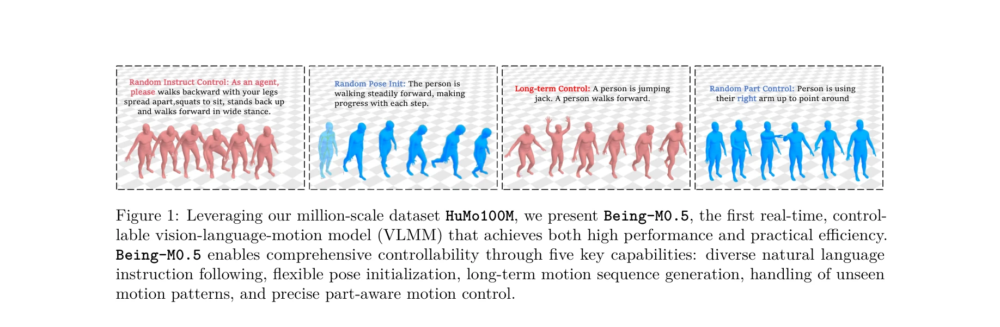
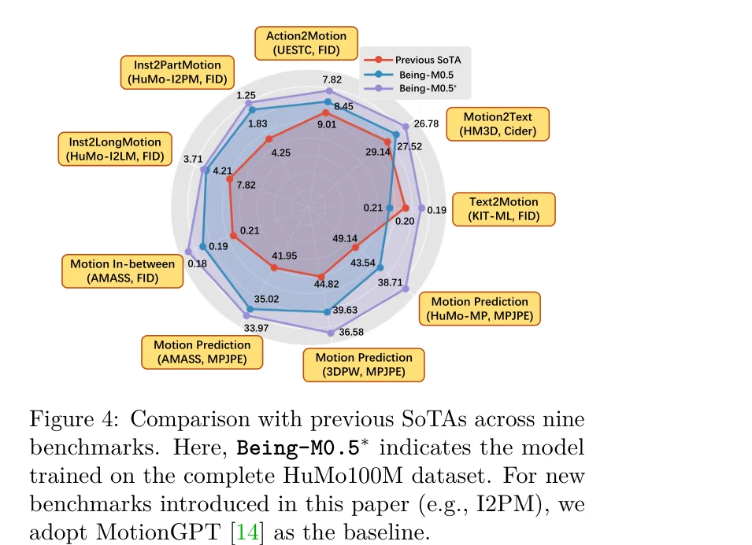
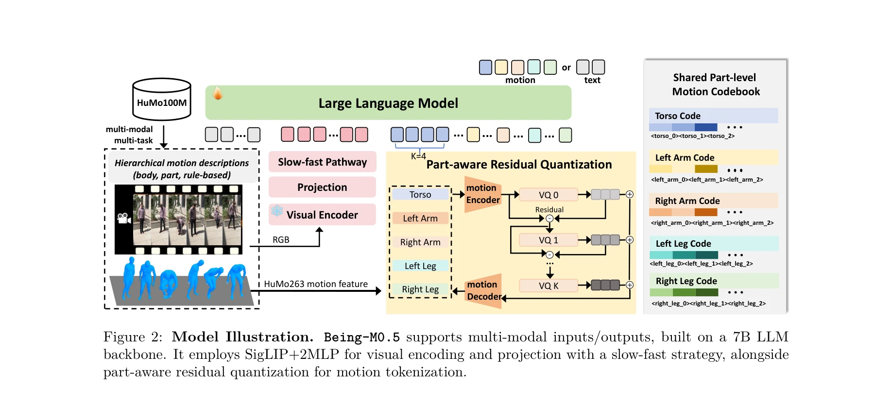

# Being-M0.5: A Real-Time Controllable Vision-Language-Motion Model

> **저자**: Bin Cao, Sipeng Zheng, Ye Wang, Lujie Xia, Qianshan Wei, Qin Jin, Jing Liu, Zongqing Lu | **날짜**: 2025-08-11 | **URL**: [https://arxiv.org/abs/2508.07863](https://arxiv.org/abs/2508.07863)

---

## Essence

*Figure 1: Leveraging our million-scale dataset HuMo100M, we present Being-M0.5, the first real-time, control-*

Being-M0.5는 HuMo100M 데이터셋을 기반으로 한 최초의 실시간 제어 가능한 vision-language-motion 모델로, part-aware residual quantization 기법을 통해 개별 신체 부위에 대한 세밀한 제어를 가능하게 한다.

## Motivation

- **Known**: 기존 vision-language-motion 모델들은 다양한 사용자 명령 대응, pose 초기화, 장기 시퀀스 생성, 미지의 시나리오 처리, 신체 부위별 제어 등에서 제한이 있다. 최근 LLM을 통합한 MotionGPT, MotionChain 등의 접근법이 제시되었다.
- **Gap**: 기존 연구들은 motion generation의 controllability와 real-time 성능 간의 균형을 제대로 달성하지 못했으며, 대규모 고품질 motion 데이터셋의 부족과 part-level 제어 능력의 부재가 주요 문제다.
- **Why**: motion generation은 게임, 영화, 휴머노이드 로봇 등 실제 응용 분야에서 변혁적 잠재력을 가지고 있으며, 실시간 성능과 세밀한 제어 능력의 확보는 실제 배포를 위해 필수적이다.
- **Approach**: HuMo100M이라는 500만 개 이상의 motion 시퀀스와 1억 개의 multi-task 지시 인스턴스로 구성된 대규모 데이터셋을 구축하고, part-aware residual quantization 기법을 통해 신체 부위별 독립적인 제어를 가능하게 한다.

## Achievement

*Figure 4: Comparison with previous SoTAs across nine*

- **HuMo100M 데이터셋**: 5백만 개의 motion 시퀀스, 100만 개의 multi-task 지시 인스턴스, part-level 주석, 장기 motion 시퀀스, text-aligned visual clips을 포함한 최대 규모의 multimodal motion 데이셋 구축
- **Real-time 제어 가능 모델**: 다양한 command 대응, 임의의 pose 초기화, 장기 motion 생성, unseen scenario 처리, part-level 제어 등 5가지 핵심 제어 능력을 동시에 달성
- **Part-aware residual quantization**: 신체를 anatomically meaningful joint grouping으로 분해하여 각 부위에 대한 discrete part-level code 생성, frame-by-frame 효율적 decoding 실현
- **성능 및 효율성**: 다양한 motion benchmark에서 기존 SoTA 모델 대비 우수한 성능, 여러 GPU에서의 real-time 추론 속도 달성

## How

*Figure 2: Model Illustration. Being-M0.5 supports multi-modal inputs/outputs, built on a 7B LLM*

- Visual encoder로 multimodal input 처리 및 feature projection을 통해 LLM 표현 공간으로 매핑
- Part-aware residual quantization (PRQ)을 사용하여 전신 motion feature를 torso, right_arm, left_arm, right_leg, left_leg 등 part-level로 분해
- 각 part별로 독립적인 discrete code sequence 생성, 이를 통해 frame-by-frame motion code 효율적 decoding 구현
- Multi-modal multi-task 학습 패러다임 적용으로 다양한 task와 제어 신호에 대한 일반화 능력 확보
- Motion concatenation 방법을 통해 짧은 개별 motion을 spatiotemporally 일관된 장기 시퀀스로 통합
- Visual-textual context alignment을 통한 weak supervision 활용으로 인터넷 수집 데이터의 부분적 품질 문제 완화

## Originality

- **최초의 실시간 제어 VLMM**: 성능과 computational efficiency 간의 trade-off를 체계적으로 분석하고 해결한 첫 시도
- **Part-aware residual quantization**: RQ의 iterative refinement와 anatomical joint grouping을 결합한 novel tokenization 기법으로, 기존의 단순 segment 분할(상/하체) 대비 훨씬 세밀한 제어 가능
- **HuMo100M의 3가지 혁신**: part-level description, long-form motion sequence, text-aligned visual clips 조합으로 기존 dataset의 critical gap 해결
- **포괄적 controllability 정의**: diverse command, pose initialization, long-term generation, unseen scenario, part-level control을 통합한 체계적인 제어 능력 프레임워크 제시

## Limitation & Further Study

- Motion capture 기반의 고품질 데이터 비율이 5%에 불과하고 나머지는 비디오 추출 기반이므로, 데이터 질 편차로 인한 성능 편차 가능성
- Part-level control의 평가 benchmark가 제한적이며, 실제 사용자 연구를 통한 제어 정확도 검증 부재
- Real-time 추론 성능이 GPU 종류에 따라 상당한 차이를 보이며, 모바일/엣지 디바이스에서의 최적화 미흡
- 후속연구는 hand gesture, facial expression 등 세분화된 부위 제어 확장, cross-dataset generalization 강화, interactive real-time editing 기능 추가를 고려할 수 있음

## Evaluation

- Novelty: 4/5
- Technical Soundness: 4/5
- Significance: 4/5
- Clarity: 4/5
- Overall: 4/5

**총평**: Being-M0.5는 대규모 고품질 dataset과 part-aware 기법을 결합하여 motion generation의 제어성과 실시간 성능이라는 이전의 미해결 문제를 동시에 해결했으며, 상세한 설계 분석과 함께 실제 응용으로의 확장 가능성을 명확히 보여주는 의미 있는 연구다.

## Related Papers

- 🏛 기반 연구: [[papers/1281_Being-H0_Vision-Language-Action_Pretraining_from_Large-Scale/review]] — 대규모 vision-language-action 데이터를 활용한 사전훈련의 기반이 되는 연구다
- 🔄 다른 접근: [[papers/1421_Genie_Sim_30__A_High-Fidelity_Comprehensive_Simulation_Platf/review]] — 실시간 vision-language-action 모델링을 다른 아키텍처로 구현한 접근법이다
- 🔗 후속 연구: [[papers/1510_KungfuBot2_Learning_Versatile_Motion_Skills_for_Humanoid_Who/review]] — vision-language-action 모델을 오픈소스로 확장한 일반화된 버전이다
