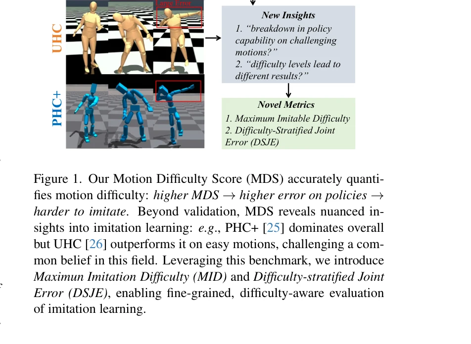
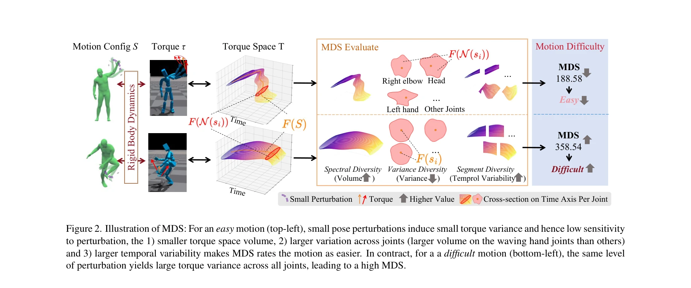

# Benchmarking Humanoid Imitation Learning with Motion Difficulty

> **저자**: Zhaorui Meng, Lu Yin, Xinrui Chen, Anjun Chen, Shihui Guo, Yipeng Qin | **날짜**: 2025-12-08 | **URL**: [https://arxiv.org/abs/2512.07248](https://arxiv.org/abs/2512.07248)

---

## Essence

*Figure 1. Our Motion Difficulty Score (MDS) accurately quanti-*

본 논문은 휴머노이드 모션 모방 학습에서 정책 성능과 모션 난이도를 분리하기 위해 Motion Difficulty Score (MDS)라는 새로운 메트릭을 제안하며, 강체 역학에 기반하여 자세 섭동으로 인한 토크 변화를 통해 모션의 내재적 난이도를 정량화한다.

## Motivation

- **Known**: Physics-based 모션 모방 학습은 humanoid 제어의 핵심이며, UHC, PHC 등의 정책이 대규모 AMASS 데이터셋에서 높은 성공률을 달성했다. 그러나 기존 평가 메트릭(예: joint position error)은 정책의 모방 능력만 측정하고 모션 자체의 난이도는 반영하지 않는다.
- **Gap**: 현재 평가 메트릭이 정책 성능과 모션 난이도를 혼동하여, 실패가 학습 부족인지 내재적으로 어려운 모션인지 구분할 수 없다. 모션의 '모방 난이도'에 대한 명시적인 정의와 정량화 방법이 부재하다.
- **Why**: 모션 난이도를 명확히 정의하고 정량화하면 정책의 진정한 능력을 평가할 수 있으며, 정책 훈련 가이드, 모션 최적화, 물리 기반 모션 복원 등 새로운 연구 방향을 열 수 있다.
- **Approach**: Rigid-body dynamics 관점에서 작은 자세 섭동이 야기하는 토크 변화의 크기, 분산, 시간적 가변성을 통해 모션 난이도를 정의하고, 이를 세 가지 성분(Spectral Diversity, Variance Diversity, Segment Diversity)으로 구성된 MDS로 계산한다.

## Achievement

*Figure 1. Our Motion Difficulty Score (MDS) accurately quanti-*

- **Motion Difficulty Score (MDS) 정의**: Rigid-body dynamics에 기반한 모션 난이도의 첫 번째 명시적 정의를 제시하며, 이를 세 가지 보완적 성분으로 정량화
- **MD-AMASS 데이터셋 구성**: AMASS 데이터셋의 첫 번째 난이도 인식형 재분할을 통해 체계적인 난이도별 평가 가능
- **MDS의 설명력 검증**: 상태-기술 수준의 모션 모방 정책들(PHC+, UHC, GT)의 성능 추세를 MDS로 설명할 수 있음을 실증적으로 입증
- **새로운 파생 메트릭**: Maximum Imitable Difficulty (MID)와 Difficulty-Stratified Joint Error (DSJE)를 도입하여 난이도 인식형 세밀한 평가 가능
- **새로운 통찰**: PHC+가 전체적으로 우수하지만 UHC가 쉬운 모션에서 더 좋은 성능을 보인다는 기존 신념을 도전하는 새로운 발견

## How

*Figure 2. Illustration of MDS: For an easy motion (top-left), small pose perturbations induce small torque variance and *

- 자세 섭동 인근(bounded pose error neighborhood)에서 유도되는 토크 변화의 특성을 분석: 체적, 분산, 시간적 가변성
- Spectral Diversity: 토크 공간의 고유 스펙트럼 다양성을 측정
- Variance Diversity: 섭동-토크 관계의 분산을 계산
- Segment Diversity: 시간 구간별 난이도 변화의 가변성 정량화
- 세 성분을 집계하여 최종 MDS 점수 도출
- MD-AMASS: 계산된 MDS 점수에 따라 AMASS 데이터셋을 난이도별로 재분할
- 상태-기술 수준 정책들(PHC+, UHC, GT)의 성능 추세와 MDS의 상관관계 검증

## Originality

- Rigid-body dynamics에 기반한 모션 난이도의 첫 번째 형식적 정의로, 기존의 의미론적 분류(춤, 보행 등)와는 다른 새로운 관점 제시
- 자세 섭동-토크 변화 관계를 통해 reward landscape의 평탄성을 물리적으로 모델링하는 창의적 접근
- MDS의 세 가지 보완적 성분(Spectral, Variance, Segment Diversity)의 조합은 모션의 다양한 난이도 측면을 포괄적으로 포착
- 기존 AMASS 데이터셋의 첫 번째 난이도 기반 재분할을 통해 벤치마크 패러다임 혁신
- MID와 DSJE 같은 파생 메트릭으로 정책 평가의 세밀성 향상

## Limitation & Further Study

- MDS는 rigid-body dynamics에 기반하므로 시뮬레이션 환경에서의 유효성은 검증되었으나, 실제 로봇 제어로의 전이 가능성 미검토
- 자세 섭동의 경계(bounded error neighborhood)의 크기 설정이 임의적일 수 있으며, 이에 대한 민감도 분석 부족
- 세 가지 성분(Spectral, Variance, Segment Diversity)의 가중치 조합이 휴리스틱한 면이 있어, 최적 가중치에 대한 이론적 근거 부재
- 현재 평가는 PHC+, UHC, GT 세 정책에만 한정되어, 다양한 정책 아키텍처에 대한 일반화 검증 필요
- MD-AMASS 재분할이 모션 모방 외 다른 작업(예: 모션 생성, 애니메이션)에 대한 유용성 미검토
- 후속 연구로 MDS를 활용한 adaptive 훈련 전략 개발, 난이도 기반 정책 설계, 실제 로봇 시스템으로의 전이 검증 필요

## Evaluation

- Novelty: 4/5
- Technical Soundness: 3/5
- Significance: 4/5
- Clarity: 4/5
- Overall: 4/5

**총평**: 본 논문은 물리 기반 모션 모방 학습에서 정책 성능과 모션 난이도를 분리하는 중요한 갭을 해결하며, Rigid-body dynamics에 기반한 창의적이고 형식적인 MDS 정의를 제시한다. 실증적 검증을 통해 MDS의 설명력을 입증하고 MD-AMASS와 함께 새로운 벤치마크 패러다임을 제공하는 높은 기여도의 연구이다.

## Related Papers

- 🔗 후속 연구: [[papers/1284_Benchmarking_Potential_Based_Rewards_for_Learning_Humanoid_L/review]] — 보상 설계 벤치마킹에 모션 난이도라는 새로운 평가 차원을 추가한다
- 🏛 기반 연구: [[papers/1322_Cost-Matching_Model_Predictive_Control_for_Efficient_Reinfor/review]] — 관찰 공간 변화 벤치마킹에서 모션 난이도 정량화 방법론을 활용할 수 있다
- 🧪 응용 사례: [[papers/1330_CLAM_Continuous_Latent_Action_Models_for_Robot_Learning_from/review]] — DeepMimic 기반 모션 모방에서 MDS를 통한 난이도 평가를 적용한다
- 🏛 기반 연구: [[papers/1284_Benchmarking_Potential_Based_Rewards_for_Learning_Humanoid_L/review]] — 모션 난이도 벤치마킹에서 보상 설계의 이론적 기반을 제공한다
- 🔗 후속 연구: [[papers/1322_Cost-Matching_Model_Predictive_Control_for_Efficient_Reinfor/review]] — 관찰 공간 변화 문제에 비용 매칭 MPC의 효율적 학습 방법론을 적용한다
- 🔗 후속 연구: [[papers/1394_FARM_Frame-Accelerated_Augmentation_and_Residual_Mixture-of-/review]] — humanoid imitation learning의 어려운 동작 처리를 전문가 혼합으로 해결한다
- 🔗 후속 연구: [[papers/1534_Learning_Sim-to-Real_Humanoid_Locomotion_in_15_Minutes/review]] — 인간형 로봇 모션 학습의 벤치마킹 연구를 바탕으로 실제 15분 내 학습이 가능한 구체적 솔루션을 제시한다.
