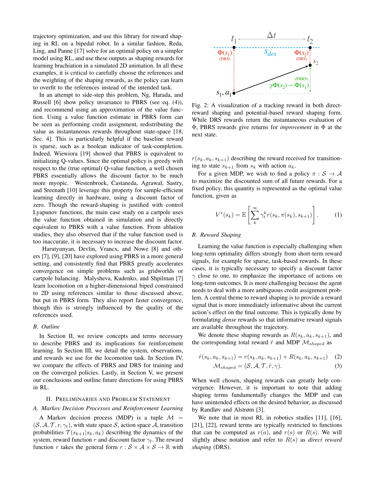
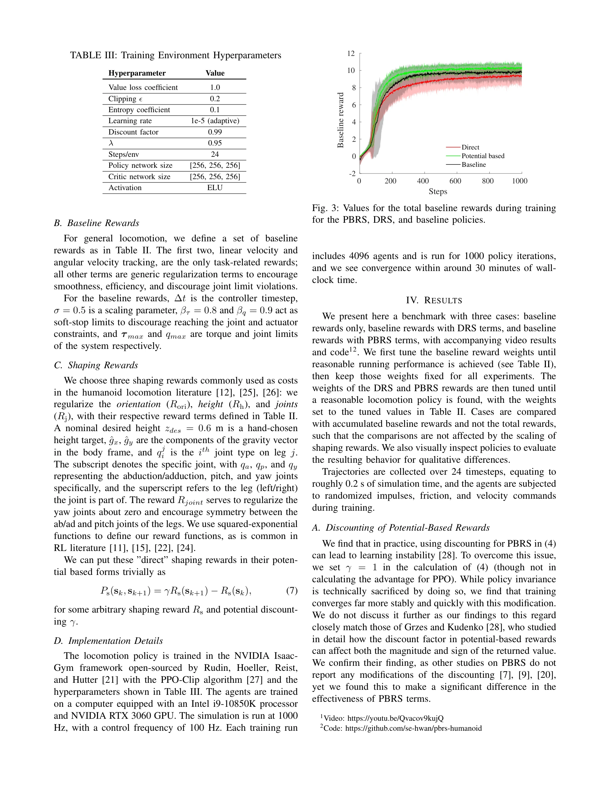

# Benchmarking Potential Based Rewards for Learning Humanoid Locomotion

> **저자**: Se Hwan Jeon, Steve Heim, Charles Khazoom, Sangbae Kim | **날짜**: 2023-07-19 | **URL**: [https://arxiv.org/abs/2307.10142](https://arxiv.org/abs/2307.10142)

---

## Essence

*Fig. 2: A visualization of a tracking reward in both direct-*

Potential-based reward shaping (PBRS)의 이론적 이점이 고차원 로봇 제어 문제에서 실제로 얼마나 유효한지 실증적으로 벤치마킹하여, PBRS가 수렴 속도에서는 한계를 보이지만 보상 가중치 조정에 대해 훨씬 더 견고함을 보인다.

## Motivation

- **Known**: Potential-based reward shaping은 이론상 최적 정책에 영향을 주지 않으면서 학습을 가속화할 수 있으며, 선행 연구들은 그리드월드나 저차원 시스템에서 수렴 속도 개선을 보고했다. 하지만 로봇 공학에서는 주로 단순한 직접 보상 형성(DRS)을 사용해왔다.
- **Gap**: 고차원 실제 로봇 시스템(인간형 보행 로봇)에서 PBRS의 실질적 효과를 체계적으로 벤치마킹한 연구가 부족하고, 이론적 이점이 실무 적용에서 얼마나 전환되는지 불명확하다.
- **Why**: 보상 함수 설계 및 튜닝은 RL 파이프라인의 핵심 도전과제이며, 만약 PBRS가 실제로 더 견고한 특성을 가진다면 로봇 학습에서 개발 효율을 크게 향상시킬 수 있다.
- **Approach**: 3D 인간형 이족 로봇의 달리기 태스크에서 PBRS와 DRS를 동일한 조건 하에서 체계적으로 비교하여, 수렴 속도, 최종 정책 성능, 그리고 보상 가중치 스케일 민감도를 측정한다.

## Achievement

*Fig. 3: Values for the total baseline rewards during training*

- **PBRS의 제한된 수렴 속도 이점**: 고차원 휴머노이드 로봇 시스템에서 PBRS는 DRS에 비해 수렴 속도 개선이 미미함을 실증적으로 입증
- **보상 견고성 우위**: PBRS 보상 항이 스케일 변화에 대해 DRS보다 유의미하게 더 견고하여 튜닝이 용이함을 발견
- **실무 적용 가치**: 이론적 정책 불변성과 실제 성능 이득 사이의 갭을 명확히 하여 로봇 RL 개발 시 보상 설계 전략 수립에 실질적 근거 제공

## How

*Fig. 2: A visualization of a tracking reward in both direct-*

- Markov decision process 프레임워크에서 potential function Φ(s)를 통해 PBRS를 수학적으로 정의하고 DRS와의 형식적 구분 명확화
- 인간형 로봇 관찰값(10차원 관절 위치/속도, 신체 높이, 속도, 각속도, 접지 상태 등)을 포함한 완전한 상태 관찰 공간 구성
- 동일한 기저 보상 함수를 PBRS 형태와 DRS 형태로 변환하여 순수한 형식의 영향만 분리하여 비교
- 훈련 곡선, 수렴된 정책의 성능, 보상 항 스케일링에 대한 민감도 분석을 통해 다각도의 평가 수행
- 정성적 분석(Fig. 2의 시각화)으로 PBRS와 DRS의 보상 분배 메커니즘 차이 명확히 제시

## Originality

- 기존 연구는 저차원 문제나 간단한 도메인에서 PBRS를 평가했으나, 본 논문은 실제 고차원 휴머노이드 로봇 시스템에서 실증적 벤치마킹을 수행한 점에서 새로움
- 이론적 이점(정책 불변성)과 실무적 성과(수렴 속도, 견고성) 간의 괴리를 실증적으로 분석하여 실용적 통찰 제공
- 보상 항의 스케일 견고성을 주요 평가 지표로 포함함으로써 기존 연구에서 간과된 튜닝 용이성 관점 도입

## Limitation & Further Study

- 단일 태스크(휴머노이드 달리기)에 대한 사례 연구로, 다양한 로봇 형태나 태스크로의 일반화 가능성 미확인
- PBRS에 사용된 potential function이 직접 보상 형성 항을 변환한 형태로, 더 정교한 potential function 설계의 가능성 탐색 부족
- 정책 불변성이 이론상 보장되지만 실제 함수 근사와 탐색 휴리스틱의 상호작용으로 인한 영향을 심층 분석하지 못함
- **후속 연구**: (1) 다양한 로봇 시스템 및 제어 태스크에서의 일반화 검증, (2) 가치함수 기반 potential function 설계 연구, (3) 관찰 노이즈와 동역학 모델 오차가 PBRS 견고성에 미치는 영향 분석

## Evaluation

- Novelty: 3/5
- Technical Soundness: 3/5
- Significance: 4/5
- Clarity: 4/5
- Overall: 4/5

**총평**: 본 논문은 이론과 실무 사이의 간극을 실증적으로 규명함으로써 로봇 강화학습에서 보상 설계 전략의 실질적 가이드를 제공한다. 특히 PBRS의 보상 견고성 이점은 실무적 가치가 높으나, 단일 시스템의 사례 연구라는 한계가 있다.

## Related Papers

- 🔗 후속 연구: [[papers/1242_A_Gait_Driven_Reinforcement_Learning_Framework_for_Humanoid/review]] — H-LIP 기반 보상 함수 설계에서 PBRS의 견고성 분석을 적용한다
- 🏛 기반 연구: [[papers/1283_Benchmarking_Humanoid_Imitation_Learning_with_Motion_Difficu/review]] — 모션 난이도 벤치마킹에서 보상 설계의 이론적 기반을 제공한다
- 🧪 응용 사례: [[papers/1348_Discovering_Self-Protective_Falling_Policy_for_Humanoid_Robo/review]] — 낙상 보호 학습에서 PBRS의 견고한 보상 설계 원리를 적용한다
- 🔗 후속 연구: [[papers/1283_Benchmarking_Humanoid_Imitation_Learning_with_Motion_Difficu/review]] — 보상 설계 벤치마킹에 모션 난이도라는 새로운 평가 차원을 추가한다
- 🏛 기반 연구: [[papers/1242_A_Gait_Driven_Reinforcement_Learning_Framework_for_Humanoid/review]] — H-LIP 모델 기반 보행 계획과 강화학습 보상 설계의 이론적 기반을 제공한다
- 🏛 기반 연구: [[papers/1348_Discovering_Self-Protective_Falling_Policy_for_Humanoid_Robo/review]] — 낙상 보호 학습에 PBRS의 견고한 보상 설계 원리를 활용한다
- 🏛 기반 연구: [[papers/1363_ECO_Energy-Constrained_Optimization_with_Reinforcement_Learn/review]] — Potential-based rewards 벤치마킹이 ECO의 에너지 제약 조건을 보상으로 재구성하는 방법론의 이론적 기반을 제공한다.
- 🔄 다른 접근: [[papers/1583_No_More_Marching_Learning_Humanoid_Locomotion_for_Short-Rang/review]] — 잠재 기반 보상과 constellation 기반 보상 함수가 휴머노이드 보행 학습에서 서로 다른 보상 설계 철학을 제시합니다.
