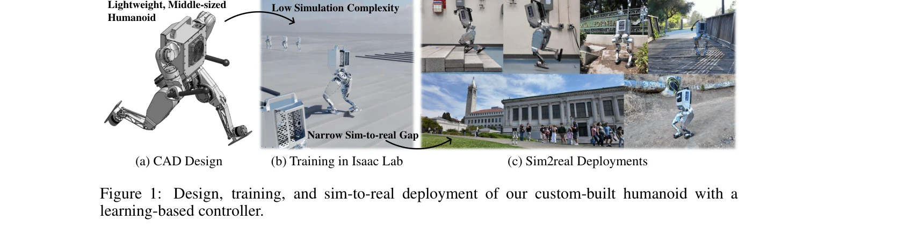

# Berkeley Humanoid: A Research Platform for Learning-based Control

> **저자**: Qiayuan Liao, Bike Zhang, Xuanyu Huang, Xiaoyu Huang, Zhongyu Li, Koushil Sreenath | **날짜**: 2024-07-31 | **URL**: [https://arxiv.org/abs/2407.21781](https://arxiv.org/abs/2407.21781)

---

## Essence

*Figure 1: Design, training, and sim-to-real deployment of our custom-built humanoid with a*

Berkeley Humanoid는 학습 기반 제어를 위해 설계된 저비용의 중형 인간형 로봇 연구 플랫폼으로, 좁은 sim-to-real 간격과 높은 신뢰성으로 다양한 지형에서 동적 보행을 구현한다.

## Motivation

- **Known**: 전체 크기의 인간형 로봇은 높은 가격과 복잡한 제어가 필요하며, 최근 mid-scale 인간형 로봇들이 QDD actuator를 사용하여 동적 성능을 개선하고 있다.
- **Gap**: 기존 mid-scale 인간형 로봇들은 학습 기반 제어에 최적화되지 않았으며, 낮은 중심의 무게, 짧은 다리로 인한 제어 불안정성과 높은 sim-to-real 격차 문제가 남아있다.
- **Why**: 학습 기반 제어가 점점 더 인간형 로봇 제어의 유력한 방식이 되고 있으며, 저비용이면서도 신뢰성 높은 연구 플랫폼이 시급하게 필요하다.
- **Approach**: custom modular actuator, hollow shaft, EtherCAT 통신을 통해 낮은 시뮬레이션 복잡도를 달성하고, minimal domain randomization과 simple reinforcement learning policy를 통해 sim-to-real 간격을 좁혔다.

## Achievement

*Figure 4: Omnidirectional Walking. (a-c) The robot walks forward, turns in place, and walks back-*

- **저비용 플랫폼**: 약 10K USD의 비용으로 fully articulated 6 DoF legs를 갖춘 중형 인간형 로봇 구현
- **고신뢰성 설계**: 낙하에 강건하고 경량(16kg)의 compact setup으로 실험실에서 안전하게 운영 가능
- **우수한 동적 보행**: 수백 미터 이상의 연속 이동, 가파른 비포장 언덕 보행, 단발 및 이중발 hopping 달성
- **narrow sim-to-real gap**: light domain randomization만으로도 Isaac Lab에서 학습된 policy를 실환경에 성공적으로 배포
- **전방위 보행**: 내외향 섭동(perturbation)에 견디며 omnidirectional locomotion 구현

## How

*Figure 2: Overview of design: (a) main components, (b) joints and key dimensions, (c) key actuators*

- **Hardware Design**: Custom modular actuators with integrated transmission, hollow shafts, crossed-roller bearings를 사용하여 높은 토크 밀도와 정확한 position/velocity control 구현
- **Actuator Architecture**: Planetary gear reducer와 motor driver를 일체화하여 부피를 최소화하고 communication을 EtherCAT로 표준화
- **Simulation Setup**: Isaac Lab을 사용하여 낮은 시뮬레이션 복잡도를 유지하면서 정확한 동역학 모델링
- **Control Policy**: Simple neural network 기반 reinforcement learning controller로 minimal domain randomization 사용
- **Mechanical Reliability**: 충격 흡수 설계와 compact 구조로 반복적인 학습 실험 중 실패에 대한 높은 내구성 보장

## Originality

- **학습 최적화 설계 철학**: 기존 model-based control 중심의 설계와 달리, learning-based algorithm의 특성을 고려하여 hardware design부터 재설계
- **Custom Actuator 개발**: 상용 QDD actuator 대신 custom modular actuator로 비용 절감과 통신 표준화(EtherCAT) 동시 달성
- **실증적 성과**: 단순한 policy로 steep unpaved trail 보행 같은 복잡한 terrain navigation 달성하여 design 효율성 입증
- **Scalability 강조**: 중형 인간형 robot 플랫폼의 scalable sim-to-real deployment 가능성을 처음으로 체계적으로 시연

## Limitation & Further Study

- **팔 제어 미흡**: 현재 설계에서 팔(arm)은 dummy arm 수준이며, 상지 조작 능력이 제한적
- **센서 활용도**: 저가형 IMU만 사용 중이며, 고급 센서(foot force sensor 등)를 활용한 더 정교한 제어 가능성 미개발
- **정책 학습의 단순성**: light domain randomization이 모든 환경에서 충분한지 의문; 더 복잡한 지형이나 예상 밖의 perturbation에 대한 robust성 평가 필요
- **비교 실험 부족**: 동일한 환경에서 다른 humanoid 플랫폼과의 직접적인 성능 비교 미실시
- **후속 연구**: 팔과 손의 fully articulated design, 더 정교한 감각 피드백 통합, 다양한 보행 패턴(running, parkour 등)의 학습 필요

## Evaluation

- Novelty: 4/5
- Technical Soundness: 4/5
- Significance: 4/5
- Clarity: 4/5
- Overall: 4/5

**총평**: Berkeley Humanoid는 learning-based humanoid control을 위한 저비용이면서도 고신뢰성의 혁신적인 연구 플랫폼으로, custom actuator 설계와 sim-to-real 간격 최소화를 통해 실제 동적 보행을 성공적으로 입증했다. 오픈소스 공개 계획과 함께 향후 humanoid 로봇 연구의 중요한 기준을 제시할 것으로 예상된다.

## Related Papers

- 🏛 기반 연구: [[papers/1273_ARMOR_Egocentric_Perception_for_Humanoid_Robot_Collision_Avo/review]] — 학습 기반 제어 플랫폼에서 자기중심 인지 기반 충돌 회피가 기초 기능이 된다
- 🔄 다른 접근: [[papers/1333_Design_and_Control_of_a_Bipedal_Robotic_Character/review]] — 이족 로봇 설계에서 연구용과 엔터테인먼트용의 다른 목적과 접근 방식이다
- 🔗 후속 연구: [[papers/1332_CLIP-Fields_Weakly_Supervised_Semantic_Fields_for_Robotic_Me/review]] — 접근 가능한 오픈소스 휴머노이드에서 Berkeley Humanoid의 저비용 설계가 확장된다
- 🧪 응용 사례: [[papers/1397_Fauna_Sprout_A_lightweight_approachable_developer-ready_huma/review]] — 개발자 친화적 휴머노이드 플랫폼에서 Berkeley Humanoid의 연구 플랫폼 설계가 적용된다
- 🧪 응용 사례: [[papers/1273_ARMOR_Egocentric_Perception_for_Humanoid_Robot_Collision_Avo/review]] — Berkeley Humanoid 플랫폼에서 자기중심 인지 기반 충돌 회피 시스템이 적용된다
- 🧪 응용 사례: [[papers/1239_A_Behavior_Architecture_for_Fast_Humanoid_Robot_Door_Travers/review]] — door traversal이 실제 Berkeley Humanoid 플랫폼에서 구현될 수 있는 구체적인 응용 사례를 제공한다
- 🔗 후속 연구: [[papers/1262_AGILOped_Agile_Open-Source_Humanoid_Robot_for_Research/review]] — AGILOped의 저비용 설계가 Berkeley Humanoid의 학습 기반 제어 플랫폼으로 확장될 수 있습니다.
- 🔄 다른 접근: [[papers/1333_Design_and_Control_of_a_Bipedal_Robotic_Character/review]] — 이족 로봇에서 엔터테인먼트와 연구 플랫폼의 다른 설계 목적과 접근 방식이다
- 🧪 응용 사례: [[papers/1334_Development_of_an_Intuitive_GUI_for_Non-Expert_Teleoperation/review]] — 사용자 친화적 휴머노이드 조작에서 Berkeley Humanoid 플랫폼의 접근성이 적용된다
