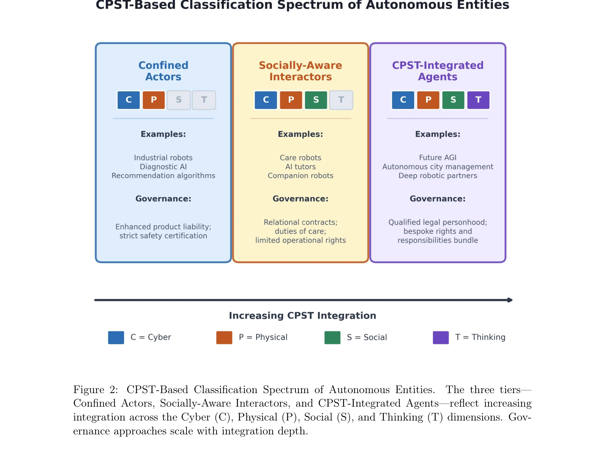

# Beyond Tools and Persons: Who Are They? Classifying Robots and AI Agents for Proportional Governance

> **저자**: Huansheng Ning, Jianguo Ding | **날짜**: 2026-04-07 | **DOI**: [10.48550/arXiv.2604.05568](https://doi.org/10.48550/arXiv.2604.05568)

---

## Essence

*Figure 1: The CPST Integration Space.*

인간형 로봇과 생성형 AI 에이전트의 급속한 상용화에 대응하기 위해, 기존의 '도구' vs '인격' 이분법을 넘어서는 Cyber-Physical-Social-Thinking (CPST) 공간 이론 기반의 분류 체계를 제안한다. 이를 통해 자율 시스템의 본질을 규정하고 비례적 거버넌스를 제공한다.

## Motivation

- **Known**: 현재 EU AI Act 등의 규제는 위험 수준에 따라 AI 시스템을 분류하지만, 자율 시스템이 어떤 종류의 실체(entity)인지 결정하는 기초 온톨로지가 부족하다. 기존 법적 범주인 '물건'과 '인격' 사이의 공백이 존재한다.
- **Gap**: AI 시스템이 점점 더 인간의 사회적·경제적 삶에 참여자로 통합되고 있으나, 관계적 복잡성, 인지적 자율성, 사회적 통합도를 반영하는 체계적인 분류 기준이 없다. 기존 위험 기반 분류나 제품 안전 규제로는 이러한 다차원적 특성을 포괄할 수 없다.
- **Why**: 휴머노이드 로봇과 자율 AI 에이전트가 실제 환경에 배치되면서 손상, 사회적 결합, 책임 추적의 문제가 발생하고 있으며, 현재 법 체계가 이를 적절히 규율할 수 없어 국제 표준화된 분류 체계가 긴급히 필요하다.
- **Approach**: CPST 공간 이론의 네 차원(계산, 물리적 구현, 사회적 관계, 인지적 능력)에 걸친 통합 정도를 기반으로 자율 실체를 분류한다. 로봇공학, 인간-로봇 상호작용, 사회 컴퓨팅, 인지과학의 표준화된 평가 지표를 통합한 평가 프로토콜을 개발한다.

## Achievement

*Figure 2: CPST-Based Classification Spectrum of Autonomous Entities.*

- **CPST 분류 체계**: Confined Actors, Socially-Aware Interactors, CPST-Integrated Agents의 3단계 분류 체계 제안으로 도구와 인격 사이의 온톨로지적 공백 해결
- **비례적 거버넌스 방안**: 고립된 시스템에 대한 강화된 제조물 책임, 상호작용 동반자에 대한 관계적 주의의무, 깊게 통합된 에이전트에 대한 제한적 법인격 부여
- **표준화된 평가 프로토콜**: 로봇공학, HRI, 인지과학 기반의 복합 평가 지표를 통한 실행 가능한 분류 방안 제시
- **시간 동역학 고려**: 실체가 진화하면서 카테고리 간 전이되는 과정을 포괄하는 동적 분류 체계
- **정책 구현 방안**: 2027년 EU AI Act 검토 전 국제 표준화를 위한 구체적 3단계 정책 제안

## How

*Figure 1: The CPST Integration Space.*

- CPST 공간의 네 차원(Cyber, Physical, Social, Thinking)을 각각 거버넌스 관련 속성으로 정의
- 각 차원에서 시스템의 통합 정도를 측정할 수 있는 표준화된 메트릭 식별 및 개발
- Confined Actors(제한된 행위자), Socially-Aware Interactors(사회 인식 상호작용자), CPST-Integrated Agents(CPST 통합 에이전트)의 3단계 분류 체계 구성
- 로봇공학, HRI 연구, 사회 컴퓨팅, 인지과학의 기존 문헌에서 평가 지표 도출
- 규제 실무를 위한 복합 평가 프로토콜(composite assessment protocol) 설계
- 시간에 따른 실체의 진화와 카테고리 간 전이 메커니즘 분석
- 신뢰할 수 있는 분류를 위한 제도 설계(institutional design) 제시

## Originality

- 기존 위험 기반 분류나 단일 축 프레임워크(능력, 위험, 자율성)를 넘어서 CPST의 다차원적 통합을 분석 단위로 삼은 혁신적 접근
- 사회적 통합(social integration)과 인지적 자율성(cognitive autonomy)을 거버넌스 관련 1급 차원으로 승격시킨 이론적 기여
- 철학적 논쟁(기계 의식 등)을 피하고 관계성(relationality)과 실제 배치(deployment reality)에 기초한 실용적 분류 체계
- 기존 법적 범주 간 '중간 상태'들을 체계적으로 도입한 최초의 포괄적 온톨로지 제시", '로봇공학, HRI, 사회 컴퓨팅, 인지과학의 다분야 지식을 통합한 학제적 접근법

## Limitation & Further Study

- 표준화된 평가 지표의 구체적 개발과 검증 과정은 논문에서 상세히 제시되지 않았으며, 실제 산업 환경에서의 적용 가능성 검증 필요
- 문화적, 지역적 차이에 따른 사회적 통합의 해석 차이를 어떻게 처리할 것인지 미흡
- 기존 법체계(제조물 책임, 기업 법인격 등)와의 충돌 해결 메커니즘이 충분히 상세하지 않음
- 인지적 자율성 측정의 어려움과 'Thinking' 차원의 정의가 다소 모호할 수 있음", '시간에 따른 실체의 진화 과정에서 책임의 추적(accountability tracing) 방안이 명확하지 않음
- 후속 연구: 다양한 산업 분야별 구체적 평가 프로토콜 개발, 국제 협력 하에 표준화 프로세스 구축, 기존 법체계와의 통합 방안 상세 모색

## Evaluation

- Novelty: 4/5
- Technical Soundness: 3/5
- Significance: 4/5
- Clarity: 4/5
- Overall: 4/5

**총평**: 본 논문은 인간형 로봇과 자율 AI 에이전트의 급속한 상용화가 야기하는 법적 공백을 CPST 이론에 기초한 혁신적 분류 체계로 해결하려는 중요한 시도이다. 학제적 통합과 실용적 거버넌스 방안 제시로 높은 원창성을 보이나, 구체적 평가 지표 개발과 실제 적용 검증을 통한 후속 작업이 필요하다.

## Related Papers

- 🧪 응용 사례: [[papers/1440_Jailbreaking_LLM-Controlled_Robots/review]] — 로봇 AI 시스템의 분류 체계가 LLM 기반 로봇의 보안 취약점을 분석하는 구체적 틀을 제공한다
- 🔗 후속 연구: [[papers/1458_LLM-Driven_Robots_Risk_Enacting_Discrimination_Violence_and/review]] — 로봇의 사회적 분류를 넘어 실제 차별과 폭력 행동의 구체적 위험성을 분석한다
- ⚖️ 반론/비판: [[papers/1550_Learning_with_pyCub_A_Simulation_and_Exercise_Framework_for/review]] — 로봇의 분류와 거버넌스 논의에 대해 로봇이 실제로 악성 고정관념을 실행한다는 반대 관점을 제시한다
- 🏛 기반 연구: [[papers/1440_Jailbreaking_LLM-Controlled_Robots/review]] — 로봇 AI 시스템의 분류와 거버넌스를 통해 jailbreak 공격의 사회적 위험성을 이해하는 기초를 제공한다
- 🔄 다른 접근: [[papers/1574_Mobi-π_Mobilizing_Your_Robot_Learning_Policy/review]] — 모바일 로봇 플랫폼에서 범용 정책 학습의 다른 접근법으로 베이스 포즈 최적화와 일반화를 비교할 수 있다.
