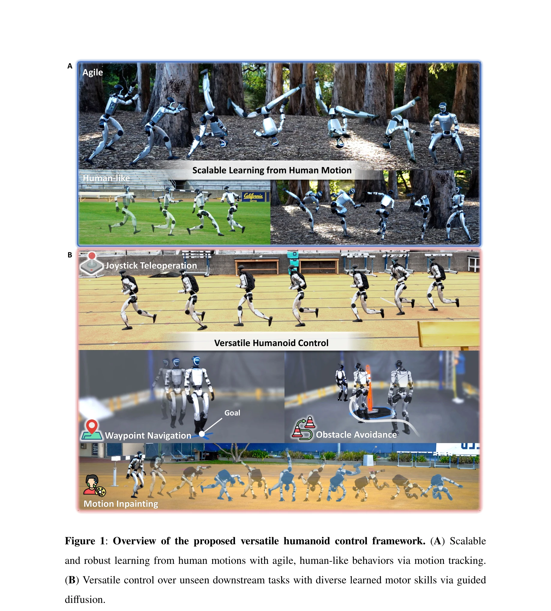
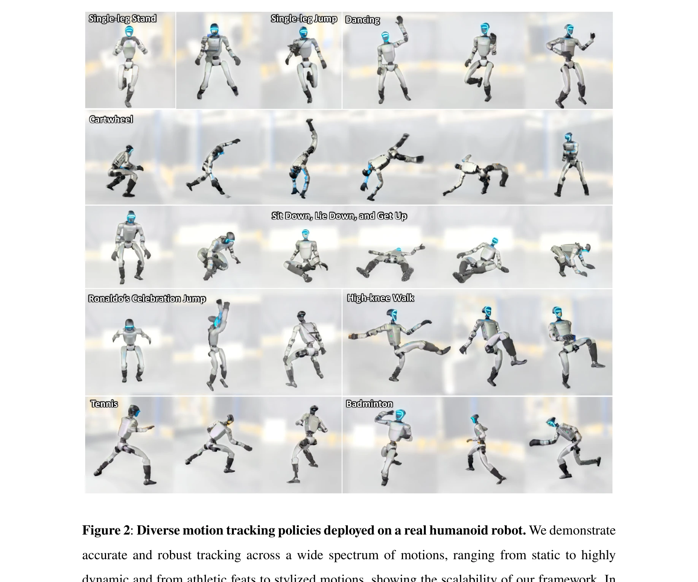

# BeyondMimic: From Motion Tracking to Versatile Humanoid Control via Guided Diffusion

> **저자**: Qiayuan Liao, Takara E. Truong, Xiaoyu Huang, Yuman Gao, Guy Tevet, Koushil Sreenath, C. Karen Liu | **날짜**: 2025-08-11 | **URL**: [https://arxiv.org/abs/2508.08241](https://arxiv.org/abs/2508.08241)

---

## Essence

*Figure 1: Overview of the proposed versatile humanoid control framework. (A) Scalable*

BeyondMimic은 human motion tracking과 diffusion model을 결합하여 humanoid robot이 다양한 민첩한 동작을 학습하고 이를 seamlessly 조합하여 미학습 작업을 해결할 수 있는 통합 제어 프레임워크를 제시한다.

## Motivation

- **Known**: Humanoid robot 제어를 위해 model-based 계층적 제어나 RL 기반 motion tracking이 사용되어 왔으나, 전자는 부자연스러운 동작을, 후자는 motion-specific tuning과 제한된 적응성을 야기한다.
- **Gap**: 기존 방법들은 단일 동작에 특화되거나 motion-specific 튜닝이 필요하며, 미학습 작업에 대한 zero-shot 일반화와 diverse skills의 seamless 조합 능력이 부족하다.
- **Why**: Humanoid robot이 인간과 같은 민첩성, 자연스러움, 다재다능성을 갖추도록 하는 것은 현실의 인간 환경에서 효과적으로 작동하기 위해 필수적이며, 이는 로봇공학의 중요한 목표이다.
- **Approach**: Compact motion-tracking RL 제식으로 다양한 동작을 학습한 후, state-action co-diffusion model과 classifier guidance를 활용하여 테스트 타임에 미학습 목표에 대한 online optimization을 수행한다.

## Achievement

*Figure 2: Diverse motion tracking policies deployed on a real humanoid robot. We demonstrate*

- **Scalable motion tracking**: aerial cartwheels, spin-kicks, flip-kicks, sprinting 등 다양한 민첩한 동작을 단일 setup과 공유 hyperparameter로 학습
- **Human-like naturalness**: 기존 RL 방법의 unnatural 특성(continuous stepping, bent knees)을 극복하고 인간 수준의 자연스러운 동작 달성
- **Zero-shot versatility**: Motion inpainting, joystick teleoperation, obstacle avoidance 등 미학습 downstream task를 추가 학습 없이 해결
- **Real-world deployment**: 학습된 skills을 real humanoid hardware에 zero-shot으로 전이

## How

- Classical mechanics 원리에 기반한 신중한 로봇 actuation 모델링으로 deployment discrepancy 최소화
- Domain randomization을 불확실한 물리 특성에만 적용하여 제어 목표 희석 방지
- Task reward에 3개 regularization term만 사용한 compact RL formulation으로 다양한 동작에 일반화
- State-action co-diffusion model이 predictive control 방식으로 동작하여 미래 states와 actions 모두에 대한 cost formulation 가능
- Classifier guidance를 이용하여 test time에 arbitrary differential objectives에 대한 gradient-based optimization 수행
- Unlabeled human motion data로부터 diverse skills의 multimodal distribution 학습

## Originality

- Classical mechanics 기반 actuation 모델링과 minimal domain randomization을 통해 복잡한 RL formulation 없이도 scalable motion tracking 달성
- Diffusion model의 gradient field 학습 특성을 활용하여 VAE나 AMP보다 향상된 test-time online optimization 지원
- State-action co-diffusion 구조로 미래 상태와 행동 모두에 대한 cost formulation을 가능하게 함
- Motion tracking RL과 diffusion-based control을 결합한 통합 프레임워크로 versatility와 agility의 동시 달성

## Limitation & Further Study

- Diffusion model의 sampling 과정이 계산 비용이 높을 수 있으며, real-time control에서의 latency 문제 미언급
- Classifier guidance의 effectiveness가 cost function의 differentiability에 의존하므로 non-differentiable objectives에 적용 제한
- Real-world 실험이 특정 humanoid 플랫폼(구체적 모델명 미제시)에 국한되었으므로 다양한 로봇 형태로의 일반화 검증 필요
- Human motion capture data의 도메인(예: 실내/실외, 환경 복잡도)이 제한적일 수 있으며, 데이터셋 크기나 특성에 대한 상세 설명 부족
- Long-horizon navigation 등 매우 복잡한 미학습 작업에 대한 성능 한계 가능성

## Evaluation

- Novelty: 4/5
- Technical Soundness: 3/5
- Significance: 4/5
- Clarity: 4/5
- Overall: 4/5

**총평**: BeyondMimic은 humanoid robot control에서 scalability, naturalness, zero-shot versatility를 동시에 달성한 주목할 만한 연구로, RL 기반 motion tracking과 diffusion model의 창의적 결합으로 humanoid 로봇공학의 새로운 지평을 제시한다.

## Related Papers

- 🏛 기반 연구: [[papers/1250_A_Whole-Body_Motion_Imitation_Framework_from_Human_Data_for/review]] — 다양한 휴머노이드 제어에서 전신 motion imitation 프레임워크가 기반이 된다
- 🔗 후속 연구: [[papers/1249_A_Unified_and_General_Humanoid_Whole-Body_Controller_for_Ver/review]] — motion tracking 기반 제어에서 통합 전신 제어기의 다양한 동작 지원이 확장된다
- 🔄 다른 접근: [[papers/1331_DemoHLM_From_One_Demonstration_to_Generalizable_Humanoid_Loc/review]] — 휴머노이드 제어에서 motion tracking 기반과 단일 시연 기반의 다른 학습 접근이다
- 🧪 응용 사례: [[papers/1590_Omni-Perception_Omnidirectional_Collision_Avoidance_for_Legg/review]] — 범용 로봇 기반 모델에서 motion tracking을 통한 다양한 동작 제어가 적용된다
- 🧪 응용 사례: [[papers/1315_Composite_Motion_Learning_with_Task_Control/review]] — motion tracking 기반 다양한 동작에서 적응형 보조 힘이 학습 가속에 적용된다
- 🔗 후속 연구: [[papers/1303_CHIP_Adaptive_Compliance_for_Humanoid_Control_through_Hindsi/review]] — motion tracking 프레임워크에서 적응형 compliance 제어가 plug-and-play로 통합된다
- 🏛 기반 연구: [[papers/1237_Ψ_0_An_Open_Foundation_Model_Towards_Universal_Humanoid_Loco/review]] — π0의 vision-language-action 통합 프레임워크가 Ψ0의 VLM과 action expert 결합 구조의 이론적 기반을 제공한다.
- 🏛 기반 연구: [[papers/1249_A_Unified_and_General_Humanoid_Whole-Body_Controller_for_Ver/review]] — 다양한 동작 조합을 위한 통합 제어 프레임워크가 motion tracking의 기초가 된다
- 🔗 후속 연구: [[papers/1250_A_Whole-Body_Motion_Imitation_Framework_from_Human_Data_for/review]] — motion tracking 기반 다양한 휴머노이드 제어에서 전신 모방 프레임워크가 확장된다
- 🏛 기반 연구: [[papers/1327_Deep_Imitation_Learning_for_Humanoid_Loco-manipulation_throu/review]] — 로코-조작 기술 학습에서 motion tracking 기반 다양한 동작 제어가 기초가 된다
- 🔄 다른 접근: [[papers/1331_DemoHLM_From_One_Demonstration_to_Generalizable_Humanoid_Loc/review]] — 휴머노이드 제어에서 단일 시연과 motion tracking의 다른 학습 데이터 접근이다
- 🔗 후속 연구: [[papers/1494_NORA-15_A_Vision-Language-Action_Model_Trained_using_World_M/review]] — π_0의 vision-language-action flow model을 기반으로 NORA-1.5가 flow-matching 방식을 action expert에 적용하여 성능을 향상시켰다.
- 🏛 기반 연구: [[papers/1522_RDT-1B_a_Diffusion_Foundation_Model_for_Bimanual_Manipulatio/review]] — 비전-언어-행동 flow 모델 구조가 UH-1의 Transformer 기반 휴머노이드 제어 시스템에 핵심 아키텍처 기반을 제공한다
- 🏛 기반 연구: [[papers/1485_HumanX_Toward_Agile_and_Generalizable_Humanoid_Interaction_S/review]] — π₀ VLA 모델이 인간 영상으로부터 휴머노이드 상호작용 스킬을 학습하는 이론적 기반을 제공함
- 🧪 응용 사례: [[papers/1610_PHUMA_Physically-Grounded_Humanoid_Locomotion_Dataset/review]] — PHUMA의 물리적으로 정제된 동작 데이터가 BeyondMimic의 다양한 휴머노이드 제어 시나리오에 직접 활용될 수 있다
