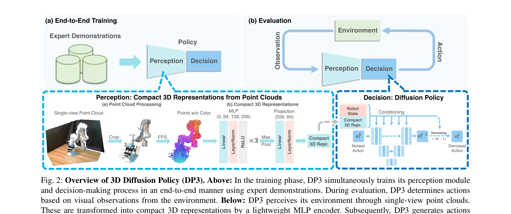
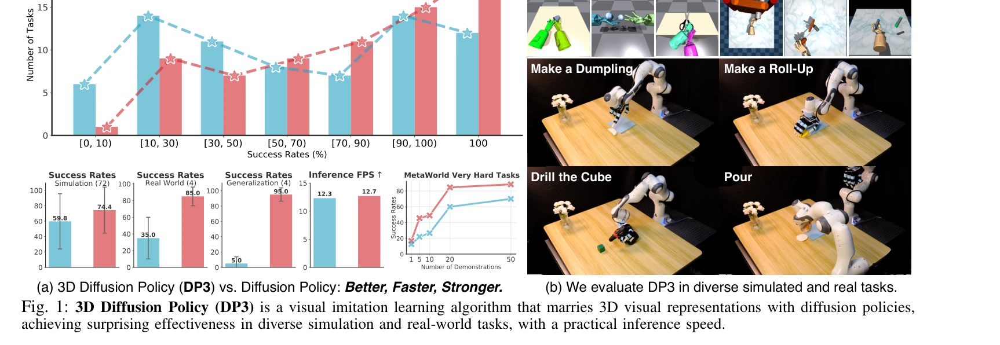

# 3D Diffusion Policy: Generalizable Visuomotor Policy Learning via Simple 3D Representations

> **저자**: Yanjie Ze, Gu Zhang, Kangning Zhang, Chenyuan Hu, Muhan Wang, Huazhe Xu | **날짜**: 2024-03-06 | **URL**: [https://arxiv.org/abs/2403.03954](https://arxiv.org/abs/2403.03954)

---

## Essence

*Fig. 2: Overview of 3D Diffusion Policy (DP3). Above: In the training phase, DP3 simultaneously trains its perception mo*

3D Diffusion Policy (DP3)는 점군(point cloud) 기반의 3D 시각 표현을 diffusion policy와 결합하여 로봇 모방 학습에서 적은 데이터로 높은 일반화 성능을 달성하는 방법을 제안한다.

## Motivation

- **Known**: Diffusion policy는 로봇 제어 학습에 효과적이나 다수의 인간 시연 데이터를 요구하며, 3D 표현을 기반으로 한 로봇 정책(PerAct, RVT, ACT3D 등)은 특정 작업에서는 우수하지만 추론 속도가 느리고 일반성이 제한된다.
- **Gap**: 기존 방법들은 3D 표현과 diffusion policy의 결합에서 최적의 설계를 제시하지 못했으며, 적은 데이터로 다양한 로봇 작업에 일반화되는 빠르고 효율적인 정책이 부재하다.
- **Why**: 로봇 학습에서 데이터 수집의 비용과 시간이 매우 크므로 적은 시연으로 강건하고 일반화된 정책을 학습하는 것이 실무적으로 중요하며, 3D 표현의 공간적 이해 능력은 시각 모방 학습의 효율성을 크게 향상시킬 수 있다.
- **Approach**: DP3는 sparse point cloud를 간단한 MLP 인코더로 compact 3D 표현으로 인코딩한 후, 이를 조건으로 하여 diffusion model이 행동 시퀀스를 생성하는 구조를 채택한다.

## Achievement

*Fig. 1: 3D Diffusion Policy (DP3) is a visual imitation learning algorithm that marries 3D visual representations with d*

- **데이터 효율성**: 시뮬레이션 72개 작업에서 단 10개 시연으로 대부분의 작업을 성공하며 기준 방법 대비 24.2% 상대적 개선 달성
- **실제 로봇 성능**: 4개의 실제 로봇 작업에서 각 40개 시연으로 85%의 높은 성공률 달성
- **다양한 일반화**: 공간적 변위, 시점 변화, 외형 변화, 인스턴스 변화 등 다양한 측면에서 우수한 일반화 능력 입증
- **안전성**: 기준 방법들이 안전 규칙을 자주 위반하는 반면 DP3는 거의 위반 없음
- **실용성**: 추론 속도가 practical 수준이며 복잡한 변형 객체 조작(dexterous hand manipulation) 가능

## How

*Fig. 2: Overview of 3D Diffusion Policy (DP3). Above: In the training phase, DP3 simultaneously trains its perception mo*

- Sparse point cloud를 입력으로 받아 효율적인 point encoder (MLP 기반)를 통해 compact 3D 표현으로 변환
- Robot pose와 함께 3D 시각 특성을 diffusion policy의 조건으로 활용
- Diffusion model의 denoising 과정을 통해 조건부 행동 시퀀스 생성
- 다양한 3D 표현(depth, voxel 등)과 point encoder 변형(PointNeXt, Point Transformer)과 비교하여 설계 최적화
- 다른 정책 백본(BCRNN, IBC)과의 비교를 통해 3D 표현과 diffusion policy의 시너지 검증

## Originality

- 처음으로 3D point cloud 표현을 diffusion policy와 체계적으로 결합하여 시각 모방 학습의 효율성과 일반화를 동시에 달성
- 단순한 MLP 기반 point encoder의 사용으로 복잡한 3D 아키텍처(attention 메커니즘, 키프레임 기반 planning 등)를 대체 가능함을 입증
- 광범위한 벤치마크(72개 시뮬레이션 작업 + 4개 실제 로봇 작업)를 통해 방법의 보편성을 체계적으로 검증
- 3D 표현이 diffusion policy와 결합될 때 다른 정책 프레임워크보다 월등한 성능 향상을 제공함을 실증적으로 입증

## Limitation & Further Study

- 현재 결과는 주로 조작 작업에 집중되어 있으며 이동(locomotion) 등 다른 로봇 작업 도메인에서의 일반화 가능성이 미검증
- Point cloud 데이터의 스파스성에 따른 성능 변화와 최적의 샘플링 전략에 대한 분석이 제한적
- 실제 환경의 복잡한 조명 조건, 폐색(occlusion), 동적 배경 등에 대한 견강성 평가가 부족
- 후속 연구: 다양한 센서 모달리티(LiDAR, RGB-D의 자동 조합) 활용, 온라인 학습과의 결합, 대규모 사전학습된 3D 인코더의 활용 가능성 탐색

## Evaluation

- Novelty: 4/5
- Technical Soundness: 3/5
- Significance: 4/5
- Clarity: 4/5
- Overall: 4/5

**총평**: DP3는 개념적으로 단순하면서도 3D 표현과 diffusion policy의 시너지를 효과적으로 활용하여 적은 데이터로 높은 성능과 일반화를 달성한 실용적인 방법이며, 광범위한 평가를 통해 로봇 시각 모방 학습에서 3D 표현의 중요성을 설득력 있게 입증한다.

## Related Papers

- 🔄 다른 접근: [[papers/1278_Behavior_Foundation_Model_for_Humanoid_Robots/review]] — BFM-Zero는 프롬프트 기반 접근법으로 masked distillation과는 다른 방식의 행동 기초 모델을 구현한다
- 🏛 기반 연구: [[papers/1257_Advancing_Humanoid_Locomotion_Mastering_Challenging_Terrains/review]] — DWL의 인코더-디코더 구조와 표현 학습의 이론적 기반을 제공한다
- 🔗 후속 연구: [[papers/1572_Sim-to-Real_Reinforcement_Learning_for_Vision-Based_Dexterou/review]] — 자유로운 플레이에서 조작 학습하는 MimicDroid가 대규모 인간 시연으로 행동 기반 모델을 사전훈련하는 BFM-Zero로 확장된다.
- 🏛 기반 연구: [[papers/1585_ThinkBot_Embodied_Instruction_Following_with_Thought_Chain_R/review]] — ThinkBot의 행동 지시 생성이 BFM-Zero의 promptable behavior modeling 원리를 기반으로 발전된 형태
- 🔄 다른 접근: [[papers/1627_What_Matters_in_Building_Vision-Language-Action_Models_for_G/review]] — BFM-Zero의 behavioral foundation model이 VLA와 다른 관점에서 generalist robot policy 문제에 접근
