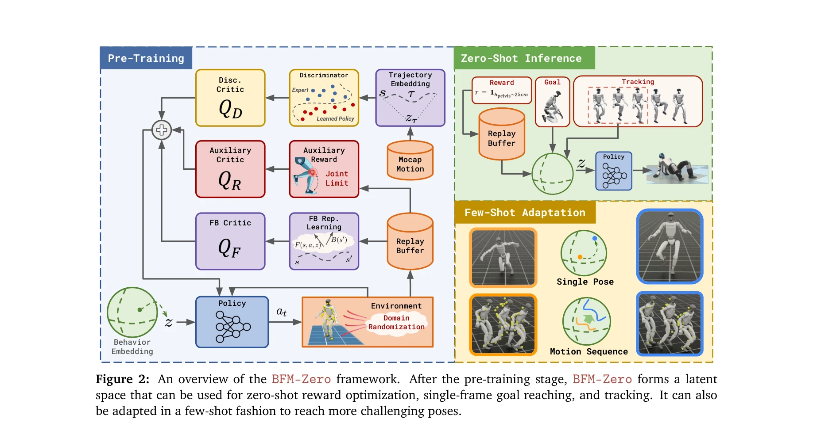
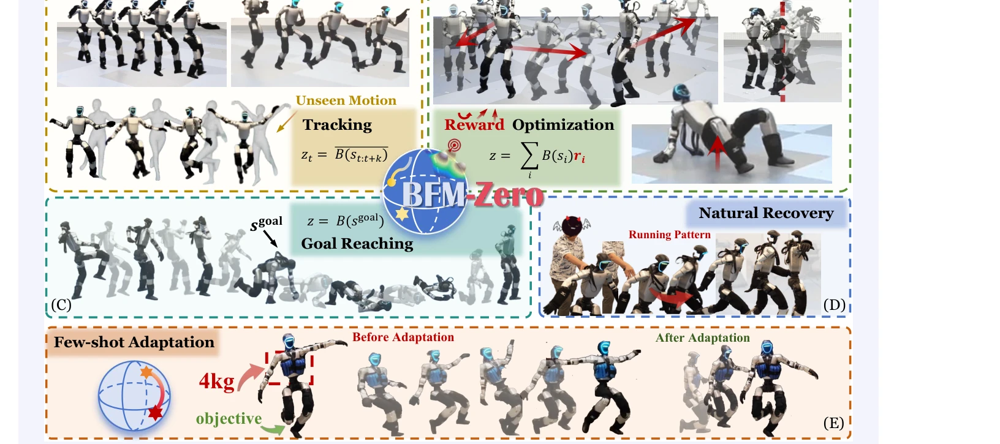

# BFM-Zero: A Promptable Behavioral Foundation Model for Humanoid Control Using Unsupervised Reinforcement Learning

> **저자**: Yitang Li, Zhengyi Luo, Tonghe Zhang, Cunxi Dai, Anssi Kanervisto, Andrea Tirinzoni, Haoyang Weng, Kris Kitani, Mateusz Guzek, Ahmed Touati, Alessandro Lazaric, Matteo Pirotta, Guanya Shi | **날짜**: 2025-11-06 | **DOI**: [10.48550/arXiv.2511.04131](https://doi.org/10.48550/arXiv.2511.04131)

---

## Essence

*Figure 2: An overview of the BFM-Zero framework. After the pre-training stage, BFM-Zero forms a latent*

BFM-Zero는 unsupervised RL과 Forward-Backward 모델을 기반으로 humanoid 로봇을 위한 promptable behavioral foundation model을 제시하며, 단일 정책으로 motion tracking, goal reaching, reward optimization 등 다양한 작업을 zero-shot 방식으로 수행할 수 있다.

## Motivation

- **Known**: VLA 모델은 manipulation 작업에서 foundation model 패러다임을 성공적으로 구현했으나, humanoid whole-body control에서는 대규모 원격조작 데이터셋 부재로 behavior cloning이 어렵다. 기존 RL 기반 humanoid 제어는 on-policy 방법(PPO)에 의존하며 task-specific이고 적응성이 떨어진다.
- **Gap**: Real humanoid에 적용 가능한 promptable foundation model이 부재하며, off-policy unsupervised RL이 sim-to-real gap과 동적 교란에 견딜 수 있는지에 대한 증거가 없다.
- **Why**: Humanoid 로봇의 대규모 상용화를 위해서는 다양한 작업을 통일된 정책으로 처리할 수 있는 foundation model이 필수적이며, 이는 새로운 작업 학습을 효율적으로 만들 수 있다.
- **Approach**: BFM-Zero는 FB-CPR 알고리즘 기반 unsupervised RL pre-training으로 shared latent representation을 학습하고, domain randomization, reward shaping, history-dependent asymmetric learning으로 sim-to-real gap을 극복한 후, zero-shot 및 few-shot 추론을 제공한다.

## Achievement

*Figure 1: BFM-Zero enables versatile and robust whole-body skills. (A-C) Diverse zero-shot inference*

- **Real humanoid 최초 foundation model**: Unitree G1 humanoid에서 retraining 없이 multiple downstream tasks를 zero-shot으로 수행하는 첫 모델 구현
- **다양한 inference 방식 지원**: motion tracking, goal reaching, reward optimization을 단일 정책으로 처리 가능
- **강건한 sim-to-real 전이**: domain randomization과 asymmetric learning으로 simulation-reality gap 극복
- **효율적 적응**: few-shot optimization으로 zero-shot 정책을 빠르게 개선 가능
- **안정적 실세계 성능**: large perturbation 회복, unseen motion 수행 등 실제 환경에서의 강건성 입증

## How

*Figure 2: An overview of the BFM-Zero framework. After the pre-training stage, BFM-Zero forms a latent*

- Forward-Backward (FB) 표현 학습을 통해 observation을 d-차원 latent feature로 임베딩하여 task-agnostic representation 구성
- Motion capture 데이터로 latent space를 정규화하며, 동시에 online off-policy 학습으로 new behaviors 탐색
- Domain randomization으로 simulator의 물리 파라미터(마찰, 질량 등)를 변동시켜 sim-to-real gap 감소
- History-dependent asymmetric learning으로 simulation에서만 privileged information(full state)을 활용하여 robust policy 학습
- Auxiliary reward (joint limit, tracking error 등)를 추가하여 로봇 안전 제약 조건 준수
- Zero-shot 추론 시 task를 latent space에 임베딩(target motion, goal pose, reward function)한 후 조건화된 정책 π_z로 실행
- Few-shot adaptation에서는 sampling-based optimization으로 latent space 내에서 빠른 적응 수행

## Originality

- Real humanoid에 off-policy unsupervised RL을 처음 성공적으로 적용하여 foundation model 패러다임 실현
- FB representation을 humanoid control의 sim-to-real gap 극복에 활용한 신규 접근법
- Shared latent space에서 motion, goal, reward를 통일적으로 표현하는 novel embedding 전략
- Motion capture regularization과 online reward-free 학습의 조합으로 behavior diversity와 safety의 균형 달성
- Zero-shot, few-shot, natural recovery 등 다층적 inference capability를 단일 모델에서 제공하는 첫 사례

## Limitation & Further Study

- Ablation study가 simulation 환경에서만 수행되어 각 design choice(domain randomization, reward shaping 등)의 real-world 영향을 직접 검증하지 못함
- Real humanoid 실험이 Unitree G1 단일 플랫폼에만 제한되어 다른 humanoid 아키텍처로의 일반화 가능성 미명확
- Zero-shot 추론의 성공률이 task 유형(tracking vs goal reaching vs reward optimization)에 따라 편차가 있을 수 있으며, 실패 케이스에 대한 상세 분석 부재
- Motion capture 데이터셋의 coverage가 제한적일 경우 학습된 latent space의 표현력 저하 가능성
- Few-shot adaptation의 수렴 속도 및 최적 에피소드 수에 대한 상세 분석 필요
- **후속연구 방향**: Multi-robot platform 확대, few-shot adaptation 이론적 수렴 분석, task composition 메커니즘 개발, visual input 통합

## Evaluation

- Novelty: 4/5
- Technical Soundness: 3/5
- Significance: 4/5
- Clarity: 4/5
- Overall: 4/5

**총평**: BFM-Zero는 real humanoid에 대한 첫 promptable foundation model로서, unsupervised RL과 FB representation 기반의 novel 접근법을 통해 zero-shot 및 few-shot 다중 작업 수행을 입증했다. Sim-to-real gap 극복 기법과 실세계 검증이 강점이나, ablation study의 real-world 확대와 다중 플랫폼 일반화 검증이 필요하다.

## Related Papers

- 🔄 다른 접근: [[papers/1289_3D_FlowMatch_Actor_Unified_3D_Policy_for_Single-_and_Dual-Ar/review]] — 둘 다 3D 기반 로봇 정책 학습이지만 3D Diffusion Policy는 점군과 diffusion을, 3D FlowMatch Actor는 flow matching을 사용한다.
- 🏛 기반 연구: [[papers/1361_Diffusion_Models_for_Robotic_Manipulation_A_Survey/review]] — Diffusion Models for Robotic Manipulation 서베이가 3D Diffusion Policy의 이론적 배경과 관련 연구 동향을 종합적으로 제시한다.
- 🧪 응용 사례: [[papers/1520_R3M_A_Universal_Visual_Representation_for_Robot_Manipulation/review]] — R3M의 universal visual representation이 3D Diffusion Policy의 점군 기반 시각 표현과 결합하여 더 강력한 3D 인식을 제공할 수 있다.
- 🔗 후속 연구: [[papers/1567_SE3-Equivariant_Robot_Learning_and_Control_A_Tutorial_Survey/review]] — 3D 확산 정책에서 SE(3) 동형성이 기하학적으로 일관된 시각-운동 정책 학습을 가능하게 한다.
- 🔄 다른 접근: [[papers/1289_3D_FlowMatch_Actor_Unified_3D_Policy_for_Single-_and_Dual-Ar/review]] — 둘 다 3D 시각 표현 기반 로봇 정책이지만 3D FlowMatch Actor는 flow matching을, 3D Diffusion Policy는 diffusion을 사용한다.
