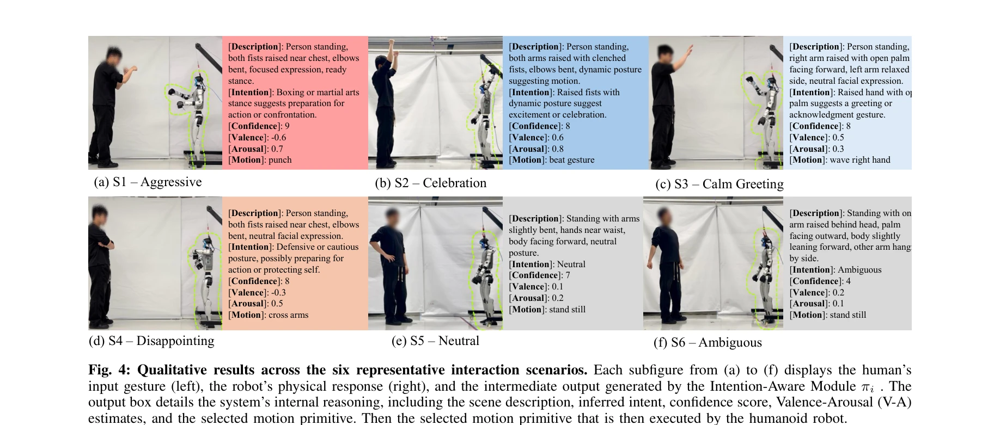

# Bi-Level Motion Imitation for Humanoid Robots

> **저자**:  | **날짜**:  | **URL**: [https://sites.google.com/view/bmi-corl2024](https://sites.google.com/view/bmi-corl2024)

---

## Essence

*Fig. 1: Overall framework of the proposed work. (a) The high-level system architecture. Multimodal inputs XI = (Vin, Lin*

HIAER는 Vision Language Model을 통해 인간의 사회적 의도와 감정 맥락(Valence-Arousal)을 계층적으로 추론하고, 이를 바탕으로 text-to-motion diffusion model과 RL 기반 whole-body controller를 통해 인간형 로봇이 상황에 적절한 표현력 있는 제스처를 실시간으로 생성·실행하는 프레임워크다.

## Motivation

- **Known**: 최근 humanoid robot들이 견고한 locomotion과 expressive motion을 생성할 수 있게 되었으나, 이러한 움직임들이 실제 사회적 맥락에 기반하지 않아 상호작용의 의도 전달이 부족하다.
- **Gap**: 기존 VLM 기반 로봇 연구는 명시적 기능적 목표 해석에 중점을 두었으며, 암묵적 감정적 의도를 포함한 완전한 의도-행동 루프를 구현하지 못했다.
- **Why**: 인간-로봇 상호작용에서 신뢰 구축과 협업 촉진을 위해 로봇은 단순히 물리적으로 정교한 움직임뿐 아니라 사회적 맥락에 민감하고 적응적인 비언어적 행동을 생성해야 한다.
- **Approach**: VLM with in-context learning으로 사회적 의도와 Valence-Arousal 값을 추론한 후, 이를 조건으로 DART text-to-motion diffusion model이 제스처를 합성하고, RL 기반 whole-body controller가 humanoid에서 실행한다.

## Achievement

*Fig. 4: Qualitative results across the six representative interaction scenarios. Each subfigure from (a) to (f) displays*

- **계층적 의도 인식 프레임워크**: VLM의 세밀한 추론을 사회적 의도와 감정 맥락에 통합하여 사회 인식형 동작 생성을 달성
- **Valence-Arousal 모델 도입**: 복잡한 사회적 의도를 구체적인 V-A 파라미터로 변환하여 상황 적절한 expressive motion 선택을 가능하게 함
- **VLM 기반 의도 추론 모듈**: ICL과 Chain-of-Thought prompting을 활용한 사회적 의도 인식 모듈 설계
- **물리 로봇 시스템 구현**: 실제 humanoid 로봇에서 저지연 context-aware 제스처를 생성하는 완전 통합 시스템 구현 및 검증

## How

*Fig. 1: Overall framework of the proposed work. (a) The high-level system architecture. Multimodal inputs XI = (Vin, Lin*

- Intention-Aware Module (πi): VLM agent가 pre-prompt, few-shot examples, in-context learning을 이용해 멀티모달 입력(비디오, 언어)과 대화 히스토리로부터 의도, 신뢰도, V-A 값, 모션 프리미티브를 추론
- Motion Planner (πp): DART diffusion model을 사용해 structured output의 text description으로부터 시간적으로 연결된 human motion trajectory 합성
- Kinematics Retargeting: 합성된 human motion을 humanoid의 특정 kinematics에 맞춰 변환
- Whole-Body Controller (πw): RL 기반 controller가 목표 trajectory를 humanoid에서 견고하게 실행
- Valence-Arousal Space Mapping: 2차원 V-A 공간(Quadrant I-IV)을 통해 감정 맥락을 시각화하고 모션 선택의 expression style을 조절

## Originality

- **완전한 의도-행동 루프**: 기존의 task decomposition을 넘어 사회적 의도 추론부터 expressive 행동 실행까지 폐쇄형 루프 구현
- **Valence-Arousal 기반 조건화**: 단순 intent 분류가 아닌 V-A 공간의 연속 파라미터를 이용한 표현 스타일 모듈레이션
- **VLM의 fine-grained social reasoning**: ICL과 CoT prompting을 통해 VLM이 기능적 목표뿐 아니라 암묵적 감정적 맥락을 추론하도록 설계
- **대규모 데이터셋 활용**: AMASS, HumanML3D 같은 대규모 motion dataset 기반으로 predefined template에 의존하지 않는 generative approach 채택

## Limitation & Further Study

- 실시간 성능: VLM 추론과 diffusion model 디노이징의 레이턴시가 실제 상호작용에서 얼마나 영향을 미치는지 분석 부족
- Valence-Arousal 추정의 정확도: VLM이 추론한 V-A 값이 실제 인간의 감정 상태와 얼마나 일치하는지 정량적 검증 부족
- 제스처 다양성 한계: 현재는 gesture 중심이며, 보행, 신체 방향 전환 등 전신 움직임 통합 필요
- 문화적 차이: 사회적 의도와 gesture의 적절성이 문화에 따라 다를 수 있으나 이를 다루지 않음
- **후속 연구**: 장시간 상호작용에서의 적응 학습, 다양한 humanoid 플랫폼 일반화, 멀티에이전트 상황 확장

## Evaluation

- Novelty: 4/5
- Technical Soundness: 3/5
- Significance: 4/5
- Clarity: 4/5
- Overall: 4/5

**총평**: 본 논문은 VLM의 사회적 추론 능력과 diffusion-based motion generation을 효과적으로 통합하여 humanoid의 intention-aware expressive interaction을 실현한 점에서 의미 있는 기여를 한다. 실제 로봇 시스템 구현 및 HRI 시나리오 검증을 통해 실용성을 입증했으나, V-A 추정 정확도와 실시간 성능에 대한 정량적 분석이 강화되면 더욱 설득력 있을 것이다.

## Related Papers

- 🧪 응용 사례: [[papers/1333_Design_and_Control_of_a_Bipedal_Robotic_Character/review]] — 엔터테인먼트 로봇의 표현적 동작에서 사회적 의도와 감정 맥락 추론이 적용된다
- 🔗 후속 연구: [[papers/1381_EMOTION_Expressive_Motion_Sequence_Generation_for_Humanoid_R/review]] — 표현적 휴머노이드 동작 생성에서 계층적 의도-감정 추론이 확장된다
- 🏛 기반 연구: [[papers/1390_Expressive_Whole-Body_Control_for_Humanoid_Robots/review]] — 표현적 전신 제어에서 VLM 기반 사회적 맥락 이해가 기초가 된다
- 🔄 다른 접근: [[papers/1443_Hierarchical_Intention-Aware_Expressive_Motion_Generation_fo/review]] — 휴머노이드 표현적 동작에서 의도-감정 기반과 계층적 의도 인식의 다른 접근이다
- 🏛 기반 연구: [[papers/1320_Coordinated_Humanoid_Manipulation_with_Choice_Policies/review]] — 모듈식 텔레오퍼레이션에서 사회적 의도 추론이 Choice Policy의 행동 선택에 기초가 된다
- 🏛 기반 연구: [[papers/1333_Design_and_Control_of_a_Bipedal_Robotic_Character/review]] — 엔터테인먼트 로봇에서 사회적 의도-감정 추론이 표현적 동작의 기초가 된다
