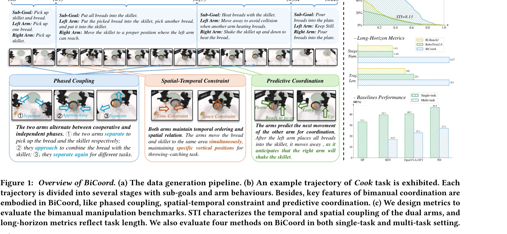

# BiCoord: 장기간 시공간 협응 양팔 조작 벤치마크

> **저자**:  | **날짜**: 2026-04-07 | **URL**: [https://arxiv.org/abs/2604.05831](https://arxiv.org/abs/2604.05831)

---

## Essence

*Figure 1: Overview of BiCoord. (a) The data generation pipeline. (b) An example trajectory of Cook task is exhibited. Ea*

BiCoord는 장시간 고도로 협응된 양팔 조작 작업을 평가하기 위한 벤치마크이며, 시간적·공간적·시공간적 협응 메트릭을 제안하여 기존 벤치마크의 한계를 극복한다.

## Motivation

- **Known**: RoboTwin과 RLBench2 같은 양팔 조작 벤치마크가 존재하지만, 대부분 단기간의 약하게 협응된 작업만 포함하여 실제 인간 수준의 두 손 협응을 반영하지 못한다.
- **Gap**: 기존 벤치마크는 (1) 단기간 작업으로 장시간 의존성과 계층적 구조를 반영하지 못하고, (2) 느슨한 협응으로 양팔의 강한 시공간적 결합을 요구하지 않는다.
- **Why**: 양팔 조작은 로봇이 인간 수준의 민첩성을 달성하는 데 필수적이며, 실제 세계의 도구와 환경은 양손 사용을 위해 설계되어 있어 긴장시간의 협응 양팔 작업 능력 평가가 중요하다.
- **Approach**: BiCoord는 (1) 여러 부분 목표에 걸쳐 지속적 상호 의존성과 동적 역할 교환을 요구하는 다양한 장시간 작업을 설계하고, (2) 시간적·공간적·시공간적 관점에서 협응을 정량적으로 평가하는 메트릭 모음을 제안한다.

## Achievement

*Figure 1: Overview of BiCoord. (a) The data generation pipeline. (b) An example trajectory of Cook task is exhibited. Ea*

1. **장시간 협응 양팔 벤치마크 구축**: 기존 벤치마크 대비 훨씬 긴 궤적(trajectory length)과 많은 단계(stage number)를 포함하는 BiCoord 개발
2. **협응 특성 정의**: 위상적 결합(phased coupling), 시공간 제약(spatial-temporal constraints), 예측적 협응(predictive coordination)의 세 가지 핵심 협응 특성 명시화
3. **다각적 평가 메트릭**: SMT, SMP, MRD, ARD, STI 등의 메트릭으로 시간적·공간적·시공간적 협응 측정
4. **방법 성능 분석**: DP, RDT, Pi0, OpenVLA-OFT 등 대표적 조작 정책들이 장시간 고결합 작업에서 한계를 보임을 실증적으로 입증

## How

*Figure 1: Overview of BiCoord. (a) The data generation pipeline. (b) An example trajectory of Cook task is exhibited. Ea*

- 4단계 데이터 생성 파이프라인: 작업 정의(task defining) → 계획 및 행동 스크립트 작성(planning & action script) → 검증(verification) → 궤적 생성(trajectory generation)
- 각 궤적을 부분 목표와 양팔 행동으로 단계 주석(stage-wise annotation)하여 협응 특성 분석
- STI(Spatial-Temporal Integral) 메트릭으로 양팔의 시공간 결합도를 정량화
- 단일 작업(single-task)과 다중 작업(multi-task) 설정에서 대표 방법 평가

## Originality

- 기존 벤치마크의 단기간·약한 협응 한계를 체계적으로 분석하고, 실제 인간 양팔 행동의 특성(위상적 결합, 시공간 제약, 예측적 협응)을 명시적으로 모델링한 첫 벤치마크
- 시공간 적분(STI)을 포함한 다각적 협응 메트릭 제안으로 협응 정도를 이전보다 정교하게 측정
- 요리 작업 등 현실적이고 복잡한 양팔 조작 작업을 시뮬레이션 환경에서 구현

## Limitation & Further Study

- 시뮬레이션 환경에서의 작업이므로 현실 로봇의 센서 노이즈, 제어 오차, 물리적 오류 등을 완전히 반영하지 못할 수 있음
- 현재 평가 대상 방법들이 모두 기존 방법이므로, BiCoord에 최적화된 새로운 협응 학습 알고리즘 개발의 필요성 제시
- 다양한 로봇 형태(embodiment)에 대한 일반화 평가 부재
- 후속 연구로 협응 특성을 명시적으로 학습하는 조작 정책 개발 및 sim-to-real 전이 연구 필요

## Evaluation

- Novelty: 4/5
- Technical Soundness: 3/5
- Significance: 4/5
- Clarity: 4/5
- Overall: 4/5

**총평**: BiCoord는 양팔 로봇 조작의 장시간 시공간 협응을 체계적으로 평가하는 기준이 되는 벤치마크로, 명확한 협응 특성 정의와 다각적 메트릭을 통해 향후 협응 양팔 조작 연구의 중요한 토대를 제공한다.

## Related Papers

- 🔄 다른 접근: [[papers/1291_BiGym_A_Demo-Driven_Mobile_Bi-Manual_Manipulation_Benchmark/review]] — 양팔 조작 평가에서 장기간 협응과 다양한 가정 작업의 다른 벤치마크 초점이다
- 🏛 기반 연구: [[papers/1297_Bunny-VisionPro_Real-Time_Bimanual_Dexterous_Teleoperation_f/review]] — 실시간 양손 정교한 조작에서 장기간 시공간 협응 메트릭이 기반이 된다
- 🔗 후속 연구: [[papers/1337_DexMimicGen_Automated_Data_Generation_for_Bimanual_Dexterous/review]] — 양손 정교한 조작 데이터 생성에서 BiCoord의 협응 벤치마크가 확장 적용된다
- 🧪 응용 사례: [[papers/1450_HITTER_A_HumanoId_Table_TEnnis_Robot_via_Hierarchical_Planni/review]] — 저비용 손 추적 기반 정밀 양손 조작에서 장기간 협응 평가가 적용된다
- 🔄 다른 접근: [[papers/1291_BiGym_A_Demo-Driven_Mobile_Bi-Manual_Manipulation_Benchmark/review]] — 양팔 조작에서 다양한 가정 작업과 장기간 협응 평가의 다른 벤치마크 접근이다
- 🔗 후속 연구: [[papers/1297_Bunny-VisionPro_Real-Time_Bimanual_Dexterous_Teleoperation_f/review]] — 실시간 양손 조작에서 BiCoord의 장기간 협응 메트릭이 성능 평가에 활용된다
