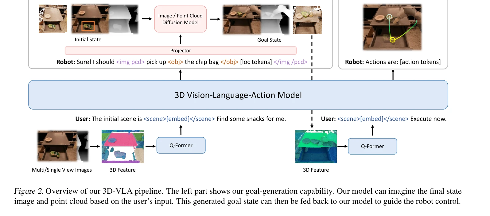
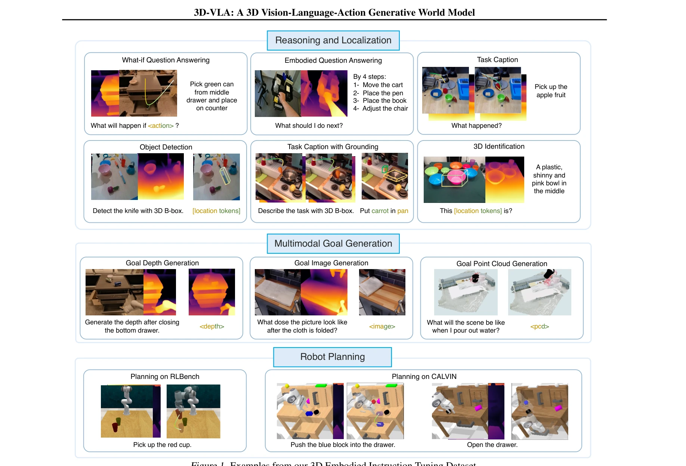

# 3D-VLA: A 3D Vision-Language-Action Generative World Model

> **저자**: Haoyu Zhen, Xiaowen Qiu, Peihao Chen, Jincheng Yang, Xin Yan, Yilun Du, Yining Hong, Chuang Gan | **날짜**: 2024-03-14 | **URL**: [https://arxiv.org/abs/2403.09631](https://arxiv.org/abs/2403.09631)

---

## Essence

*Figure 2. Overview of our 3D-VLA pipeline. The left part shows our goal-generation capability. Our model can imagine the*

3D-VLA는 3D 인식, 추론, 행동을 생성형 월드 모델로 통합하는 embodied foundation model이며, 3D LLM 위에 interaction token과 diffusion model을 결합하여 로봇의 목표 이미지/포인트 클라우드 생성과 행동 예측을 수행한다.

## Motivation

- **Known**: 2D 기반의 vision-language-action (VLA) 모델들(RT-2, PALM-E)과 3D 환경에서의 embodied foundation model들이 존재하지만, 이들은 직접적인 perception-to-action 매핑에만 초점을 두며 월드 다이나믹스를 간과한다.
- **Gap**: 기존 embodied 모델들은 2D 입력에 의존하여 3D 물리 세계와의 통합이 부족하며, 인간처럼 미래 상태를 상상하고 계획하는 월드 모델 능력이 없다. 또한 기존 embodied 데이터셋들은 3D 정보가 부족하다.
- **Why**: 로봇의 3D 공간 추론 능력이 '가장 먼 컵을 중간 서랍에 넣기'와 같은 복잡한 명령 수행에 필수적이며, 미래 상태 생성 능력은 더 나은 행동 계획을 가능하게 한다.
- **Approach**: 3D LLM 기반 아키텍처에 scene, object, action token을 도입하고, pretrain된 embodied diffusion model들을 projector를 통해 정렬하여 목표 이미지/포인트 클라우드 생성을 수행한다. 기존 로봇 데이터셋에서 2M의 3D-language-action 쌍을 추출한 대규모 instruction tuning 데이터셋을 구축한다.

## Achievement

*Figure 1. Examples from our 3D Embodied Instruction Tuning Dataset.*

- **3D 기반 월드 모델**: 3D perception, reasoning, action을 unified 아키텍처로 통합하고 multimodal goal generation(RGB-D 이미지, depth, point cloud) 능력을 제공
- **대규모 3D embodied 데이터셋**: 2M의 3D-language-action 데이터 쌍으로 구성된 데이터셋 구축으로 기존 embodied 데이터셋의 3D 정보 부족 문제 해결
- **우수한 성능**: goal generation, goal-based planning, action prediction에서 baseline 모델들을 크게 능가하며, 전통적 언어 기반 task에서도 뛰어난 성능 달성
- **다양한 task 지원**: task captioning, action prediction, localization, multimodal goal generation, robot planning, embodied question answering 등 다양한 embodied task 수행

## How

*Figure 2. Overview of our 3D-VLA pipeline. The left part shows our goal-generation capability. Our model can imagine the*

- 3D LLM(Hong et al., 2023)을 기반으로 하여 scene, object, action 등의 interactive token을 LLM 어휘에 추가
- RGBD-to-RGBD와 point-to-point generation을 위한 embodied diffusion model을 사전학습
- projector를 통해 diffusion decoder와 LLM embedding space를 효율적으로 정렬하여 multimodal goal generation 수행
- 기존 로봇 데이터셋(실제 데이터, 합성 데이터, 인간-객체 상호작용)에서 depth estimator를 이용해 3D 정보 추출 및 point cloud로 변환
- ChatGPT 기반의 자동 파이프라인으로 3D 관련 주석과 언어 설명을 추출하여 2M의 instruction tuning 데이터셋 구축

## Originality

- 3D point cloud를 action token 생성에 활용한 최초의 VLA 모델로, 2D 기반 접근법 대비 3D 공간 이해도 혁신적 제고
- LLM과 diffusion model 사이의 projector 기반 정렬 메커니즘을 통해 multimodal goal generation과 action prediction을 unified 아키텍처로 통합
- 대규모 기존 embodied 데이터셋을 3D 정보로 풍부하게 하는 자동화된 데이터 처리 파이프라인 개발로 4M+ 3D 데이터 쌍 확보

## Limitation & Further Study

- 실제 로봇 환경에서의 성능 검증이 제시되지 않으며, held-in 데이터셋에서의 평가만 제공됨
- depth estimator를 통한 3D 정보 추출 과정에서 발생할 수 있는 오류의 누적 효과 미분석
- 생성된 goal image와 point cloud의 정량적 품질 평가 메트릭이 불명확함
- inference time과 computational cost에 대한 상세한 분석 부족
- 후속 연구로 sim-to-real 전이 학습, 실제 로봇 플랫폼에서의 end-to-end 검증, 다양한 embodiment에 대한 일반화 가능성 탐색 필요

## Evaluation

- Novelty: 4/5
- Technical Soundness: 3/5
- Significance: 4/5
- Clarity: 4/5
- Overall: 4/5

**총평**: 3D-VLA는 embodied AI의 새로운 패러다임을 제시하며, 3D 인식과 월드 모델 기반 행동 생성을 통합한 점에서 혁신적이다. 대규모 3D embodied 데이터셋 구축과 multimodal goal generation 능력은 로봇 조작 분야에 상당한 기여를 할 수 있으나, 실제 로봇 환경에서의 검증이 필요하다.

## Related Papers

- 🏛 기반 연구: [[papers/1632_World_Simulation_with_Video_Foundation_Models_for_Physical_A/review]] — World Simulation with Video Foundation Models의 비디오 기반 월드 시뮬레이션이 3D-VLA의 생성형 월드 모델 구축의 이론적 기반을 제공한다.
- 🔄 다른 접근: [[papers/1419_H3DP_Triply-Hierarchical_Diffusion_Policy_for_Visuomotor_Lea/review]] — 둘 다 humanoid를 위한 generative world model이지만 3D-VLA는 3D LLM 기반을, 1X World Model은 다른 접근법을 사용한다.
- 🔗 후속 연구: [[papers/1581_Structured_World_Models_from_Human_Videos/review]] — Structured World Models의 인간 비디오 기반 구조화된 월드 모델이 3D-VLA의 3D 월드 모델링을 더 체계적으로 발전시킬 수 있다.
- 🔗 후속 연구: [[papers/1476_MimicPlay_Long-Horizon_Imitation_Learning_by_Watching_Human/review]] — 3D Vision-Language-Action 통합 모델 구조를 HWM의 세계 모델에 적용하여 공간 이해 능력을 강화할 수 있다
- 🔄 다른 접근: [[papers/1514_Perceiver-Actor_A_Multi-Task_Transformer_for_Robotic_Manipul/review]] — 3D-VLA의 3D generative world model과 PerAct의 voxelized transformer는 모두 3D 공간 이해를 위한 서로 다른 접근법이다.
- 🧪 응용 사례: [[papers/1567_SE3-Equivariant_Robot_Learning_and_Control_A_Tutorial_Survey/review]] — 3D 정책 학습에서 SE(3) 동형성이 시각-운동 정책의 기하학적 일반화 능력을 향상시킨다.
- 🔗 후속 연구: [[papers/1576_SpatialVLA_Exploring_Spatial_Representations_for_Visual-Lang/review]] — 3D-VLA의 3D vision-language-action model이 SpatialVLA의 공간 표현을 더 포괄적인 3D 생성 모델로 확장한다.
- 🔄 다른 접근: [[papers/1355_DexGarmentLab_Dexterous_Garment_Manipulation_Environment_wit/review]] — dexterous manipulation을 다른 환경과 정책 학습 방법으로 접근한다
- 🔄 다른 접근: [[papers/1374_DynamicVLA_A_Vision-Language-Action_Model_for_Dynamic_Object/review]] — 3D Vision-Language-Action 모델이 DynamicVLA의 compact 0.4B 모델과 다른 규모로 동적 조작을 접근한다.
