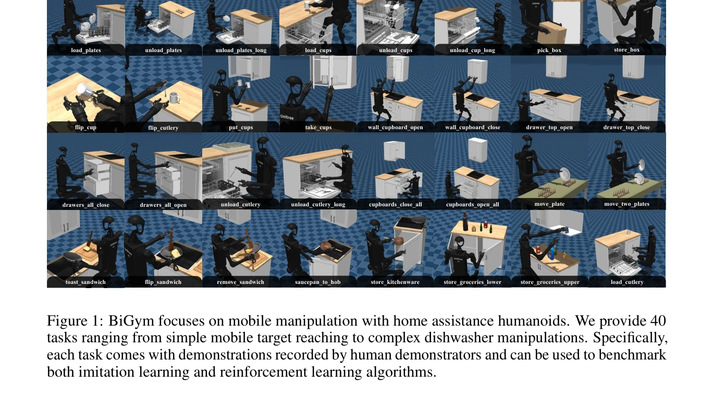
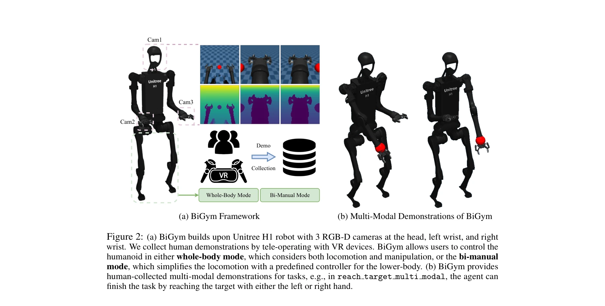

# BiGym: A Demo-Driven Mobile Bi-Manual Manipulation Benchmark

> **저자**: Nikita Chernyadev, Nicholas Backshall, Xiao Ma, Yunfan Lu, Younggyo Seo, Stephen James | **날짜**: 2024-07-10 | **URL**: [https://arxiv.org/abs/2407.07788](https://arxiv.org/abs/2407.07788)

---

## Essence

*Figure 1: BiGym focuses on mobile manipulation with home assistance humanoids. We provide 40*

BiGym은 양팔 이동 조작을 위한 데모 기반 로봇 학습 벤치마크로, 40개의 다양한 가정 작업과 인간이 수집한 멀티모달 시연 데이터를 제공합니다.

## Motivation

- **Known**: 기존 벤치마크(MetaWorld, RLBench)는 단일 팔 조작에 집중하거나 motion planner로 생성된 부자연스러운 시연 데이터를 사용하며, 밀집 보상 함수 설계를 요구합니다.
- **Gap**: 양팔 이동 조작, 인간이 수집한 멀티모달 시연, 희소 보상(sparse reward)을 모두 지원하는 벤치마크가 부재합니다.
- **Why**: 실제 로봇 시스템은 양팔 협력과 이동성이 필요하며, 장기 수평 작업에서 보상 함수 설계는 극히 어렵기 때문에 자연스러운 시연 데이터 기반 학습이 중요합니다.
- **Approach**: Unitree H1 인문형 로봇을 기반으로 VR 텔레오퍼레이션으로 인간 시연을 수집하고, 전체 신체 제어 모드와 양팔 전용 모드를 분리하여 제공합니다.

## Achievement

*Figure 1: BiGym focuses on mobile manipulation with home assistance humanoids. We provide 40*

- **포괄적 벤치마크**: 간단한 목표 도달부터 복잡한 식기세척기 조작까지 40개의 다양한 가정 작업 포함
- **멀티모달 인간 시연**: 각 작업당 50개의 인간 수집 시연으로 실세계의 다양한 궤적 분포 반영
- **유연한 제어 모드**: 전체 신체 제어(locomotion + manipulation)와 양팔 전용 모드 분리로 알고리즘 비교 강화
- **다양한 관측**: proprioceptive 데이터와 RGB, depth를 3개 카메라 뷰에서 제공
- **광범위한 벤치마킹**: SOTA imitation learning과 demo-driven RL 알고리즘 평가 및 비교

## How

*Figure 2: (a) BiGym builds upon Unitree H1 robot with 3 RGB-D cameras at the head, left wrist, and right*

- Unitree H1 humanoid 로봇 플랫폼 사용
- VR 텔레오퍼레이션 시스템으로 인간 시연 데이터 수집
- whole-body mode(전체 신체)와 bi-manual mode(양팔 + 고정 하체 제어기) 두 가지 제어 모드 제공
- 3개의 RGB-D 카메라(head, left wrist, right wrist)로 다각도 관측
- 각 작업에 대해 희소 보상만 제공하여 IL/RL 모두 적용 가능하게 구성
- POMDP 프레임워크로 부분 관측 환경 구성

## Originality

- 양팔 이동 조작을 통합한 첫 번째 대규모 벤치마크로, 기존 RLBench(단일 팔)와 LocoMujoco(이동만)의 한계 극복
- motion planner 대신 인간 시연을 사용함으로써 자연스럽고 멀티모달한 궤적 분포 제공
- 전체 신체와 양팔 모드 분리로 locomotion과 manipulation 능력을 독립적으로 평가 가능
- 희소 보상만 사용하여 IL과 demo-driven RL을 동일 환경에서 비교 평가

## Limitation & Further Study

- 현재 실제 로봇 실험 없이 시뮬레이션만 제공 - sim-to-real 성능 격차 미검증
- 40개 작업이 주로 주방 관련(dishwasher, cupboard 등)으로 치우침 - 작업 다양성 개선 필요
- 인간 시연이 50개로 제한적 - 더 많은 시연 데이터나 다양한 시연자 포함 필요
- SOTA 알고리즘 성능 분석이 제한적 - 상세한 비교 분석 부족
- 부분 관측(POMDP)의 복잡성에 대한 체계적 평가 부재
- 후속 연구로는 실제 로봇 전이 실험, 더 다양한 환경/작업 추가, 시연 효율성 개선 필요

## Evaluation

- Novelty: 4/5
- Technical Soundness: 3/5
- Significance: 4/5
- Clarity: 4/5
- Overall: 4/5

**총평**: BiGym은 양팔 이동 조작, 인간 시연, 희소 보상을 통합한 혁신적 벤치마크로, 로봇 학습 커뮤니티에 중요한 기여를 합니다. 다만 실제 로봇 검증과 작업 다양성 확대가 필요합니다.

## Related Papers

- 🔗 후속 연구: [[papers/1272_ARMADA_Augmented_Reality_for_Robot_Manipulation_and_Robot-Fr/review]] — 양팔 이동 조작에서 증강현실 기반 robot-free 데이터 수집이 확장 활용된다
- 🏛 기반 연구: [[papers/1279_BEHAVIOR_Robot_Suite_Streamlining_Real-World_Whole-Body_Mani/review]] — 가정용 양팔 조작 벤치마크가 실세계 전신 조작 프레임워크의 기초가 된다
- 🔄 다른 접근: [[papers/1290_BiCoord_장기간_시공간_협응_양팔_조작_벤치마크/review]] — 양팔 조작에서 다양한 가정 작업과 장기간 협응 평가의 다른 벤치마크 접근이다
- 🧪 응용 사례: [[papers/1562_ManiSkill-HAB_A_Benchmark_for_Low-Level_Manipulation_in_Home/review]] — 가정 환경 저수준 조작에서 BiGym의 양팔 이동 조작 벤치마크가 적용된다
- 🔄 다른 접근: [[papers/1290_BiCoord_장기간_시공간_협응_양팔_조작_벤치마크/review]] — 양팔 조작 평가에서 장기간 협응과 다양한 가정 작업의 다른 벤치마크 초점이다
- 🏛 기반 연구: [[papers/1272_ARMADA_Augmented_Reality_for_Robot_Manipulation_and_Robot-Fr/review]] — 양팔 조작 벤치마크에서 증강현실 기반 데이터 수집 방법론이 기초가 된다
- 🔗 후속 연구: [[papers/1279_BEHAVIOR_Robot_Suite_Streamlining_Real-World_Whole-Body_Mani/review]] — 가정용 일상 작업에서 BRS의 전신 조작이 BiGym의 양팔 조작을 확장한다
