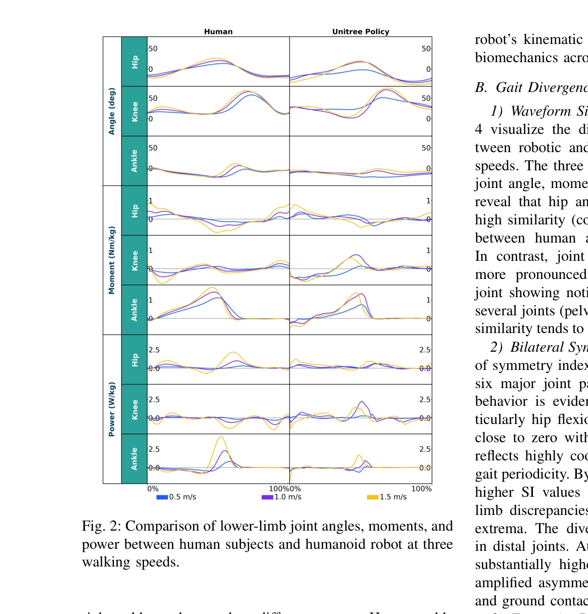
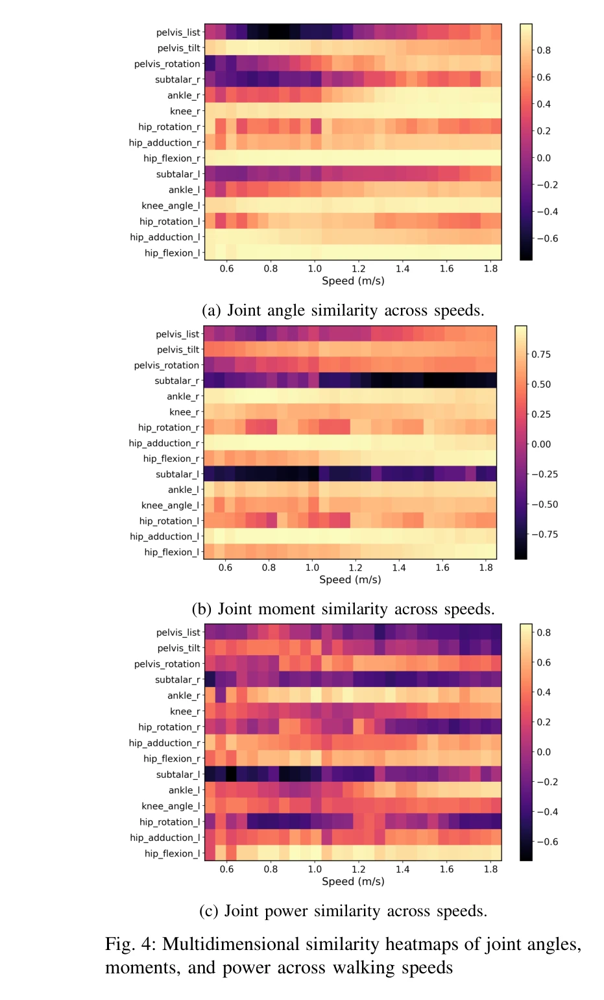
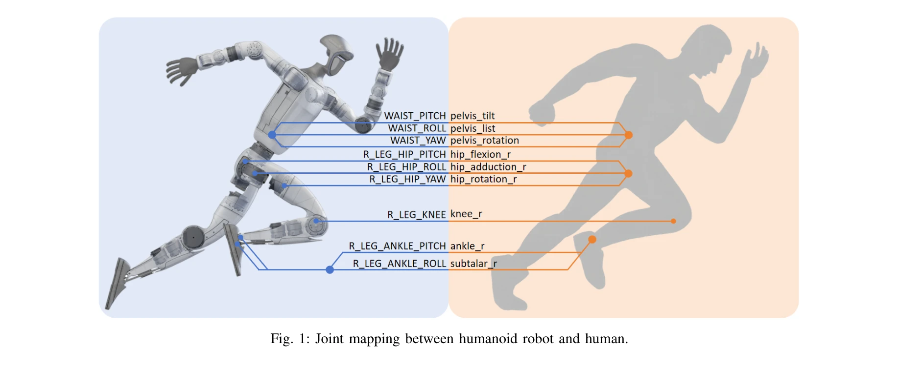

# Biomechanical Comparisons Reveal Divergence of Human and Humanoid Gaits

> **저자**: Luying Feng, Yaochu Jin, Hanze Hu, Wei Chen | **날짜**: 2026-02-25 | **URL**: [https://arxiv.org/abs/2602.21666](https://arxiv.org/abs/2602.21666)

---

## Essence

*Fig. 2: Comparison of lower-limb joint angles, moments, and*

본 논문은 Gait Divergence Analysis Framework (GDAF)를 제안하여 28개의 보행 속도에서 인간과 휴머노이드 로봇의 생물역학적 차이를 체계적으로 정량화하고 벤치마크 데이터셋과 분석 도구를 공개한다.

## Motivation

- **Known**: 강화학습(RL)과 모방학습(IL) 기반 휴머노이드 제어기는 안정적인 보행을 생성하지만, 단순한 관절각도 모방만으로는 인간 운동의 근본 원리를 포착하지 못한다.
- **Gap**: 기존 인간-로봇 보행 비교 연구들은 제한된 보행 속도에서 수행되어 속도 변화에 따른 생물역학적 특성 변화를 체계적으로 분석하지 못했다.
- **Why**: 휴머노이드 로봇의 자연스러운 보행은 인간-로봇 공존 환경에서 기능 효율성뿐만 아니라 사회적 수용성을 향상시키고, 재활 및 보조기기 개발의 플랫폼 역할을 한다.
- **Approach**: 인간 보행 데이터(22명, 0.5-1.85 m/s, 0.05 m/s 간격)와 Unitree G1 로봇 보행 데이터를 수집하여 GDAF를 적용하고, 운동학/동역학적 지표를 통합한 발산 지수를 개발하였다.

## Achievement

*Fig. 4: Multidimensional similarity heatmaps of joint angles,*

- **GDAF 프레임워크**: 운동학적 유사도(Pearson correlation), 좌우 대칭성(Bilateral Symmetry Index), 에너지 분포, torque-angle loops 등 다차원 지표를 통합한 체계적 생물역학 평가 프레임워크 개발
- **대규모 벤치마크 데이터셋**: 28개 보행 속도에서 수집한 인간-로봇 보행 데이터셋 및 분석 코드, 시각화 도구의 공개 제공
- **정량적 발견**: 시각적으로는 인간유사하지만 로봇은 모든 속도에서 체계적인 좌우 비대칭, 에너지 분배 편차, 관절 조율 차이를 나타냄을 증명
- **에너지 효율성 평가**: 다차원 지표 분석을 통해 로봇 보행의 생물역학적 충실도 및 에너지 효율 개선 가능성을 제시

## How

*Fig. 1: Joint mapping between humanoid robot and human.*

- OpenSim 플랫폼을 이용한 인간 모션캡처 데이터의 역운동학(IK) 및 역동역학(ID) 계산
- 우측 발 접지 이벤트 기반 0-100% 정규화된 보행 주기 정렬 및 보간
- Unitree G1의 관절각, 각속도, 추정 토크 데이터를 200 Hz로 수집 (25초 정상보행)
- 인간-로봇 관절 대응 매핑 및 로봇 좌표계로의 데이터 변환
- Pearson correlation, 좌우 대칭 지수, 관절 전력 계산, torque-angle loop 분석
- 다차원 지표를 통합한 종합 발산 지수(GDAF Cost) 산출

## Originality

- 보행 속도의 연속적 변화(0.05 m/s 간격, 28개 속도)를 통해 RL/IL 기반 휴머노이드의 생물역학적 특성을 최초로 체계적으로 비교
- OpenSim 기반 표준화된 생물역학 분석 파이프라인을 로봇 데이터에 적용하여 인간-로봇 비교의 과학적 엄밀성 제고
- GDAF라는 통합 평가 프레임워크를 통해 기존의 개별 지표 기반 평가를 다차원 종합 평가로 확장
- 분석 코드, 데이터셋, 시각화 도구의 공개로 재현성과 일반성 확보

## Limitation & Further Study

- 인간 데이터는 트레드밀에서, 로봇 데이터는 평지에서 수집되어 데이터 취득 환경의 불일치 발생 (트레드밀 vs 평지 보행의 생물역학적 차이 존재)
- 로봇의 모션캡처 및 지면반력 데이터 부재로 발목 피치각 변화를 발 접지 판별 지표로 대체하여 정확성 제한
- Unitree G1 단일 로봇에만 적용되어 다양한 플랫폼으로의 일반화 미검증
- **후속연구**: 동일 환경(트레드밀 또는 평지)에서의 인간-로봇 데이터 재수집, 다양한 휴머노이드 플랫폼 및 제어 알고리즘에의 GDAF 적용, 발산 지표를 직접 보행 최적화 보상(reward)으로 통합하는 학습 기법 개발

## Evaluation

- Novelty: 4/5
- Technical Soundness: 3/5
- Significance: 4/5
- Clarity: 4/5
- Overall: 4/5

**총평**: 본 논문은 생물역학 원리에 기반한 GDAF 프레임워크를 통해 인간과 휴머노이드 보행의 차이를 처음으로 체계적이고 정량화된 방식으로 비교하였으며, 공개 데이터셋과 분석 도구 제공으로 로봇 보행 제어 연구의 증거 기반 최적화를 가능하게 한 의미 있는 기여다.

## Related Papers

- 🔗 후속 연구: [[papers/1461_Human-Level_Actuation_for_Humanoids/review]] — 인간-휴머노이드 보행 차이 정량화가 인간 수준 구동 성능 평가 프레임워크로 확장될 수 있습니다.
- 🏛 기반 연구: [[papers/1601_Optimizing_Bipedal_Locomotion_for_The_100m_Dash_With_Compari/review]] — 생물역학적 차이 분석 방법론이 달리기 보행 최적화에서 인간 역학과의 비교 기준을 제공합니다.
- 🧪 응용 사례: [[papers/1241_A_Framework_for_Optimal_Ankle_Design_of_Humanoid_Robots/review]] — GDAF 프레임워크가 발목 설계 최적화의 생체역학적 성능 검증에 적용될 수 있습니다.
- 🧪 응용 사례: [[papers/1241_A_Framework_for_Optimal_Ankle_Design_of_Humanoid_Robots/review]] — 최적화된 발목 설계가 인간과 휴머노이드 보행 차이 분석에서 생체역학적 성능 개선에 기여할 수 있습니다.
- 🏛 기반 연구: [[papers/1461_Human-Level_Actuation_for_Humanoids/review]] — Human-Level Actuation Score가 인간-휴머노이드 보행 차이 정량화의 구동 성능 평가 기준을 제공합니다.
- 🧪 응용 사례: [[papers/1601_Optimizing_Bipedal_Locomotion_for_The_100m_Dash_With_Compari/review]] — 달리기 보행 최적화에서 인간 역학 비교가 생물역학적 차이 분석 프레임워크로 검증됩니다.
