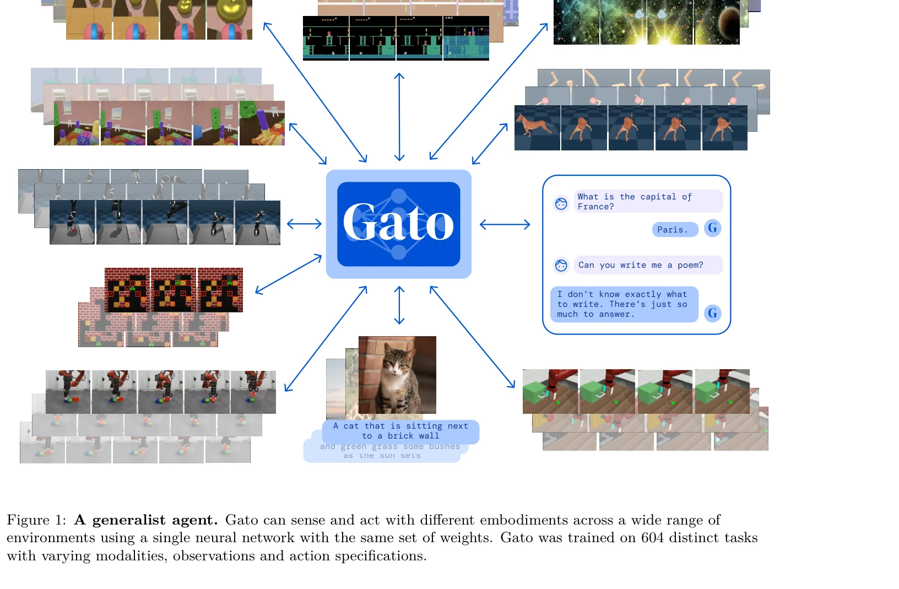
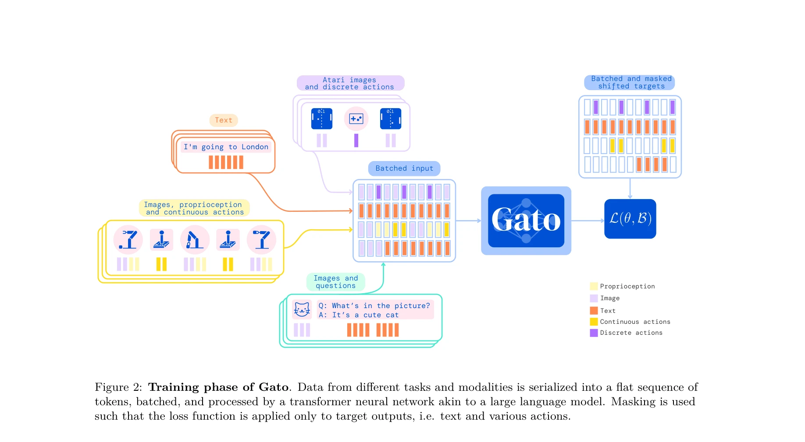

# A Generalist Agent

> **저자**: Scott Reed, Konrad Zolna, Emilio Parisotto, Sergio Gomez Colmenarejo, Alexander Novikov, Gabriel Barth-Maron, Mai Gimenez, Yury Sulsky, Jackie Kay, Jost Tobias Springenberg, Tom Eccles, Jake Bruce, Ali Razavi, Ashley Edwards, Nicolas Heess, Yutian Chen, Raia Hadsell, Oriol Vinyals, Mahyar Bordbar, Nando de Freitas | **날짜**: 2022-05-12 | **URL**: [https://arxiv.org/abs/2205.06175](https://arxiv.org/abs/2205.06175)

---

## Essence

*Figure 1: A generalist agent. Gato can sense and act with different embodiments across a wide range of*

Gato는 대규모 언어 모델의 접근 방식을 일반화하여 텍스트를 넘어 다양한 모달리티와 구체화(embodiment)를 처리할 수 있는 단일 신경망 기반의 범용 정책 에이전트이다. 동일한 가중치를 가진 하나의 모델로 Atari 게임, 이미지 캡셔닝, 대화, 로봇 제어 등 604개의 서로 다른 작업을 수행할 수 있다.

## Motivation

- **Known**: 대규모 언어 모델이 스케일링에 따라 성능이 지속적으로 개선되고, 단일 신경망으로 여러 도메인에서 작업할 경우 손으로 만든 task-specific 정책이 불필요해진다는 것이 알려져 있다.
- **Gap**: 기존 연구는 주로 텍스트 생성에 집중했으며, 로봇 제어, 게임, 비전 작업 등 다양한 모달리티와 구체화를 통합하는 단일 범용 에이전트의 가능성이 충분히 탐구되지 않았다.
- **Why**: 단일 범용 에이전트는 데이터 다양성을 극대화하여 훈련 효율을 높이고, 자연어를 공통 기반으로 사용하여 서로 다른 embodiment 간 조합적 일반화를 가능하게 하며, 강력한 스케일링 성질로 인해 향후 성능 개선 가능성이 크다.
- **Approach**: 모든 데이터(텍스트, 이미지, 연속/이산 값)를 토큰 시퀀스로 직렬화하고 단일 1.2B 파라미터 transformer 디코더를 이용하여 다음 토큰을 예측하는 자기회귀 방식으로 훈련한다. 배포 시에는 토큰을 context에 따라 대화, 이미지 캡션, 버튼 입력, 관절 토크 등으로 변환한다.

## Achievement

*Figure 1: A generalist agent. Gato can sense and act with different embodiments across a wide range of*

- **단일 모델의 범용성**: 동일한 가중치의 단일 모델이 Atari, 로봇 제어, 자연어 이해, 이미지 캡셔닝 등 604개 작업을 수행 가능
- **확장성**: 1.2B 파라미터 규모에서도 실시간 로봇 제어가 가능하며, 모델 및 데이터 스케일링에 따라 성능 지속적 개선
- **프롬프트 기반 태스크 적응**: 25% 비율로 프롬프트 시퀀스를 포함시켜 similar task 간 구분 가능
- **다중 모달리티 처리**: 텍스트, 이미지, 연속값, 이산값, proprioception 등 다양한 입출력 형식을 통일된 토큰 시퀀스로 처리

## How

*Figure 2: Training phase of Gato. Data from different tasks and modalities is serialized into a flat sequence of*

- 모든 데이터를 통일된 토큰 시퀀스로 변환: 텍스트는 SentencePiece (32000 어휘), 이미지는 16×16 패치로 변환, 연속값은 mu-law 인코딩 후 1024 bin으로 이산화, 이산값은 row-major 순서로 정렬
- modality별 임베딩 함수 적용: 텍스트/이산/연속값은 lookup table으로, 이미지 패치는 ResNet 블록으로 임베딩 (위치 인코딩 추가)
- 마스킹 기반 손실 함수: 텍스트와 에이전트 액션 토큰에만 loss 적용, 이미지 및 관찰값은 마스크 처리
- 프롬프트 조건화: 배치의 25%에 대해 같은 에이전트/태스크의 episode를 프롬프트로 추가 (절반은 goal, 절반은 uniform sampling)
- 자기회귀 훈련: transformer로 이전 토큰들로부터 다음 토큰의 확률 분포 예측
- 병렬화된 훈련: 16x16 TPU v3 slice로 1M step, batch size 512, L=1024 token sequence로 약 4일 소요

## Originality

- **다중 embodiment 통합**: 로봇, 게임, 언어 등 본질적으로 다른 구체화를 단일 모델에서 처리하는 것은 혁신적 접근
- **토큰화 체계**: 연속값의 mu-law 인코딩과 1024-bin 이산화를 통해 다양한 형식을 통일 토큰으로 변환하는 방식
- **프롬프트 기반 태스크 구분**: task identifier 대신 자연어 프롬프트를 사용하여 task disambiguation 수행
- **604개 작업 규모**: 공개된 가장 다양한 범용 에이전트 훈련 규모

## Limitation & Further Study

- **supervised learning만 사용**: 온라인/오프라인 RL 적용 미포함으로 상호작용적 학습의 이점 활용 불가
- **관찰값 예측 미지원**: 이미지나 proprioceptive 관찰값을 예측하지 않아 world model 기능 부재
- **out-of-distribution 취약성**: 훈련 분포 외 새로운 태스크에서 성능 미검증
- **성능-일반화 트레이드오프**: 범용성을 추구하는 과정에서 specialized agent 대비 성능 저하 가능성
- **후속 연구 방향**: (1) RL 통합, (2) world model 추가, (3) 더 큰 모델 스케일 탐색, (4) continual learning 적용, (5) zero-shot generalization 강화

## Evaluation

- Novelty: 4/5
- Technical Soundness: 3/5
- Significance: 4/5
- Clarity: 4/5
- Overall: 4/5

**총평**: Gato는 대규모 언어 모델의 스케일링 원리를 다중 모달리티 제어 문제로 확장하여 단일 범용 에이전트의 가능성을 실증적으로 보여주는 획기적 연구이다. 기술적 구성은 상대적으로 단순하지만, 604개 작업 규모에서의 통합 및 실제 로봇 제어 성공은 높은 실무적 가치와 장기적 영향력을 가진다.

## Related Papers

- 🔗 후속 연구: [[papers/1464_Magma_A_Foundation_Model_for_Multimodal_AI_Agents/review]] — Magma는 Gato의 멀티모달 일반 에이전트 개념을 멀티모달 AI 에이전트로 확장한다
- 🔄 다른 접근: [[papers/1385_EO-1_An_Open_Unified_Embodied_Foundation_Model_for_General_R/review]] — EO-1은 Gato와 유사한 통합 기초 모델이지만 구체화된 AI에 특화되어 있다
- 🔗 후속 연구: [[papers/1591_OmniClone_Engineering_a_Robust_All-Rounder_Whole-Body_Humano/review]] — 모방 학습의 다양한 행동을 위한 벤치마크로 Gato의 다중 작업 성능 평가에 필요한 기준을 제공한다
- 🔗 후속 연구: [[papers/1464_Magma_A_Foundation_Model_for_Multimodal_AI_Agents/review]] — 일반주의 에이전트의 개념을 멀티모달 AI 에이전트로 발전시켜 더욱 포괄적인 작업 수행 능력을 구현합니다.
- 🔗 후속 연구: [[papers/1563_Scaling_Instructable_Agents_Across_Many_Simulated_Worlds/review]] — A Generalist Agent가 SIMA의 embodied AI 에이전트를 더 일반화된 형태로 확장한다.
- 🏛 기반 연구: [[papers/1385_EO-1_An_Open_Unified_Embodied_Foundation_Model_for_General_R/review]] — A Generalist Agent의 범용 에이전트 개념이 EO-1의 unified foundation model 설계에 기반한다.
