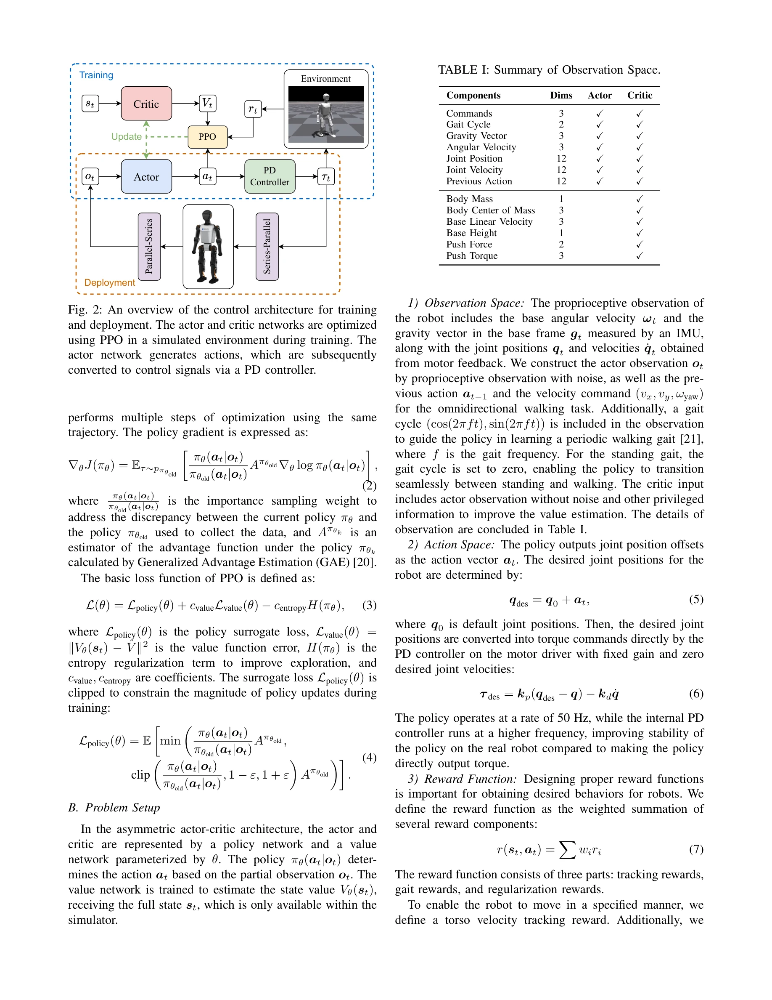
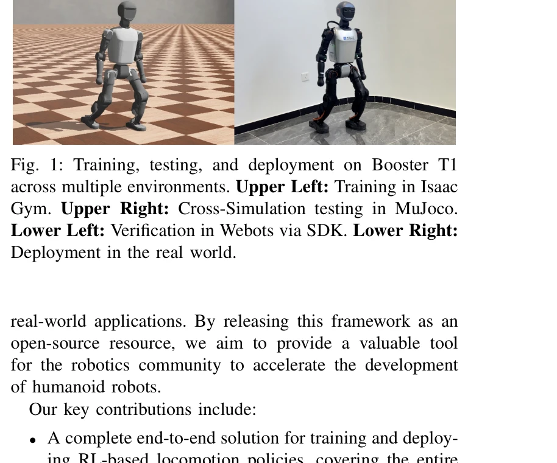

# Booster Gym: An End-to-End Reinforcement Learning Framework for Humanoid Robot Locomotion

> **저자**: Yushi Wang, Penghui Chen, Xinyu Han, Feng Wu, Mingguo Zhao | **날짜**: 2025-06-18 | **URL**: [https://arxiv.org/abs/2506.15132](https://arxiv.org/abs/2506.15132)

---

## Essence

*Fig. 2: An overview of the control architecture for training*

인간형 로봇의 보행 제어를 위한 강화학습 기반의 완전한 end-to-end 프레임워크를 제시하며, 시뮬레이션에서 실제 로봇으로의 정책 전이를 용이하게 한다.

## Motivation

- **Known**: 강화학습은 인간형 로봇 보행 제어에서 괄목할 만한 진전을 이루었으나, 시뮬레이션에서 실제 로봇으로의 정책 전이(sim-to-real transfer)는 여전히 도전적인 문제이다.
- **Gap**: 기존 연구들은 보행 정책 학습의 효과는 입증했으나, 구현 세부사항의 복잡성으로 인해 재현 가능한 완전한 프레임워크를 제공하지 못하고 있다.
- **Why**: 체계적이고 재사용 가능한 프레임워크는 로봇 공학 커뮤니티의 개발 진입 장벽을 낮추어 인간형 로봇 개발을 가속화할 수 있다.
- **Approach**: Isaac Gym에서 GPU 병렬화를 활용한 PPO 기반 훈련과 포괄적인 domain randomization을 적용하며, MuJoCo와 Webots를 통한 교차 시뮬레이션 검증 후 Booster T1 실제 로봇에 배포한다.

## Achievement

*Fig. 1: Training, testing, and deployment on Booster T1*

- **End-to-End 완전 솔루션**: 시뮬레이션 훈련에서 실제 로봇 배포까지의 전체 파이프라인을 통합한 오픈소스 프레임워크 제공
- **포괄적 도메인 랜더마이제이션**: 환경, 로봇, 액추에이터 레벨의 광범위한 domain randomization으로 sim-to-real 갭 감소
- **실제 로봇 검증**: Booster T1에서 전방향 보행, 외부 교란 저항, 지형 적응성 등 다양한 보행 능력 입증
- **유연한 확장성**: 보상 함수, 신경망 구조, 물리 파라미터를 쉽게 수정할 수 있는 모듈형 인터페이스 설계

## How

*Fig. 2: An overview of the control architecture for training*

- POMDP 포뮬레이션으로 부분 관찰 문제 정의 및 PPO 알고리즘을 통한 정책 최적화
- Asymmetric Actor-Critic (AAC) 아키텍처로 훈련 시 critic에만 privileged information 제공
- Isaac Gym의 GPU 병렬화로 수천 개 환경의 동시 시뮬레이션 수행
- 환경 파라미터, 센서 노이즈, 로봇 물리 특성의 광범위한 랜더마이제이션
- 병렬 구조를 가진 humanoid 로봇의 액추에이터 제어를 위한 Series-Parallel 및 Parallel-Series 변환 메커니즘 구현
- MuJoCo와 Webots에서의 교차 시뮬레이션 테스트로 정책의 일반화 성능 검증

## Originality

- 기존의 분산 multi-stage 방식(teacher-student distillation, RMA) 대신 end-to-end 단일 프레임워크로 통합
- Isaac Gym의 GPU 가속 훈련과 CPU 기반 정밀 시뮬레이터(MuJoCo, Webots)를 결합한 하이브리드 검증 전략
- 병렬 기계 구조를 처리하는 명시적 액추에이터 제어 메커니즘 설계
- 오픈소스 프레임워크로 제공함으로써 재현성과 커뮤니티 확산성 강조

## Limitation & Further Study

- Isaac Gym의 PhysX 엔진은 폐쇄 운동학 사슬(closed kinematic chains) 미지원과 접촉력 추정 부정확성의 한계 존재
- 현재 omnidirectional walking, disturbance resistance, terrain adaptation에 제한되어 더 복잡한 행동(계단 오르기, 점프 등) 확장 필요
- Booster T1 단일 로봇에서만 검증되었으므로 다른 humanoid 로봇 플랫폼으로의 일반화 검증 부족
- domain randomization의 정도 설정에 대한 이론적 가이드라인이나 자동화 메커니즘 미흡
- 실시간 정책 적응 능력(RMA 방식의 런타임 파라미터 추론)을 포함하지 않아 동적 환경 변화에 대한 대응 제한

## Evaluation

- Novelty: 3/5
- Technical Soundness: 4/5
- Significance: 4/5
- Clarity: 4/5
- Overall: 4/5

**총평**: 이 논문은 강화학습 기반 humanoid 로봇 보행 제어를 위한 실용적이고 완전한 오픈소스 프레임워크를 제공함으로써 로봇 개발 커뮤니티에 상당한 기여를 한다. 기술적 완성도와 실제 로봇 검증이 우수하지만, 방법론적 혁신성은 상대적으로 제한적이며 단일 플랫폼 검증이라는 한계가 있다.

## Related Papers

- 🧪 응용 사례: [[papers/1260_AGILE_A_Comprehensive_Workflow_for_Humanoid_Loco-Manipulatio/review]] — 휴머노이드 보행을 위한 구체적인 강화학습 구현을 통해 AGILE 워크플로우의 실제 적용 사례를 보여준다
- 🔗 후속 연구: [[papers/1328_Deep_Reinforcement_Learning_for_Bipedal_Locomotion_A_Brief_S/review]] — 이족 보행의 deep RL 접근법을 end-to-end 프레임워크로 통합하여 더 완전한 시스템을 구현한다
- 🔄 다른 접근: [[papers/1534_Learning_Sim-to-Real_Humanoid_Locomotion_in_15_Minutes/review]] — 휴머노이드 보행 학습을 각각 end-to-end 프레임워크와 15분 빠른 학습이라는 다른 접근법으로 해결한다
- 🔗 후속 연구: [[papers/1260_AGILE_A_Comprehensive_Workflow_for_Humanoid_Loco-Manipulatio/review]] — 강화학습 기반 휴머노이드 제어의 구체적 구현을 통해 AGILE 워크플로우의 실제 적용 사례를 제공한다
- 🏛 기반 연구: [[papers/1328_Deep_Reinforcement_Learning_for_Bipedal_Locomotion_A_Brief_S/review]] — bipedal locomotion의 DRL 프레임워크가 휴머노이드 강화학습의 이론적 기초를 제공한다
- 🔄 다른 접근: [[papers/1385_Evolutionary_Continuous_Adaptive_RL-Powered_Co-Design_for_Hu/review]] — 둘 다 RL 기반 최적화를 다루지만 EA-CoRL은 하드웨어-제어 공동 설계에, Booster Gym은 일반적 RL 프레임워크에 집중한다.
- 🏛 기반 연구: [[papers/1503_Iterative_Closed-Loop_Motion_Synthesis_for_Scaling_the_Capab/review]] — Booster Gym의 end-to-end RL framework가 반복적 폐쇄루프 모션 합성의 기반 구조를 제공함
- 🏛 기반 연구: [[papers/1557_LiPS_Large-Scale_Humanoid_Robot_Reinforcement_Learning_with/review]] — 대규모 휴머노이드 강화학습을 위한 LiPS의 병렬 시뮬레이션 방법론이 종단간 강화학습 프레임워크 Booster Gym의 기반이 된다.
